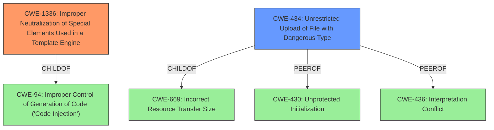

# Analysis for CVE-2020-8243

# Summary
| CWE ID | CWE Name | Confidence | CWE Abstraction Level | CWE Vulnerability Mapping Label | CWE-Vulnerability Mapping Notes |
|---|---|---|---|---|---|
| CWE-1336 | Improper Neutralization of Special Elements Used in a Template Engine | 0.9 | Base | Allowed | Primary CWE |
| CWE-434 | Unrestricted Upload of File with Dangerous Type | 0.7 | Base | Allowed | Secondary Candidate |

## Evidence and Confidence

*   **Confidence Score:** 0.8
*   **Evidence Strength:** HIGH

## Relationship Analysis
The primary CWE is CWE-1336, which is a Base level CWE. It's related to CWE-94 through a ChildOf relationship. This means that CWE-1336 is a specific type of CWE-94.
CWE-434 is a Base level CWE. It is related to CWE-669 through a ChildOf relationship. It has PeerOf relationships with CWE-430 and CWE-436.

## Vulnerability Chain
The vulnerability chain begins with the **improper input validation** when uploading a custom template, which leads to arbitrary code execution.
  - **Root Cause:** **Improper Input Validation**
  - **Weakness:** Improper Neutralization of Special Elements Used in a Template Engine
  - **Impact:** Arbitrary Code Execution

## Summary of Analysis
The vulnerability involves an authenticated attacker uploading a custom template to a Pulse Connect Secure device, leading to arbitrary code execution. The **root cause** is **improper input validation** in the admin web interface.

The primary CWE selected is CWE-1336 (Improper Neutralization of Special Elements Used in a Template Engine). This CWE accurately captures the vulnerability because it describes a scenario where a product uses a template engine to process externally-influenced input, but it fails to properly neutralize special elements that could be interpreted as template expressions or code directives. The vulnerability description explicitly mentions the ability to upload custom templates, aligning with CWE-1336's description. The impact of arbitrary code execution further supports this classification, as successful template injection can lead to code execution.

CWE-434 (Unrestricted Upload of File with Dangerous Type) is also considered as the application allows uploading a custom template, which is essentially a file with a dangerous type.

CWE-20 (Improper Input Validation) was considered, but it is a Class-level CWE and is too general. The vulnerability description provides enough information to pinpoint the specific type of **improper input validation** which is why a more specific CWE was chosen (CWE-1336).

CWE-94 (Improper Control of Generation of Code ('Code Injection')) was considered. CWE-1336 is a child of CWE-94, making it more specific to the type of code injection present in this vulnerability.

The selection of CWE-1336 is at the optimal level of specificity because it directly addresses the **weakness** of **improper neutralization** within a template engine, leading to arbitrary code execution. The evidence from the vulnerability description strongly supports this classification.
Relevant CWE Information:

# Enhanced Context (25 CWEs)
The following CWEs were identified as potentially relevant to this vulnerability:

## CWE-23: Relative Path Traversal
**Abstraction Level**: Base
**Similarity Score**: 0.78
**Source**: dense

**Description**:
The product uses external input to construct a pathname that should be within a restricted directory, but it does not properly neutralize sequences such as ".." that can resolve to a location that is outside of that directory.

**Mapping Guidance**:
- Usage: Allowed
- Rationale: This CWE entry is at the Base level of abstraction, which is a preferred level of abstraction for mapping to the root causes of vulnerabilities.

## CWE-41: Improper Resolution of Path Equivalence
**Abstraction Level**: Base
**Similarity Score**: 0.77
**Source**: dense

**Description**:
The product is vulnerable to file system contents disclosure through path equivalence. Path equivalence involves the use of special characters in file and directory names. The associated manipulations are intended to generate multiple names for the same object.

**Mapping Guidance**:
- Usage: Allowed
- Rationale: This CWE entry is at the Base level of abstraction, which is a preferred level of abstraction for mapping to the root causes of vulnerabilities.

## CWE-73: External Control of File Name or Path
**Abstraction Level**: Base
**Similarity Score**: 0.77
**Source**: dense

**Description**:
The product allows user input to control or influence paths or file names that are used in filesystem operations.

**Mapping Guidance**:
- Usage: Allowed
- Rationale: This CWE entry is at the Base level of abstraction, which is a preferred level of abstraction for mapping to the root causes of vulnerabilities.

## CWE-74: Improper Neutralization of Special Elements in Output Used by a Downstream Component ('Injection')
**Abstraction Level**: Class
**Similarity Score**: 0.77
**Source**: dense

**Description**:
The product constructs all or part of a command, data structure, or record using externally-influenced input from an upstream component, but it does not neutralize or incorrectly neutralizes special elements that could modify how it is parsed or interpreted when it is sent to a downstream component.

**Mapping Guidance**:
- Usage: Discouraged
- Rationale: CWE-74 is high-level and often misused when lower-level weaknesses are more appropriate.

## CWE-184: Incomplete List of Disallowed Inputs
**Abstraction Level**: Base
**Similarity Score**: 0.76
**Source**: dense

**Description**:
The product implements a protection mechanism that relies on a list of inputs (or properties of inputs) that are not allowed by policy or otherwise require other action to neutralize before additional processing takes place, but the list is incomplete.

**Mapping Guidance**:
- Usage: Allowed
- Rationale: This CWE entry is at the Base level of abstraction, which is a preferred level of abstraction for mapping to the root causes of vulnerabilities.

## CWE-36: Absolute Path Traversal
**Abstraction Level**: Base
**Similarity Score**: 0.76
**Source**: dense

**Description**:
The product uses external input to construct a pathname that should be within a restricted directory, but it does not properly neutralize absolute path sequences such as "/abs/path" that can resolve to a location that is outside of that directory.

**Mapping Guidance**:
- Usage: Allowed
- Rationale: This CWE entry is at the Base level of abstraction, which is a preferred level of abstraction for mapping to the root causes of vulnerabilities.

## CWE-59: Improper Link Resolution Before File Access ('Link Following')
**Abstraction Level**: Base
**Similarity Score**: 0.76
**Source**: dense

**Description**:
The product attempts to access a file based on the filename, but it does not properly prevent that filename from identifying a link or shortcut that resolves to an unintended resource.

**Mapping Guidance**:
- Usage: Allowed
- Rationale: This CWE entry is at the Base level of abstraction, which is a preferred level of abstraction for mapping to the root causes of vulnerabilities.

## CWE-1289: Improper Validation of Unsafe Equivalence in Input
**Abstraction Level**: Base
**Similarity Score**: 0.76
**Source**: dense

**Description**:
The product receives an input value that is used as a resource identifier or other type of reference, but it does not validate or incorrectly validates that the input is equivalent to a potentially-unsafe value.

**Mapping Guidance**:
- Usage: Allowed
- Rationale: This CWE entry is at the Base level of abstraction, which is a preferred level of abstraction for mapping to the root causes of vulnerabilities.

## CWE-138: Improper Neutralization of Special Elements
**Abstraction Level**: Class
**Similarity Score**: 0.75
**Source**: dense

**Description**:
The product receives input from an upstream component, but it does not neutralize or incorrectly