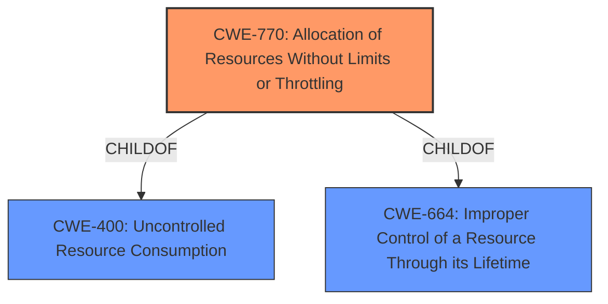

# Analysis Report for CVE-2020-8299

# Vulnerability Analysis Report: CVE-2020-8299

## Description


## Analysis (with Relationship Data)

# Summary
| CWE ID  | CWE Name                                         | Confidence | CWE Abstraction Level | CWE Vulnerability Mapping Label | CWE-Vulnerability Mapping Notes |
| :------- | :----------------------------------------------- | :--------- | :-------------------- | :------------------------------ | :------------------------------ |
| CWE-770 | Allocation of Resources Without Limits or Throttling | 0.85       | Base                  | Allowed                         | Primary CWE                     |
| CWE-400 | Uncontrolled Resource Consumption                 | 0.60       | Class                 | Discouraged                     | Secondary Candidate              |

## Evidence and Confidence

*   **Confidence Score:** 0.80
*   **Evidence Strength:** HIGH

## Relationship Analysis
The primary relationship that influenced the CWE selection was the ChildOf relationship between CWE-770 and CWE-400. CWE-770 is a more specific Base CWE that describes allocating resources without limits or throttling, which directly aligns with the vulnerability description. CWE-400 is a broader Class CWE that encompasses uncontrolled resource consumption generally. Due to the availability of a more precise, lower-level CWE, CWE-770 was favored over CWE-400 as the primary mapping. The relationship between CWE-770 and CWE-665 (Improper Control of a Resource Through Its Lifetime) was also considered, but it was deemed less relevant than the direct resource allocation issue described by CWE-770.



## Vulnerability Chain
The vulnerability chain starts with the **uncontrolled resource consumption**, specifically the allocation of resources without limits or throttling (CWE-770). This leads directly to a denial-of-service (DoS) condition, as the attacker can exhaust available resources within the Layer 2 network segment. The chain can be represented as: CWE-770 -> DoS.

## Summary of Analysis
The initial analysis focused on identifying the root cause of the denial-of-service vulnerability. The vulnerability description explicitly states "**uncontrolled resource consumption**". This points towards issues related to resource management. The Retriever Results identified CWE-400 (Uncontrolled Resource Consumption) as the top candidate. However, the MITRE mapping guidance discourages the use of CWE-400 due to its high-level nature and potential for misuse. Instead, it recommends considering more specific children such as CWE-770 (Allocation of Resources Without Limits or Throttling).

CWE-770 directly addresses the **root cause** of allocating resources without proper limits, which aligns perfectly with the vulnerability description. Therefore, CWE-770 was selected as the primary CWE.

The evidence from the vulnerability description is: "Citrix ADC and Citrix/NetScaler Gateway... suffers from **uncontrolled resource consumption** by way of a network-based denial-of-service from within the same Layer 2 network segment." This statement confirms the presence of **uncontrolled resource consumption** leading to a denial-of-service.

CWE-400 was considered but downgraded to a secondary candidate because it represents a broader class of weaknesses. While the vulnerability ultimately results in **uncontrolled resource consumption**, the more specific **root cause** is the **allocation of resources without limits or throttling**, which is accurately captured by CWE-770.

The chosen CWEs are at the optimal level of specificity because CWE-770 pinpoints the exact mechanism causing the vulnerability, while CWE-400 is a general categorization of the resulting resource exhaustion.

Relevant CWE Information:

# Enhanced Context (25 CWEs)
The following CWEs were identified as potentially relevant to this vulnerability:

## CWE-404: Improper Resource Shutdown or Release
**Abstraction Level**: Class
**Similarity Score**: 0.78

## CWE-664: Improper Control of a Resource Through its Lifetime
**Abstraction Level**: Pillar
**Similarity Score**: 0.78

## CWE-274: Improper Handling of Insufficient Privileges
**Abstraction Level**: Base
**Similarity Score**: 0.76

## CWE-405: Asymmetric Resource Consumption (Amplification)
**Abstraction Level**: Class
**Similarity Score**: 0.76

## CWE-653: Improper Isolation or Compartmentalization
**Abstraction Level**: Class
**Similarity Score**: 0.75

## CWE-668: Exposure of Resource to Wrong Sphere
**Abstraction Level**: Class
**Similarity Score**: 0.75

## CWE-226: Sensitive Information in Resource Not Removed Before Reuse
**Abstraction Level**: Base
**Similarity Score**: 0.75

## CWE-280: Improper Handling of Insufficient Permissions or Privileges
**Abstraction Level**: Base
**Similarity Score**: 0.75

## CWE-667: Improper Locking
**Abstraction Level**: Class
**Similarity Score**: 0.74

## CWE-266: Incorrect Privilege Assignment
**Abstraction Level**: Base
**Similarity Score**: 0.74

## CWE-770: Allocation of Resources Without Limits or Throttling
**Abstraction Level**: Base
**Similarity Score**: 6724.42

## CWE-789: Memory Allocation with Excessive Size Value
**Abstraction Level**: Variant
**Similarity Score**: 6579.09

## CWE-184: Incomplete List of Disallowed Inputs
**Abstraction Level**: Base
**Similarity Score**: 6292.28

## CWE-863: Incorrect Authorization
**Abstraction Level**: Class
**Similarity Score**: 6270.78

## CWE-400: Uncontrolled Resource Consumption
**Abstraction Level**: Class
**Similarity Score**: 6253.25

## CWE-410: Insufficient Resource Pool
**Abstraction Level**: base
**Similarity Score**: 4.33

## CWE-1284: Improper Validation of Specified Quantity in Input
**Abstraction Level**: base
**Similarity Score**: 4.33

## CWE-476: NULL Pointer Dereference
**Abstraction Level**: base
**Similarity Score**: 4.33

## CWE-434: Unrestricted Upload of File with Dangerous Type
**Abstraction Level**: base
**Similarity Score**: 4.33

## CWE-79: Improper Neutralization of Input During Web Page Generation ('Cross-site Scripting')
**Abstraction Level**: base
**Similarity Score**: 4.33

## CWE-184: Incomplete List of Disallowed Inputs
**Abstraction Level**: base
**Similarity Score**: 4.33

## CWE-78: Improper Neutralization of Special Elements used in an OS Command ('OS Command Injection')
**Abstraction Level**: base
**Similarity Score**: 4.33

## CWE-22: Improper Limitation of a Pathname to a Restricted Directory ('Path Traversal')
**Abstraction Level**: base
**Similarity Score**: 3.89

## CWE-98: Improper Control of Filename for Include/Require Statement in PHP Program ('PHP Remote File Inclusion')
**Abstraction Level**: variant
**Similarity Score**: 3.75

## CWE-190: Integer Overflow or Wraparound
**Abstraction Level**: base
**Similarity Score**: 3.42


## CWE Relationship Analysis

Current CWEs represent these abstraction levels: .


### Vulnerability Chain Analysis

**Chain starting from CWE-404:**
- 404 (Improper Resource Shutdown or Release) - ROOT


**Chain starting from CWE-434:**
- 434 (Unrestricted Upload of File with Dangerous Type) - ROOT


### CWE Relationship Diagram

```mermaid
graph TD
    classDef primary fill:#f96,stroke:#333,stroke-width:2px
    classDef secondary fill:#69f,stroke:#333
    classDef tertiary fill:#9e9,stroke:#333
```


*Report generated on 2025-04-01 18:32:41*
