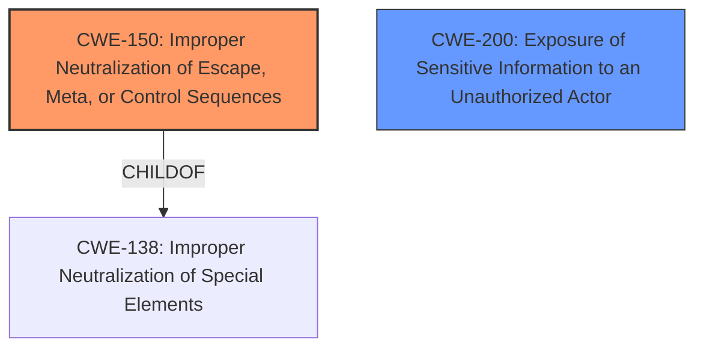

# Analysis for CVE-2020-8468

# Summary
| CWE ID | CWE Name | Confidence | CWE Abstraction Level | CWE Vulnerability Mapping Label | CWE-Vulnerability Mapping Notes |
|---|---|---|---|---|---|
| CWE-150 | Improper Neutralization of Escape, Meta, or Control Sequences | 0.7 | Variant | Allowed | Primary CWE |
| CWE-200 | Exposure of Sensitive Information to an Unauthorized Actor | 0.4 | Class | Discouraged | Secondary Candidate |

## Evidence and Confidence

*   **Confidence Score:** 0.7
*   **Evidence Strength:** MEDIUM

## Relationship Analysis
The primary CWE selected is CWE-150, which is a Variant of CWE-138 (Improper Neutralization of Special Elements). The relationship indicates that CWE-150 is a specific type of neutralization failure related to escape, meta, or control sequences. CWE-200 was considered as a secondary weakness because the manipulation of agent client components could lead to the exposure of sensitive information.

## Vulnerability Chain
The vulnerability chain starts with the **content validation escape vulnerability** (CWE-150), which allows an attacker to manipulate agent client components. This manipulation could potentially lead to the exposure of sensitive information (CWE-200), although this is speculative based on the information available.

## Summary of Analysis
The initial analysis focused on identifying the root cause of the vulnerability, which is described as a **"content validation escape vulnerability."** The Retriever results indicated CWE-150 (Improper Neutralization of Escape, Meta, or Control Sequences) as the top candidate. Given the description and the nature of escape vulnerabilities, CWE-150 appears to be the most appropriate primary CWE.

CWE-200 (Exposure of Sensitive Information to an Unauthorized Actor) was considered because manipulating agent components could lead to information exposure. However, without more information, this remains a potential impact rather than a confirmed root cause.

The choice of CWE-150 is based on the phrase "**content validation escape vulnerability**", which suggests a failure to properly neutralize special elements. The CWE-150 description aligns with this, as it describes a product that receives input and fails to neutralize special elements that could be interpreted as escape, meta, or control character sequences. This aligns with the vulnerability description of a "**content validation escape vulnerability** which could allow an attacker to manipulate certain agent client components."

The selection of CWE-150 is at the Variant level, which is the preferred level of abstraction according to the mapping guidance. CWE-200 is at the Class level and discouraged. The evidence supports the selection of CWE-150 as the primary CWE.

Relevant CWE Information:

# Enhanced Context (25 CWEs)

## CWE-150: Improper Neutralization of Escape, Meta, or Control Sequences
**Abstraction:** Variant
**Similarity Score**: 0.419

### Description
The product receives input from an upstream component, but it does not neutralize or incorrectly neutralizes special elements that could be interpreted as escape, meta, or control character sequences when they are sent to a downstream component.

### Extended Description
As data is parsed, an injected/absent/malformed delimiter may cause the process to take unexpected actions.

### Mapping Guidance
**Usage:** Allowed
**Rationale:** This CWE entry is at the Variant level of abstraction, which is a preferred level of abstraction for mapping to the root causes of vulnerabilities.

## CWE-200: Exposure of Sensitive Information to an Unauthorized Actor
**Abstraction:** Class
**Similarity Score**: 0.558

### Description
The product exposes sensitive information to an actor that is not explicitly authorized to have access to that information.

### Mapping Guidance
**Usage:** Discouraged
**Rationale:** CWE-200 is commonly misused to represent the loss of confidentiality in a vulnerability, but confidentiality loss is a technical impact - not a root cause error.