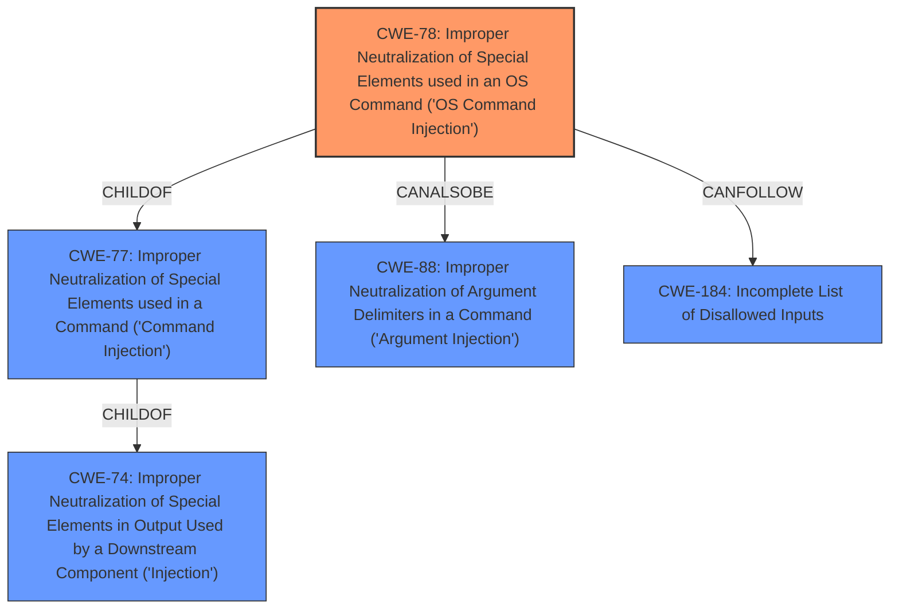

# Raw Analyzer Response for CVE-2020-8515

# Summary
| CWE ID | CWE Name | Confidence | CWE Abstraction Level | CWE Vulnerability Mapping Label | CWE-Vulnerability Mapping Notes |
|---|---|---|---|---|---|
| CWE-78 | Improper Neutralization of Special Elements used in an OS Command ('OS Command Injection') | 1.0 | Base | Allowed | Primary CWE. The vulnerability involves **improper input sanitization** leading to remote code execution via shell metacharacters, which directly aligns with the description of CWE-78. |
| CWE-77 | Improper Neutralization of Special Elements used in a Command ('Command Injection') | 0.5 | Class | Allowed-with-Review | Secondary candidate. While OS command injection is more specific, command injection could also be considered if the specific command environment wasn't strictly OS-level. |
| CWE-73 | External Control of File Name or Path | 0.4 | Base | Allowed | Secondary candidate. This could be relevant if the shell metacharacters are used to manipulate file paths, but the primary issue is the command execution. |

## Evidence and Confidence

*   **Confidence Score:** 1.0
*   **Evidence Strength:** HIGH

## Relationship Analysis
The primary relationship influencing the decision is the hierarchical relationship where CWE-78 is a child of CWE-77, making it a more specific and appropriate choice given the context of OS commands. The `CANFOLLOW` relationship from CWE-78 to CWE-184 (Incomplete List of Disallowed Inputs) suggests that an incomplete list of disallowed shell metacharacters might be a contributing factor. The `CANALSOBE` relationship between CWE-78 and CWE-88 (Improper Neutralization of Argument Delimiters) indicates a possible alternative classification if the injection was specifically related to argument delimiters.

## Vulnerability Chain
The vulnerability chain starts with **improper input sanitization** (likely within the `cgi-bin/mainfunction.cgi` component), leading to the ability to inject shell metacharacters, which then results in remote code execution as root.

## Summary of Analysis
The assessment is primarily based on the vulnerability description, which explicitly mentions **improper input sanitization** and the use of shell metacharacters to achieve remote code execution.

> Vulnerability Description Key Phrases
> - **rootcause:** **improper input sanitization**
> - **impact:** remote code execution
> - **vector:** shell metacharacters

The `CVE Reference Links Content Summary` confirms that the vulnerability exists in the WebUI of the DrayTek routers and can lead to unauthorized access, further supporting the classification.

The choice of CWE-78 is based on the fact that it directly addresses the **improper neutralization** of special elements used in an OS command, which aligns perfectly with the vulnerability description. While other CWEs like CWE-77 (Improper Neutralization of Special Elements used in a Command) were considered, CWE-78 provides a more specific mapping to the OS command context. The abstraction level of Base is also preferred as it represents the root cause of the vulnerability more accurately.

The high confidence is due to the clear indicators in the vulnerability description and the supportive evidence from the CVE reference links. Other CWEs were considered but not used because they didn't directly address the OS command injection aspect.

Relevant CWE Information:

# Enhanced Context (25 CWEs)

## CWE-184: Incomplete List of Disallowed Inputs
**Abstraction Level**: Base
**Similarity Score**: 0.75
**Source**: dense

**Description**:
The product implements a protection mechanism that relies on a list of inputs (or properties of inputs) that are not allowed by policy or otherwise require other action to neutralize before additional processing takes place, but the list is incomplete.

**Mapping Guidance**:
- Usage: Allowed
- Rationale: This CWE entry is at the Base level of abstraction, which is a preferred level of abstraction for mapping to the root causes of vulnerabilities.

## CWE-41: Improper Resolution of Path Equivalence
**Abstraction Level**: Base
**Similarity Score**: 0.74
**Source**: dense

**Description**:
The product is vulnerable to file system contents disclosure through path equivalence. Path equivalence involves the use of special characters in file and directory names. The associated manipulations are intended to generate multiple names for the same object.

**Mapping Guidance**:
- Usage: Allowed
- Rationale: This CWE entry is at the Base level of abstraction, which is a preferred level of abstraction for mapping to the root causes of vulnerabilities.

## CWE-74: Improper Neutralization of Special Elements in Output Used by a Downstream Component ('Injection')
**Abstraction Level**: Class
**Similarity Score**: 0.74
**Source**: dense

**Description**:
The product constructs all or part of a command, data structure, or record using externally-influenced input from an upstream component, but it does not neutralize or incorrectly neutralizes special elements that could modify how it is parsed or interpreted when it is sent to a downstream component.

**Mapping Guidance**:
- Usage: Discouraged
- Rationale: CWE-74 is high-level and often misused when lower-level weaknesses are more appropriate.

## CWE-138: Improper Neutralization of Special Elements
**Abstraction Level**: Class
**Similarity Score**: 0.74
**Source**: dense

**Description**:
The product receives input from an upstream component, but it does not neutralize or incorrectly neutralizes special elements that could be interpreted as control elements or syntactic markers when they are sent to a downstream component.

**Mapping Guidance**:
- Usage: Discouraged
- Rationale: This CWE entry is a level-1 Class (i.e., a child of a Pillar). It might have lower-level children that would be more appropriate

## CWE-73: External Control of File Name or Path
**Abstraction Level**: Base
**Similarity Score**: 0.74
**Source**: dense

**Description**:
The product allows user input to control or influence paths or file names that are used in filesystem operations.

**Mapping Guidance**:
- Usage: Allowed
- Rationale: This CWE entry is at the Base level of abstraction, which is a preferred level of abstraction for mapping to the root causes of vulnerabilities.

## CWE-668: Exposure of Resource to Wrong Sphere
**Abstraction Level**: Class
**Similarity Score**: 0.73
**Source**: dense

**Description**:
The product exposes a resource to the wrong control sphere, providing unintended actors with inappropriate access to the resource.

**Mapping Guidance**:
- Usage: Discouraged
- Rationale: CWE-668 is high-level and is often misused as a catch-all when lower-level CWE IDs might be applicable. It is sometimes used for low-information vulnerability reports [REF-1287]. It is a level-1 Class (i.e., a child of a Pillar). It is not useful for trend analysis.

## CWE-653: Improper Isolation or Compartmentalization
**Abstraction Level**: Class
**Similarity Score**: 0.73
**Source**: dense

**Description**:
The product does not properly compartmentalize or isolate functionality, processes, or resources that require different privilege levels, rights, or permissions.

**Mapping Guidance**:
- Usage: Allowed
- Rationale: This CWE entry is at the Base level of abstraction, which is a preferred level of abstraction for mapping to the root causes of vulnerabilities.

## CWE-807: Reliance on Untrusted Inputs in a Security Decision
**Abstraction Level**: Base
**Similarity Score**: 0.73
**Source**: dense

**Description**:
The product uses a protection mechanism that relies on the existence or values of an input, but the input can be modified by an untrusted actor in a way that bypasses the protection mechanism.

**Mapping Guidance**:
- Usage: Allowed
- Rationale: This CWE entry is at the Base level of abstraction, which is a preferred level of abstraction for mapping to the root causes of vulnerabilities.

## CWE-23: Relative Path Traversal
**Abstraction Level**: Base
**Similarity Score**: 0.73
**Source**: dense

**Description