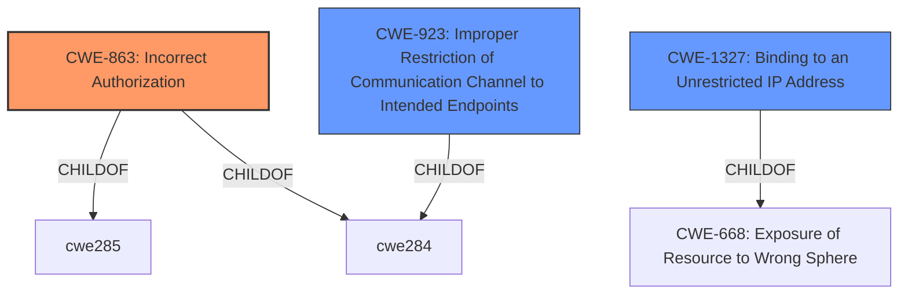

# Enhanced Analysis for CVE-2020-8554

# Summary
| CWE ID    | CWE Name                                                                  | Confidence | CWE Abstraction Level | CWE Vulnerability Mapping Label | CWE-Vulnerability Mapping Notes |
| :-------- | :------------------------------------------------------------------------ | :--------- | :-------------------- | :------------------------------ | :------------------------------ |
| CWE-863   | Incorrect Authorization                                                   | 0.9        | Class                 | Primary CWE                     | Allowed-with-Review           |
| CWE-923   | Improper Restriction of Communication Channel to Intended Endpoints      | 0.7        | Class                 | Secondary Candidate             | Allowed-with-Review           |
| CWE-1327  | Binding to an Unrestricted IP Address                                    | 0.6        | Base                  | Secondary Candidate             | Allowed                       |

## Evidence and Confidence

*   **Confidence Score:** 0.8
*   **Evidence Strength:** HIGH

## Relationship Analysis
The primary CWE selected is CWE-863, which is a Class-level CWE. It has child relationships with CWE-285 and CWE-284 (both Improper Authorization). CWE-923 is also a Class-level CWE and a peer of CWE-863, representing a similar but slightly different weakness. CWE-1327, is more specific and a child of CWE-668.



## Vulnerability Chain
The chain of weaknesses begins with an **incorrect authorization** (**CWE-863**), which allows an attacker to create a ClusterIP service and set the spec.externalIPs field, leading to the interception of traffic. Alternatively, an attacker who can patch the status of a LoadBalancer service can set the status.loadBalancer.ingress.ip, also leading to traffic interception. This might involve an **improper restriction of a communication channel** (**CWE-923**) by not properly ensuring communication with the correct endpoint.

## Summary of Analysis
The initial analysis considered the ability of an attacker to intercept traffic by manipulating service configurations. This suggests a problem with authorization or access control. The primary CWE candidate, **CWE-863 (Incorrect Authorization)**, aligns well with the vulnerability description, as the Kubernetes API server **incorrectly authorizes** the setting of `spec.externalIPs` and the patching of LoadBalancer statuses. This allows attackers to redirect traffic. The **CVE Reference Links Content Summary** states that the **root cause** is a design flaw that allows attackers with the ability to create or edit services and pods to intercept traffic.

CWE-923 was also considered, as the vulnerability allows an attacker to potentially redirect traffic to unintended endpoints. While this is a possible impact, the **root cause** is more directly related to **incorrect authorization**. The retriever results also suggest CWE-1327, since an attacker can effectively bind to an unrestricted IP address by setting the `externalIPs` field.

The final decision favors **CWE-863** as the primary CWE because the vulnerability stems from an **incorrect authorization** check when setting the `spec.externalIPs` field and patching LoadBalancer statuses, which allows attackers to intercept traffic. This is further supported by the **CVE Reference Links Content Summary** that indicates the **root cause** as "A design flaw in Kubernetes allows attackers with the ability to create or edit services and pods to intercept traffic.".

CWE-923 is a valid secondary CWE because the attacker is redirecting traffic to an unintended endpoint. This is supported by the fact that attackers are able to create a ClusterIP service and set the spec.externalIPs field, which in turns impacts communications to externalIP addresses.

CWE-1327 is a valid secondary CWE candidate since an attacker is effectively binding to an unrestricted IP address by setting the `externalIPs` field.

Relevant CWE Information:

# Enhanced Context (25 CWEs)

## CWE-280: Improper Handling of Insufficient Permissions or Privileges
**Abstraction Level**: Base
**Similarity Score**: 0.77
**Source**: dense

**Description**:
The product does not handle or incorrectly handles when it has insufficient privileges to access resources or functionality as specified by their permissions. This may cause it to follow unexpected code paths that may leave the product in an invalid state.

**Mapping Guidance**:
- Usage: Allowed
- Rationale: This CWE entry is at the Base level of abstraction, which is a preferred level of abstraction for mapping to the root causes of vulnerabilities.

## CWE-274: Improper Handling of Insufficient Privileges
**Abstraction Level**: Base
**Similarity Score**: 0.77
**Source**: dense

**Description**:
The product does not handle or incorrectly handles when it has insufficient privileges to perform an operation, leading to resultant weaknesses.

**Mapping Guidance**:
- Usage: Discouraged
- Rationale: This CWE entry could be deprecated in a future version of CWE.

## CWE-668: Exposure of Resource to Wrong Sphere
**Abstraction Level**: Class
**Similarity Score**: 0.76
**Source**: dense

**Description**:
The product exposes a resource to the wrong control sphere, providing unintended actors with inappropriate access to the resource.

**Mapping Guidance**:
- Usage: Discouraged
- Rationale: CWE-668 is high-level and is often misused as a catch-all when lower-level CWE IDs might be applicable. It is sometimes used for low-information vulnerability reports [REF-1287]. It is a level-1 Class (i.e., a child of a Pillar). It is not useful for trend analysis.

## CWE-1220: Insufficient Granularity of Access Control
**Abstraction Level**: Base
**Similarity Score**: 0.76
**Source**: dense

**Description**:
The product implements access controls via a policy or other feature with the intention to disable or restrict accesses (reads and/or writes) to assets in a system from untrusted agents. However, implemented access controls lack required granularity, which renders the control policy too broad because it allows accesses from unauthorized agents to the security-sensitive assets.

**Mapping Guidance**:
- Usage: Allowed
- Rationale: This CWE entry is at the Base level of abstraction, which is a preferred level of abstraction for mapping to the root causes of vulnerabilities.

## CWE-941: Incorrectly Specified Destination in a Communication Channel
**Abstraction Level**: Base
**Similarity Score**: 0.76
**Source**: dense

**Description**:
The product creates a communication channel to initiate an outgoing request to an actor, but it does not correctly specify the intended destination for that actor.

**Mapping Guidance**:
- Usage: Allowed
- Rationale: This CWE entry is at the Base level of abstraction, which is a preferred level of abstraction for mapping to the root causes of vulnerabilities.

## CWE-653: Improper Isolation or Compartmentalization
**Abstraction Level**: Class
**Similarity Score**: 0.76
**Source**: dense

**Description**:
The product does not properly compartmentalize or isolate functionality, processes, or resources that require different privilege levels, rights, or permissions.

**Mapping Guidance**:
- Usage: Allowed
- Rationale: This CWE entry is at the Base level of abstraction, which is a preferred level of abstraction for mapping to the root causes of vulnerabilities.

## CWE-807: Reliance on Untrusted Inputs in a Security Decision
**Abstraction Level**: Base
**Similarity Score**: 0.76
**Source**: dense

**Description**:
The product uses a protection mechanism that relies on the existence or values of an input, but the input can be modified by an untrusted actor in a way that bypasses the protection mechanism.

**Mapping Guidance**:
- Usage: Allowed
- Rationale: This CWE entry is at the Base level of abstraction, which is a preferred level of abstraction for mapping to the root causes of vulnerabilities.

## CWE-303: Incorrect Implementation of Authentication Algorithm
**Abstraction Level**: Base
**Similarity Score**: 0.75
**Source**: dense

**Description**:
The requirements for the product dictate the use of an established authentication algorithm, but the implementation of the algorithm is incorrect.

**Mapping Guidance**:
- Usage: Allowed
- Rationale: This CWE entry is at the Base level of abstraction, which is a preferred level of abstraction for mapping to the root causes of vulnerabilities.

## CWE-404:


## CWE Relationship Analysis

Current CWEs represent these abstraction levels: .


### Vulnerability Chain Analysis

**Chain starting from CWE-303:**
- 303 (Incorrect Implementation of Authentication Algorithm) - ROOT


**Chain starting from CWE-404:**
- 404 (Improper Resource Shutdown or Release) - ROOT


### CWE Relationship Diagram

```mermaid
graph TD
    classDef primary fill:#f96,stroke:#333,stroke-width:2px
    classDef secondary fill:#69f,stroke:#333
    classDef tertiary fill:#9e9,stroke:#333
```