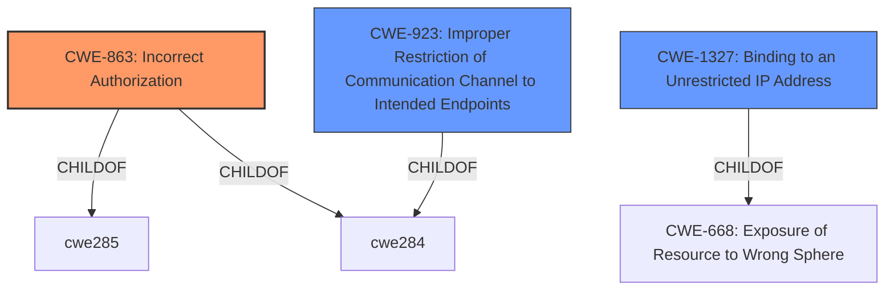

# Analysis for CVE-2020-8554

# Summary
| CWE ID    | CWE Name                                                                  | Confidence | CWE Abstraction Level | CWE Vulnerability Mapping Label | CWE-Vulnerability Mapping Notes |
| :-------- | :------------------------------------------------------------------------ | :--------- | :-------------------- | :------------------------------ | :------------------------------ |
| CWE-863   | Incorrect Authorization                                                   | 0.9        | Class                 | Primary CWE                     | Allowed-with-Review           |
| CWE-923   | Improper Restriction of Communication Channel to Intended Endpoints      | 0.7        | Class                 | Secondary Candidate             | Allowed-with-Review           |
| CWE-1327  | Binding to an Unrestricted IP Address                                    | 0.6        | Base                  | Secondary Candidate             | Allowed                       |

## Evidence and Confidence

*   **Confidence Score:** 0.8
*   **Evidence Strength:** HIGH

## Relationship Analysis
The primary CWE selected is CWE-863, which is a Class-level CWE. It has child relationships with CWE-285 and CWE-284 (both Improper Authorization). CWE-923 is also a Class-level CWE and a peer of CWE-863, representing a similar but slightly different weakness. CWE-1327, is more specific and a child of CWE-668.



## Vulnerability Chain
The chain of weaknesses begins with an **incorrect authorization** (**CWE-863**), which allows an attacker to create a ClusterIP service and set the spec.externalIPs field, leading to the interception of traffic. Alternatively, an attacker who can patch the status of a LoadBalancer service can set the status.loadBalancer.ingress.ip, also leading to traffic interception. This might involve an **improper restriction of a communication channel** (**CWE-923**) by not properly ensuring communication with the correct endpoint.

## Summary of Analysis
The initial analysis considered the ability of an attacker to intercept traffic by manipulating service configurations. This suggests a problem with authorization or access control. The primary CWE candidate, **CWE-863 (Incorrect Authorization)**, aligns well with the vulnerability description, as the Kubernetes API server **incorrectly authorizes** the setting of `spec.externalIPs` and the patching of LoadBalancer statuses. This allows attackers to redirect traffic. The **CVE Reference Links Content Summary** states that the **root cause** is a design flaw that allows attackers with the ability to create or edit services and pods to intercept traffic.

CWE-923 was also considered, as the vulnerability allows an attacker to potentially redirect traffic to unintended endpoints. While this is a possible impact, the **root cause** is more directly related to **incorrect authorization**. The retriever results also suggest CWE-1327, since an attacker can effectively bind to an unrestricted IP address by setting the `externalIPs` field.

The final decision favors **CWE-863** as the primary CWE because the vulnerability stems from an **incorrect authorization** check when setting the `spec.externalIPs` field and patching LoadBalancer statuses, which allows attackers to intercept traffic. This is further supported by the **CVE Reference Links Content Summary** that indicates the **root cause** as "A design flaw in Kubernetes allows attackers with the ability to create or edit services and pods to intercept traffic.".

CWE-923 is a valid secondary CWE because the attacker is redirecting traffic to an unintended endpoint. This is supported by the fact that attackers are able to create a ClusterIP service and set the spec.externalIPs field, which in turns impacts communications to externalIP addresses.

CWE-1327 is a valid secondary CWE candidate since an attacker is effectively binding to an unrestricted IP address by setting the `externalIPs` field.

Relevant CWE Information:

# Enhanced Context (25 CWEs)

## CWE-280: Improper Handling of Insufficient Permissions or Privileges
**Abstraction Level**: Base
**Similarity Score**: 0.77
**Source**: dense

**Description**:
The product does not handle or incorrectly handles when it has insufficient privileges to access resources or functionality as specified by their permissions. This may cause it to follow unexpected code paths that may leave the product in an invalid state.

**Mapping Guidance**:
- Usage: Allowed
- Rationale: This CWE entry is at the Base level of abstraction, which is a preferred level of abstraction for mapping to the root causes of vulnerabilities.

## CWE-274: Improper Handling of Insufficient Privileges
**Abstraction Level**: Base
**Similarity Score**: 0.77
**Source**: dense

**Description**:
The product does not handle or incorrectly handles when it has insufficient privileges to perform an operation, leading to resultant weaknesses.

**Mapping Guidance**:
- Usage: Discouraged
- Rationale: This CWE entry could be deprecated in a future version of CWE.

## CWE-668: Exposure of Resource to Wrong Sphere
**Abstraction Level**: Class
**Similarity Score**: 0.76
**Source**: dense

**Description**:
The product exposes a resource to the wrong control sphere, providing unintended actors with inappropriate access to the resource.

**Mapping Guidance**:
- Usage: Discouraged
- Rationale: CWE-668 is high-level and is often misused as a catch-all when lower-level CWE IDs might be applicable. It is sometimes used for low-information vulnerability reports [REF-1287]. It is a level-1 Class (i.e., a child of a Pillar). It is not useful for trend analysis.

## CWE-1220: Insufficient Granularity of Access Control
**Abstraction Level**: Base
**Similarity Score**: 0.76
**Source**: dense

**Description**:
The product implements access controls via a policy or other feature with the intention to disable or restrict accesses (reads and/or writes) to assets in a system from untrusted agents. However, implemented access controls lack required granularity, which renders the control policy too broad because it allows accesses from unauthorized agents to the security-sensitive assets.

**Mapping Guidance**:
- Usage: Allowed
- Rationale: This CWE entry is at the Base level of abstraction, which is a preferred level of abstraction for mapping to the root causes of vulnerabilities.

## CWE-941: Incorrectly Specified Destination in a Communication Channel
**Abstraction Level**: Base
**Similarity Score**: 0.76
**Source**: dense

**Description**:
The product creates a communication channel to initiate an outgoing request to an actor, but it does not correctly specify the intended destination for that actor.

**Mapping Guidance**:
- Usage: Allowed
- Rationale: This CWE entry is at the Base level of abstraction, which is a preferred level of abstraction for mapping to the root causes of vulnerabilities.

## CWE-653: Improper Isolation or Compartmentalization
**Abstraction Level**: Class
**Similarity Score**: 0.76
**Source**: dense

**Description**:
The product does not properly compartmentalize or isolate functionality, processes, or resources that require different privilege levels, rights, or permissions.

**Mapping Guidance**:
- Usage: Allowed
- Rationale: This CWE entry is at the Base level of abstraction, which is a preferred level of abstraction for mapping to the root causes of vulnerabilities.

## CWE-807: Reliance on Untrusted Inputs in a Security Decision
**Abstraction Level**: Base
**Similarity Score**: 0.76
**Source**: dense

**Description**:
The product uses a protection mechanism that relies on the existence or values of an input, but the input can be modified by an untrusted actor in a way that bypasses the protection mechanism.

**Mapping Guidance**:
- Usage: Allowed
- Rationale: This CWE entry is at the Base level of abstraction, which is a preferred level of abstraction for mapping to the root causes of vulnerabilities.

## CWE-303: Incorrect Implementation of Authentication Algorithm
**Abstraction Level**: Base
**Similarity Score**: 0.75
**Source**: dense

**Description**:
The requirements for the product dictate the use of an established authentication algorithm, but the implementation of the algorithm is incorrect.

**Mapping Guidance**:
- Usage: Allowed
- Rationale: This CWE entry is at the Base level of abstraction, which is a preferred level of abstraction for mapping to the root causes of vulnerabilities.

## CWE-404:

# Enhanced Query for CVE-2020-8554

## Vulnerability Description
Kubernetes API server in all versions allow an attacker who is able to create a ClusterIP service and set the spec.externalIPs field, to intercept traffic to that IP address. Additionally, an attacker who is able to patch the status (which is considered a privileged operation and should not typically be granted to users) of a LoadBalancer service can set the status.loadBalancer.ingress.ip to similar effect.

### Vulnerability Description Key Phrases
- **impact:** intercept traffic to that IP address
- **vector:** create a ClusterIP service and set the spec.externalIPs field
- **attacker:** attacker
- **product:** Kubernetes API server
- **version:** all versions

## CVE Reference Links Content Summary
```
{
  "CVE-2020-8554": {
    "Root cause": "A design flaw in Kubernetes allows attackers with the ability to create or edit services and pods to intercept traffic.",
    "Weaknesses": [
      "Ability to create a ClusterIP service and set the spec.externalIPs field.",
       "Ability to patch the status of a LoadBalancer service and set the status.loadBalancer.ingress.ip."
    ],
    "Impact": "An attacker may be able to intercept traffic from other pods or nodes within the cluster.",
    "Attack vectors": [
      "Creating a ClusterIP service and setting the spec.externalIPs field.",
       "Patching the status of a LoadBalancer service and setting the status.loadBalancer.ingress.ip."
    ],
    "Required attacker capabilities": "The attacker must have the ability to create or edit services and pods. The ability to patch service/status is considered a privileged operation."
  }
}
```

## Retriever Results

### Top Combined Results

| Rank | CWE ID | Name | Abstraction | Usage  | Retrievers | Individual Scores |
|------|--------|------|-------------|-------|------------|-------------------|
| 1 | 283 | Unverified Ownership | Base | Allowed | sparse | 0.249 |
| 2 | 863 | Incorrect Authorization | Class | Allowed-with-Review | sparse | 0.141 |
| 3 | 923 | Improper Restriction of Communication Channel to Intended Endpoints | Class | Allowed-with-Review | sparse | 0.140 |
| 4 | 346 | Origin Validation Error | Class | Allowed-with-Review | sparse | 0.135 |
| 5 | 668 | Exposure of Resource to Wrong Sphere | Class | Discouraged | sparse | 0.131 |
| 6 | 1327 | Binding to an Unrestricted IP Address | Base | Allowed | dense | 0.469 |
| 7 | 941 | Incorrectly Specified Destination in a Communication Channel | Base | Allowed | graph | 0.003 |
| 8 | 306 | Missing Authentication for Critical Function | Base | Allowed | sparse | 0.131 |
| 9 | 319 | Cleartext Transmission of Sensitive Information | Base | Allowed | sparse | 0.131 |
| 10 | 285 | Improper Authorization | Class | Discouraged | sparse | 0.129 |


# Complete CWE Specifications


## CWE-283: Unverified Ownership
**Abstraction:** Base
**Status:** Draft

### Description
The product does not properly verify that a critical resource is owned by the proper entity.

### Extended Description
Not provided

### Alternative Terms
None

### Relationships
ChildOf -> CWE-282

### Mapping Guidance
**Usage:** Allowed
**Rationale:** This CWE entry is at the Base level of abstraction, which is a preferred level of abstraction for mapping to the root causes of vulnerabilities.
**Comments:** Carefully read both the name and description to ensure that this mapping is an appropriate fit. Do not try to 'force' a mapping to a lower-level Base/Variant simply to comply with this preferred level of abstraction.
**Reasons:**
- Acceptable-Use


### Additional Notes
**[Relationship]** This overlaps insufficient comparison, verification errors, permissions, and privileges.


### Observed Examples
- **CVE-2001-0178:** Program does not verify the owner of a UNIX socket that is used for sending a password.
- **CVE-2004-2012:** Owner of special device not checked, allowing root.


## CWE-863: Incorrect Authorization
**Abstraction:** Class
**Status:** Incomplete

### Description
The product performs an authorization check when an actor attempts to access a resource or perform an action, but it does not correctly perform the check.

### Extended Description
Not provided

### Alternative Terms
AuthZ: "AuthZ" is typically used as an abbreviation of "authorization" within the web application security community. It is distinct from "AuthN" (or, sometimes, "AuthC") which is an abbreviation of "authentication." The use of "Auth" as an abbreviation is discouraged, since it could be used for either authentication or authorization.

### Relationships
ChildOf -> CWE-285
ChildOf -> CWE-284

### Mapping Guidance
**Usage:** Allowed-with-Review
**Rationale:** This CWE entry is a Class and might have Base-level children that would be more appropriate
**Comments:** Examine children of this entry to see if there is a better fit
**Reasons:**
- Abstraction


### Additional Notes
**[Terminology]** 

Assuming a user with a given identity, authorization is the process of determining whether that user can access a given resource, based on the user's privileges and any permissions or other access-control specifications that apply to the resource.


### Observed Examples
- **CVE-2021-39155:** Chain: A microservice integration and management platform compares the hostname in the HTTP Host header in a case-sensitive way (CWE-178, CWE-1289), allowing bypass of the authorization policy (CWE-863) using a hostname with mixed case or other variations.
- **CVE-2019-15900:** Chain: sscanf() call is used to check if a username and group exists, but the return value of sscanf() call is not checked (CWE-252), causing an uninitialized variable to be checked (CWE-457), returning success to allow authorization bypass for executing a privileged (CWE-863).
- **CVE-2009-2213:** Gateway uses default "Allow" configuration for its authorization settings.


## CWE-923: Improper Restriction of Communication Channel to Intended Endpoints
**Abstraction:** Class
**Status:** Incomplete

### Description
The product establishes a communication channel to (or from) an endpoint for privileged or protected operations, but it does not properly ensure that it is communicating with the correct endpoint.

### Extended Description


Attackers might be able to spoof the intended endpoint from a different system or process, thus gaining the same level of access as the intended endpoint.


While this issue frequently involves authentication between network-based clients and servers, other types of communication channels and endpoints can have this weakness.


### Alternative Terms
None

### Relationships
ChildOf -> CWE-284

### Mapping Guidance
**Usage:** Allowed-with-Review
**Rationale:** This CWE entry is a Class and might have Base-level children that would be more appropriate
**Comments:** Examine children of this entry to see if there is a better fit
**Reasons:**
- Abstraction


### Observed Examples
- **CVE-2022-30319:** S-bus functionality in a home automation product performs access control using an IP allowlist, which can be bypassed by a forged IP address.
- **CVE-2022-22547:** A troubleshooting tool exposes a web server on a random port between 9000-65535 that could be used for information gathering
- **CVE-2022-4390:** A WAN interface on a router has firewall restrictions enabled for IPv4, but it does not for IPv6, which is enabled by default


## CWE-346: Origin Validation Error
**Abstraction:** Class
**Status:** Draft

### Description
The product does not properly verify that the source of data or communication is valid.

### Extended Description
Not provided

### Alternative Terms
None

### Relationships
ChildOf -> CWE-345
ChildOf -> CWE-345
ChildOf -> CWE-284

### Mapping Guidance
**Usage:** Allowed-with-Review
**Rationale:** This CWE entry is a Class and might have Base-level children that would be more appropriate
**Comments:** Examine children of this entry to see if there is a better fit
**Reasons:**
- Abstraction


### Additional Notes
**[Maintenance]** This entry has some significant overlap with other CWE entries and may need some clarification. See terminology notes.

**[Terminology]** The "Origin Validation Error" term was originally used in a 1995 thesis [REF-324]. Although not formally defined, an issue is considered to be an origin validation error if either (1) "an object [accepts] input from an unauthorized subject," or (2) "the system [fails] to properly or completely authenticate a subject." A later section says that an origin validation error can occur when the system (1) "does not properly authenticate a user or process" or (2) "does not properly authenticate the shared data or libraries." The only example provided in the thesis (covered by OSVDB:57615) involves a setuid program running command-line arguments without dropping privileges. So, this definition (and its examples in the thesis) effectively cover other weaknesses such as CWE-287 (Improper Authentication), CWE-285 (Improper Authorization), and CWE-250 (Execution with Unnecessary Privileges). There appears to be little usage of this term today, except in the SecurityFocus vulnerability database, where the term is used for a variety of issues, including web-browser problems that allow violation of the Same Origin Policy and improper validation of the source of an incoming message.


### Observed Examples
- **CVE-2000-1218:** DNS server can accept DNS updates from hosts that it did not query, leading to cache poisoning
- **CVE-2005-0877:** DNS server can accept DNS updates from hosts that it did not query, leading to cache poisoning
- **CVE-2001-1452:** DNS server caches glue records received from non-delegated name servers


## CWE-668: Exposure of Resource to Wrong Sphere
**Abstraction:** Class
**Status:** Draft

### Description
The product exposes a resource to the wrong control sphere, providing unintended actors with inappropriate access to the resource.

### Extended Description


Resources such as files and directories may be inadvertently exposed through mechanisms such as insecure permissions, or when a program accidentally operates on the wrong object. For example, a program may intend that private files can only be provided to a specific user. This effectively defines a control sphere that is intended to prevent attackers from accessing these private files. If the file permissions are insecure, then parties other than the user will be able to access those files.


A separate control sphere might effectively require that the user can only access the private files, but not any other files on the system. If the program does not ensure that the user is only requesting private files, then the user might be able to access other files on the system.


In either case, the end result is that a resource has been exposed to the wrong party.


### Alternative Terms
None

### Relationships
ChildOf -> CWE-664

### Mapping Guidance
**Usage:** Discouraged
**Rationale:** CWE-668 is high-level and is often misused as a catch-all when lower-level CWE IDs might be applicable. It is sometimes used for low-information vulnerability reports [REF-1287]. It is a level-1 Class (i.e., a child of a Pillar). It is not useful for trend analysis.
**Comments:** Closely analyze the specific mistake that is allowing the resource to be exposed, and perform a CWE mapping for that mistake.
**Reasons:**
- Frequent Misuse
- Abstraction


### Additional Notes
**[Theoretical]** A "control sphere" is a set of resources and behaviors that are accessible to a single actor, or a group of actors. A product's security model will typically define multiple spheres, possibly implicitly. For example, a server might define one sphere for "administrators" who can create new user accounts with subdirectories under /home/server/, and a second sphere might cover the set of users who can create or delete files within their own subdirectories. A third sphere might be "users who are authenticated to the operating system on which the product is installed." Each sphere has different sets of actors and allowable behaviors.


## CWE-1327: Binding to an Unrestricted IP Address
**Abstraction:** Base
**Status:** Incomplete

### Description
The product assigns the address 0.0.0.0 for a database server, a cloud service/instance, or any computing resource that communicates remotely.

### Extended Description


When a server binds to the address 0.0.0.0, it allows connections from every IP address on the local machine, effectively exposing the server to every possible network. This might be much broader access than intended by the developer or administrator, who might only be expecting the server to be reachable from a single interface/network.


### Alternative Terms
None

### Relationships
ChildOf -> CWE-668

### Mapping Guidance
**Usage:** Allowed
**Rationale:** This CWE entry is at the Base level of abstraction, which is a preferred level of abstraction for mapping to the root causes of vulnerabilities.
**Comments:** Carefully read both the name and description to ensure that this mapping is an appropriate fit. Do not try to 'force' a mapping to a lower-level Base/Variant simply to comply with this preferred level of abstraction.
**Reasons:**
- Acceptable-Use


### Observed Examples
- **CVE-2022-21947:** Desktop manager for Kubernetes and container management binds a service to 0.0.0.0, allowing users on the network to make requests to a dashboard API.


## CWE-941: Incorrectly Specified Destination in a Communication Channel
**Abstraction:** Base
**Status:** Incomplete

### Description
The product creates a communication channel to initiate an outgoing request to an actor, but it does not correctly specify the intended destination for that actor.

### Extended Description


Attackers at the destination may be able to spoof trusted servers to steal data or cause a denial of service.


There are at least two distinct weaknesses that can cause the product to communicate with an unintended destination:


  - If the product allows an attacker to control which destination is specified, then the attacker can cause it to connect to an untrusted or malicious destination. For example, because UDP is a connectionless protocol, UDP packets can be spoofed by specifying a false source address in the packet; when the server receives the packet and sends a reply, it will specify a destination by using the source of the incoming packet - i.e., the false source. The server can then be tricked into sending traffic to the wrong host, which is effective for hiding the real source of an attack and for conducting a distributed denial of service (DDoS). As another example, server-side request forgery (SSRF) and XML External Entity (XXE) can be used to trick a server into making outgoing requests to hosts that cannot be directly accessed by the attacker due to firewall restrictions.

  - If the product incorrectly specifies the destination, then an attacker who can control this destination might be able to spoof trusted servers. While the most common occurrence is likely due to misconfiguration by an administrator, this can be resultant from other weaknesses. For example, the product might incorrectly parse an e-mail or IP address and send sensitive data to an unintended destination. As another example, an Android application may use a "sticky broadcast" to communicate with a receiver for a particular application, but since sticky broadcasts can be processed by *any* receiver, this can allow a malicious application to access restricted data that was only intended for a different application.


### Alternative Terms
None

### Relationships
ChildOf -> CWE-923
CanPrecede -> CWE-406

### Mapping Guidance
**Usage:** Allowed
**Rationale:** This CWE entry is at the Base level of abstraction, which is a preferred level of abstraction for mapping to the root causes of vulnerabilities.
**Comments:** Carefully read both the name and description to ensure that this mapping is an appropriate fit. Do not try to 'force' a mapping to a lower-level Base/Variant simply to comply with this preferred level of abstraction.
**Reasons:**
- Acceptable-Use


### Observed Examples
- **CVE-2013-5211:** composite: NTP feature generates large responses (high amplification factor) with spoofed UDP source addresses.
- **CVE-1999-0513:** Classic "Smurf" attack, using spoofed ICMP packets to broadcast addresses.
- **CVE-1999-1379:** DNS query with spoofed source address causes more traffic to be returned to spoofed address than was sent by the attacker.


## CWE-306: Missing Authentication for Critical Function
**Abstraction:** Base
**Status:** Draft

### Description
The product does not perform any authentication for functionality that requires a provable user identity or consumes a significant amount of resources.

### Extended Description
Not provided

### Alternative Terms
None

### Relationships
ChildOf -> CWE-287
ChildOf -> CWE-287

### Mapping Guidance
**Usage:** Allowed
**Rationale:** This CWE entry is at the Base level of abstraction, which is a preferred level of abstraction for mapping to the root causes of vulnerabilities.
**Comments:** Carefully read both the name and description to ensure that this mapping is an appropriate fit. Do not try to 'force' a mapping to a lower-level Base/Variant simply to comply with this preferred level of abstraction.
**Reasons:**
- Acceptable-Use


### Observed Examples
- **CVE-2022-31260:** Chain: a digital asset management program has an undisclosed backdoor in the legacy version of a PHP script (CWE-912) that could allow an unauthenticated user to export metadata (CWE-306)
- **CVE-2022-29951:** TCP-based protocol in Programmable Logic Controller (PLC) has no authentication.
- **CVE-2022-29952:** Condition Monitor firmware uses a protocol that does not require authentication.


## CWE-319: Cleartext Transmission of Sensitive Information
**Abstraction:** Base
**Status:** Draft

### Description
The product transmits sensitive or security-critical data in cleartext in a communication channel that can be sniffed by unauthorized actors.

### Extended Description


Many communication channels can be "sniffed" (monitored) by adversaries during data transmission. For example, in networking, packets can traverse many intermediary nodes from the source to the destination, whether across the internet, an internal network, the cloud, etc. Some actors might have privileged access to a network interface or any link along the channel, such as a router, but they might not be authorized to collect the underlying data. As a result, network traffic could be sniffed by adversaries, spilling security-critical data.


Applicable communication channels are not limited to software products. Applicable channels include hardware-specific technologies such as internal hardware networks and external debug channels, supporting remote JTAG debugging. When mitigations are not applied to combat adversaries within the product's threat model, this weakness significantly lowers the difficulty of exploitation by such adversaries.


When full communications are recorded or logged, such as with a packet dump, an adversary could attempt to obtain the dump long after the transmission has occurred and try to "sniff" the cleartext from the recorded communications in the dump itself. Even if the information is encoded in a way that is not human-readable, certain techniques could determine which encoding is being used, then decode the information. 


### Alternative Terms
None

### Relationships
ChildOf -> CWE-311
ChildOf -> CWE-311

### Mapping Guidance
**Usage:** Allowed
**Rationale:** This CWE entry is at the Base level of abstraction, which is a preferred level of abstraction for mapping to the root causes of vulnerabilities.
**Comments:** Carefully read both the name and description to ensure that this mapping is an appropriate fit. Do not try to 'force' a mapping to a lower-level Base/Variant simply to comply with this preferred level of abstraction.
**Reasons:**
- Acceptable-Use


### Additional Notes
**[Maintenance]** The Taxonomy_Mappings to ISA/IEC 62443 were added in CWE 4.10, but they are still under review and might change in future CWE versions. These draft mappings were performed by members of the "Mapping CWE to 62443" subgroup of the CWE-CAPEC ICS/OT Special Interest Group (SIG), and their work is incomplete as of CWE 4.10. The mappings are included to facilitate discussion and review by the broader ICS/OT community, and they are likely to change in future CWE versions.


### Observed Examples
- **CVE-2022-29519:** Programmable Logic Controller (PLC) sends sensitive information in plaintext, including passwords and session tokens.
- **CVE-2022-30312:** Building Controller uses a protocol that transmits authentication credentials in plaintext.
- **CVE-2022-31204:** Programmable Logic Controller (PLC) sends password in plaintext.


## CWE-285: Improper Authorization
**Abstraction:** Class
**Status:** Draft

### Description
The product does not perform or incorrectly performs an authorization check when an actor attempts to access a resource or perform an action.

### Extended Description


Assuming a user with a given identity, authorization is the process of determining whether that user can access a given resource, based on the user's privileges and any permissions or other access-control specifications that apply to the resource.


When access control checks are not applied consistently - or not at all - users are able to access data or perform actions that they should not be allowed to perform. This can lead to a wide range of problems, including information exposures, denial of service, and arbitrary code execution.


### Alternative Terms
AuthZ: "AuthZ" is typically used as an abbreviation of "authorization" within the web application security community. It is distinct from "AuthN" (or, sometimes, "AuthC") which is an abbreviation of "authentication." The use of "Auth" as an abbreviation is discouraged, since it could be used for either authentication or authorization.

### Relationships
ChildOf -> CWE-284
ChildOf -> CWE-284

### Mapping Guidance
**Usage:** Discouraged
**Rationale:** CWE-285 is high-level and lower-level CWEs can frequently be used instead. It is a level-1 Class (i.e., a child of a Pillar).
**Comments:** Look at CWE-285's children and consider mapping to CWEs such as CWE-862: Missing Authorization, CWE-863: Incorrect Authorization, CWE-732: Incorrect Permission Assignment for Critical Resource, or others.
**Reasons:**
- Abstraction
**Suggested Alternatives:**
- CWE-862: Missing Authorization
- CWE-863: Incorrect Authorization
- CWE-732: Incorrect Permission Assignment for Critical Resource


### Observed Examples
- **CVE-2022-24730:** Go-based continuous deployment product does not check that a user has certain privileges to update or create an app, allowing adversaries to read sensitive repository information
- **CVE-2009-3168:** Web application does not restrict access to admin scripts, allowing authenticated users to reset administrative passwords.
- **CVE-2009-2960:** Web application does not restrict access to admin scripts, allowing authenticated users to modify passwords of other users.

