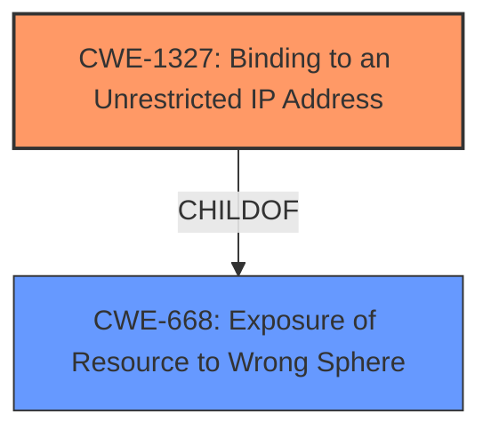

# Raw Analyzer Response for CVE-2020-8558

# Summary
| CWE ID    | CWE Name                                                        | Confidence | CWE Abstraction Level | CWE Vulnerability Mapping Label | CWE-Vulnerability Mapping Notes |
| :-------- | :-------------------------------------------------------------- | :--------- | :-------------------- | :------------------------------ | :------------------------------ |
| CWE-1327  | Binding to an Unrestricted IP Address                           | 0.9        | Base                  | Allowed                         | Primary CWE                     |
| CWE-668   | Exposure of Resource to Wrong Sphere                            | 0.7        | Class                 | Discouraged                     | Secondary Candidate             |

## Evidence and Confidence

*   **Confidence Score:** 0.8
*   **Evidence Strength:** HIGH

## Relationship Analysis
The primary relationship that influenced the decision was the ChildOf relationship between CWE-1327 and CWE-668. Specifically, CWE-1327 is a more specific case of CWE-668. Given the details of the vulnerability, CWE-1327 provides a more accurate and granular classification. The abstraction levels also played a role, favoring the Base level CWE-1327 over the Class level CWE-668.

## Vulnerability Chain
The vulnerability chain starts with `kube-proxy` incorrectly setting the `net.ipv4.conf.all.route_localnet` sysctl parameter. This **improper configuration** allows adjacent hosts to reach TCP and UDP services bound to 127.0.0.1, resulting in potential sensitive information disclosure, data modification, or arbitrary API request execution.

## Summary of Analysis
The initial analysis considered several CWEs, including CWE-420, CWE-400, CWE-923, CWE-201 and CWE-770. However, the key factor in the vulnerability is that the `kube-proxy` component was setting `net.ipv4.conf.all.route_localnet` sysctl parameter, which caused the system to not reject traffic destined for localhost (`127.0.0.1`) even if it originated from other hosts on the same network.

This configuration effectively binds services to an unrestricted IP address, making CWE-1327 the most appropriate choice.
The description of CWE-1327 aligns perfectly: "The product assigns the address 0.0.0.0 for a database server, a cloud service/instance, or any computing resource that communicates remotely." In this case, setting `net.ipv4.conf.all.route_localnet` to 1 effectively makes services bound to 127.0.0.1 reachable from any IP on the network.

The decision to use CWE-1327 is heavily based on the "CVE Reference Links Content Summary", which states: "The root cause of the vulnerability lies in the way `kube-proxy` sets the `net.ipv4.conf.all.route_localnet` sysctl parameter in Linux systems. Specifically, kube-proxy was setting this parameter to `1`, which caused the system to not reject traffic destined for localhost (`127.0.0.1`) even if it originated from other hosts on the same network."

The graph relationships influenced the final selection by highlighting the child-parent relationship between CWE-1327 and CWE-668. This helped refine the selection to the most specific and accurate CWE.

The selected CWE is at the optimal level of specificity because it directly reflects the **incorrect configuration** that enables the vulnerability.

Relevant CWE Information:

# Enhanced Context (25 CWEs)
The following CWEs were identified as potentially relevant to this vulnerability:

## CWE-226: Sensitive Information in Resource Not Removed Before Reuse
**Abstraction Level**: Base
**Similarity Score**: 0.77
**Source**: dense

**Description**:
The product releases a resource such as memory or a file so that it can be made available for reuse, but it does not clear or "zeroize" the information contained in the resource before the product performs a critical state transition or makes the resource available for reuse by other entities.

**Mapping Guidance**:
- Usage: Allowed
- Rationale: This CWE entry is at the Base level of abstraction, which is a preferred level of abstraction for mapping to the root causes of vulnerabilities.

## CWE-404: Improper Resource Shutdown or Release
**Abstraction Level**: Class
**Similarity Score**: 0.77
**Source**: dense

**Description**:
The product does not release or incorrectly releases a resource before it is made available for re-use.

**Mapping Guidance**:
- Usage: Allowed-with-Review
- Rationale: This CWE entry is a Class and might have Base-level children that would be more appropriate

## CWE-668: Exposure of Resource to Wrong Sphere
**Abstraction Level**: Class
**Similarity Score**: 0.75
**Source**: dense

**Description**:
The product exposes a resource to the wrong control sphere, providing unintended actors with inappropriate access to the resource.

**Mapping Guidance**:
- Usage: Discouraged
- Rationale: CWE-668 is high-level and is often misused as a catch-all when lower-level CWE IDs might be applicable. It is sometimes used for low-information vulnerability reports [REF-1287]. It is a level-1 Class (i.e., a child of a Pillar). It is not useful for trend analysis.

## CWE-212: Improper Removal of Sensitive Information Before Storage or Transfer
**Abstraction Level**: Base
**Similarity Score**: 0.75
**Source**: dense

**Description**:
The product stores, transfers, or shares a resource that contains sensitive information, but it does not properly remove that information before the product makes the resource available to unauthorized actors.

**Mapping Guidance**:
- Usage: Allowed
- Rationale: This CWE entry is at the Base level of abstraction, which is a preferred level of abstraction for mapping to the root causes of vulnerabilities.

## CWE-653: Improper Isolation or Compartmentalization
**Abstraction Level**: Class
**Similarity Score**: 0.75
**Source**: dense

**Description**:
The product does not properly compartmentalize or isolate functionality, processes, or resources that require different privilege levels, rights, or permissions.

**Mapping Guidance**:
- Usage: Allowed
- Rationale: This CWE entry is at the Base level of abstraction, which is a preferred level of abstraction for mapping to the root causes of vulnerabilities.

## CWE-1289: Improper Validation of Unsafe Equivalence in Input
**Abstraction Level**: Base
**Similarity Score**: 0.74
**Source**: dense

**Description**:
The product receives an input value that is used as a resource identifier or other type of reference, but it does not validate or incorrectly validates that the input is equivalent to a potentially-unsafe value.

**Mapping Guidance**:
- Usage: Allowed
- Rationale: This CWE entry is at the Base level of abstraction, which is a preferred level of abstraction for mapping to the root causes of vulnerabilities.

## CWE-405: Asymmetric Resource Consumption (Amplification)
**Abstraction Level**: Class
**Similarity Score**: 0.74
**Source**: dense

**Description**:
The product does not properly control situations in which an adversary can cause the product to consume or produce excessive resources without requiring the adversary to invest equivalent work or otherwise prove authorization, i.e., the adversary's influence is "asymmetric."

**Mapping Guidance**:
- Usage: Allowed-with-Review
- Rationale: This CWE entry is a Class and might have Base-level children that would be more appropriate

## CWE-667: Improper Locking
**Abstraction Level**: Class
**Similarity Score**: 0.74
**Source**: dense

**Description**:
The product does not properly acquire or release a lock on a resource, leading to unexpected resource state changes and behaviors.

**Mapping Guidance**:
- Usage: Allowed-with-Review
- Rationale: This CWE entry is a Class and might have Base-level children that would be more appropriate

## CWE-754: Improper Check for Unusual or Exceptional Conditions
**Abstraction Level**: Class
**Similarity Score**: 0.74
**Source**: dense

**Description**:
The product does not check or incorrectly checks for unusual or exceptional conditions that are not expected to occur frequently during day to day operation of the product.

**Mapping Guidance**:
- Usage: Allowed-with-Review
- Rationale: This CWE entry is a Class and might have Base-level children that would be more appropriate

## CWE-639: Authorization Bypass Through User-Controlled Key
**Abstraction Level**: Base
**Similarity Score**: 0.74
**Source**: dense

**Description**:
The system's authorization functionality does not prevent one user from gaining access to another user's data or record by modifying the key