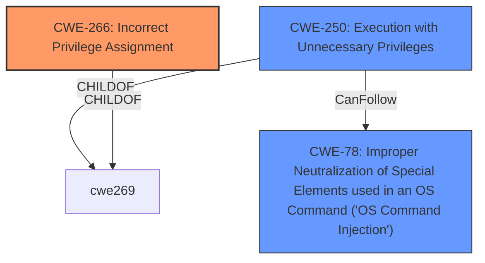

# Enhanced Analysis for CVE-2020-8655

# Summary
| CWE ID | CWE Name | Confidence | CWE Abstraction Level | CWE Vulnerability Mapping Label | CWE-Vulnerability Mapping Notes |
|---|---|---|---|---|---|
| CWE-266 | Incorrect Privilege Assignment | 0.9 | Base | Allowed | Primary CWE |
| CWE-250 | Execution with Unnecessary Privileges | 0.7 | Base | Allowed | Secondary CWE |
| CWE-78 | Improper Neutralization of Special Elements used in an OS Command ('OS Command Injection') | 0.6 | Base | Allowed | Secondary CWE |

## Evidence and Confidence

*   **Confidence Score:** 0.8
*   **Evidence Strength:** HIGH

## Relationship Analysis
The primary relationship is that **CWE-266 (Incorrect Privilege Assignment)** is the root cause, leading to the potential for **CWE-250 (Execution with Unnecessary Privileges)** because the apache user now has more privileges than needed, enabling **CWE-78 (Improper Neutralization of Special Elements used in an OS Command ('OS Command Injection'))** through the use of `nmap` with a crafted NSE script.



## Vulnerability Chain
The vulnerability chain starts with the **improper sudoers configuration (CWE-266)**, leading to the **apache user having unnecessary privileges (CWE-250)** which is then exploited using a crafted NSE script to perform **OS Command Injection (CWE-78)**, ultimately resulting in privilege escalation to root.

## Summary of Analysis
The analysis is based on the provided vulnerability description and the CVE reference content summary. The root cause of the vulnerability is the **improper sudoers configuration**, which allows the `apache` user to run arbitrary commands as root.

The evidence supporting this is:

*   "**rootcause:** **improper sudoers configuration**"
*   "The vulnerability stems from **insecure sudo configurations** for the `apache` user in EON 5.3."
*   "The primary **weakness is the excessive permissions** granted to the `apache` user via `sudo`."
*   "An attacker, by leveraging the `apache` user’s privileges, can achieve arbitrary command execution as the root user."
*   The provided sudo configuration snippet: `apache ALL=NOPASSWD:/bin/systemctl * snmptt,/bin/systemctl * snmptrapd,/bin/systemctl * snmpd,/bin/systemctl * nagios,/bin/systemctl * gedd,/usr/bin/nmap`

The relationships influenced the selection because **CWE-266 (Incorrect Privilege Assignment)** directly addresses the root cause, while **CWE-250 (Execution with Unnecessary Privileges)** describes the consequence of the incorrect privilege assignment. **CWE-78 (Improper Neutralization of Special Elements used in an OS Command ('OS Command Injection'))** describes how the attacker escalates privileges.

The selected CWEs are at the optimal level of specificity because they accurately represent the weakness at the Base level, which is a preferred level of abstraction.

Relevant CWE Information:

# Enhanced Context (25 CWEs)
The following CWEs were identified as potentially relevant to this vulnerability:

## CWE-266: Incorrect Privilege Assignment
**Abstraction Level**: Base
**Similarity Score**: 0.79
**Source**: dense

**Description**:
A product incorrectly assigns a privilege to a particular actor, creating an unintended sphere of control for that actor.

**Mapping Guidance**:
- Usage: Allowed
- Rationale: This CWE entry is at the Base level of abstraction, which is a preferred level of abstraction for mapping to the root causes of vulnerabilities.

## CWE-250: Execution with Unnecessary Privileges
**Abstraction Level**: Base
**Similarity Score**: 0.76
**Source**: dense

**Description**:
The product performs an operation at a privilege level that is higher than the minimum level required, which creates new weaknesses or amplifies the consequences of other weaknesses.

**Mapping Guidance**:
- Usage: Allowed
- Rationale: This CWE entry is at the Base level of abstraction, which is a preferred level of abstraction for mapping to the root causes of vulnerabilities.

## CWE-78: Improper Neutralization of Special Elements used in an OS Command ('OS Command Injection')
**Abstraction Level**: base
**Similarity Score**: 5.03
**Source**: graph

**Description**:
The product constructs all or part of an OS command using externally-influenced input from an upstream component, but it does not neutralize or incorrectly neutralizes special elements that could modify the intended OS command when it is sent to a downstream component.

**Mapping Guidance**:
- Usage: Allowed
- Rationale: This CWE entry is at the Base level of abstraction, which is a preferred level of abstraction for mapping to the root causes of vulnerabilities.

## CWE Details and Justification:

### CWE-266: Incorrect Privilege Assignment
*   **Explanation:** The vulnerability stems from an **improper sudoers configuration**, which incorrectly assigns privileges to the `apache` user. This allows the `apache` user to run commands as root, which is an unintended sphere of control.
*   **Security Implications:** This allows an attacker to escalate privileges and execute arbitrary commands as root.
*   **Relationships:** This is the root cause and can lead to other weaknesses such as CWE-250.
*   **Mapping Guidance:** The usage is ALLOWED, and the rationale is that it's a Base level of abstraction suitable for mapping root causes.

### CWE-250: Execution with Unnecessary Privileges
*   **Explanation:** The `apache` user is granted `NOPASSWD` privileges for commands like `systemctl` and `nmap`, which are higher than the minimum level required for its intended function. This grants unnecessary privileges that can be exploited.
*   **Security Implications:** This amplifies the consequences of other weaknesses, such as **OS Command Injection**, because the commands are executed with root privileges.
*   **Relationships:** This is a consequence of **CWE-266** and can lead to other weaknesses like **CWE-78**.
*   **Mapping Guidance:** The usage is ALLOWED, and the rationale is that it's a Base level of abstraction suitable for mapping root causes.

### CWE-78: Improper Neutralization of Special Elements used in an OS Command ('OS Command Injection')
*   **Explanation:** The `apache` user is permitted to execute `/usr/bin/nmap` via `sudo`. `nmap` allows the execution of arbitrary commands via NSE scripts, and due to the improper sudo configuration, these commands are executed as root.
*   **Security Implications:** An attacker can craft a malicious NSE script to execute arbitrary commands with root privileges.
*   **Relationships:** This is a direct consequence of the excessive privileges granted to the `apache` user via the **improper sudoers configuration**.
*   **Mapping Guidance:** The usage is ALLOWED, and the rationale is that it's a Base level of abstraction suitable for mapping root causes.

## CWEs Considered but Not Used:

*   **CWE-269: Improper Privilege Management:** This is a Class-level CWE and is too generic. **CWE-266** provides a more specific description of the **incorrect privilege assignment**. The mapping guidance discourages the use of **CWE-269** due to frequent misuse.
*   **CWE-426: Untrusted Search Path:** While `nmap` is in the path, the issue is not about the path itself being untrusted, but about the **improper privilege** given to the `apache` user to execute `nmap` with root privileges.
*   **CWE-732: Incorrect Permission Assignment for Critical Resource:** This CWE is about incorrect permission assignments for resources, not about **incorrect sudo configurations**.


## CWE Relationship Analysis

Current CWEs represent these abstraction levels: .


### Vulnerability Chain Analysis

**Chain starting from CWE-732:**
- 732 (Incorrect Permission Assignment for Critical Resource) - ROOT


**Chain starting from CWE-78:**
- 78 (Improper Neutralization of Special Elements used in an OS Command ('OS Command Injection')) - ROOT


### CWE Relationship Diagram

```mermaid
graph TD
    classDef primary fill:#f96,stroke:#333,stroke-width:2px
    classDef secondary fill:#69f,stroke:#333
    classDef tertiary fill:#9e9,stroke:#333
```