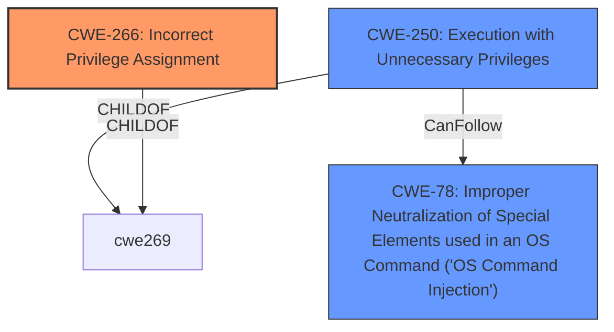

# Analysis for CVE-2020-8655

# Summary
| CWE ID | CWE Name | Confidence | CWE Abstraction Level | CWE Vulnerability Mapping Label | CWE-Vulnerability Mapping Notes |
|---|---|---|---|---|---|
| CWE-266 | Incorrect Privilege Assignment | 0.9 | Base | Allowed | Primary CWE |
| CWE-250 | Execution with Unnecessary Privileges | 0.7 | Base | Allowed | Secondary CWE |
| CWE-78 | Improper Neutralization of Special Elements used in an OS Command ('OS Command Injection') | 0.6 | Base | Allowed | Secondary CWE |

## Evidence and Confidence

*   **Confidence Score:** 0.8
*   **Evidence Strength:** HIGH

## Relationship Analysis
The primary relationship is that **CWE-266 (Incorrect Privilege Assignment)** is the root cause, leading to the potential for **CWE-250 (Execution with Unnecessary Privileges)** because the apache user now has more privileges than needed, enabling **CWE-78 (Improper Neutralization of Special Elements used in an OS Command ('OS Command Injection'))** through the use of `nmap` with a crafted NSE script.



## Vulnerability Chain
The vulnerability chain starts with the **improper sudoers configuration (CWE-266)**, leading to the **apache user having unnecessary privileges (CWE-250)** which is then exploited using a crafted NSE script to perform **OS Command Injection (CWE-78)**, ultimately resulting in privilege escalation to root.

## Summary of Analysis
The analysis is based on the provided vulnerability description and the CVE reference content summary. The root cause of the vulnerability is the **improper sudoers configuration**, which allows the `apache` user to run arbitrary commands as root.

The evidence supporting this is:

*   "**rootcause:** **improper sudoers configuration**"
*   "The vulnerability stems from **insecure sudo configurations** for the `apache` user in EON 5.3."
*   "The primary **weakness is the excessive permissions** granted to the `apache` user via `sudo`."
*   "An attacker, by leveraging the `apache` user’s privileges, can achieve arbitrary command execution as the root user."
*   The provided sudo configuration snippet: `apache ALL=NOPASSWD:/bin/systemctl * snmptt,/bin/systemctl * snmptrapd,/bin/systemctl * snmpd,/bin/systemctl * nagios,/bin/systemctl * gedd,/usr/bin/nmap`

The relationships influenced the selection because **CWE-266 (Incorrect Privilege Assignment)** directly addresses the root cause, while **CWE-250 (Execution with Unnecessary Privileges)** describes the consequence of the incorrect privilege assignment. **CWE-78 (Improper Neutralization of Special Elements used in an OS Command ('OS Command Injection'))** describes how the attacker escalates privileges.

The selected CWEs are at the optimal level of specificity because they accurately represent the weakness at the Base level, which is a preferred level of abstraction.

Relevant CWE Information:

# Enhanced Context (25 CWEs)
The following CWEs were identified as potentially relevant to this vulnerability:

## CWE-266: Incorrect Privilege Assignment
**Abstraction Level**: Base
**Similarity Score**: 0.79
**Source**: dense

**Description**:
A product incorrectly assigns a privilege to a particular actor, creating an unintended sphere of control for that actor.

**Mapping Guidance**:
- Usage: Allowed
- Rationale: This CWE entry is at the Base level of abstraction, which is a preferred level of abstraction for mapping to the root causes of vulnerabilities.

## CWE-250: Execution with Unnecessary Privileges
**Abstraction Level**: Base
**Similarity Score**: 0.76
**Source**: dense

**Description**:
The product performs an operation at a privilege level that is higher than the minimum level required, which creates new weaknesses or amplifies the consequences of other weaknesses.

**Mapping Guidance**:
- Usage: Allowed
- Rationale: This CWE entry is at the Base level of abstraction, which is a preferred level of abstraction for mapping to the root causes of vulnerabilities.

## CWE-78: Improper Neutralization of Special Elements used in an OS Command ('OS Command Injection')
**Abstraction Level**: base
**Similarity Score**: 5.03
**Source**: graph

**Description**:
The product constructs all or part of an OS command using externally-influenced input from an upstream component, but it does not neutralize or incorrectly neutralizes special elements that could modify the intended OS command when it is sent to a downstream component.

**Mapping Guidance**:
- Usage: Allowed
- Rationale: This CWE entry is at the Base level of abstraction, which is a preferred level of abstraction for mapping to the root causes of vulnerabilities.

## CWE Details and Justification:

### CWE-266: Incorrect Privilege Assignment
*   **Explanation:** The vulnerability stems from an **improper sudoers configuration**, which incorrectly assigns privileges to the `apache` user. This allows the `apache` user to run commands as root, which is an unintended sphere of control.
*   **Security Implications:** This allows an attacker to escalate privileges and execute arbitrary commands as root.
*   **Relationships:** This is the root cause and can lead to other weaknesses such as CWE-250.
*   **Mapping Guidance:** The usage is ALLOWED, and the rationale is that it's a Base level of abstraction suitable for mapping root causes.

### CWE-250: Execution with Unnecessary Privileges
*   **Explanation:** The `apache` user is granted `NOPASSWD` privileges for commands like `systemctl` and `nmap`, which are higher than the minimum level required for its intended function. This grants unnecessary privileges that can be exploited.
*   **Security Implications:** This amplifies the consequences of other weaknesses, such as **OS Command Injection**, because the commands are executed with root privileges.
*   **Relationships:** This is a consequence of **CWE-266** and can lead to other weaknesses like **CWE-78**.
*   **Mapping Guidance:** The usage is ALLOWED, and the rationale is that it's a Base level of abstraction suitable for mapping root causes.

### CWE-78: Improper Neutralization of Special Elements used in an OS Command ('OS Command Injection')
*   **Explanation:** The `apache` user is permitted to execute `/usr/bin/nmap` via `sudo`. `nmap` allows the execution of arbitrary commands via NSE scripts, and due to the improper sudo configuration, these commands are executed as root.
*   **Security Implications:** An attacker can craft a malicious NSE script to execute arbitrary commands with root privileges.
*   **Relationships:** This is a direct consequence of the excessive privileges granted to the `apache` user via the **improper sudoers configuration**.
*   **Mapping Guidance:** The usage is ALLOWED, and the rationale is that it's a Base level of abstraction suitable for mapping root causes.

## CWEs Considered but Not Used:

*   **CWE-269: Improper Privilege Management:** This is a Class-level CWE and is too generic. **CWE-266** provides a more specific description of the **incorrect privilege assignment**. The mapping guidance discourages the use of **CWE-269** due to frequent misuse.
*   **CWE-426: Untrusted Search Path:** While `nmap` is in the path, the issue is not about the path itself being untrusted, but about the **improper privilege** given to the `apache` user to execute `nmap` with root privileges.
*   **CWE-732: Incorrect Permission Assignment for Critical Resource:** This CWE is about incorrect permission assignments for resources, not about **incorrect sudo configurations**.

# Enhanced Query for CVE-2020-8655

## Vulnerability Description
An issue was discovered in EyesOfNetwork 5.3. The sudoers configuration is prone to a privilege escalation vulnerability, allowing the apache user to run arbitrary commands as root via a crafted NSE script for nmap 7.

### Vulnerability Description Key Phrases
- **rootcause:** **improper sudoers configuration**
- **impact:** privilege escalation
- **vector:** crafted NSE script
- **attacker:** apache user
- **product:** EyesOfNetwork
- **version:** 5.3

## CVE Reference Links Content Summary
Based on the provided content, here's an analysis related to CVE-2020-8655:

**Content Analysis:**

The provided content from GitHub describes a privilege escalation vulnerability in EyesOfNetwork (EON) version 5.3. It does not match CVE-2020-8655 which, based on its CVE description is a placeholder.

**Vulnerability Details:**

*   **Root Cause:** The vulnerability stems from insecure sudo configurations for the `apache` user in EON 5.3. Specifically, the `apache` user is granted `NOPASSWD` privileges to execute `systemctl` commands for various services, as well as `nmap`.
*   **Weaknesses:** The primary weakness is the excessive permissions granted to the `apache` user via `sudo`. The inclusion of `/usr/bin/nmap` is particularly dangerous since it can be used to execute arbitrary commands using NSE scripts with root privileges.
*   **Impact of Exploitation:** An attacker, by leveraging the `apache` user’s privileges, can achieve arbitrary command execution as the root user.
*  **Attack Vectors:** An attacker who is able to control the apache user (e.g., through webserver vulnerabilities) can escalate privileges.
*   **Required Attacker Capabilities/Position:** The attacker needs to be in control of a context that allows them to execute commands as the `apache` user. Additionally, the attacker needs to have the capacity to craft/use a custom NSE script to exploit the `nmap` functionality.

**Technical Details:**

The vulnerability lies in the following sudo configuration:

```
apache ALL=NOPASSWD:/bin/systemctl * snmptt,/bin/systemctl * snmptrapd,/bin/systemctl * snmpd,/bin/systemctl * nagios,/bin/systemctl * gedd,/usr/bin/nmap
```

The attacker can exploit this by using an NSE script with `nmap`, which will execute with the effective user ID of `root`.

**Summary:**

The provided content describes a privilege escalation vulnerability in EON 5.3, specifically due to insecure sudo configurations. An attacker can leverage the `apache` user’s `nmap` privileges to execute arbitrary commands as root using a specially crafted NSE script.

**Response:**

The content does not relate to the actual CVE-2020-8655, which is a placeholder, but describes a privilege escalation issue found in EyesOfNetwork (EON) version 5.3.

## Retriever Results

### Top Combined Results

| Rank | CWE ID | Name | Abstraction | Usage  | Retrievers | Individual Scores |
|------|--------|------|-------------|-------|------------|-------------------|
| 1 | 250 | Execution with Unnecessary Privileges | Base | Allowed | sparse | 0.267 |
| 2 | 269 | Improper Privilege Management | Class | Discouraged | sparse | 0.230 |
| 3 | 426 | Untrusted Search Path | Base | Allowed | sparse | 0.226 |
| 4 | 732 | Incorrect Permission Assignment for Critical Resource | Class | Allowed-with-Review | sparse | 0.220 |
| 5 | 78 | Improper Neutralization of Special Elements used in an OS Command ('OS Command Injection') | Base | Allowed | sparse | 0.218 |
| 6 | 918 | Server-Side Request Forgery (SSRF) | Base | Allowed | dense | 0.527 |
| 7 | 98 | Improper Control of Filename for Include/Require Statement in PHP Program ('PHP Remote File Inclusion') | Variant | Allowed | graph | 0.002 |
| 8 | 321 | Use of Hard-coded Cryptographic Key | Variant | Allowed | sparse | 0.216 |
| 9 | 625 | Permissive Regular Expression | Base | Allowed | sparse | 0.216 |
| 10 | 266 | Incorrect Privilege Assignment | Base | Allowed | sparse | 0.213 |


# Complete CWE Specifications


## CWE-250: Execution with Unnecessary Privileges
**Abstraction:** Base
**Status:** Draft

### Description
The product performs an operation at a privilege level that is higher than the minimum level required, which creates new weaknesses or amplifies the consequences of other weaknesses.

### Extended Description


New weaknesses can be exposed because running with extra privileges, such as root or Administrator, can disable the normal security checks being performed by the operating system or surrounding environment. Other pre-existing weaknesses can turn into security vulnerabilities if they occur while operating at raised privileges.


Privilege management functions can behave in some less-than-obvious ways, and they have different quirks on different platforms. These inconsistencies are particularly pronounced if you are transitioning from one non-root user to another. Signal handlers and spawned processes run at the privilege of the owning process, so if a process is running as root when a signal fires or a sub-process is executed, the signal handler or sub-process will operate with root privileges.


### Alternative Terms
None

### Relationships
ChildOf -> CWE-269
ChildOf -> CWE-657

### Mapping Guidance
**Usage:** Allowed
**Rationale:** This CWE entry is at the Base level of abstraction, which is a preferred level of abstraction for mapping to the root causes of vulnerabilities.
**Comments:** Carefully read both the name and description to ensure that this mapping is an appropriate fit. Do not try to 'force' a mapping to a lower-level Base/Variant simply to comply with this preferred level of abstraction.
**Reasons:**
- Acceptable-Use


### Additional Notes
**[Relationship]** There is a close association with CWE-653 (Insufficient Separation of Privileges). CWE-653 is about providing separate components for each privilege; CWE-250 is about ensuring that each component has the least amount of privileges possible.

**[Maintenance]** CWE-271, CWE-272, and CWE-250 are all closely related and possibly overlapping. CWE-271 is probably better suited as a category. Both CWE-272 and CWE-250 are in active use by the community. The "least privilege" phrase has multiple interpretations.

**[Maintenance]** The Taxonomy_Mappings to ISA/IEC 62443 were added in CWE 4.10, but they are still under review and might change in future CWE versions. These draft mappings were performed by members of the "Mapping CWE to 62443" subgroup of the CWE-CAPEC ICS/OT Special Interest Group (SIG), and their work is incomplete as of CWE 4.10. The mappings are included to facilitate discussion and review by the broader ICS/OT community, and they are likely to change in future CWE versions.


### Observed Examples
- **CVE-2007-4217:** FTP client program on a certain OS runs with setuid privileges and has a buffer overflow. Most clients do not need extra privileges, so an overflow is not a vulnerability for those clients.
- **CVE-2008-1877:** Program runs with privileges and calls another program with the same privileges, which allows read of arbitrary files.
- **CVE-2007-5159:** OS incorrectly installs a program with setuid privileges, allowing users to gain privileges.


## CWE-269: Improper Privilege Management
**Abstraction:** Class
**Status:** Draft

### Description
The product does not properly assign, modify, track, or check privileges for an actor, creating an unintended sphere of control for that actor.

### Extended Description
Not provided

### Alternative Terms
None

### Relationships
ChildOf -> CWE-284

### Mapping Guidance
**Usage:** Discouraged
**Rationale:** CWE-269 is commonly misused. It can be conflated with "privilege escalation," which is a technical impact that is listed in many low-information vulnerability reports [REF-1287]. It is not useful for trend analysis.
**Comments:** If an error or mistake allows privilege escalation, then use the CWE ID for that mistake. Avoid using CWE-269 when only phrases such as "privilege escalation" or "gain privileges" are available, as these indicate technical impact of the vulnerability - not the root cause weakness. If the root cause seems to be directly related to privileges, then examine the children of CWE-269 for additional hints, such as Execution with Unnecessary Privileges (CWE-250) or Incorrect Privilege Assignment (CWE-266).
**Reasons:**
- Frequent Misuse


### Additional Notes
**[Maintenance]** The relationships between privileges, permissions, and actors (e.g. users and groups) need further refinement within the Research view. One complication is that these concepts apply to two different pillars, related to control of resources (CWE-664) and protection mechanism failures (CWE-693).


### Observed Examples
- **CVE-2001-1555:** Terminal privileges are not reset when a user logs out.
- **CVE-2001-1514:** Does not properly pass security context to child processes in certain cases, allows privilege escalation.
- **CVE-2001-0128:** Does not properly compute roles.


## CWE-426: Untrusted Search Path
**Abstraction:** Base
**Status:** Stable

### Description
The product searches for critical resources using an externally-supplied search path that can point to resources that are not under the product's direct control.

### Extended Description


This might allow attackers to execute their own programs, access unauthorized data files, or modify configuration in unexpected ways. If the product uses a search path to locate critical resources such as programs, then an attacker could modify that search path to point to a malicious program, which the targeted product would then execute. The problem extends to any type of critical resource that the product trusts.


Some of the most common variants of untrusted search path are:


  - In various UNIX and Linux-based systems, the PATH environment variable may be consulted to locate executable programs, and LD_PRELOAD may be used to locate a separate library.

  - In various Microsoft-based systems, the PATH environment variable is consulted to locate a DLL, if the DLL is not found in other paths that appear earlier in the search order.


### Alternative Terms
Untrusted Path

### Relationships
ChildOf -> CWE-642
ChildOf -> CWE-668
ChildOf -> CWE-673
PeerOf -> CWE-427
PeerOf -> CWE-428

### Mapping Guidance
**Usage:** Allowed
**Rationale:** This CWE entry is at the Base level of abstraction, which is a preferred level of abstraction for mapping to the root causes of vulnerabilities.
**Comments:** Carefully read both the name and description to ensure that this mapping is an appropriate fit. Do not try to 'force' a mapping to a lower-level Base/Variant simply to comply with this preferred level of abstraction.
**Reasons:**
- Acceptable-Use


### Observed Examples
- **CVE-1999-1120:** Application relies on its PATH environment variable to find and execute program.
- **CVE-2008-1810:** Database application relies on its PATH environment variable to find and execute program.
- **CVE-2007-2027:** Chain: untrusted search path enabling resultant format string by loading malicious internationalization messages.


## CWE-732: Incorrect Permission Assignment for Critical Resource
**Abstraction:** Class
**Status:** Draft

### Description
The product specifies permissions for a security-critical resource in a way that allows that resource to be read or modified by unintended actors.

### Extended Description
When a resource is given a permission setting that provides access to a wider range of actors than required, it could lead to the exposure of sensitive information, or the modification of that resource by unintended parties. This is especially dangerous when the resource is related to program configuration, execution, or sensitive user data. For example, consider a misconfigured storage account for the cloud that can be read or written by a public or anonymous user.

### Alternative Terms
None

### Relationships
ChildOf -> CWE-285
ChildOf -> CWE-668

### Mapping Guidance
**Usage:** Allowed-with-Review
**Rationale:** While the name itself indicates an assignment of permissions for resources, this is often misused for vulnerabilities in which "permissions" are not checked, which is an "authorization" weakness (CWE-285 or descendants) within CWE's model [REF-1287].
**Comments:** Closely analyze the specific mistake that is allowing the resource to be exposed, and perform a CWE mapping for that mistake.
**Reasons:**
- Frequent Misuse


### Additional Notes
**[Maintenance]** The relationships between privileges, permissions, and actors (e.g. users and groups) need further refinement within the Research view. One complication is that these concepts apply to two different pillars, related to control of resources (CWE-664) and protection mechanism failures (CWE-693).


### Observed Examples
- **CVE-2022-29527:** Go application for cloud management creates a world-writable sudoers file that allows local attackers to inject sudo rules and escalate privileges to root by winning a race condition.
- **CVE-2009-3482:** Anti-virus product sets insecure "Everyone: Full Control" permissions for files under the "Program Files" folder, allowing attackers to replace executables with Trojan horses.
- **CVE-2009-3897:** Product creates directories with 0777 permissions at installation, allowing users to gain privileges and access a socket used for authentication.


## CWE-78: Improper Neutralization of Special Elements used in an OS Command ('OS Command Injection')
**Abstraction:** Base
**Status:** Stable

### Description
The product constructs all or part of an OS command using externally-influenced input from an upstream component, but it does not neutralize or incorrectly neutralizes special elements that could modify the intended OS command when it is sent to a downstream component.

### Extended Description


This weakness can lead to a vulnerability in environments in which the attacker does not have direct access to the operating system, such as in web applications. Alternately, if the weakness occurs in a privileged program, it could allow the attacker to specify commands that normally would not be accessible, or to call alternate commands with privileges that the attacker does not have. The problem is exacerbated if the compromised process does not follow the principle of least privilege, because the attacker-controlled commands may run with special system privileges that increases the amount of damage.


There are at least two subtypes of OS command injection:


  - The application intends to execute a single, fixed program that is under its own control. It intends to use externally-supplied inputs as arguments to that program. For example, the program might use system("nslookup [HOSTNAME]") to run nslookup and allow the user to supply a HOSTNAME, which is used as an argument. Attackers cannot prevent nslookup from executing. However, if the program does not remove command separators from the HOSTNAME argument, attackers could place the separators into the arguments, which allows them to execute their own program after nslookup has finished executing.

  - The application accepts an input that it uses to fully select which program to run, as well as which commands to use. The application simply redirects this entire command to the operating system. For example, the program might use "exec([COMMAND])" to execute the [COMMAND] that was supplied by the user. If the COMMAND is under attacker control, then the attacker can execute arbitrary commands or programs. If the command is being executed using functions like exec() and CreateProcess(), the attacker might not be able to combine multiple commands together in the same line.

From a weakness standpoint, these variants represent distinct programmer errors. In the first variant, the programmer clearly intends that input from untrusted parties will be part of the arguments in the command to be executed. In the second variant, the programmer does not intend for the command to be accessible to any untrusted party, but the programmer probably has not accounted for alternate ways in which malicious attackers can provide input.

### Alternative Terms
Shell injection
Shell metacharacters
OS Command Injection

### Relationships
ChildOf -> CWE-77
ChildOf -> CWE-74
ChildOf -> CWE-77
ChildOf -> CWE-77
CanAlsoBe -> CWE-88

### Mapping Guidance
**Usage:** Allowed
**Rationale:** This CWE entry is at the Base level of abstraction, which is a preferred level of abstraction for mapping to the root causes of vulnerabilities.
**Comments:** Carefully read both the name and description to ensure that this mapping is an appropriate fit. Do not try to 'force' a mapping to a lower-level Base/Variant simply to comply with this preferred level of abstraction.
**Reasons:**
- Acceptable-Use


### Additional Notes
**[Terminology]** The "OS command injection" phrase carries different meanings to different people. For some people, it only refers to cases in which the attacker injects command separators into arguments for an application-controlled program that is being invoked. For some people, it refers to any type of attack that can allow the attacker to execute OS commands of their own choosing. This usage could include untrusted search path weaknesses (CWE-426) that cause the application to find and execute an attacker-controlled program. Further complicating the issue is the case when argument injection (CWE-88) allows alternate command-line switches or options to be inserted into the command line, such as an "-exec" switch whose purpose may be to execute the subsequent argument as a command (this -exec switch exists in the UNIX "find" command, for example). In this latter case, however, CWE-88 could be regarded as the primary weakness in a chain with CWE-78.

**[Research Gap]** More investigation is needed into the distinction between the OS command injection variants, including the role with argument injection (CWE-88). Equivalent distinctions may exist in other injection-related problems such as SQL injection.


### Observed Examples
- **CVE-2020-10987:** OS command injection in Wi-Fi router, as exploited in the wild per CISA KEV.
- **CVE-2020-10221:** Template functionality in network configuration management tool allows OS command injection, as exploited in the wild per CISA KEV.
- **CVE-2020-9054:** Chain: improper input validation (CWE-20) in username parameter, leading to OS command injection (CWE-78), as exploited in the wild per CISA KEV.


## CWE-918: Server-Side Request Forgery (SSRF)
**Abstraction:** Base
**Status:** Incomplete

### Description
The web server receives a URL or similar request from an upstream component and retrieves the contents of this URL, but it does not sufficiently ensure that the request is being sent to the expected destination.

### Extended Description
Not provided

### Alternative Terms
XSPA: Cross Site Port Attack
SSRF: Server-Side Request Forgery

### Relationships
ChildOf -> CWE-441
ChildOf -> CWE-610

### Mapping Guidance
**Usage:** Allowed
**Rationale:** This CWE entry is at the Base level of abstraction, which is a preferred level of abstraction for mapping to the root causes of vulnerabilities.
**Comments:** Carefully read both the name and description to ensure that this mapping is an appropriate fit. Do not try to 'force' a mapping to a lower-level Base/Variant simply to comply with this preferred level of abstraction.
**Reasons:**
- Acceptable-Use


### Additional Notes
**[Relationship]** CWE-918 (SSRF) and CWE-611 (XXE) are closely related, because they both involve web-related technologies and can launch outbound requests to unexpected destinations. However, XXE can be performed client-side, or in other contexts in which the software is not acting directly as a server, so the "Server" portion of the SSRF acronym does not necessarily apply.


### Observed Examples
- **CVE-2023-32786:** Chain: LLM integration framework has prompt injection (CWE-1427) that allows an attacker to force the service to retrieve data from an arbitrary URL, essentially providing SSRF (CWE-918) and potentially injecting content into downstream tasks.
- **CVE-2021-26855:** Server Side Request Forgery (SSRF) in mail server, as exploited in the wild per CISA KEV.
- **CVE-2021-21973:** Server Side Request Forgery in cloud platform, as exploited in the wild per CISA KEV.


## CWE-98: Improper Control of Filename for Include/Require Statement in PHP Program ('PHP Remote File Inclusion')
**Abstraction:** Variant
**Status:** Draft

### Description
The PHP application receives input from an upstream component, but it does not restrict or incorrectly restricts the input before its usage in "require," "include," or similar functions.

### Extended Description
In certain versions and configurations of PHP, this can allow an attacker to specify a URL to a remote location from which the product will obtain the code to execute. In other cases in association with path traversal, the attacker can specify a local file that may contain executable statements that can be parsed by PHP.

### Alternative Terms
Remote file include
RFI: The Remote File Inclusion (RFI) acronym is often used by vulnerability researchers.
Local file inclusion: This term is frequently used in cases in which remote download is disabled, or when the first part of the filename is not under the attacker's control, which forces use of relative path traversal (CWE-23) attack techniques to access files that may contain previously-injected PHP code, such as web access logs.

### Relationships
ChildOf -> CWE-706
ChildOf -> CWE-829
CanPrecede -> CWE-94
CanAlsoBe -> CWE-426

### Mapping Guidance
**Usage:** Allowed
**Rationale:** This CWE entry is at the Variant level of abstraction, which is a preferred level of abstraction for mapping to the root causes of vulnerabilities.
**Comments:** Carefully read both the name and description to ensure that this mapping is an appropriate fit. Do not try to 'force' a mapping to a lower-level Base/Variant simply to comply with this preferred level of abstraction.
**Reasons:**
- Acceptable-Use


### Additional Notes
**[Relationship]** 

This is frequently a functional consequence of other weaknesses. It is usually multi-factor with other factors (e.g. MAID), although not all inclusion bugs involve assumed-immutable data. Direct request weaknesses frequently play a role.


Can overlap directory traversal in local inclusion problems.


### Observed Examples
- **CVE-2004-0285:** Modification of assumed-immutable configuration variable in include file allows file inclusion via direct request.
- **CVE-2004-0030:** Modification of assumed-immutable configuration variable in include file allows file inclusion via direct request.
- **CVE-2004-0068:** Modification of assumed-immutable configuration variable in include file allows file inclusion via direct request.


## CWE-321: Use of Hard-coded Cryptographic Key
**Abstraction:** Variant
**Status:** Draft

### Description
The use of a hard-coded cryptographic key significantly increases the possibility that encrypted data may be recovered.

### Extended Description
Not provided

### Alternative Terms
None

### Relationships
ChildOf -> CWE-798
ChildOf -> CWE-798
ChildOf -> CWE-798

### Mapping Guidance
**Usage:** Allowed
**Rationale:** This CWE entry is at the Variant level of abstraction, which is a preferred level of abstraction for mapping to the root causes of vulnerabilities.
**Comments:** Carefully read both the name and description to ensure that this mapping is an appropriate fit. Do not try to 'force' a mapping to a lower-level Base/Variant simply to comply with this preferred level of abstraction.
**Reasons:**
- Acceptable-Use


### Additional Notes
**[Other]** The main difference between the use of hard-coded passwords and the use of hard-coded cryptographic keys is the false sense of security that the former conveys. Many people believe that simply hashing a hard-coded password before storage will protect the information from malicious users. However, many hashes are reversible (or at least vulnerable to brute force attacks) -- and further, many authentication protocols simply request the hash itself, making it no better than a password.

**[Maintenance]** The Taxonomy_Mappings to ISA/IEC 62443 were added in CWE 4.10, but they are still under review and might change in future CWE versions. These draft mappings were performed by members of the "Mapping CWE to 62443" subgroup of the CWE-CAPEC ICS/OT Special Interest Group (SIG), and their work is incomplete as of CWE 4.10. The mappings are included to facilitate discussion and review by the broader ICS/OT community, and they are likely to change in future CWE versions.


### Observed Examples
- **CVE-2022-29960:** Engineering Workstation uses hard-coded cryptographic keys that could allow for unathorized filesystem access and privilege escalation
- **CVE-2022-30271:** Remote Terminal Unit (RTU) uses a hard-coded SSH private key that is likely to be used by default.
- **CVE-2020-10884:** WiFi router service has a hard-coded encryption key, allowing root access


## CWE-625: Permissive Regular Expression
**Abstraction:** Base
**Status:** Draft

### Description
The product uses a regular expression that does not sufficiently restrict the set of allowed values.

### Extended Description


This effectively causes the regexp to accept substrings that match the pattern, which produces a partial comparison to the target. In some cases, this can lead to other weaknesses. Common errors include:


  - not identifying the beginning and end of the target string

  - using wildcards instead of acceptable character ranges

  - others


### Alternative Terms
None

### Relationships
ChildOf -> CWE-185
PeerOf -> CWE-187
PeerOf -> CWE-184
PeerOf -> CWE-183

### Mapping Guidance
**Usage:** Allowed
**Rationale:** This CWE entry is at the Base level of abstraction, which is a preferred level of abstraction for mapping to the root causes of vulnerabilities.
**Comments:** Carefully read both the name and description to ensure that this mapping is an appropriate fit. Do not try to 'force' a mapping to a lower-level Base/Variant simply to comply with this preferred level of abstraction.
**Reasons:**
- Acceptable-Use


### Observed Examples
- **CVE-2021-22204:** Chain: regex in EXIF processor code does not correctly determine where a string ends (CWE-625), enabling eval injection (CWE-95), as exploited in the wild per CISA KEV.
- **CVE-2006-1895:** ".*" regexp leads to static code injection
- **CVE-2002-2175:** insertion of username into regexp results in partial comparison, causing wrong database entry to be updated when one username is a substring of another.


## CWE-266: Incorrect Privilege Assignment
**Abstraction:** Base
**Status:** Draft

### Description
A product incorrectly assigns a privilege to a particular actor, creating an unintended sphere of control for that actor.

### Extended Description
Not provided

### Alternative Terms
None

### Relationships
ChildOf -> CWE-269
CanAlsoBe -> CWE-286

### Mapping Guidance
**Usage:** Allowed
**Rationale:** This CWE entry is at the Base level of abstraction, which is a preferred level of abstraction for mapping to the root causes of vulnerabilities.
**Comments:** Carefully read both the name and description to ensure that this mapping is an appropriate fit. Do not try to 'force' a mapping to a lower-level Base/Variant simply to comply with this preferred level of abstraction.
**Reasons:**
- Acceptable-Use


### Observed Examples
- **CVE-1999-1193:** untrusted user placed in unix "wheel" group
- **CVE-2005-2741:** Product allows users to grant themselves certain rights that can be used to escalate privileges.
- **CVE-2005-2496:** Product uses group ID of a user instead of the group, causing it to run with different privileges. This is resultant from some other unknown issue.

