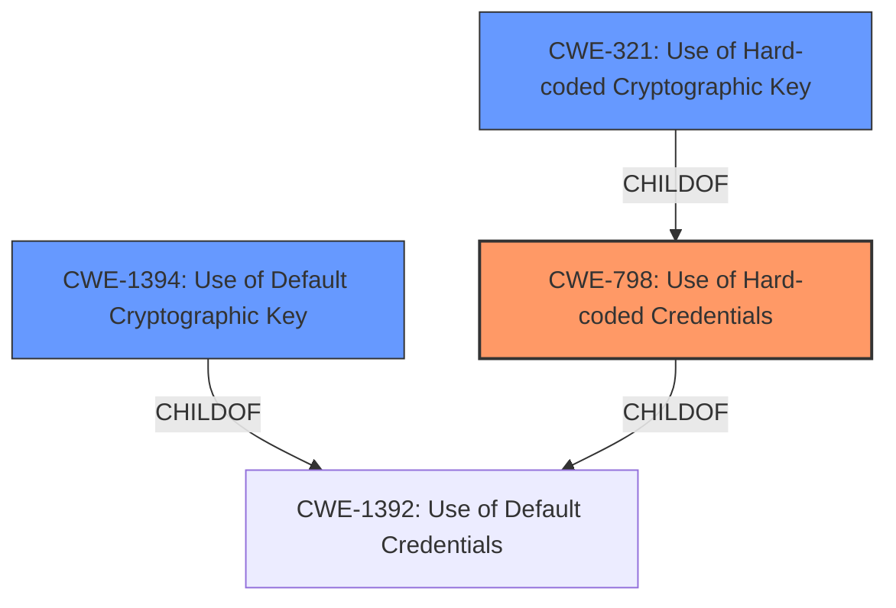

# Raw Analyzer Response for CVE-2020-8657

# Summary
| CWE ID | CWE Name | Confidence | CWE Abstraction Level | CWE Vulnerability Mapping Label | CWE-Vulnerability Mapping Notes |
|---|---|---|---|---|---|
| CWE-798 | Use of Hard-coded Credentials | 1.0 | Base | Allowed | Primary CWE |
| CWE-321 | Use of Hard-coded Cryptographic Key | 0.7 | Variant | Allowed | Secondary Candidate |
| CWE-1394 | Use of Default Cryptographic Key | 0.7 | Base | Allowed | Secondary Candidate |

## Evidence and Confidence

*   **Confidence Score:** 0.9
*   **Evidence Strength:** HIGH

## Relationship Analysis
The primary CWE is CWE-798 **Use of Hard-coded Credentials**, which is a Base level CWE. CWE-321 **Use of Hard-coded Cryptographic Key** and CWE-1394 **Use of Default Cryptographic Key** are both related to CWE-798. CWE-321 is a Variant of CWE-798, representing a more specific case where the hardcoded credential is a cryptographic key. CWE-1394 is a Base level CWE and a child of CWE-1392. The relationship between CWE-798 and CWE-321 influenced the decision to include CWE-321 as a secondary candidate, as the vulnerability involves a hardcoded API key, which can be considered a cryptographic key.

## Vulnerability Chain
The vulnerability chain starts with the **use of a hard-coded API key**. This leads to a predictable access token, which then allows an attacker to calculate or guess the admin access token and gain unauthorized access.
  - **Root Cause:** CWE-798 **Use of Hard-coded Credentials**
  - **Weakness:** Predictable access token generation
  - **Impact:** Unauthorized access and control of the system

## Summary of Analysis
The initial analysis focused on identifying the **root cause** of the vulnerability. The vulnerability description and the CVE Reference Links Content Summary clearly indicate that the use of a **hardcoded API key** is the primary issue.

The evidence from the CVE Reference Links Content Summary: "The vulnerability stems from the **use of a hardcoded, default API key** (`€On@piK3Y`) in EON (EyesOfNetwork) version 5.3."

The graph relationships, particularly the child-of relationship between CWE-321 and CWE-798 and the fact that API keys are used for cryptographic purposes, influenced the decision to include CWE-321 as a secondary candidate. Similarly, the observation that the key is a default key led to the consideration of CWE-1394 **Use of Default Cryptographic Key**.

The selected CWEs are at the optimal level of specificity because CWE-798 directly addresses the core issue of using hardcoded credentials. While CWE-321 is more specific (hardcoded cryptographic key), it's included as a secondary candidate because the API key has cryptographic implications. The primary CWE is CWE-798 because it captures the general weakness, and CWE-321 provides additional context.

Relevant CWE Information:

# Enhanced Context (25 CWEs)

## CWE-1391: Use of Weak Credentials
**Abstraction Level**: Class
**Similarity Score**: 0.80
**Source**: dense

**Description**:
The product uses weak credentials (such as a default key or hard-coded password) that can be calculated, derived, reused, or guessed by an attacker.

**Mapping Guidance**:
- Usage: Allowed-with-Review
- Rationale: This CWE entry is a Class and might have Base-level children that would be more appropriate

## CWE-798: Use of Hard-coded Credentials
**Abstraction Level**: Base
**Similarity Score**: 0.80
**Source**: dense

**Description**:
The product contains hard-coded credentials, such as a password or cryptographic key.

**Mapping Guidance**:
- Usage: Allowed
- Rationale: This CWE entry is at the Base level of abstraction, which is a preferred level of abstraction for mapping to the root causes of vulnerabilities.

## CWE-1392: Use of Default Credentials
**Abstraction Level**: Base
**Similarity Score**: 0.79
**Source**: dense

**Description**:
The product uses default credentials (such as passwords or cryptographic keys) for potentially critical functionality.

**Mapping Guidance**:
- Usage: Allowed
- Rationale: This CWE entry is at the Base level of abstraction, which is a preferred level of abstraction for mapping to the root causes of vulnerabilities.

## CWE-1188: Initialization of a Resource with an Insecure Default
**Abstraction Level**: Base
**Similarity Score**: 0.77
**Source**: dense

**Description**:
The product initializes or sets a resource with a default that is intended to be changed by the administrator, but the default is not secure.

**Mapping Guidance**:
- Usage: Allowed
- Rationale: This CWE entry is at the Base level of abstraction, which is a preferred level of abstraction for mapping to the root causes of vulnerabilities.

## CWE-321: Use of Hard-coded Cryptographic Key
**Abstraction Level**: Variant
**Similarity Score**: 0.77
**Source**: dense

**Description**:
The use of a hard-coded cryptographic key significantly increases the possibility that encrypted data may be recovered.

**Mapping Guidance**:
- Usage: Allowed
- Rationale: This CWE entry is at the Variant level of abstraction, which is a preferred level of abstraction for mapping to the root causes of vulnerabilities.

## CWE-1394: Use of Default Cryptographic Key
**Abstraction Level**: Base
**Similarity Score**: 0.77
**Source**: dense

**Description**:
The product uses a default cryptographic key for potentially critical functionality.

**Mapping Guidance**:
- Usage: Allowed
- Rationale: This CWE entry is at the Base level of abstraction, which is a preferred level of abstraction for mapping to the root causes of vulnerabilities.

## CWE-807: Reliance on Untrusted Inputs in a Security Decision
**Abstraction Level**: Base
**Similarity Score**: 0.76
**Source**: dense

**Description**:
The product uses a protection mechanism that relies on the existence or values of an input, but the input can be modified by an untrusted actor in a way that bypasses the protection mechanism.

**Mapping Guidance**:
- Usage: Allowed
- Rationale: This CWE entry is at the Base level of abstraction, which is a preferred level of abstraction for mapping to the root causes of vulnerabilities.

## CWE-1393: Use of Default Password
**Abstraction Level**: Base
**Similarity Score**: 0.76
**Source**: dense

**Description**:
The product uses default passwords for potentially critical functionality.

**Mapping Guidance**:
- Usage: Allowed
- Rationale: This CWE entry is at the Base level of abstraction, which is a preferred level of abstraction for mapping to the root causes of vulnerabilities.

## CWE-1240: Use of a Cryptographic Primitive with a Risky Implementation
**Abstraction Level**: Base
**Similarity Score**: 0.76
**Source**: dense

**Description**:
To fulfill the need for a cryptographic primitive, the product implements a cryptographic algorithm using a non-standard, unproven, or disallowed/non-compliant cryptographic implementation.

**Mapping Guidance**:
- Usage: Allowed
- Rationale: This CWE entry is at the Base level of abstraction, which is a preferred level of abstraction for mapping to the root causes of vulnerabilities.

## CWE-330: Use of Insufficiently Random Values
**Abstraction Level**: Class
**Similarity Score**: 0.76
**Source**: dense

**Description**:
The product uses insufficiently random numbers or values in a security context that depends on unpredictable numbers.

**Mapping Guidance**:
- Usage: Discouraged
- Rationale: This CWE entry is a level-1 Class (i.e., a child of a Pillar). It might have lower-level children that would be more appropriate

## CWE-1391: Use of Weak Credentials
**Abstraction Level**: Class
**Similarity Score**: 7445.83
**Source**: sparse

**Description**:
The product uses weak credentials (such as a default key or hard-coded password) that can be calculated