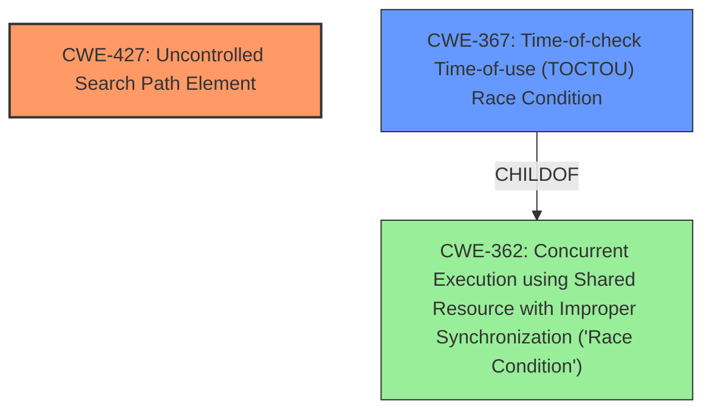

# Raw Analyzer Response for CVE-2020-8793

# Summary
| CWE ID | CWE Name | Confidence | CWE Abstraction Level | CWE Vulnerability Mapping Label | CWE-Vulnerability Mapping Notes |
|---|---|---|---|---|---|
| CWE-427 | Uncontrolled Search Path Element | 0.9 | Base | Allowed | Primary CWE |
| CWE-367 | Time-of-check Time-of-use (TOCTOU) Race Condition | 0.9 | Base | Allowed | Secondary Candidate |

## Evidence and Confidence

*   **Confidence Score:** 0.9
*   **Evidence Strength:** HIGH

## Relationship Analysis
The primary weakness is CWE-427, representing the **untrusted search path** vulnerability. CWE-367 is a secondary weakness representing the **TOCTOU race condition**. CWE-427 is a base level weakness. CWE-367 is a base level weakness that is child of CWE-362 (Concurrent Execution using Shared Resource with Improper Synchronization ('Race Condition')).

## Vulnerability Chain
The vulnerability chain involves an **untrusted search path** (CWE-427) and **TOCTOU race conditions** (CWE-367), leading to arbitrary file read.

## Summary of Analysis
The primary CWE is CWE-427, which accurately describes the **untrusted search path** vulnerability in makemap.c. The secondary CWE is CWE-367, which represents the **race conditions** in the offline functionality in smtpd.c.

The vulnerability description clearly states: "OpenSMTPD before 6.6.4 allows local users to read arbitrary files (e.g., on some Linux distributions) because of a combination of an **untrusted search path in makemap.c** and **race conditions in the offline functionality in smtpd.c**."

The CVE Reference Links Content Summary further confirms this: "The vulnerability stems from a combination of factors: a local privilege escalation vulnerability in smtpctl, and time-of-check to time-of-use (TOCTOU) **race conditions** within OpenSMTPD's offline message handling." and also indicates "By exploiting the way `smtpctl` handles the `-bi` command-line argument and manipulating the PATH environment variable, an attacker can execute `makemap` with the privileges of the `_smtpq` group (or root in Fedora's case)."

These CWEs are at the optimal level of specificity as they directly represent the **root causes** of the vulnerability.

Relevant CWE Information:

# Enhanced Context (25 CWEs)
The following CWEs were identified as potentially relevant to this vulnerability:

## CWE-667: Improper Locking
**Abstraction Level**: Class
**Similarity Score**: 0.78
**Source**: dense

**Description**:
The product does not properly acquire or release a lock on a resource, leading to unexpected resource state changes and behaviors.

**Mapping Guidance**:
- Usage: Allowed-with-Review
- Rationale: This CWE entry is a Class and might have Base-level children that would be more appropriate

*Rationale for not selecting CWE-667*: While locking issues might be related to the race condition, the core issue is the TOCTOU race condition itself (CWE-367).

## CWE-404: Improper Resource Shutdown or Release
**Abstraction Level**: Class
**Similarity Score**: 0.77
**Source**: dense

**Description**:
The product does not release or incorrectly releases a resource before it is made available for re-use.

**Mapping Guidance**:
- Usage: Allowed-with-Review
- Rationale: This CWE entry is a Class and might have Base-level children that would be more appropriate

*Rationale for not selecting CWE-404*: This CWE doesn't directly relate to the described vulnerability.

## CWE-59: Improper Link Resolution Before File Access ('Link Following')
**Abstraction Level**: Base
**Similarity Score**: 0.77
**Source**: dense

**Description**:
The product attempts to access a file based on the filename, but it does not properly prevent that filename from identifying a link or shortcut that resolves to an unintended resource.

**Mapping Guidance**:
- Usage: Allowed
- Rationale: This CWE entry is at the Base level of abstraction, which is a preferred level of abstraction for mapping to the root causes of vulnerabilities.

*Rationale for not selecting CWE-59*: While the vulnerability allows reading arbitrary files, it's not directly due to improper link resolution but rather the race condition and untrusted search path.

## CWE-41: Improper Resolution of Path Equivalence
**Abstraction Level**: Base
**Similarity Score**: 0.77
**Source**: dense

**Description**:
The product is vulnerable to file system contents disclosure through path equivalence. Path equivalence involves the use of special characters in file and directory names. The associated manipulations are intended to generate multiple names for the same object.

**Mapping Guidance**:
- Usage: Allowed
- Rationale: This CWE entry is at the Base level of abstraction, which is a preferred level of abstraction for mapping to the root causes of vulnerabilities.

*Rationale for not selecting CWE-41*: This CWE doesn't directly relate to the described vulnerability.

## CWE-226: Sensitive Information in Resource Not Removed Before Reuse
**Abstraction Level**: Base
**Similarity Score**: 0.76
**Source**: dense

**Description**:
The product releases a resource such as memory or a file so that it can be made available for reuse, but it does not clear or "zeroize" the information contained in the resource before the product performs a critical state transition or makes the resource available for reuse by other entities.

**Mapping Guidance**:
- Usage: Allowed
- Rationale: This CWE entry is at the Base level of abstraction, which is a preferred level of abstraction for mapping to the root causes of vulnerabilities.

*Rationale for not selecting CWE-226*: This CWE doesn't directly relate to the described vulnerability.

## CWE-362: Concurrent Execution using Shared Resource with Improper Synchronization ('Race Condition')
**Abstraction Level**: Class
**Similarity Score**: 0.75
**Source**: dense

**Description**:
The product contains a concurrent code sequence that requires temporary, exclusive access to a shared resource, but a timing window exists in which the shared resource can be modified by another code sequence operating concurrently.

**Mapping Guidance**:
- Usage: Allowed-with-Review
- Rationale: This CWE entry is a Class and might have Base-level children that would be more appropriate

*Rationale for not selecting CWE-362*: CWE-367 is a more specific child of CWE-362 and better describes the TOCTOU race condition.

## CWE-367: Time-of-check Time-of-use (TOCTOU) Race Condition
**Abstraction Level**: Base
**Similarity Score**: 0.75
**Source**: dense

**Description**:
The product checks the state of a resource before using that resource, but the resource's state can change between the check and the use in a way that invalidates the results of the check. This can cause the product to perform invalid actions when the resource is in an unexpected state.

**Mapping Guidance**:
- Usage: Allowed
- Rationale: This CWE entry is at the Base level of abstraction, which is a preferred level of abstraction for mapping to the root causes of vulnerabilities.

*Rationale for selecting CWE-367*: This accurately describes the TOCTOU race condition in OpenSMTPD's offline message handling.

## CWE-23: Relative Path Traversal
**Abstraction Level**: Base
**Similarity Score**: 0.75
**Source**: dense

**Description**:
The product uses external input to construct a pathname that should be within a restricted directory, but it does not properly neutralize sequences such as ".." that can resolve to a location that is outside of that directory.

**Mapping Guidance**:
- Usage: Allowed
- Rationale: This CWE entry is at the Base level of abstraction, which is a preferred level of abstraction for mapping to the root causes of vulnerabilities.

*Rationale for not selecting CWE-23*: While the vulnerability allows reading arbitrary files, it's not directly due to path traversal but rather the race condition and untrusted search path.

## CWE-754: Improper Check for Unusual or Exceptional Conditions
**Abstraction Level**: Class
**Similarity Score**: 0.75
**Source**: dense

**Description**:
The product does not check or incorrectly checks for unusual or exceptional conditions that are not expected to occur frequently during day to day operation of the product.

**Mapping Guidance**: