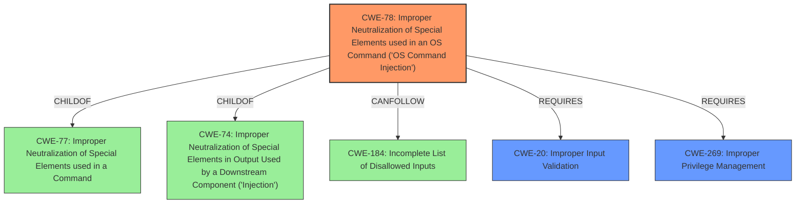

# Analysis for CVE-2020-8816

# Summary
| CWE ID | CWE Name | Confidence | CWE Abstraction Level | CWE Vulnerability Mapping Label | CWE-Vulnerability Mapping Notes |
|---|---|---|---|---|---|
| CWE-78 | Improper Neutralization of Special Elements used in an OS Command ('OS Command Injection') | 0.9 | Base | Allowed | Primary CWE |
| CWE-269 | Improper Privilege Management | 0.7 | Base | Allowed | Secondary CWE |
| CWE-20 | Improper Input Validation | 0.6 | Class | Allowed-with-Review | Secondary CWE |

## Evidence and Confidence

*   **Confidence Score:** 0.8
*   **Evidence Strength:** HIGH

## Relationship Analysis
The primary CWE identified is CWE-78 (Improper Neutralization of Special Elements used in an OS Command).
- CWE-78 is a base-level CWE, making it specific enough to describe the vulnerability.
- It is a child of CWE-77 (Improper Neutralization of Special Elements used in a Command) and CWE-74 (Improper Neutralization of Special Elements in Output Used by a Downstream Component ('Injection')).
- The chain relationships show that CWE-78 can follow CWE-184 (Incomplete List of Disallowed Inputs).
- The secondary CWE, CWE-269 (Improper Privilege Management), addresses the fact that the vulnerability is exploitable by privileged users.
- CWE-20 (Improper Input Validation) is considered as a contributing factor, as the lack of proper validation allows the injection.

## Vulnerability Chain
The vulnerability chain starts with the **improper access control** and **improper input validation** which leads to **OS Command Injection**, ultimately resulting in remote code execution.
  - The initial flaw is the lack of proper input sanitization of the MAC address.
  - This allows for the injection of malicious code.
  - The injected code is then executed by the web server, leading to remote code execution.

## Summary of Analysis
The initial assessment, based on the vulnerability description, CVE reference links, and retriever results, points to CWE-78 as the primary weakness. The vulnerability description key phrases mention "improper access control", "remote code execution" via a "crafted DHCP static lease". The CVE reference links summary confirms that the root cause is **"improper sanitization of user-supplied MAC address input"** which leads to code injection and execution. The retriever results also list CWE-78 as a potential match.

The choice of CWE-78 is further supported by the extended description, which states that the weakness can lead to a vulnerability in environments in which the attacker does not have direct access to the operating system, such as in web applications. This aligns perfectly with the described vulnerability. The "weaknesses" section of the CVE reference links content summary lists "Improper input validation" and "Remote Code Execution", which further supports the selection of CWE-78.

The selected CWEs are at the optimal level of specificity. CWE-78 is a Base level CWE, providing a detailed description of the vulnerability.

Other CWEs Considered:

*   CWE-94 (Improper Control of Generation of Code ('Code Injection')): While code injection is involved, the root cause is the **improper neutralization of special elements used in an OS command**. Therefore, CWE-78 is a more accurate representation of the vulnerability.
*   CWE-434 (Unrestricted Upload of File with Dangerous Type): This CWE is not applicable as the vulnerability does not involve the upload of a file.
*   CWE-79 (Improper Neutralization of Input During Web Page Generation ('Cross-site Scripting')): This CWE is not applicable as the vulnerability does not involve cross-site scripting.
*   CWE-22 (Improper Limitation of a Pathname to a Restricted Directory ('Path Traversal')): This CWE is not applicable as the vulnerability does not involve path traversal.
*   CWE-184 (Incomplete List of Disallowed Inputs): This CWE is too high level and doesn't fully capture the nature of the command injection vulnerability.
*   CWE-269 (Improper Privilege Management): Although not the primary cause, the exploit is only possible because the attacker has privileges to configure DHCP static leases. This suggests a secondary weakness related to privilege management.
*   CWE-20 (Improper Input Validation): The vulnerability stems from the lack of proper input validation of the MAC address.

Relevant CWE Information:

# Enhanced Context (25 CWEs)
The following CWEs were identified as potentially relevant to this vulnerability:

## CWE-269: Improper Privilege Management
**Abstraction Level**: Base

**Description**:
The software does not properly manage or control privileges.

**Extended Description**:
This can occur in a variety of ways. The program might grant excessive privileges, or it might not revoke privileges when they are no longer needed. The program might not properly check privileges before performing a sensitive operation, or it might not use the correct privileges for the operation. The program might allow a user to perform actions that they should not be allowed to perform, or it might not allow a user to perform actions that they should be allowed to perform.

**Mapping Guidance**:
- Usage: Allowed
- Rationale: This CWE entry is at the Base level of abstraction, which is a preferred level of abstraction for mapping to the root causes of vulnerabilities.

## CWE-20: Improper Input Validation
**Abstraction Level**: Class

**Description**:
The product does not validate or incorrectly validates input.

**Extended Description**:
Without proper validation, an attacker is able to craft the input in a form that is not expected by the rest of the application. This will lead to parts of the system receiving unintended input, which may result in arbitrary code execution, control-flow hijacking, denial of service, and other undesirable behavior.

**Mapping Guidance**:
- Usage: Allowed-with-Review
- Rationale: This CWE entry is a Class and might have Base-level children that would be more appropriate