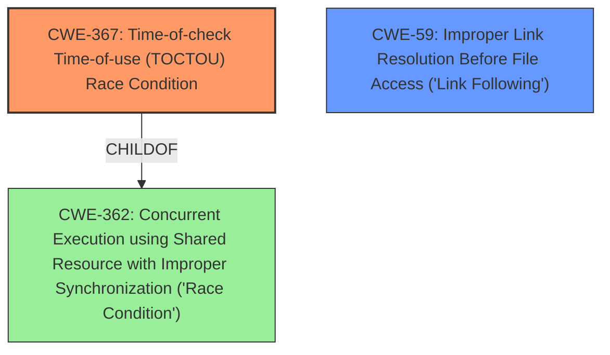

# Raw Analyzer Response for CVE-2020-8833

# Summary
| CWE ID | CWE Name | Confidence | CWE Abstraction Level | CWE Vulnerability Mapping Label | CWE-Vulnerability Mapping Notes |
|---|---|---|---|---|---|
| CWE-367 | Time-of-check Time-of-use (TOCTOU) Race Condition | 1.0 | Base | Primary | Allowed |
| CWE-59 | Improper Link Resolution Before File Access ('Link Following') | 0.75 | Base | Secondary | Allowed |

## Evidence and Confidence

*   **Confidence Score:** 0.9
*   **Evidence Strength:** HIGH

## Relationship Analysis
The primary CWE, CWE-367, is a base-level CWE that is a child of the class-level CWE-362 (Concurrent Execution using Shared Resource with Improper Synchronization ('Race Condition')). CWE-59, a secondary CWE, is related to file access issues caused by improper link resolution. The selection of CWE-367 as primary is due to the explicit mention of "Time-of-check Time-of-use Race Condition" in the vulnerability description. The relationship between CWE-367 and CWE-362 indicates a more general class of concurrent execution vulnerabilities, while CWE-367 provides a more specific characterization.

## Vulnerability Chain
The vulnerability chain starts with a **Time-of-check Time-of-use Race Condition** (CWE-367) where the state of a resource changes between the check and the use. This race condition occurs in Apport when the cron script removes crash files of size 0, creating a window for an attacker to create a symlink with the same name. The subsequent `chown` call then operates on the symlink, potentially changing the file owner to root if `fs.protected_symlinks` is disabled. If `fs.protected_symlinks` is disabled, a privilege escalation can happen.

## Summary of Analysis
The initial assessment identified CWE-367 as the primary weakness due to the explicit mention of "**Time-of-check Time-of-use Race Condition**" in the vulnerability description. The "CVE Reference Links Content Summary" further supports this, stating: "A **Time-of-Check Time-of-Use (TOCTTOU) race condition** exists in Apport's crash report creation process." This direct reference strongly supports the selection of CWE-367.

The secondary weakness, CWE-59, is relevant because the attacker exploits the race condition by creating a symlink, which the `chown` command then acts upon. The summary also notes, "the fix involves using a file descriptor...instead of the file path when calling `chown()`, and adding `follow_symlinks=False`. This prevents the symlink attack." This mitigation strategy directly addresses the **improper link resolution** issue.

The relationships between CWEs influenced the final selection. CWE-367 is a child of CWE-362, indicating a specific type of concurrent execution issue. While CWE-362 is a broader classification, CWE-367 provides a more precise characterization of the vulnerability.

The selected CWEs are at the optimal level of specificity. CWE-367 accurately captures the **root cause** of the vulnerability, while CWE-59 highlights a critical aspect of the exploitation mechanism. Both are base-level CWEs, aligning with best practices for vulnerability mapping.

Relevant CWE Information:

# Enhanced Context (25 CWEs)
The following CWEs were identified as potentially relevant to this vulnerability:

## CWE-404: Improper Resource Shutdown or Release
**Abstraction Level**: Class
**Similarity Score**: 0.79
**Source**: dense

**Description**:
The product does not release or incorrectly releases a resource before it is made available for re-use.

**Mapping Guidance**:
- Usage: Allowed-with-Review
- Rationale: This CWE entry is a Class and might have Base-level children that would be more appropriate

*Not Selected:* The description does not fit the vulnerability description. The issue is not about improper resource shutdown but rather a race condition during file ownership change.

## CWE-667: Improper Locking
**Abstraction Level**: Class
**Similarity Score**: 0.77
**Source**: dense

**Description**:
The product does not properly acquire or release a lock on a resource, leading to unexpected resource state changes and behaviors.

**Mapping Guidance**:
- Usage: Allowed-with-Review
- Rationale: This CWE entry is a Class and might have Base-level children that would be more appropriate

*Not Selected:* While the vulnerability involves concurrency, the **root cause** is specifically a TOCTOU race condition rather than a general locking issue.

## CWE-405: Asymmetric Resource Consumption (Amplification)
**Abstraction Level**: Class
**Similarity Score**: 0.77
**Source**: dense

**Description**:
The product does not properly control situations in which an adversary can cause the product to consume or produce excessive resources without requiring the adversary to invest equivalent work or otherwise prove authorization, i.e., the adversary's influence is "asymmetric."

**Mapping Guidance**:
- Usage: Allowed-with-Review
- Rationale: This CWE entry is a Class and might have Base-level children that would be more appropriate

*Not Selected:* This CWE focuses on resource consumption amplification, which is not the primary characteristic of the described vulnerability.

## CWE-664: Improper Control of a Resource Through its Lifetime
**Abstraction Level**: Pillar
**Similarity Score**: 0.77
**Source**: dense

**Description**:
The product does not maintain or incorrectly maintains control over a resource throughout its lifetime of creation, use, and release.

**Mapping Guidance**:
- Usage: Discouraged
- Rationale: This CWE entry is high-level when lower-level children are available.

*Not Selected:* This is a high-level CWE, and a more specific CWE like CWE-367 better describes the vulnerability.

## CWE-367: Time-of-check Time-of-use (TOCTOU) Race Condition
**Abstraction Level**: Base
**Similarity Score**: 0.76
**Source**: dense

**Description**:
The product checks the state of a resource before using that resource, but the resource's state can change between the check and the use in a way that invalidates the results of the check. This can cause the product to perform invalid actions when the resource is in an unexpected state.

**Mapping Guidance**:
- Usage: Allowed
- Rationale: This CWE entry is at the Base level of abstraction, which is a preferred level of abstraction for mapping to the root causes of vulnerabilities.

*Selected as Primary:* This CWE perfectly matches the description of the vulnerability: "**Time-of-check Time-of-use Race Condition**". The vulnerability lies in the fact that the state of the file can change between the check (os.open) and the use (os.chown).

## CWE-362: Concurrent Execution using Shared Resource with Improper Synchronization ('Race Condition')
**Abstraction Level**: Class
**Similarity Score**: 0.76
**Source**: dense

**Description**:
The product contains a concurrent code sequence that requires temporary, exclusive access to a shared resource, but a timing window exists in which the shared resource can be modified by another code sequence operating concurrently.

**Mapping Guidance**:
- Usage: Allowed-with-Review
- Rationale: This CWE entry is a Class and might have Base-level children that would be more appropriate

*Not Selected:* While the vulnerability is a race condition, CWE-367 is a more specific type of race condition (TOCTOU) and therefore a better fit.

## CWE-226: Sensitive Information in Resource Not Removed Before Reuse
**Abstraction Level**: Base
**Similarity Score**: 0.76
**Source**: dense

**Description**:
The product releases a resource such as memory or a file so that it can be made available for reuse, but it does not clear or "zeroize" the information contained in the resource before the product performs a critical state transition or makes the resource available for reuse by other entities.

**Mapping Guidance**:
- Usage: Allowed
- Rationale: This CWE entry is at the Base level of abstraction, which is a preferred level of abstraction for mapping to the root causes of vulnerabilities.

*Not Selected:* The issue is not about sensitive information being leaked, but about the race condition allowing for privilege escalation.

## CWE-799: Improper Control of Interaction Frequency
**Abstraction Level**: Class
**Similarity Score**: 0.76
**Source