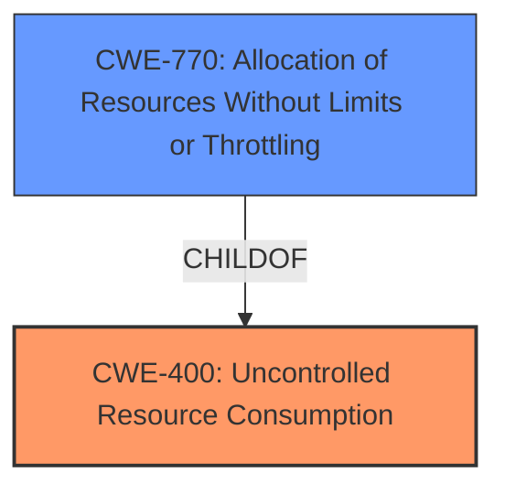

# Raw Analyzer Response for CVE-2020-9060

# Summary
| CWE ID | CWE Name | Confidence | CWE Abstraction Level | CWE Vulnerability Mapping Label | CWE-Vulnerability Mapping Notes |
|---|---|---|---|---|---|
| CWE-400 | Uncontrolled Resource Consumption | 0.9 | Class | Primary CWE | Allowed-with-Review |
| CWE-770 | Allocation of Resources Without Limits or Throttling | 0.7 | Base | Secondary Candidate CWE | Allowed |

## Evidence and Confidence

*   **Confidence Score:** 0.8
*   **Evidence Strength:** HIGH

## Relationship Analysis
The primary CWE selected is CWE-400 (Uncontrolled Resource Consumption), which is a Class-level CWE. While it's generally preferred to map to Base or Variant levels, CWE-400 accurately captures the high-level weakness of the device being vulnerable to resource exhaustion due to **malformed messages**.

CWE-770 (Allocation of Resources Without Limits or Throttling) is a child of CWE-400 and was considered due to the vulnerability involving resource allocation, but the information doesn't indicate specifically that resource allocation without limits is the core problem, but rather the improper handling of messages leading to resource consumption.

## Vulnerability Chain
The vulnerability chain starts with **malformed SECURITY NONCE GET, SECURITY NONCE GET 2, NO OPERATION, or NIF REQUEST messages** being sent to the device. This leads to **improper handling of these messages**, resulting in **uncontrolled resource consumption**, which ultimately causes **denial of service and resource exhaustion**.

## Summary of Analysis
The initial analysis focused on identifying the root cause and impact of the vulnerability. The vulnerability description and CVE summary point to **malformed messages** causing resource exhaustion.

CWE-400 (Uncontrolled Resource Consumption) was selected as the primary CWE because it directly addresses the core issue of the device's resources being exhausted due to improper handling of **malformed messages**. While CWE-770 (Allocation of Resources Without Limits or Throttling) was considered, the description indicates the problem is related to message handling, not necessarily that resources are allocated without limits.

The decision to use CWE-400 is supported by the following evidence from the provided content:

*   Vulnerability Description: "...susceptible to denial of service and resource exhaustion via **malformed SECURITY NONCE GET, SECURITY NONCE GET 2, NO OPERATION, or NIF REQUEST messages**."
*   CVE Reference Links Content Summary: "The vulnerability stems from the way Z-Wave devices based on Silicon Labs 500 series chipsets handle S2 security...they are susceptible to denial-of-service (DoS) and resource exhaustion when processing **malformed "SECURITY NONCE GET", "SECURITY NONCE GET 2", "NO OPERATION", or "NIF REQUEST" messages**."

The selection of CWE-400 is at an appropriate level of specificity because it captures the fundamental weakness, which is the lack of proper resource management when dealing with **malformed messages**, leading to resource exhaustion and DoS. While more specific CWEs could potentially be identified with more detailed information about the implementation, CWE-400 provides an accurate representation of the vulnerability based on the available evidence.

Relevant CWE Information: