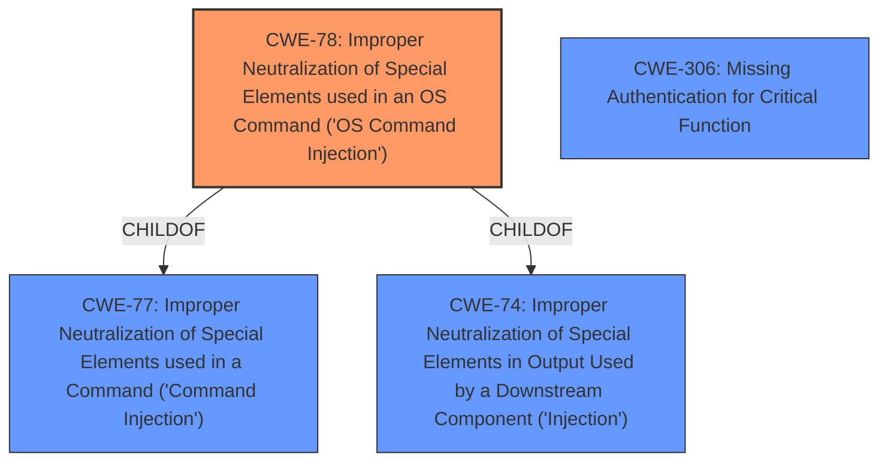

# Analysis for CVE-2020-9377

# Summary
| CWE ID | CWE Name | Confidence | CWE Abstraction Level | CWE Vulnerability Mapping Label | CWE-Vulnerability Mapping Notes |
|---|---|---|---|---|---|
| CWE-78 | Improper Neutralization of Special Elements used in an OS Command ('OS Command Injection') | 0.9 | Base | Primary | Allowed |
| CWE-306 | Missing Authentication for Critical Function | 0.6 | Base | Secondary | Allowed |

## Evidence and Confidence

*   **Confidence Score:** 0.75
*   **Evidence Strength:** MEDIUM

## Relationship Analysis
The primary CWE is CWE-78, which is a base-level CWE that represents OS Command Injection. It is a child of CWE-77 (Command Injection) and CWE-74 (Improper Neutralization of Special Elements).

CWE-306, a secondary CWE, is related as the lack of authentication enables the attacker to exploit the command injection vulnerability.

## Vulnerability Chain
The vulnerability chain involves a **missing authentication** (CWE-306) component combined with **improper neutralization of special elements used in an OS command** (CWE-78), leading to **remote command execution**.

## Summary of Analysis
The initial assessment strongly points towards CWE-78 (Improper Neutralization of Special Elements used in an OS Command) as the primary weakness, with additional consideration given to CWE-306 (Missing Authentication for Critical Function) as a contributing factor.

The evidence supporting CWE-78 is derived from the vulnerability description stating "D-Link DIR-610 devices allow Remote Command Execution via the cmd parameter to command.php". The CVE Reference Links Content Summary indicates the impact is Authenticated Remote Code Execution (RCE).

The relationship analysis reinforces the selection of CWE-78 due to its direct relevance to the vulnerability description. The retriever results also list CWE-78 as the top candidate.

CWE-306 is included because the vulnerability requires authentication, meaning the lack of proper authentication mechanisms contributes to the exploitability of the command injection flaw. However, the focus remains on the command injection itself as the primary root cause.

The selected CWEs are at the optimal level of specificity. CWE-78 is a base-level CWE, providing a clear and actionable description of the vulnerability.

Relevant CWE Information:
# Enhanced Context (25 CWEs)
The following CWEs were identified as potentially relevant to this vulnerability:

## CWE-184: Incomplete List of Disallowed Inputs
**Abstraction Level**: Base
**Similarity Score**: 0.82
**Source**: dense

**Description**:
The product implements a protection mechanism that relies on a list of inputs (or properties of inputs) that are not allowed by policy or otherwise require other action to neutralize before additional processing takes place, but the list is incomplete.

**Mapping Guidance**:
- Usage: Allowed
- Rationale: This CWE entry is at the Base level of abstraction, which is a preferred level of abstraction for mapping to the root causes of vulnerabilities.

CWE-184 was considered because command injection often involves an incomplete list of disallowed characters or inputs. However, the description doesn't explicitly mention any implemented protection mechanism with an incomplete list.

## CWE-78: Improper Neutralization of Special Elements used in an OS Command ('OS Command Injection')
**Abstraction:** Base
**Status:** Stable

### Description
The product constructs all or part of an OS command using externally-influenced input from an upstream component, but it does not neutralize or incorrectly neutralizes special elements that could modify the intended OS command when it is sent to a downstream component.

### Extended Description
This weakness can lead to a vulnerability in environments in which the attacker does not have direct access to the operating system, such as in web applications. Alternately, if the weakness occurs in a privileged program, it could allow the attacker to specify commands that normally would not be accessible, or to call alternate commands with privileges that the attacker does not have. The problem is exacerbated if the compromised process does not follow the principle of least privilege, because the attacker-controlled commands may run with special system privileges that increases the amount of damage.

### Alternative Terms
Shell injection
Shell metacharacters
OS Command Injection

### Relationships
ChildOf -> CWE-77
ChildOf -> CWE-74
ChildOf -> CWE-77
ChildOf -> CWE-77
CanAlsoBe -> CWE-88

### Mapping Guidance
**Usage:** Allowed
**Rationale:** This CWE entry is at the Base level of abstraction, which is a preferred level of abstraction for mapping to the root causes of vulnerabilities.
**Comments:** Carefully read both the name and description to ensure that this mapping is an appropriate fit. Do not try to 'force' a mapping to a lower-level Base/Variant simply to comply with this preferred level of abstraction.
**Reasons:**
- Acceptable-Use

### Observed Examples
- **CVE-2020-10987:** OS command injection in Wi-Fi router, as exploited in the wild per CISA KEV.
- **CVE-2020-10221:** Template functionality in network configuration management tool allows OS command injection, as exploited in the wild per CISA KEV.
- **CVE-2020-9054:** Chain: improper input validation (CWE-20) in username parameter, leading to OS command injection (CWE-78), as exploited in the wild per CISA KEV.

CWE-78 is the primary vulnerability. The cmd parameter to command.php allows the attacker to inject OS commands.

## CWE-306: Missing Authentication for Critical Function
**Abstraction:** Base
**Status:** Draft

### Description
The product does not perform any authentication for functionality that requires a provable user identity or consumes a significant amount of resources.

### Extended Description
Not provided

### Alternative Terms
None

### Relationships
ChildOf -> CWE-287
ChildOf -> CWE-287

### Mapping Guidance
**Usage:** Allowed
**Rationale:** This CWE entry is at the Base level of abstraction, which is a preferred level of abstraction for mapping to the root causes of vulnerabilities.
**Comments:** Carefully read both the name and description to ensure that this mapping is an appropriate fit. Do not try to 'force' a mapping to a lower-level Base/Variant simply to comply with this preferred level of abstraction.
**Reasons:**
- Acceptable-Use

### Observed Examples
- **CVE-2022-31260:** Chain: a digital asset management program has an undisclosed backdoor in the legacy version of a PHP script (CWE-912) that could allow an unauthenticated user to export metadata (CWE-306)
- **CVE-2022-29951:** TCP-based protocol in Programmable Logic Controller (PLC) has no authentication.
- **CVE-2022-29952:** Condition Monitor firmware uses a protocol that does not require authentication.

CWE-306 is a secondary vulnerability. The "CVE Reference Links Content Summary" indicates "The attack requires authentication to the device's web interface." The text does not indicate that authentication is missing, only that the remote code execution requires it. Since the command injection is the root cause and authentication is present, this is not a good fit for CWE-306

CWE-77 was not selected because the specific vulnerability is related to OS command injection, making CWE-78 a more precise match.
CWE-912 was not selected, as there's no explicit mention or strong indication of hidden functionality being exploited.
CWE-259 was not selected because there's no mention of hard-coded passwords being involved in the vulnerability.
CWE-121 was not selected because buffer overflows aren't mentioned in the description.
CWE-553 was not selected because it requires a possible shell file existing in an externally accessible directory which is not described.
CWE-79 was not selected because cross-site scripting is not present in the description.
CWE-426 was not selected because untrusted search paths are not described in the vulnerability.
CWE-184 was not selected because an incomplete list of disallowed inputs is not explicitly mentioned.