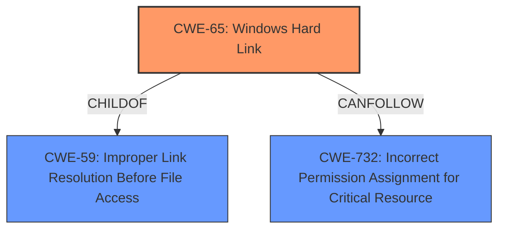

# Enhanced Analysis for CVE-2020-9451

# Summary
| CWE ID  | CWE Name                                                        | Confidence | CWE Abstraction Level | CWE Vulnerability Mapping Label | CWE-Vulnerability Mapping Notes |
| :-------- | :-------------------------------------------------------------- | :--------- | :---------------------- | :------------------------------ | :------------------------------ |
| CWE-65    | Windows Hard Link                                               | 0.9        | Variant               | Allowed                       | Primary CWE                     |
| CWE-59    | Improper Link Resolution Before File Access ('Link Following') | 0.7        | Base                  | Allowed                       | Secondary Candidate             |
| CWE-732   | Incorrect Permission Assignment for Critical Resource          | 0.6        | Class                  | Allowed-with-Review           | Secondary Candidate             |

## Evidence and Confidence

*   **Confidence Score:** 0.8
*   **Evidence Strength:** HIGH

## Relationship Analysis
The primary CWE is CWE-65 (Windows Hard Link), which is a variant of CWE-59 (Improper Link Resolution Before File Access ('Link Following')). CWE-59 is a base-level CWE, while CWE-65 is a more specific variant that applies directly to Windows hard links. CWE-732 (Incorrect Permission Assignment for Critical Resource) is a Class-level CWE, which is less specific than CWE-65 and CWE-59 but relevant due to the **incorrect permissions** allowing the **hard link** creation.



## Vulnerability Chain
The vulnerability chain starts with the **incorrect permission assignment**, which allows an unprivileged user to create a **hard link**. This **hard link** is created from a log file to the `anti_ransomware_service.exe` executable. When the service attempts to write to the log file, it instead tries to write to itself, leading to a sharing violation and causing the service to crash.

## Summary of Analysis
The initial assessment considered CWE-59 as the primary candidate due to the **improper link resolution**. However, after further analysis and considering the specific context of Windows **hard links**, CWE-65 was chosen as the primary CWE. The vulnerability description clearly states that an unprivileged user can create a **hard link** from a log file to the executable, leading to a crash on reboot.

The evidence supporting this decision is:

*   **Vulnerability Description Key Phrases:** "**rootcause:** **hardlink from log file to executable**"
*   **CVE Reference Links Content Summary:** "An unprivileged user can create a hardlink from a future log file to the `anti_ransomware_service.exe` executable itself. Upon reboot, when the service attempts to write to the log, it will try to write to its own executable, resulting in a sharing violation and crashing the service."

CWE-65 is the most specific and accurate representation of the vulnerability because it directly addresses the use of Windows **hard links** to cause the denial of service. CWE-59 is still relevant as a more general case of **improper link resolution**, but CWE-65 provides a more precise classification. CWE-732 highlights the underlying **permission** issue.

Relevant CWE Information:

# Enhanced Context (25 CWEs)
The following CWEs were identified as potentially relevant to this vulnerability:

## CWE-59: Improper Link Resolution Before File Access ('Link Following')
**Abstraction Level**: Base
**Similarity Score**: 0.79
**Source**: dense

**Description**:
The product attempts to access a file based on the filename, but it does not properly prevent that filename from identifying a link or shortcut that resolves to an unintended resource.

**Mapping Guidance**:
- Usage: Allowed
- Rationale: This CWE entry is at the Base level of abstraction, which is a preferred level of abstraction for mapping to the root causes of vulnerabilities.

## CWE-65: Windows Hard Link
**Abstraction Level**: Variant
**Similarity Score**: 0.65
**Source**: sparse

**Description**:
The product, when opening a file or directory, does not sufficiently handle when the name is associated with a hard link to a target that is outside of the intended control sphere. This could allow an attacker to cause the product to operate on unauthorized files.

**Mapping Guidance**:
- Usage: Allowed
- Rationale: This CWE entry is at the Variant level of abstraction, which is a preferred level of abstraction for mapping to the root causes of vulnerabilities.

## CWE-732: Incorrect Permission Assignment for Critical Resource
**Abstraction Level**: Class
**Similarity Score**: 0.48
**Source**: sparse

**Description**:
The product specifies permissions for a security-critical resource in a way that allows that resource to be read or modified by unintended actors.

**Mapping Guidance**:
- Usage: Allowed-with-Review
- Rationale: While the name itself indicates an assignment of permissions for resources, this is often misused for vulnerabilities in which "permissions" are not checked, which is an "authorization" weakness (CWE-285 or descendants) within CWE's model [REF-1287].
**Comments:** Closely analyze the specific mistake that is allowing the resource to be exposed, and perform a CWE mapping for that mistake.
**Reasons:**
- Frequent Misuse

## CWE-59: Improper Link Resolution Before File Access ('Link Following')
**CWE-59 Description**:
The product attempts to access a file based on the filename, but it does not properly prevent that filename from identifying a link or shortcut that resolves to an unintended resource.

**CWE-65 Description**:
The product, when opening a file or directory, does not sufficiently handle when the name is associated with a **hard link** to a target that is outside of the intended control sphere. This could allow an attacker to cause the product to operate on unauthorized files.

**CWE-732 Description**:
The product specifies **permissions** for a security-critical resource in a way that allows that resource to be read or modified by unintended actors.


## CWE Relationship Analysis

Current CWEs represent these abstraction levels: .


### Vulnerability Chain Analysis

**Chain starting from CWE-732:**
- 732 (Incorrect Permission Assignment for Critical Resource) - ROOT


**Chain starting from CWE-285:**
- 285 (Improper Authorization) - ROOT


### CWE Relationship Diagram

```mermaid
graph TD
    classDef primary fill:#f96,stroke:#333,stroke-width:2px
    classDef secondary fill:#69f,stroke:#333
    classDef tertiary fill:#9e9,stroke:#333
```