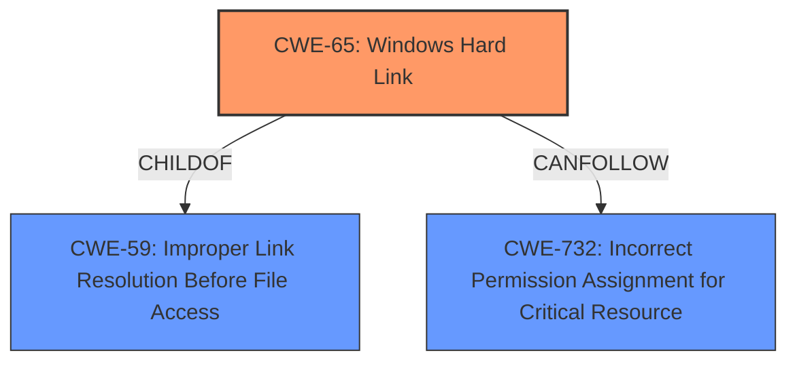

# Analysis for CVE-2020-9451

# Summary
| CWE ID  | CWE Name                                                        | Confidence | CWE Abstraction Level | CWE Vulnerability Mapping Label | CWE-Vulnerability Mapping Notes |
| :-------- | :-------------------------------------------------------------- | :--------- | :---------------------- | :------------------------------ | :------------------------------ |
| CWE-65    | Windows Hard Link                                               | 0.9        | Variant               | Allowed                       | Primary CWE                     |
| CWE-59    | Improper Link Resolution Before File Access ('Link Following') | 0.7        | Base                  | Allowed                       | Secondary Candidate             |
| CWE-732   | Incorrect Permission Assignment for Critical Resource          | 0.6        | Class                  | Allowed-with-Review           | Secondary Candidate             |

## Evidence and Confidence

*   **Confidence Score:** 0.8
*   **Evidence Strength:** HIGH

## Relationship Analysis
The primary CWE is CWE-65 (Windows Hard Link), which is a variant of CWE-59 (Improper Link Resolution Before File Access ('Link Following')). CWE-59 is a base-level CWE, while CWE-65 is a more specific variant that applies directly to Windows hard links. CWE-732 (Incorrect Permission Assignment for Critical Resource) is a Class-level CWE, which is less specific than CWE-65 and CWE-59 but relevant due to the **incorrect permissions** allowing the **hard link** creation.



## Vulnerability Chain
The vulnerability chain starts with the **incorrect permission assignment**, which allows an unprivileged user to create a **hard link**. This **hard link** is created from a log file to the `anti_ransomware_service.exe` executable. When the service attempts to write to the log file, it instead tries to write to itself, leading to a sharing violation and causing the service to crash.

## Summary of Analysis
The initial assessment considered CWE-59 as the primary candidate due to the **improper link resolution**. However, after further analysis and considering the specific context of Windows **hard links**, CWE-65 was chosen as the primary CWE. The vulnerability description clearly states that an unprivileged user can create a **hard link** from a log file to the executable, leading to a crash on reboot.

The evidence supporting this decision is:

*   **Vulnerability Description Key Phrases:** "**rootcause:** **hardlink from log file to executable**"
*   **CVE Reference Links Content Summary:** "An unprivileged user can create a hardlink from a future log file to the `anti_ransomware_service.exe` executable itself. Upon reboot, when the service attempts to write to the log, it will try to write to its own executable, resulting in a sharing violation and crashing the service."

CWE-65 is the most specific and accurate representation of the vulnerability because it directly addresses the use of Windows **hard links** to cause the denial of service. CWE-59 is still relevant as a more general case of **improper link resolution**, but CWE-65 provides a more precise classification. CWE-732 highlights the underlying **permission** issue.

Relevant CWE Information:

# Enhanced Context (25 CWEs)
The following CWEs were identified as potentially relevant to this vulnerability:

## CWE-59: Improper Link Resolution Before File Access ('Link Following')
**Abstraction Level**: Base
**Similarity Score**: 0.79
**Source**: dense

**Description**:
The product attempts to access a file based on the filename, but it does not properly prevent that filename from identifying a link or shortcut that resolves to an unintended resource.

**Mapping Guidance**:
- Usage: Allowed
- Rationale: This CWE entry is at the Base level of abstraction, which is a preferred level of abstraction for mapping to the root causes of vulnerabilities.

## CWE-65: Windows Hard Link
**Abstraction Level**: Variant
**Similarity Score**: 0.65
**Source**: sparse

**Description**:
The product, when opening a file or directory, does not sufficiently handle when the name is associated with a hard link to a target that is outside of the intended control sphere. This could allow an attacker to cause the product to operate on unauthorized files.

**Mapping Guidance**:
- Usage: Allowed
- Rationale: This CWE entry is at the Variant level of abstraction, which is a preferred level of abstraction for mapping to the root causes of vulnerabilities.

## CWE-732: Incorrect Permission Assignment for Critical Resource
**Abstraction Level**: Class
**Similarity Score**: 0.48
**Source**: sparse

**Description**:
The product specifies permissions for a security-critical resource in a way that allows that resource to be read or modified by unintended actors.

**Mapping Guidance**:
- Usage: Allowed-with-Review
- Rationale: While the name itself indicates an assignment of permissions for resources, this is often misused for vulnerabilities in which "permissions" are not checked, which is an "authorization" weakness (CWE-285 or descendants) within CWE's model [REF-1287].
**Comments:** Closely analyze the specific mistake that is allowing the resource to be exposed, and perform a CWE mapping for that mistake.
**Reasons:**
- Frequent Misuse

## CWE-59: Improper Link Resolution Before File Access ('Link Following')
**CWE-59 Description**:
The product attempts to access a file based on the filename, but it does not properly prevent that filename from identifying a link or shortcut that resolves to an unintended resource.

**CWE-65 Description**:
The product, when opening a file or directory, does not sufficiently handle when the name is associated with a **hard link** to a target that is outside of the intended control sphere. This could allow an attacker to cause the product to operate on unauthorized files.

**CWE-732 Description**:
The product specifies **permissions** for a security-critical resource in a way that allows that resource to be read or modified by unintended actors.

# Enhanced Query for CVE-2020-9451

## Vulnerability Description
An issue was discovered in Acronis True Image 2020 24.5.22510. anti_ransomware_service.exe keeps a log in a folder where unprivileged users have write permissions. The logs are generated in a predictable pattern, allowing an unprivileged user to create a hardlink from a (not yet created) log file to anti_ransomware_service.exe. On reboot, this forces the anti_ransomware_service to try to write its log into its own process, crashing in a SHARING VIOLATION. This crash occurs on every reboot.

### Vulnerability Description Key Phrases
- **rootcause:** **hardlink from log file to executable**
- **impact:** crash
- **attacker:** unprivileged user
- **product:** Acronis True Image
- **version:** 2020 24.5.22510
- **component:** anti_ransomware_service.exe

## CVE Reference Links Content Summary
Based on the provided content, here's a breakdown of the vulnerabilities related to CVE-2020-9451:

**Root Cause of Vulnerability:**

The primary root cause is a combination of insecure file handling and a lack of proper access control on a REST API in Acronis True Image 2020's anti-ransomware service.

**Vulnerabilities:**

1.  **Denial of Service via Hardlink Manipulation (DoS Issue 1):**
    *   **Weakness:** The `anti_ransomware_service.exe` writes logs to a directory where unprivileged users have write permissions. The log file names are predictable.
    *   **Vulnerability:** An unprivileged user can create a hardlink from a future log file to the `anti_ransomware_service.exe` executable itself. Upon reboot, when the service attempts to write to the log, it will try to write to its own executable, resulting in a sharing violation and crashing the service.
2.  **Denial of Service via Unprotected REST API (DoS Issue 2):**
    *   **Weakness:** The `anti_ransomware_service.exe` exposes a REST API on localhost (port 6109) without any access restrictions.
    *   **Vulnerability:** An unprivileged user can send API calls to this service to disable its functionality. Specifically, they can send PUT requests to `/settings/common` with JSON data to disable various features such as `autoFileRestore`, `backupProtectionEnabled`, `fileProtectionEnabled`, and ultimately `sessionEnabled`, effectively turning off the service.

**Impact of Exploitation:**

*   **DoS Issue 1:**  The anti-ransomware service crashes on every reboot, leaving the system unprotected. This is a persistent denial of service.
*   **DoS Issue 2:** The anti-ransomware service can be disabled, leaving the system unprotected from ransomware attacks.

**Attack Vectors:**

*   **DoS Issue 1:** Local attack. An attacker with low-privilege access can create a hard link.
*   **DoS Issue 2:** Local attack. An attacker with low-privilege access can send HTTP requests to the exposed REST API.

**Required Attacker Capabilities/Position:**

*   The attacker must have local, unprivileged access to the system where Acronis True Image 2020 is installed.
*   For DoS Issue 1, the attacker needs to be able to run the tool to create hard links.
*   For DoS Issue 2, the attacker needs to be able to execute a script or program capable of making HTTP requests.

**Additional Notes**

The provided information gives more technical details than the CVE description. It details the specific API endpoints and the process of creating the hardlink and how this leads to a denial of service on the anti-ransomware service.

## Retriever Results

### Top Combined Results

| Rank | CWE ID | Name | Abstraction | Usage  | Retrievers | Individual Scores |
|------|--------|------|-------------|-------|------------|-------------------|
| 1 | 276 | Incorrect Default Permissions | Base | Allowed | sparse | 0.825 |
| 2 | 65 | Windows Hard Link | Variant | Allowed | sparse | 0.650 |
| 3 | 732 | Incorrect Permission Assignment for Critical Resource | Class | Allowed-with-Review | sparse | 0.482 |
| 4 | 59 | Improper Link Resolution Before File Access ('Link Following') | Base | Allowed | sparse | 0.469 |
| 5 | 22 | Improper Limitation of a Pathname to a Restricted Directory ('Path Traversal') | Base | Allowed | sparse | 0.424 |
| 6 | 1386 | Insecure Operation on Windows Junction / Mount Point | Base | Allowed | dense | 0.485 |
| 7 | 73 | External Control of File Name or Path | Base | Allowed | graph | 0.002 |
| 8 | 367 | Time-of-check Time-of-use (TOCTOU) Race Condition | Base | Allowed | sparse | 0.420 |
| 9 | 532 | Insertion of Sensitive Information into Log File | Base | Allowed | sparse | 0.418 |
| 10 | 476 | NULL Pointer Dereference | Base | Allowed | sparse | 0.417 |


# Complete CWE Specifications


## CWE-276: Incorrect Default Permissions
**Abstraction:** Base
**Status:** Draft

### Description
During installation, installed file permissions are set to allow anyone to modify those files.

### Extended Description
Not provided

### Alternative Terms
None

### Relationships
ChildOf -> CWE-732
ChildOf -> CWE-732

### Mapping Guidance
**Usage:** Allowed
**Rationale:** This CWE entry is at the Base level of abstraction, which is a preferred level of abstraction for mapping to the root causes of vulnerabilities.
**Comments:** Carefully read both the name and description to ensure that this mapping is an appropriate fit. Do not try to 'force' a mapping to a lower-level Base/Variant simply to comply with this preferred level of abstraction.
**Reasons:**
- Acceptable-Use


### Observed Examples
- **CVE-2005-1941:** Executables installed world-writable.
- **CVE-2002-1713:** Home directories installed world-readable.
- **CVE-2001-1550:** World-writable log files allow information loss; world-readable file has cleartext passwords.


## CWE-65: Windows Hard Link
**Abstraction:** Variant
**Status:** Incomplete

### Description
The product, when opening a file or directory, does not sufficiently handle when the name is associated with a hard link to a target that is outside of the intended control sphere. This could allow an attacker to cause the product to operate on unauthorized files.

### Extended Description
Failure for a system to check for hard links can result in vulnerability to different types of attacks. For example, an attacker can escalate their privileges if a file used by a privileged program is replaced with a hard link to a sensitive file (e.g. AUTOEXEC.BAT). When the process opens the file, the attacker can assume the privileges of that process, or prevent the program from accurately processing data.

### Alternative Terms
None

### Relationships
ChildOf -> CWE-59

### Mapping Guidance
**Usage:** Allowed
**Rationale:** This CWE entry is at the Variant level of abstraction, which is a preferred level of abstraction for mapping to the root causes of vulnerabilities.
**Comments:** Carefully read both the name and description to ensure that this mapping is an appropriate fit. Do not try to 'force' a mapping to a lower-level Base/Variant simply to comply with this preferred level of abstraction.
**Reasons:**
- Acceptable-Use


### Observed Examples
- **CVE-2002-0725:** File system allows local attackers to hide file usage activities via a hard link to the target file, which causes the link to be recorded in the audit trail instead of the target file.
- **CVE-2003-0844:** Web server plugin allows local users to overwrite arbitrary files via a symlink attack on predictable temporary filenames.


## CWE-732: Incorrect Permission Assignment for Critical Resource
**Abstraction:** Class
**Status:** Draft

### Description
The product specifies permissions for a security-critical resource in a way that allows that resource to be read or modified by unintended actors.

### Extended Description
When a resource is given a permission setting that provides access to a wider range of actors than required, it could lead to the exposure of sensitive information, or the modification of that resource by unintended parties. This is especially dangerous when the resource is related to program configuration, execution, or sensitive user data. For example, consider a misconfigured storage account for the cloud that can be read or written by a public or anonymous user.

### Alternative Terms
None

### Relationships
ChildOf -> CWE-285
ChildOf -> CWE-668

### Mapping Guidance
**Usage:** Allowed-with-Review
**Rationale:** While the name itself indicates an assignment of permissions for resources, this is often misused for vulnerabilities in which "permissions" are not checked, which is an "authorization" weakness (CWE-285 or descendants) within CWE's model [REF-1287].
**Comments:** Closely analyze the specific mistake that is allowing the resource to be exposed, and perform a CWE mapping for that mistake.
**Reasons:**
- Frequent Misuse


### Additional Notes
**[Maintenance]** The relationships between privileges, permissions, and actors (e.g. users and groups) need further refinement within the Research view. One complication is that these concepts apply to two different pillars, related to control of resources (CWE-664) and protection mechanism failures (CWE-693).


### Observed Examples
- **CVE-2022-29527:** Go application for cloud management creates a world-writable sudoers file that allows local attackers to inject sudo rules and escalate privileges to root by winning a race condition.
- **CVE-2009-3482:** Anti-virus product sets insecure "Everyone: Full Control" permissions for files under the "Program Files" folder, allowing attackers to replace executables with Trojan horses.
- **CVE-2009-3897:** Product creates directories with 0777 permissions at installation, allowing users to gain privileges and access a socket used for authentication.


## CWE-59: Improper Link Resolution Before File Access ('Link Following')
**Abstraction:** Base
**Status:** Draft

### Description
The product attempts to access a file based on the filename, but it does not properly prevent that filename from identifying a link or shortcut that resolves to an unintended resource.

### Extended Description
Not provided

### Alternative Terms
insecure temporary file: Some people use the phrase "insecure temporary file" when referring to a link following weakness, but other weaknesses can produce insecure temporary files without any symlink involvement at all.
Zip Slip: "Zip slip" is an attack that uses file archives (e.g., ZIP, tar, rar, etc.) that contain filenames with path traversal sequences that cause the files to be written outside of the directory under which the archive is expected to be extracted [REF-1282]. It is most commonly used for relative path traversal (CWE-23) and link following (CWE-59).

### Relationships
ChildOf -> CWE-706
ChildOf -> CWE-706

### Mapping Guidance
**Usage:** Allowed
**Rationale:** This CWE entry is at the Base level of abstraction, which is a preferred level of abstraction for mapping to the root causes of vulnerabilities.
**Comments:** Carefully read both the name and description to ensure that this mapping is an appropriate fit. Do not try to 'force' a mapping to a lower-level Base/Variant simply to comply with this preferred level of abstraction.
**Reasons:**
- Acceptable-Use


### Additional Notes
**[Theoretical]** 

Link following vulnerabilities are Multi-factor Vulnerabilities (MFV). They are the combination of multiple elements: file or directory permissions, filename predictability, race conditions, and in some cases, a design limitation in which there is no mechanism for performing atomic file creation operations.


Some potential factors are race conditions, permissions, and predictability.


### Observed Examples
- **CVE-1999-1386:** Some versions of Perl follow symbolic links when running with the -e option, which allows local users to overwrite arbitrary files via a symlink attack.
- **CVE-2000-1178:** Text editor follows symbolic links when creating a rescue copy during an abnormal exit, which allows local users to overwrite the files of other users.
- **CVE-2004-0217:** Antivirus update allows local users to create or append to arbitrary files via a symlink attack on a logfile.


## CWE-22: Improper Limitation of a Pathname to a Restricted Directory ('Path Traversal')
**Abstraction:** Base
**Status:** Stable

### Description
The product uses external input to construct a pathname that is intended to identify a file or directory that is located underneath a restricted parent directory, but the product does not properly neutralize special elements within the pathname that can cause the pathname to resolve to a location that is outside of the restricted directory.

### Extended Description


Many file operations are intended to take place within a restricted directory. By using special elements such as ".." and "/" separators, attackers can escape outside of the restricted location to access files or directories that are elsewhere on the system. One of the most common special elements is the "../" sequence, which in most modern operating systems is interpreted as the parent directory of the current location. This is referred to as relative path traversal. Path traversal also covers the use of absolute pathnames such as "/usr/local/bin" to access unexpected files. This is referred to as absolute path traversal.


### Alternative Terms
Directory traversal
Path traversal: "Path traversal" is preferred over "directory traversal," but both terms are attack-focused.

### Relationships
ChildOf -> CWE-706
ChildOf -> CWE-706
ChildOf -> CWE-668

### Mapping Guidance
**Usage:** Allowed
**Rationale:** This CWE entry is at the Base level of abstraction, which is a preferred level of abstraction for mapping to the root causes of vulnerabilities.
**Comments:** Carefully read both the name and description to ensure that this mapping is an appropriate fit. Do not try to 'force' a mapping to a lower-level Base/Variant simply to comply with this preferred level of abstraction.
**Reasons:**
- Acceptable-Use


### Additional Notes
**[Other]** In many programming languages, the injection of a null byte (the 0 or NUL) may allow an attacker to truncate a generated filename to apply to a wider range of files. For example, the product may add ".txt" to any pathname, thus limiting the attacker to text files, but a null injection may effectively remove this restriction.

**[Relationship]** Pathname equivalence can be regarded as a type of canonicalization error.

**[Relationship]** Some pathname equivalence issues are not directly related to directory traversal, rather are used to bypass security-relevant checks for whether a file/directory can be accessed by the attacker (e.g. a trailing "/" on a filename could bypass access rules that don't expect a trailing /, causing a server to provide the file when it normally would not).

**[Terminology]** 

Like other weaknesses, terminology is often based on the types of manipulations used, instead of the underlying weaknesses. Some people use "directory traversal" only to refer to the injection of ".." and equivalent sequences whose specific meaning is to traverse directories.


Other variants like "absolute pathname" and "drive letter" have the *effect* of directory traversal, but some people may not call it such, since it doesn't involve ".." or equivalent.


**[Research Gap]** Many variants of path traversal attacks are probably under-studied with respect to root cause. CWE-790 and CWE-182 begin to cover part of this gap.

**[Research Gap]** 

Incomplete diagnosis or reporting of vulnerabilities can make it difficult to know which variant is affected. For example, a researcher might say that "..\" is vulnerable, but not test "../" which may also be vulnerable.


Any combination of directory separators ("/", "\", etc.) and numbers of "." (e.g. "....") can produce unique variants; for example, the "//../" variant is not listed (CVE-2004-0325). See this entry's children and lower-level descendants.


### Observed Examples
- **CVE-2024-37032:** Large language model (LLM) management tool does not validate the format of a digest value (CWE-1287) from a private, untrusted model registry, enabling relative path traversal (CWE-23), a.k.a. Probllama
- **CVE-2024-4315:** Chain: API for text generation using Large Language Models (LLMs) does not include the "\" Windows folder separator in its denylist (CWE-184) when attempting to prevent Local File Inclusion via path traversal (CWE-22), allowing deletion of arbitrary files on Windows systems.
- **CVE-2022-45918:** Chain: a learning management tool debugger uses external input to locate previous session logs (CWE-73) and does not properly validate the given path (CWE-20), allowing for filesystem path traversal using "../" sequences (CWE-24)


## CWE-1386: Insecure Operation on Windows Junction / Mount Point
**Abstraction:** Base
**Status:** Incomplete

### Description
The product opens a file or directory, but it does not properly prevent the name from being associated with a junction or mount point to a destination that is outside of the intended control sphere.

### Extended Description


Depending on the intended action being performed, this could allow an attacker to cause the product to read, write, delete, or otherwise operate on unauthorized files.


In Windows, NTFS5 allows for file system objects called reparse points. Applications can create a hard link from one directory to another directory, called a junction point. They can also create a mapping from a directory to a drive letter, called a mount point. If a file is used by a privileged program, but it can be replaced with a hard link to a sensitive file (e.g., AUTOEXEC.BAT), an attacker could excalate privileges. When the process opens the file, the attacker can assume the privileges of that process, tricking the privileged process to read, modify, or delete the sensitive file, preventing the program from accurately processing data. Note that one can also point to registries and semaphores.


### Alternative Terms
None

### Relationships
ChildOf -> CWE-59

### Mapping Guidance
**Usage:** Allowed
**Rationale:** This CWE entry is at the Base level of abstraction, which is a preferred level of abstraction for mapping to the root causes of vulnerabilities.
**Comments:** Carefully read both the name and description to ensure that this mapping is an appropriate fit. Do not try to 'force' a mapping to a lower-level Base/Variant simply to comply with this preferred level of abstraction.
**Reasons:**
- Acceptable-Use


### Additional Notes
**[Terminology]** Symbolic links, hard links, junctions, and mount points can be confusing terminology, as there are differences in how they operate between UNIX-based systems and Windows, and there are interactions between them.

**[Maintenance]** This entry is still under development and will continue to see updates and content improvements.


### Observed Examples
- **CVE-2021-26426:** Privileged service allows attackers to delete unauthorized files using a directory junction, leading to arbitrary code execution as SYSTEM.
- **CVE-2020-0863:** By creating a mount point and hard links, an attacker can abuse a service to allow users arbitrary file read permissions.
- **CVE-2019-1161:** Chain: race condition (CWE-362) in anti-malware product allows deletion of files by creating a junction (CWE-1386) and using hard links during the time window in which a temporary file is created and deleted.


## CWE-73: External Control of File Name or Path
**Abstraction:** Base
**Status:** Draft

### Description
The product allows user input to control or influence paths or file names that are used in filesystem operations.

### Extended Description


This could allow an attacker to access or modify system files or other files that are critical to the application.


Path manipulation errors occur when the following two conditions are met:

```
		1. An attacker can specify a path used in an operation on the filesystem.
		2. By specifying the resource, the attacker gains a capability that would not otherwise be permitted.
```
For example, the program may give the attacker the ability to overwrite the specified file or run with a configuration controlled by the attacker.

### Alternative Terms
None

### Relationships
ChildOf -> CWE-642
ChildOf -> CWE-610
ChildOf -> CWE-20
CanPrecede -> CWE-22
CanPrecede -> CWE-41
CanPrecede -> CWE-98
CanPrecede -> CWE-434
CanPrecede -> CWE-59

### Mapping Guidance
**Usage:** Allowed
**Rationale:** This CWE entry is at the Base level of abstraction, which is a preferred level of abstraction for mapping to the root causes of vulnerabilities.
**Comments:** Carefully read both the name and description to ensure that this mapping is an appropriate fit. Do not try to 'force' a mapping to a lower-level Base/Variant simply to comply with this preferred level of abstraction.
**Reasons:**
- Acceptable-Use


### Additional Notes
**[Maintenance]** CWE-114 is a Class, but it is listed a child of CWE-73 in view 1000. This suggests some abstraction problems that should be resolved in future versions.

**[Relationship]** 

The external control of filenames can be the primary link in chains with other file-related weaknesses, as seen in the CanPrecede relationships. This is because software systems use files for many different purposes: to execute programs, load code libraries, to store application data, to store configuration settings, record temporary data, act as signals or semaphores to other processes, etc.


However, those weaknesses do not always require external control. For example, link-following weaknesses (CWE-59) often involve pathnames that are not controllable by the attacker at all.


The external control can be resultant from other issues. For example, in PHP applications, the register_globals setting can allow an attacker to modify variables that the programmer thought were immutable, enabling file inclusion (CWE-98) and path traversal (CWE-22). Operating with excessive privileges (CWE-250) might allow an attacker to specify an input filename that is not directly readable by the attacker, but is accessible to the privileged program. A buffer overflow (CWE-119) might give an attacker control over nearby memory locations that are related to pathnames, but were not directly modifiable by the attacker.


### Observed Examples
- **CVE-2022-45918:** Chain: a learning management tool debugger uses external input to locate previous session logs (CWE-73) and does not properly validate the given path (CWE-20), allowing for filesystem path traversal using "../" sequences (CWE-24)
- **CVE-2008-5748:** Chain: external control of values for user's desired language and theme enables path traversal.
- **CVE-2008-5764:** Chain: external control of user's target language enables remote file inclusion.


## CWE-367: Time-of-check Time-of-use (TOCTOU) Race Condition
**Abstraction:** Base
**Status:** Incomplete

### Description
The product checks the state of a resource before using that resource, but the resource's state can change between the check and the use in a way that invalidates the results of the check. This can cause the product to perform invalid actions when the resource is in an unexpected state.

### Extended Description
This weakness can be security-relevant when an attacker can influence the state of the resource between check and use. This can happen with shared resources such as files, memory, or even variables in multithreaded programs.

### Alternative Terms
TOCTTOU: The TOCTTOU acronym expands to "Time Of Check To Time Of Use".
TOCCTOU: The TOCCTOU acronym is most likely a typo of TOCTTOU, but it has been used in some influential documents, so the typo is repeated fairly frequently.

### Relationships
ChildOf -> CWE-362
ChildOf -> CWE-362

### Mapping Guidance
**Usage:** Allowed
**Rationale:** This CWE entry is at the Base level of abstraction, which is a preferred level of abstraction for mapping to the root causes of vulnerabilities.
**Comments:** Carefully read both the name and description to ensure that this mapping is an appropriate fit. Do not try to 'force' a mapping to a lower-level Base/Variant simply to comply with this preferred level of abstraction.
**Reasons:**
- Acceptable-Use


### Additional Notes
**[Relationship]** TOCTOU issues do not always involve symlinks, and not every symlink issue is a TOCTOU problem.

**[Research Gap]** Non-symlink TOCTOU issues are not reported frequently, but they are likely to occur in code that attempts to be secure.


### Observed Examples
- **CVE-2015-1743:** TOCTOU in sandbox process allows installation of untrusted browser add-ons by replacing a file after it has been verified, but before it is executed
- **CVE-2003-0813:** A multi-threaded race condition allows remote attackers to cause a denial of service (crash or reboot) by causing two threads to process the same RPC request, which causes one thread to use memory after it has been freed.
- **CVE-2004-0594:** PHP flaw allows remote attackers to execute arbitrary code by aborting execution before the initialization of key data structures is complete.


## CWE-532: Insertion of Sensitive Information into Log File
**Abstraction:** Base
**Status:** Incomplete

### Description
The product writes sensitive information to a log file.

### Extended Description
Not provided

### Alternative Terms
None

### Relationships
ChildOf -> CWE-538
ChildOf -> CWE-200

### Mapping Guidance
**Usage:** Allowed
**Rationale:** This CWE entry is at the Base level of abstraction, which is a preferred level of abstraction for mapping to the root causes of vulnerabilities.
**Comments:** Carefully read both the name and description to ensure that this mapping is an appropriate fit. Do not try to 'force' a mapping to a lower-level Base/Variant simply to comply with this preferred level of abstraction.
**Reasons:**
- Acceptable-Use


### Observed Examples
- **CVE-2017-9615:** verbose logging stores admin credentials in a world-readable log file
- **CVE-2018-1999036:** SSH password for private key stored in build log


## CWE-476: NULL Pointer Dereference
**Abstraction:** Base
**Status:** Stable

### Description
The product dereferences a pointer that it expects to be valid but is NULL.

### Extended Description
Not provided

### Alternative Terms
NPD: Common abbreviation for Null Pointer Dereference
null deref: Common abbreviation for Null Pointer Dereference
NPE: Common abbreviation for Null Pointer Exception
nil pointer dereference: used for access of nil in Go programs

### Relationships
ChildOf -> CWE-710
ChildOf -> CWE-754
ChildOf -> CWE-754

### Mapping Guidance
**Usage:** Allowed
**Rationale:** This CWE entry is at the Base level of abstraction, which is a preferred level of abstraction for mapping to the root causes of vulnerabilities.
**Comments:** Carefully read both the name and description to ensure that this mapping is an appropriate fit. Do not try to 'force' a mapping to a lower-level Base/Variant simply to comply with this preferred level of abstraction.
**Reasons:**
- Acceptable-Use


### Observed Examples
- **CVE-2005-3274:** race condition causes a table to be corrupted if a timer activates while it is being modified, leading to resultant NULL dereference; also involves locking.
- **CVE-2002-1912:** large number of packets leads to NULL dereference
- **CVE-2005-0772:** packet with invalid error status value triggers NULL dereference

