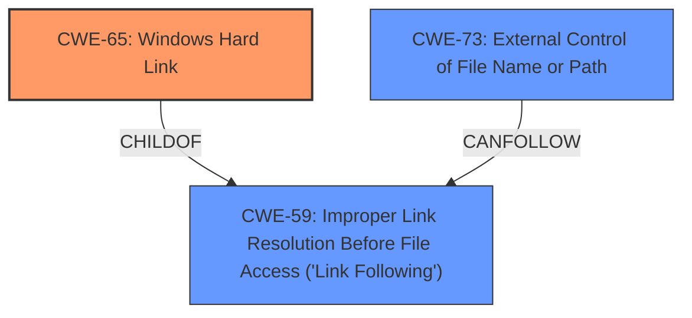

# Raw Analyzer Response for CVE-2020-9452

# Summary
| CWE ID | CWE Name | Confidence | CWE Abstraction Level | CWE Vulnerability Mapping Label | CWE-Vulnerability Mapping Notes |
|---|---|---|---|---|---|
| **CWE-65** | **Windows Hard Link** | 1.0 | Variant | Primary | Allowed |
| CWE-73 | External Control of File Name or Path | 0.8 | Base | Secondary | Allowed |
| CWE-59 | Improper Link Resolution Before File Access ('Link Following') | 0.7 | Base | Secondary | Allowed |

## Evidence and Confidence

*   **Confidence Score:** 0.9
*   **Evidence Strength:** HIGH

## Relationship Analysis
The primary CWE is CWE-65 Windows Hard Link, a **Variant** of CWE-59 Improper Link Resolution. CWE-59 is a **Base** CWE and a parent of CWE-65. The analysis also considered CWE-73 External Control of File Name or Path, another potential contributor to the vulnerability, where user-controlled input influences file system operations.

## Vulnerability Chain
The chain of events leading to the vulnerability is:
1.  **Unprivileged users have write permissions in the quarantine folder (CWE not identified, but contributes to the issue)**
2.  Attacker creates a hard link in the quarantine folder (CWE-65 Windows Hard Link)
3.  Anti-ransomware service copies a suspected ransomware file to the quarantine folder using SYSTEM privileges, following the hard link (CWE-65 Windows Hard Link)
4.  An unprivileged user can write/overwrite arbitrary files in arbitrary folders (Impact)
5.  Escalating privileges to SYSTEM (Impact)

## Summary of Analysis
The primary weakness lies in the ability of unprivileged users to manipulate the privileged write operation by using a hard link. The service **does not properly** handle the case where a hard link redirects the file write to an unintended location.

The vulnerability description states: "Because **unprivileged users have write permissions in the quarantine folder**, it is possible to control this privileged write with a hardlink. This means that an unprivileged user can write/overwrite arbitrary files in arbitrary folders. Escalating privileges to SYSTEM is trivial with arbitrary writes."

The CVE Reference Links Content Summary supports this: "The service copies files to the quarantine folder without properly validating the destination, allowing for the use of hard links to redirect the write operation." It also highlights "Privileged File Write with User-Controlled Path".

CWE-65 Windows Hard Link is the most specific and accurate representation of the vulnerability, as it directly addresses the **weakness** of **improperly handling hard links**, leading to arbitrary file overwrite. The other CWEs considered were either too general (CWE-59) or focused on related but not primary aspects of the vulnerability (CWE-73).

Relevant CWE Information:

# Enhanced Context (25 CWEs)

## CWE-59: Improper Link Resolution Before File Access ('Link Following')
**Abstraction Level**: Base
**Similarity Score**: 0.82
**Source**: dense

**Description**:
The product attempts to access a file based on the filename, but it **does not properly prevent** that filename from identifying a link or shortcut that resolves to an unintended resource.

**Mapping Guidance**:
- Usage: Allowed
- Rationale: This CWE entry is at the Base level of abstraction, which is a preferred level of abstraction for mapping to the root causes of vulnerabilities.

## CWE-65: Windows Hard Link
**Abstraction Level**: Variant
**Similarity Score**: 0.78
**Source**: dense

**Description**:
The product, when opening a file or directory, **does not sufficiently handle when the name is associated with a hard link** to a target that is outside of the intended control sphere. This could allow an attacker to cause the product to operate on unauthorized files.

**Mapping Guidance**:
- Usage: Allowed
- Rationale: This CWE entry is at the Variant level of abstraction, which is a preferred level of abstraction for mapping to the root causes of vulnerabilities.

## CWE-73: External Control of File Name or Path
**Abstraction Level**: Base
**Similarity Score**: 0.76
**Source**: dense

**Description**:
The product allows user input to control or influence paths or file names that are used in filesystem operations.

**Mapping Guidance**:
- Usage: Allowed
- Rationale: This CWE entry is at the Base level of abstraction, which is a preferred level of abstraction for mapping to the root causes of vulnerabilities.

## CWE-65: Windows Hard Link
**Abstraction Level**: Variant
**Similarity Score**: 7257.52
**Source**: sparse

**Description**:
The product, when opening a file or directory, **does not sufficiently handle when the name is associated with a hard link** to a target that is outside of the intended control sphere. This could allow an attacker to cause the product to operate on unauthorized files.

**Mapping Guidance**:
- Usage: Allowed
- Rationale: This CWE entry is at the Variant level of abstraction, which is a preferred level of abstraction for mapping to the root causes of vulnerabilities.

### CWE Considerations

*   **CWE-65 Windows Hard Link**: This is the most specific CWE, as the vulnerability is directly related to the **improper handling** of Windows hard links. The description aligns perfectly with the vulnerability description.
*   **CWE-59 Improper Link Resolution Before File Access ('Link Following')**: This is a more general CWE, as it covers various types of link-following issues, not just hard links. While applicable, CWE-65 is a more precise classification.
*   **CWE-73 External Control of File Name or Path**: This CWE is relevant because the attacker has some control over the file path through the hard link. However, the core issue is not the external control of the filename itself, but the **improper handling** of the hard link by the privileged process.
*   **CWE-276 Incorrect Default Permissions**: This CWE was considered because the root cause includes the fact that the quarantine folder has write permissions for unprivileged users, however that is a contributing factor and not the main weakness.

### Decision Justification

The selection of CWE-65 is based on the following:

*   **Specificity:** CWE-65 directly addresses the **weakness** related to **improper handling** of Windows hard links.
*   **Evidence:** The vulnerability description explicitly mentions the use of hard links to control the privileged write operation.
*   **Mapping Guidance:** The mapping guidance for CWE-65 allows its use and is at the Variant level of abstraction, which is preferred.
*   **Relationship Analysis:** While CWE-59 is a parent, CWE-65 provides a more accurate and detailed description of the **vulnerability**.

CWE-73 and CWE-59 are included as secondary CWEs to represent the broader context of the vulnerability.