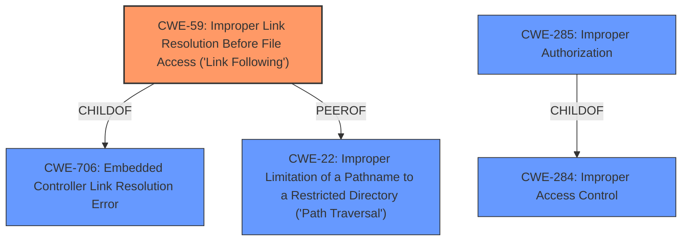

# Raw Analyzer Response for CVE-2020-9668

# Summary
| CWE ID | CWE Name | Confidence | CWE Abstraction Level | CWE Vulnerability Mapping Label | CWE-Vulnerability Mapping Notes |
|---|---|---|---|---|---|
| CWE-59 | Improper Link Resolution Before File Access ('Link Following') | 0.9 | Base | Allowed | Primary CWE |
| CWE-285 | Improper Authorization | 0.6 | Class | Discouraged | Secondary Candidate |
| CWE-284 | Improper Access Control | 0.5 | Pillar | Discouraged | Secondary Candidate |

## Evidence and Confidence

*   **Confidence Score:** 0.9
*   **Evidence Strength:** MEDIUM

## Relationship Analysis
The primary CWE is CWE-59, which describes the improper handling of symbolic links leading to unauthorized file access. This aligns with the vulnerability description mentioning symbolic links. While the description also points to **Improper Access control**, this is a high-level concept. The more specific CWE-59 is preferred. CWE-59 is a child of CWE-706 which is "Embedded Controller Link Resolution Error". Other related CWEs include CWE-22 "Improper Limitation of a Pathname to a Restricted Directory ('Path Traversal')" which could be an alternative classification if the symbolic link is used to traverse directories.

## Vulnerability Chain
The vulnerability chain starts with the **improper handling of symbolic links** (CWE-59), which leads to **improper access control** and **privilege elevation**.

## Summary of Analysis
The initial assessment focused on the **Improper Access Control** aspect of the vulnerability, which led to considering CWE-284 and CWE-285. However, the vulnerability description explicitly mentions the handling of symbolic links as the attack vector. This points more directly to CWE-59. The Retriever results also show CWE-59 as a strong candidate.

The final decision to select CWE-59 as the primary CWE is based on the explicit mention of symbolic links in the vulnerability description. This aligns with the CWE's description of **improperly preventing a filename from identifying a link or shortcut that resolves to an unintended resource**. The **Improper Access Control** is a consequence of this weakness.

The selected CWE is at the optimal level of specificity because it directly addresses the root cause of the vulnerability. Other CWEs, such as CWE-284, are too general and don't capture the specific nature of the vulnerability.

Relevant CWE Information:

# Enhanced Context (25 CWEs)

## CWE-59: Improper Link Resolution Before File Access ('Link Following')
**Abstraction Level**: Base
**Similarity Score**: 0.80
**Source**: dense

**Description**:
The product attempts to access a file based on the filename, but it does not properly prevent that filename from identifying a link or shortcut that resolves to an unintended resource.

**Mapping Guidance**:
- Usage: Allowed
- Rationale: This CWE entry is at the Base level of abstraction, which is a preferred level of abstraction for mapping to the root causes of vulnerabilities.

### Technical Explanation for CWE-59:
- **How it matches:** The vulnerability description states that the vulnerability exists when handling symbolic links. This aligns directly with CWE-59, which focuses on the **improper resolution of links before file access**.
- **Security implications:** An unauthenticated attacker can exploit this weakness to elevate privileges, indicating that the symbolic link is being used to access resources that should not be accessible to the attacker.
- **Relationships:** CWE-59 is a base-level CWE, which is preferred for root cause analysis.
- **Mapping guidance:** The MITRE mapping guidance allows for the use of CWE-59.

### Technical Explanation for CWE-285:
- **How it matches:** The vulnerability results in privilege elevation, which could be seen as an authorization issue.
- **Security implications:** Privilege elevation allows an attacker to perform actions they are not authorized to perform.
- **Relationships:** CWE-285 is a class-level CWE, and the mapping guidance discourages its use when more specific CWEs exist.
- **Mapping guidance:** The MITRE mapping guidance discourages the use of CWE-285 and suggests looking at its children such as CWE-862 "Missing Authorization" or CWE-863 "Incorrect Authorization". The provided description does not have the details to select a more specific CWE.

### Technical Explanation for CWE-284:
- **How it matches:** The vulnerability description includes the phrase **"Improper Access control"**.
- **Security implications:** Privilege elevation allows an attacker to perform actions they are not authorized to perform.
- **Relationships:** CWE-284 is a pillar-level CWE, the highest level of abstraction, and the mapping guidance strongly discourages its use.

### Considered but not used:
- CWE-788, CWE-787, CWE-379, CWE-20, CWE-732, CWE-22, CWE-822: These CWEs were considered but ultimately not selected because they did not directly address the root cause of the vulnerability, which is the improper handling of symbolic links. These address memory corruption, resource management, input validation, or path traversal but do not fit the vulnerability.