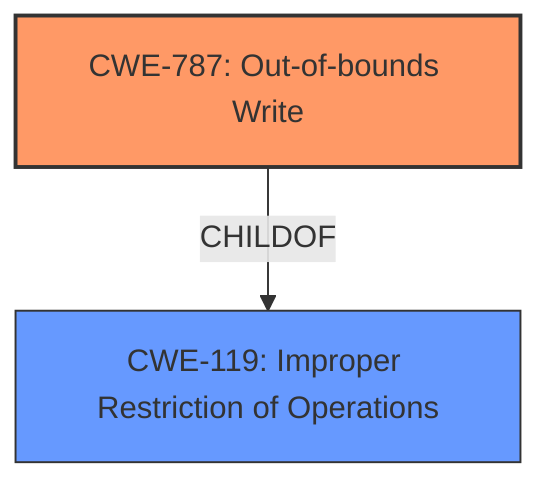

# Enhanced Analysis for CVE-2020-9818

# Summary
| CWE ID  | CWE Name                                                                | Confidence | CWE Abstraction Level | CWE Vulnerability Mapping Label | CWE-Vulnerability Mapping Notes |
| :-------- | :---------------------------------------------------------------------- | :---------- | :---------------------- | :------------------------------ | :------------------------------ |
| CWE-787 | Out-of-bounds Write                                                       | 1          | Base                    | Primary CWE                    | Allowed                         |

## Evidence and Confidence

*   **Confidence Score:** 1
*   **Evidence Strength:** HIGH

## Relationship Analysis
The primary CWE is CWE-787 (**Out-of-bounds Write**), which is a base-level CWE. CWE-787 is a child of CWE-119 (**Improper Restriction of Operations within the Bounds of a Memory Buffer**), a class-level CWE, indicating that out-of-bounds write is a specific type of buffer handling issue. No other direct relationships significantly impacted the choice, as the description clearly indicates an out-of-bounds write condition being the root cause.



## Vulnerability Chain
The chain of events is as follows:
1.  A maliciously crafted mail message is processed.
2.  This leads to an **out-of-bounds write** (CWE-787) due to **improper bounds checking**.
3.  The impact is unexpected memory modification or application termination.

The root cause is the **out-of-bounds write** (CWE-787), and the impact is memory modification or application termination. The description lacks detail on what could have preceded the out-of-bounds write to create the crafted mail message.

## Summary of Analysis
The initial analysis and resulting conclusion are strongly supported by the evidence provided in the vulnerability description and CVE reference. The vulnerability is described as an **out-of-bounds write** issue, which aligns directly with the description of CWE-787 (**Out-of-bounds Write**). The "CVE Reference Links Content Summary" also explicitly states the root cause as an out-of-bounds write in the Mail component.

The graph relationships influenced the final selection by confirming that CWE-787 is a specific type of buffer handling issue (child of CWE-119), reinforcing its appropriateness as the primary CWE.

The selected CWE is at the optimal level of specificity because the description clearly identifies an out-of-bounds write, which is a base-level CWE, providing more detail than the more general class CWE-119 (**Improper Restriction of Operations within the Bounds of a Memory Buffer**).

The primary evidence for this decision is the explicit mention of "**out-of-bounds write**" in both the "Vulnerability Description Key Phrases" and the "CVE Reference Links Content Summary."

CWE-843 (**Access of Resource Using Incompatible Type ('Type Confusion')**), CWE-119 (**Improper Restriction of Operations within the Bounds of a Memory Buffer**), CWE-20 (**Improper Input Validation**), CWE-125 (**Out-of-bounds Read**), CWE-823 (**Use of Out-of-range Pointer Offset**), and CWE-120 (**Buffer Copy without Checking Size of Input ('Classic Buffer Overflow')**) were considered but not used because they do not accurately represent the specific weakness described in the vulnerability. The description explicitly states an out-of-bounds write, making CWE-787 the most appropriate choice.


## CWE Relationship Analysis

Current CWEs represent these abstraction levels: .


### Vulnerability Chain Analysis

**Chain starting from CWE-823:**
- 823 (Use of Out-of-range Pointer Offset) - ROOT


**Chain starting from CWE-787:**
- 787 (Out-of-bounds Write) - ROOT


### CWE Relationship Diagram

```mermaid
graph TD
    classDef primary fill:#f96,stroke:#333,stroke-width:2px
    classDef secondary fill:#69f,stroke:#333
    classDef tertiary fill:#9e9,stroke:#333
```