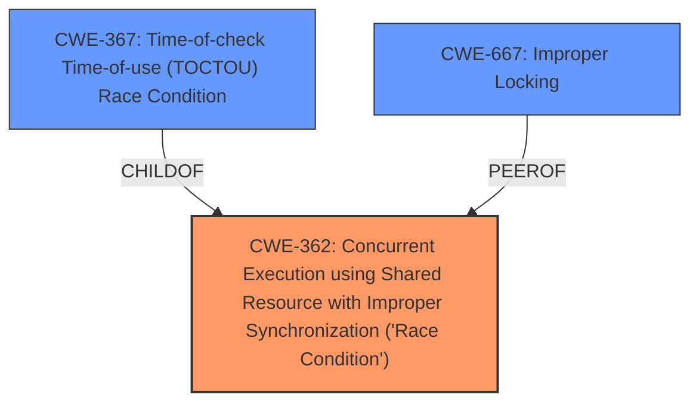

# Enhanced Analysis for CVE-2020-9990

# Summary
| CWE ID  | CWE Name                                                                                                 | Confidence | CWE Abstraction Level | CWE Vulnerability Mapping Label | CWE-Vulnerability Mapping Notes |
| ------- | -------------------------------------------------------------------------------------------------------- | ---------- | --------------------- | ------------------------------- | ------------------------------- |
| CWE-362 | Concurrent Execution using Shared Resource with Improper Synchronization ('Race Condition') | 1          | Class                 | Primary                         | Allowed-with-Review           |

## Evidence and Confidence

*   **Confidence Score:** 1
*   **Evidence Strength:** HIGH

## Relationship Analysis
The primary CWE is CWE-362 which is a Class level CWE. While it has a child CWE of CWE-367 Time-of-check Time-of-use (TOCTOU) Race Condition, the description does not give enough information to determine if the race condition is a TOCTOU vulnerability. The vulnerability description indicates that a general **race condition** was addressed with additional validation.



## Vulnerability Chain
The vulnerability chain is:

1.  **Root Cause:** CWE-362 Concurrent Execution using Shared Resource with Improper Synchronization ('Race Condition')
2.  **Impact:** A malicious application may be able to execute arbitrary code with kernel privileges.

## Summary of Analysis
The initial analysis identified a **race condition** as the root cause of the vulnerability, as stated in both the "Vulnerability Description Key Phrases" and "CVE Reference Links Content Summary".

The "Retriever Results" list CWE-362 as the top combined result, with a score of 1.000. The description of CWE-362, "The product contains a concurrent code sequence that requires temporary, exclusive access to a shared resource, but a timing window exists in which the shared resource can be modified by another code sequence operating concurrently," aligns with the provided vulnerability description.

The relationship analysis shows that CWE-362 is a Class-level CWE with child CWEs, such as CWE-367 (Time-of-check Time-of-use Race Condition). However, without further information, it is difficult to determine if this is a TOCTOU vulnerability.

The mapping guidance for CWE-362 is "Allowed-with-Review" since it's a Class and might have Base-level children that would be more appropriate, but based on the current evidence, CWE-362 is the most accurate and specific CWE.

The other CWEs considered but not used:

*   CWE-667: Improper Locking - While locking issues can lead to race conditions, the description doesn't explicitly mention improper locking, so it's not the primary cause.
*   CWE-415: Double Free - This is memory corruption and not directly related to the **race condition** described.
*   CWE-787: Out-of-bounds Write - Also memory corruption, not a direct result of the **race condition**.
*   CWE-665: Improper Initialization - No information to suggest this.
*   CWE-363: Race Condition Enabling Link Following - The description does not indicate symlink use.
*   CWE-609: Double-Checked Locking - There is no mention of double-checked locking in the description.
*   CWE-367: Time-of-check Time-of-use (TOCTOU) Race Condition - This is a more specific type of **race condition**, but the given description doesn't have enough information to confirm it.
*   CWE-277: Insecure Inherited Permissions - Not applicable.
*   CWE-20: Improper Input Validation - While input validation might be a mitigation, the root cause is the **race condition**.

The assessment is based on the provided evidence, specifically the phrases "**race condition**" and "execute arbitrary code with kernel privileges". The relationships and mapping guidance further support the selection of CWE-362 as the most appropriate CWE at the Class level of specificity.


## CWE Relationship Analysis

Current CWEs represent these abstraction levels: .


### Vulnerability Chain Analysis

**Chain starting from CWE-667:**
- 667 (Improper Locking) - ROOT


**Chain starting from CWE-415:**
- 415 (Double Free) - ROOT


### CWE Relationship Diagram

```mermaid
graph TD
    classDef primary fill:#f96,stroke:#333,stroke-width:2px
    classDef secondary fill:#69f,stroke:#333
    classDef tertiary fill:#9e9,stroke:#333
```