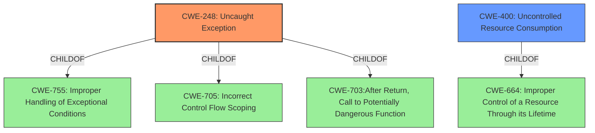

# Analysis Report for CVE-2021-0007

# Vulnerability Analysis Report: CVE-2021-0007

## Description


## Analysis (with Relationship Data)

# Summary
| CWE ID | CWE Name | Confidence | CWE Abstraction Level | CWE Vulnerability Mapping Label | CWE-Vulnerability Mapping Notes |
|---|---|---|---|---|---|
| CWE-248 | Uncaught Exception | 1.0 | Base | Allowed | Primary CWE |
| CWE-400 | Uncontrolled Resource Consumption | 0.6 | Class | Discouraged | Secondary CWE |

## Evidence and Confidence

*   **Confidence Score:** 0.8
*   **Evidence Strength:** HIGH

## Relationship Analysis
The primary CWE is CWE-248 (Uncaught Exception), which is a Base level CWE. It is related to CWE-755, CWE-705, and CWE-703 through ChildOf relationships. The secondary CWE is CWE-400 (Uncontrolled Resource Consumption), which is a Class level CWE and a ChildOf CWE-664. These relationships help to understand the context of the vulnerability, showing that an uncaught exception can lead to resource consumption issues.



## Vulnerability Chain
The vulnerability chain starts with an **uncaught exception** (CWE-248) in the firmware, which can then lead to a denial of service (DoS). While the **uncaught exception** is the root cause, the DoS can be linked to **uncontrolled resource consumption** (CWE-400) as a consequence.

## Summary of Analysis
The initial analysis identified the **uncaught exception** as the primary issue, which is supported by the vulnerability description key phrases and the CVE reference links content summary. The retriever results also listed CWE-248 as the top combined result.

The evidence "Root Cause: An uncaught exception in the firmware" from the CVE Reference Links Content Summary section strongly supports the selection of CWE-248.

CWE-248 (Uncaught Exception) is chosen as the primary CWE because the vulnerability description clearly states an "**uncaught exception**" as the root cause. This aligns directly with the definition of CWE-248. The impact is a denial of service, but the root cause is the **uncaught exception**.

CWE-400 (Uncontrolled Resource Consumption) is considered as a secondary CWE because the **uncaught exception** can lead to resource exhaustion and a denial of service. However, CWE-400 is a more general class of weakness, and the specific root cause is the **uncaught exception**.

The mapping guidance for CWE-248 recommends its use as the base level of abstraction, making it a suitable choice. The mapping guidance for CWE-400 discourages its use because it is often misused and a more specific CWE should be used.

Relevant CWE Information:

# Enhanced Context (25 CWEs)

## CWE-248: Uncaught Exception
**Abstraction:** Base
**Status:** Draft

### Description
An exception is thrown from a function, but it is not caught.

### Extended Description
When an exception is not caught, it may cause the program to crash or expose sensitive information.

### Alternative Terms
None

### Relationships
ChildOf -> CWE-705
ChildOf -> CWE-755
ChildOf -> CWE-703
ChildOf -> CWE-703

### Mapping Guidance
**Usage:** Allowed
**Rationale:** This CWE entry is at the Base level of abstraction, which is a preferred level of abstraction for mapping to the root causes of vulnerabilities.
**Comments:** Carefully read both the name and description to ensure that this mapping is an appropriate fit. Do not try to 'force' a mapping to a lower-level Base/Variant simply to comply with this preferred level of abstraction.
**Reasons:**
- Acceptable-Use

## CWE-400: Uncontrolled Resource Consumption
**Abstraction:** Class
**Status:** Draft

### Description
The product does not properly control the allocation and maintenance of a limited resource, thereby enabling an actor to influence the amount of resources consumed, eventually leading to the exhaustion of available resources.

### Extended Description


Limited resources include memory, file system storage, database connection pool entries, and CPU. If an attacker can trigger the allocation of these limited resources, but the number or size of the resources is not controlled, then the attacker could cause a denial of service that consumes all available resources. This would prevent valid users from accessing the product, and it could potentially have an impact on the surrounding environment. For example, a memory exhaustion attack against an application could slow down the application as well as its host operating system.

### Alternative Terms
Resource Exhaustion

### Relationships
ChildOf -> CWE-664

### Mapping Guidance
**Usage:** Discouraged
**Rationale:** CWE-400 is intended for incorrect behaviors in which the product is expected to track and restrict how many resources it consumes, but CWE-400 is often misused because it is conflated with the "technical impact" of vulnerabilities in which resource consumption occurs. It is sometimes used for low-information vulnerability reports. It is a level-1 Class (i.e., a child of a Pillar).
**Comments:** Closely analyze the specific mistake that is causing resource consumption, and perform a CWE mapping for that mistake. Consider children/descendants such as CWE-770: Allocation of Resources Without Limits or Throttling, CWE-771: Missing Reference to Active Allocated Resource, CWE-410: Insufficient Resource Pool, CWE-772: Missing Release of Resource after Effective Lifetime, CWE-834: Excessive Iteration, CWE-405: Asymmetric Resource Consumption (Amplification), and others.
**Reasons:**
- Frequent Misuse


## CWE Relationship Analysis

Current CWEs represent these abstraction levels: .


### Vulnerability Chain Analysis

**Chain starting from CWE-248:**
- 248 (Uncaught Exception) - ROOT


**Chain starting from CWE-664:**
- 664 (Improper Control of a Resource Through its Lifetime) - ROOT


### CWE Relationship Diagram

```mermaid
graph TD
    classDef primary fill:#f96,stroke:#333,stroke-width:2px
    classDef secondary fill:#69f,stroke:#333
    classDef tertiary fill:#9e9,stroke:#333
```


*Report generated on 2025-04-02 01:34:46*
