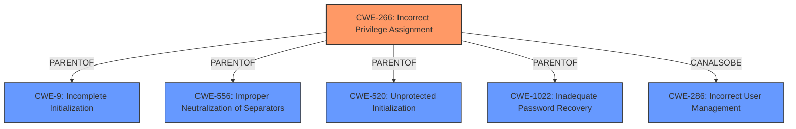

# Analysis Report for CVE-2021-0052

# Vulnerability Analysis Report: CVE-2021-0052

## Description


## Analysis (with Relationship Data)

# Summary
| CWE ID | CWE Name | Confidence | CWE Abstraction Level | CWE Vulnerability Mapping Label | CWE-Vulnerability Mapping Notes |
|---|---|---|---|---|---|
| CWE-266 | Incorrect Privilege Assignment | 0.9 | Base | Allowed | Primary CWE |
| CWE-280 | Improper Handling of Insufficient Permissions or Privileges | 0.6 | Base | Allowed | Secondary Candidate |
| CWE-269 | Improper Privilege Management | 0.5 | Class | Discouraged | Secondary Candidate |

## Evidence and Confidence

*   **Confidence Score:** 0.9
*   **Evidence Strength:** HIGH

## Relationship Analysis
The primary CWE selected is CWE-266, Incorrect Privilege Assignment, which is a base-level CWE. This choice is supported by the vulnerability description that states "**Incorrect default privileges**". CWE-266 has relationships to CWE-9, CWE-556, CWE-520, and CWE-1022 as a PARENT, and CANALSOBE to CWE-286. This indicates that assigning incorrect privileges can lead to various issues, including insecure defaults, which aligns with the provided context.

CWE-280 is considered as a secondary candidate since the **incorrect default privileges** could lead to insufficient permissions later.

CWE-269 is considered as a secondary candidate since the root cause is directly related to privileges, but it's a class-level CWE and the description leans towards the assignment of privileges.



## Vulnerability Chain
The vulnerability chain starts with **incorrect default privileges** (CWE-266), which then leads to a potential escalation of privilege.

## Summary of Analysis
The initial assessment and final conclusion are heavily based on the provided evidence, specifically the **Vulnerability Description Key Phrases**, which pinpoint "**Incorrect default privileges**" as the root cause. The "CVE Reference Links Content Summary" reinforces this by stating: "**Root Cause of Vulnerability:** - Incorrect default privileges".

The graph relationships influenced the selection by providing context on what issues can arise from **incorrect privilege assignments**.

CWE-266 is chosen as the primary CWE because it directly reflects the root cause "**Incorrect default privileges**" as indicated in the vulnerability description. The base level of abstraction is appropriate as it directly addresses the specific weakness.

Other CWEs considered but not used:

*   CWE-691: Insufficient Control Flow Management - This is a Pillar level CWE and does not directly relate to the root cause of **incorrect privileges**.
*   CWE-277: Insecure Inherited Permissions - While related to privileges, the vulnerability description focuses on **default privileges** rather than inherited permissions.
*   CWE-284: Improper Access Control - This is a very high-level Pillar CWE and less specific than CWE-266.
*   CWE-453: Insecure Default Variable Initialization - This is related to **default** values, but focuses on variable initialization. The identified root cause is about **privileges**, not variables.
*   CWE-693: Protection Mechanism Failure - This is a Pillar level CWE and the description does not indicate a failure of a protection mechanism, but rather a problem with **privilege assignment**.
*   CWE-269: Improper Privilege Management - This is a class level CWE and could be applicable, but CWE-266 is more specific to the **incorrect assignment** of privileges.
*   CWE-280: Improper Handling of Insufficient Permissions or Privileges - This could be a consequence of the root cause, however, the focus is on the **incorrect assignment**.
*   CWE-287: Improper Authentication - The description explicitly mentions an authenticated user, so authentication isn't the issue.
*   CWE-248: Uncaught Exception - There is no evidence of uncaught exceptions.
*   CWE-119: Improper Restriction of Operations within the Bounds of a Memory Buffer - There is no evidence of memory buffer issues.


## CWE Relationship Analysis

Current CWEs represent these abstraction levels: .


### Vulnerability Chain Analysis

**Chain starting from CWE-691:**
- 691 (Insufficient Control Flow Management) - ROOT


**Chain starting from CWE-693:**
- 693 (Protection Mechanism Failure) - ROOT


### CWE Relationship Diagram

```mermaid
graph TD
    classDef primary fill:#f96,stroke:#333,stroke-width:2px
    classDef secondary fill:#69f,stroke:#333
    classDef tertiary fill:#9e9,stroke:#333
```


*Report generated on 2025-04-01 21:16:18*
