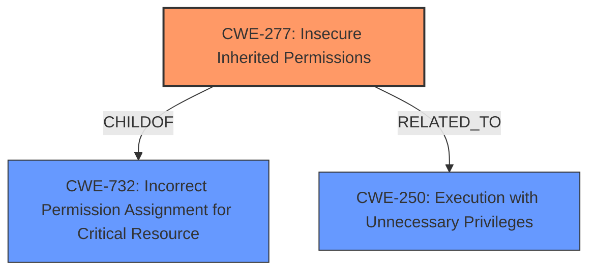

# Enhanced Analysis for CVE-2021-0055

# Summary
| CWE ID | CWE Name | Confidence | CWE Abstraction Level | CWE Vulnerability Mapping Label | CWE-Vulnerability Mapping Notes |
|---|---|---|---|---|---|
| CWE-277 | Insecure Inherited Permissions | 1.0 | Variant | Allowed | Primary CWE |
| CWE-732 | Incorrect Permission Assignment for Critical Resource | 0.7 | Class | Allowed-with-Review | Secondary Candidate |
| CWE-250 | Execution with Unnecessary Privileges | 0.6 | Base | Allowed | Secondary Candidate |

## Evidence and Confidence

*   **Confidence Score:** 0.9
*   **Evidence Strength:** HIGH

## Relationship Analysis
The primary CWE, CWE-277 **(Insecure Inherited Permissions)**, is a variant of CWE-732 **(Incorrect Permission Assignment for Critical Resource)**. This hierarchical relationship indicates that CWE-277 is a more specific case of CWE-732, which aligns with the vulnerability description focusing on inherited permissions. CWE-277 is also related to CWE-250 **(Execution with Unnecessary Privileges)**, as incorrect permissions can lead to a program running with more privileges than it needs. The relationships influenced the selection by providing a structure that allows for a specific root cause to be identified (CWE-277) while acknowledging related broader issues (CWE-732, CWE-250).



## Vulnerability Chain
The vulnerability chain starts with the **insecure inherited permissions** (CWE-277) in the LAN drivers. This leads to a situation where an authenticated user can exploit these permissions to escalate their privileges. The chain can be summarized as:

1.  **Insecure Inherited Permissions** (CWE-277): Root cause – the drivers are set up with insecure permissions.
2.  **Privilege Escalation**: Impact – an authenticated user can gain higher privileges than intended.

## Summary of Analysis
The initial analysis strongly pointed to CWE-277 **(Insecure Inherited Permissions)**, based on the vulnerability description key phrases and the CVE reference links content summary. The **root cause** is explicitly stated as "**Insecure inherited permissions**" for Intel(R) NUC 9 Extreme Laptop Kit LAN Drivers.

The retriever results also listed CWE-277 as the top candidate. The vulnerability description mentions "**Insecure inherited permissions**" directly, making CWE-277 the most appropriate and specific choice. While other CWEs such as CWE-732 **(Incorrect Permission Assignment for Critical Resource)** and CWE-250 **(Execution with Unnecessary Privileges)** were considered, CWE-277 offers the most precise match to the described vulnerability.

The selection of CWE-277 is based on direct evidence from the vulnerability description and the retriever results. The relationship analysis further solidified this choice by placing it within a hierarchy that includes broader permission-related CWEs. This ensures that the mapping is both accurate and specific, reflecting the true nature of the vulnerability.
The selected CWEs are at the optimal level of specificity because CWE-277 directly addresses the **root cause** of the vulnerability, while the others were considered as contributing factors or potential impacts.

Relevant CWE Information:

# Enhanced Context (25 CWEs)

## CWE-667: Improper Locking
**Abstraction Level**: Class
**Similarity Score**: 0.77
**Source**: dense

**Description**:
The product does not properly acquire or release a lock on a resource, leading to unexpected resource state changes and behaviors.

**Mapping Guidance**:
- Usage: Allowed-with-Review
- Rationale: This CWE entry is a Class and might have Base-level children that would be more appropriate

*Not Selected*: This CWE is not relevant because the vulnerability does not involve locking mechanisms.

## CWE-653: Improper Isolation or Compartmentalization
**Abstraction Level**: Class
**Similarity Score**: 0.76
**Source**: dense

**Description**:
The product does not properly compartmentalize or isolate functionality, processes, or resources that require different privilege levels, rights, or permissions.

**Mapping Guidance**:
- Usage: Allowed
- Rationale: This CWE entry is at the Base level of abstraction, which is a preferred level of abstraction for mapping to the root causes of vulnerabilities.

*Not Selected*: While privilege escalation is involved, the **root cause** is the inherited permissions, not isolation.

## CWE-131: Incorrect Calculation of Buffer Size
**Abstraction Level**: Base
**Similarity Score**: 0.76
**Source**: dense

**Description**:
The product does not correctly calculate the size to be used when allocating a buffer, which could lead to a buffer overflow.

**Mapping Guidance**:
- Usage: Allowed
- Rationale: This CWE entry is at the Base level of abstraction, which is a preferred level of abstraction for mapping to the root causes of vulnerabilities.

*Not Selected*: This CWE relates to buffer overflows, which are not mentioned in the vulnerability description.

## CWE-119: Improper Restriction of Operations within the Bounds of a Memory Buffer
**Abstraction Level**: Class
**Similarity Score**: 0.76
**Source**: dense

**Description**:
The product performs operations on a memory buffer, but it reads from or writes to a memory location outside the buffer's intended boundary. This may result in read or write operations on unexpected memory locations that could be linked to other variables, data structures, or internal program data.

**Mapping Guidance**:
- Usage: Discouraged
- Rationale: CWE-119 is commonly misused in low-information vulnerability reports when lower-level CWEs could be used instead, or when more details about the vulnerability are available.

*Not Selected*: This CWE relates to buffer overflows, which are not mentioned in the vulnerability description.

## CWE-404: Improper Resource Shutdown or Release
**Abstraction Level**: Class
**Similarity Score**: 0.76
**Source**: dense

**Description**:
The product does not release or incorrectly releases a resource before it is made available for re-use.

**Mapping Guidance**:
- Usage: Allowed-with-Review
- Rationale: This CWE entry is a Class and might have Base-level children that would be more appropriate

*Not Selected*: This CWE relates to resource management, which is not part of the vulnerability description.

## CWE-191: Integer Underflow (Wrap or Wraparound)
**Abstraction Level**: Base
**Similarity Score**: 0.75
**Source**: dense

**Description**:
The product subtracts one value from another, such that the result is less than the minimum allowable integer value, which produces a value that is not equal to the correct result.

**Mapping Guidance**:
- Usage: Allowed
- Rationale: This CWE entry is at the Base level of abstraction, which is a preferred level of abstraction for mapping to the root causes of vulnerabilities.

*Not Selected*: This CWE relates to integer manipulation, which is not part of the vulnerability description.

## CWE-691: Insufficient Control Flow Management
**Abstraction Level**: Pillar
**Similarity Score**: 0.75
**Source**: dense

**Description**:
The code does not sufficiently manage its control flow during execution, creating conditions in which the control flow can be modified in unexpected ways.

**Mapping Guidance**:
- Usage: Discouraged
- Rationale: This CWE entry is extremely high-level, a Pillar. However, classification research is limited for weaknesses of this type, so there can be gaps or organizational difficulties within CWE that force use of this weakness, even at such a high level of abstraction.

*Not Selected*: The vulnerability is directly related to **insecure inherited permissions**, not control flow management.

## CWE-754: Improper Check for Unusual or Exceptional Conditions
**Abstraction Level**: Class
**Similarity Score**: 0.75
**Source**: dense

**Description**:
The product does not check or incorrectly checks for unusual or exceptional conditions that are not expected to occur frequently during day to day operation of the product.

**Mapping Guidance**:
- Usage: Allowed-with-Review
- Rationale: This CWE entry is a Class and might have Base-level children that would be more appropriate

*Not Selected*: This CWE is not relevant as the vulnerability is related to permission assignments rather than checking for exceptional conditions.

## CWE-703: Improper Check or Handling of Exceptional Conditions
**Abstraction Level**: Pillar
**Similarity Score**: 0.75
**Source**: dense

**Description**:
The product does not properly anticipate or handle exceptional conditions that rarely occur during normal operation of the product.

**Mapping Guidance**:


## CWE Relationship Analysis

Current CWEs represent these abstraction levels: .


### Vulnerability Chain Analysis

**Chain starting from CWE-732:**
- 732 (Incorrect Permission Assignment for Critical Resource) - ROOT


**Chain starting from CWE-667:**
- 667 (Improper Locking) - ROOT


### CWE Relationship Diagram

```mermaid
graph TD
    classDef primary fill:#f96,stroke:#333,stroke-width:2px
    classDef secondary fill:#69f,stroke:#333
    classDef tertiary fill:#9e9,stroke:#333
```