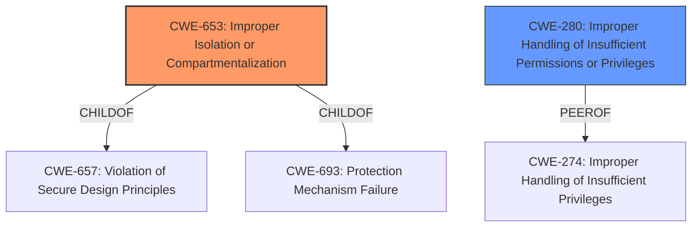

# Analysis for CVE-2021-0060

# Summary
| CWE ID | CWE Name | Confidence | CWE Abstraction Level | CWE Vulnerability Mapping Label | CWE-Vulnerability Mapping Notes |
|---|---|---|---|---|---|
| CWE-653 | Improper Isolation or Compartmentalization | 1.0 | Class | Allowed | Primary CWE |
| CWE-280 | Improper Handling of Insufficient Permissions or Privileges  | 0.5 | Base | Allowed | Secondary Candidate |

## Evidence and Confidence

*   **Confidence Score:** 0.8
*   **Evidence Strength:** HIGH

## Relationship Analysis
The primary CWE, CWE-653, is a Class-level weakness that describes the improper isolation of functionalities or resources with different privilege levels. It is related to CWE-657 (Violation of Secure Design Principles) and CWE-693 (Protection Mechanism Failure) through ChildOf relationships. CWE-280, a Base-level weakness, relates to the improper handling of insufficient permissions or privileges, and has a PeerOf relationship with CWE-274 (Improper Handling of Insufficient Privileges).

## Vulnerability Chain
The vulnerability chain starts with **insufficient compartmentalization** (CWE-653), leading to a potential escalation of privilege. An authenticated user with physical access can exploit this **weakness**.
  - Root Cause: **Insufficient Compartmentalization** (CWE-653)
  - Impact: Escalation of Privilege

## Summary of Analysis
The vulnerability description clearly states "**Insufficient compartmentalization** in HECI subsystem for the Intel(R) SPS before versions SPS_E5_04.01.04.516.0, SPS_E5_04.04.04.033.0, SPS_E5_04.04.03.281.0, SPS_E5_03.01.03.116.0, SPS_E3_05.01.04.309.0, SPS_02.04.00.101.0, SPS_SoC-A_05.00.03.114.0, SPS_SoC-X_04.00.04.326.0, SPS_SoC-X_03.00.03.117.0, IGN_E5_91.00.00.167.0, SPS_PHI_03.01.03.078.0 may allow an authenticated user to potentially enable escalation of privilege via physical access." The root cause is **insufficient compartmentalization**, which directly aligns with CWE-653 (Improper Isolation or Compartmentalization). The description indicates that this **weakness** can lead to privilege escalation, which is the impact.

The retriever results also support CWE-653 as the top candidate.

CWE-280 (Improper Handling of Insufficient Permissions or Privileges) was considered because the vulnerability involves privilege escalation, which implies that permissions or privileges are not being correctly managed. However, CWE-653 is a more direct and precise match for the **root cause** described in the vulnerability.

Therefore, CWE-653 is selected as the primary CWE due to its direct relevance to the **root cause** of the vulnerability.

Relevant CWE Information:
## CWE-653: Improper Isolation or Compartmentalization
**Abstraction Level**: Class
**Similarity Score**: 0.80
**Source**: dense

**Description**:
The product does not properly compartmentalize or isolate functionality, processes, or resources that require different privilege levels, rights, or permissions.

**Mapping Guidance**:
- Usage: Allowed
- Rationale: This CWE entry is at the Base level of abstraction, which is a preferred level of abstraction for mapping to the root causes of vulnerabilities.