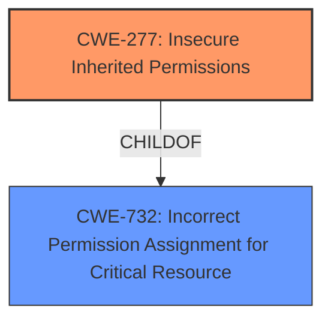

# Raw Analyzer Response for CVE-2021-0077

# Summary
| CWE ID | CWE Name | Confidence | CWE Abstraction Level | CWE Vulnerability Mapping Label | CWE-Vulnerability Mapping Notes |
|---|---|---|---|---|---|
| CWE-277 | Insecure Inherited Permissions | 0.9 | Variant | Allowed | Primary CWE |
| CWE-732 | Incorrect Permission Assignment for Critical Resource | 0.6 | Class | Allowed-with-Review | Secondary Candidate |

## Evidence and Confidence

*   **Confidence Score:** 0.9
*   **Evidence Strength:** HIGH

## Relationship Analysis
The primary CWE is CWE-277 (Insecure Inherited Permissions), which is a variant of CWE-732 (Incorrect Permission Assignment for Critical Resource). This parent-child relationship indicates that CWE-277 is a more specific case of the more general CWE-732. The choice of CWE-277 is based on the vulnerability description explicitly mentioning "insecure inherited permissions."

## Vulnerability Chain
The chain of events is as follows:
1.  **Root Cause:** **Insecure inherited permissions** are present in the installer (CWE-277).
2.  **Impact:** This allows an authenticated user to escalate privileges.

## Summary of Analysis
The initial assessment identified CWE-277 (Insecure Inherited Permissions) as the primary candidate due to the explicit mention of "**Insecure inherited permissions**" in both the vulnerability description and the CVE Reference Links Content Summary. The description states: "**Insecure inherited permissions** in the installer for the Intel(R) VTune(TM) Profiler before version 2021.1.1 may allow an authenticated user to potentially enable escalation of privilege via local access."

The retriever results also support CWE-277 as the top candidate. The next best candidate was CWE-732 (Incorrect Permission Assignment for Critical Resource), but since the root cause is specifically related to *inherited* permissions, CWE-277 is a more precise match.

The graph relationship shows that CWE-277 is a child of CWE-732. Therefore, choosing CWE-277 provides a more specific classification, aligning with the best practice of selecting the most detailed CWE when the evidence supports it. The confidence level is high (0.9) because the evidence directly corresponds to the weakness described by CWE-277. CWE-277 is at the optimal level of specificity (Variant), providing a focused representation of the vulnerability.

Relevant CWE Information:

# Enhanced Context (25 CWEs)
The following CWEs were identified as potentially relevant to this vulnerability:

## CWE-274: Improper Handling of Insufficient Privileges
**Abstraction Level**: Base
**Similarity Score**: 0.75
**Source**: dense

**Description**:
The product does not handle or incorrectly handles when it has insufficient privileges to perform an operation, leading to resultant weaknesses.

**Mapping Guidance**:
- Usage: Discouraged
- Rationale: This CWE entry could be deprecated in a future version of CWE.

*Not selected* because the root cause is not related to handling insufficient privileges but rather incorrect permission inheritance.

## CWE-281: Improper Preservation of Permissions
**Abstraction Level**: Base
**Similarity Score**: 0.75
**Source**: dense

**Description**:
The product does not preserve permissions or incorrectly preserves permissions when copying, restoring, or sharing objects, which can cause them to have less restrictive permissions than intended.

**Mapping Guidance**:
- Usage: Allowed
- Rationale: This CWE entry is at the Base level of abstraction, which is a preferred level of abstraction for mapping to the root causes of vulnerabilities.

*Not selected* because the vulnerability description highlights insecure *inherited* permissions, not the preservation of permissions.

## CWE-276: Incorrect Default Permissions
**Abstraction Level**: Base
**Similarity Score**: 0.75
**Source**: dense

**Description**:
During installation, installed file permissions are set to allow anyone to modify those files.

**Mapping Guidance**:
- Usage: Allowed
- Rationale: This CWE entry is at the Base level of abstraction, which is a preferred level of abstraction for mapping to the root causes of vulnerabilities.

*Not selected* as it focuses on incorrect *default* permissions set during installation, while the current vulnerability is about insecure *inherited* permissions.

## CWE-280: Improper Handling of Insufficient Permissions or Privileges 
**Abstraction Level**: Base
**Similarity Score**: 0.75
**Source**: dense

**Description**:
The product does not handle or incorrectly handles when it has insufficient privileges to access resources or functionality as specified by their permissions. This may cause it to follow unexpected code paths that may leave the product in an invalid state.

**Mapping Guidance**:
- Usage: Allowed
- Rationale: This CWE entry is at the Base level of abstraction, which is a preferred level of abstraction for mapping to the root causes of vulnerabilities.

*Not selected* because the issue is not about handling insufficient privileges but about the assignment and inheritance of insecure permissions.

## CWE-664: Improper Control of a Resource Through its Lifetime
**Abstraction Level**: Pillar
**Similarity Score**: 0.75
**Source**: dense

**Description**:
The product does not maintain or incorrectly maintains control over a resource throughout its lifetime of creation, use, and release.

**Mapping Guidance**:
- Usage: Discouraged
- Rationale: This CWE entry is high-level when lower-level children are available.

*Not selected* because it's a very general, high-level CWE. A more specific CWE like CWE-277 (Insecure Inherited Permissions) is more appropriate.

## CWE-653: Improper Isolation or Compartmentalization
**Abstraction Level**: Class
**Similarity Score**: 0.75
**Source**: dense

**Description**:
The product does not properly compartmentalize or isolate functionality, processes, or resources that require different privilege levels, rights, or permissions.

**Mapping Guidance**:
- Usage: Allowed
- Rationale: This CWE entry is at the Base level of abstraction, which is a preferred level of abstraction for mapping to the root causes of vulnerabilities.

*Not selected* because the root cause is not a lack of isolation or compartmentalization but insecure inherited permissions.

## CWE-668: Exposure of Resource to Wrong Sphere
**Abstraction Level**: Class
**Similarity Score**: 0.74
**Source**: dense

**Description**:
The product exposes a resource to the wrong control sphere, providing unintended actors with inappropriate access to the resource.

**Mapping Guidance**:
- Usage: Discouraged
- Rationale: CWE-668 is high-level and is often misused as a catch-all when lower-level CWE IDs might be applicable. It is sometimes used for low-information vulnerability reports [REF-1287]. It is a level-1 Class (i.e., a child of a Pillar). It is not useful for trend analysis.

*Not selected* because CWE-277 (Insecure Inherited Permissions) provides a more specific description of the vulnerability.

## CWE-667: Improper Locking
**Abstraction Level**: Class
**Similarity Score**: 0.74
**Source**: dense

**Description**:
The product does not properly acquire or release a lock on a resource, leading to unexpected resource state changes and behaviors.

**Mapping Guidance**:
- Usage: Allowed-with-Review
- Rationale: This CWE entry is a Class and might have Base-level children that would be more appropriate

*Not selected* because the vulnerability is not related to locking mechanisms.

## CWE-1220: Insufficient Granularity of Access Control
**Abstraction Level**: Base
**Similarity Score**: 0.74
**Source**: dense

**Description**:
The product implements access controls via a policy or other feature with the intention to disable or restrict accesses (reads and/or writes) to assets in a system from untrusted agents. However, implemented access controls lack required granularity, which renders the control policy too broad because it allows accesses from unauthorized agents to the security-sensitive assets.

**Mapping Guidance**:
- Usage: Allowed
- Rationale: This CWE entry is at the Base level of abstraction, which is a preferred level of abstraction for mapping to the root causes of vulnerabilities.

*Not selected* because the vulnerability is specifically about insecure inherited permissions, not a general lack of granularity in access control.

## CWE-552: Files or Directories Accessible to External Parties
**Abstraction Level**: Base
**Similarity Score**: 0.74
**Source**: dense

**Description**:
The product makes files or directories accessible to unauthorized actors, even though they should not be.

**Mapping Guidance**:
- Usage: Allowed
- Rationale: This CWE entry is at the Base level of abstraction, which is a preferred level of abstraction for mapping to the root causes of vulnerabilities.

*Not