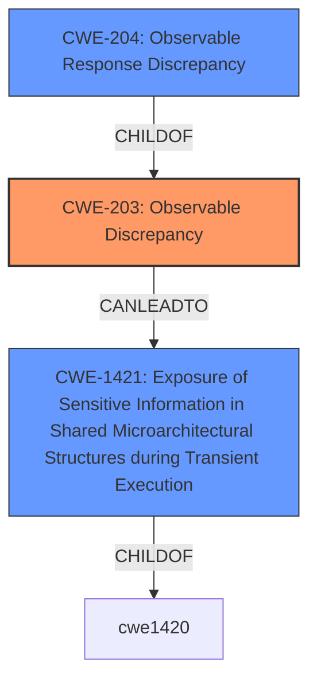

# Enhanced Analysis for CVE-2021-0089

# Summary
| CWE ID  | CWE Name                                                                                                           | Confidence | CWE Abstraction Level | CWE Vulnerability Mapping Label | CWE-Vulnerability Mapping Notes |
| :-------- | :----------------------------------------------------------------------------------------------------------------- | :---------- | :----------------------- | :------------------------------- | :-------------------------------- |
| CWE-203 | Observable Discrepancy                                                                                             | 0.95       | Base                    | Primary                        | Allowed                           |
| CWE-1421 | Exposure of Sensitive Information in Shared Microarchitectural Structures during Transient Execution           | 0.70       | Base                    | Secondary                        | Allowed                           |
| CWE-204 | Observable Response Discrepancy                                                                                     | 0.60       | Base                    | Secondary                        | Allowed                           |

## Evidence and Confidence

*   **Confidence Score:** 0.85
*   **Evidence Strength:** HIGH

## Relationship Analysis
The primary CWE is CWE-203, "Observable Discrepancy," which is a base-level CWE. CWE-204, "Observable Response Discrepancy," is a child of CWE-203, making it a more specific variant. CWE-1421, "Exposure of Sensitive Information in Shared Microarchitectural Structures during Transient Execution" describes a potential mechanism by which the observable discrepancy can lead to information exposure.



## Vulnerability Chain
The vulnerability chain starts with a **response discrepancy**, which allows an attacker to observe differences in behavior. This **observable discrepancy** can then be exploited through transient execution in shared microarchitectural structures, leading to the **exposure of sensitive information**.

## Summary of Analysis
The initial analysis focused on identifying the root cause and impact of the vulnerability. The primary indicator was the **"response discrepancy"** which directly aligns with CWE-203.

The CVE Reference Links Content Summary provided strong evidence, detailing the speculative execution of stale instructions and potential data leaks. This supports the selection of CWE-203. The content summary also mentioned microarchitectural behavior related to speculative code store bypass (SCSB) which may lead to type confusion.

The Retriever Results also suggested CWE-203, CWE-204, and CWE-1421 as potential matches.

The final decision was to select CWE-203 as the primary CWE due to the **observable discrepancy**, and CWE-1421 as a secondary CWE due to the transient execution aspect. CWE-204 was also included as a secondary CWE because it's a more specific case of CWE-203 focusing on **response discrepancy**.

The selection of CWE-203 is based on the direct evidence of a **response discrepancy** and the supporting evidence from the content summary and retriever results. CWE-203 is at the optimal level of specificity as it captures the core weakness without being overly specific about the exact mechanism of exploitation.

Relevant CWE Information:

# Enhanced Context (25 CWEs)
The following CWEs were identified as potentially relevant to this vulnerability:

## CWE-691: Insufficient Control Flow Management
**Abstraction Level**: Pillar
**Similarity Score**: 0.78
**Source**: dense

**Description**:
The code does not sufficiently manage its control flow during execution, creating conditions in which the control flow can be modified in unexpected ways.

**Mapping Guidance**:
- Usage: Discouraged
- Rationale: This CWE entry is extremely high-level, a Pillar. However, classification research is limited for weaknesses of this type, so there can be gaps or organizational difficulties within CWE that force use of this weakness, even at such a high level of abstraction.

## CWE-693: Protection Mechanism Failure
**Abstraction Level**: Pillar
**Similarity Score**: 0.77
**Source**: dense

**Description**:
The product does not use or incorrectly uses a protection mechanism that provides sufficient defense against directed attacks against the product.

**Mapping Guidance**:
- Usage: Discouraged
- Rationale: This CWE entry is extremely high-level, a Pillar.

## CWE-703: Improper Check or Handling of Exceptional Conditions
**Abstraction Level**: Pillar
**Similarity Score**: 0.76
**Source**: dense

**Description**:
The product does not properly anticipate or handle exceptional conditions that rarely occur during normal operation of the product.

**Mapping Guidance**:
- Usage: Discouraged
- Rationale: This CWE entry is extremely high-level, a Pillar.

## CWE-664: Improper Control of a Resource Through its Lifetime
**Abstraction Level**: Pillar
**Similarity Score**: 0.75
**Source**: dense

**Description**:
The product does not maintain or incorrectly maintains control over a resource throughout its lifetime of creation, use, and release.

**Mapping Guidance**:
- Usage: Discouraged
- Rationale: This CWE entry is high-level when lower-level children are available.

## CWE-653: Improper Isolation or Compartmentalization
**Abstraction Level**: Class
**Similarity Score**: 0.75
**Source**: dense

**Description**:
The product does not properly compartmentalize or isolate functionality, processes, or resources that require different privilege levels, rights, or permissions.

**Mapping Guidance**:
- Usage: Allowed
- Rationale: This CWE entry is at the Base level of abstraction, which is a preferred level of abstraction for mapping to the root causes of vulnerabilities.

## CWE-668: Exposure of Resource to Wrong Sphere
**Abstraction Level**: Class
**Similarity Score**: 0.75
**Source**: dense

**Description**:
The product exposes a resource to the wrong control sphere, providing unintended actors with inappropriate access to the resource.

**Mapping Guidance**:
- Usage: Discouraged
- Rationale: CWE-668 is high-level and is often misused as a catch-all when lower-level CWE IDs might be applicable. It is sometimes used for low-information vulnerability reports [REF-1287]. It is a level-1 Class (i.e., a child of a Pillar). It is not useful for trend analysis.

## CWE-1299: Missing Protection Mechanism for Alternate Hardware Interface
**Abstraction Level**: Base
**Similarity Score**: 0.75
**Source**: dense

**Description**:
The lack of protections on alternate paths to access
                control-protected assets (such as unprotected shadow registers
                and other external facing unguarded interfaces) allows an
                attacker to bypass existing protections to the asset that are
		only performed against the primary path.

**Mapping Guidance**:
- Usage: Allowed
- Rationale: This CWE entry is at the Base level of abstraction, which is a preferred level of abstraction for mapping to the root causes of vulnerabilities.

## CWE-667: Improper Locking
**Abstraction Level**: Class
**Similarity Score**: 0.75
**Source**: dense

**Description**:
The product does not properly acquire or release a lock on a resource, leading to unexpected resource state changes and behaviors.

**Mapping Guidance**:
- Usage: Allowed-with-Review
- Rationale: This CWE entry is a Class and might have Base-level children that would be more appropriate

## CWE-208: Observable Timing Discrepancy
**Abstraction Level**: Base
**Similarity Score**: 0.74
**Source**: dense

**Description**:
Two separate operations in a product require different amounts of time to complete, in a way that is observable to an actor and reveals security-relevant information about the state of the product, such as whether a particular operation was successful or not.

**Mapping Guidance**:
- Usage: Allowed
- Rationale: This CWE entry is at the Base level of abstraction, which is a preferred level of abstraction for mapping to the root causes of vulnerabilities.

## CWE-697: Incorrect Comparison
**Abstraction Level**: Pillar
**Similarity Score**: 0.74
**Source**: dense

**Description**:
The product compares two entities in a security-relevant context, but the comparison is incorrect, which may lead to resultant weaknesses.

**Mapping Guidance**:
- Usage: Discouraged
- Rationale: This CWE entry is extremely high-level, a Pillar. However, sometimes this weakness is forced to be used due to the lack of in-depth weakness research. See Research Gaps.

## CWE-203: Observable Discrepancy
**Abstraction Level**: Base
**Similarity Score**: 5503.23
**Source**: sparse

**Description**:
The product behaves differently or sends different responses under different circumstances in a


## CWE Relationship Analysis

Current CWEs represent these abstraction levels: .


### Vulnerability Chain Analysis

**Chain starting from CWE-691:**
- 691 (Insufficient Control Flow Management) - ROOT


**Chain starting from CWE-1421:**
- 1421 (Exposure of Sensitive Information in Shared Microarchitectural Structures during Transient Execution) - ROOT


### CWE Relationship Diagram

```mermaid
graph TD
    classDef primary fill:#f96,stroke:#333,stroke-width:2px
    classDef secondary fill:#69f,stroke:#333
    classDef tertiary fill:#9e9,stroke:#333
```