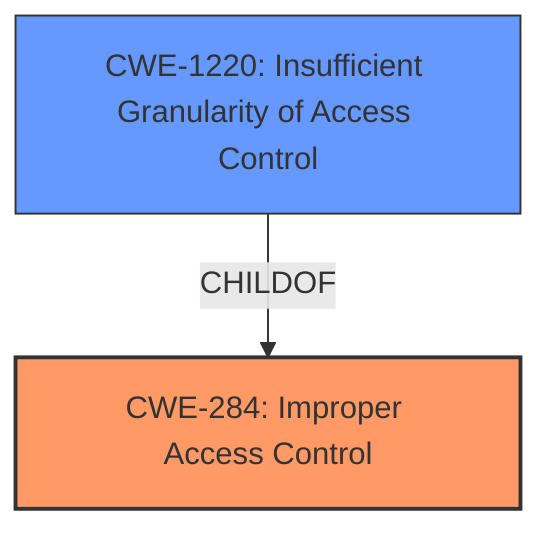

# Analysis Report for CVE-2021-0092

# Vulnerability Analysis Report: CVE-2021-0092

## Description


## Analysis (with Relationship Data)

# Summary
| CWE ID | CWE Name | Confidence | CWE Abstraction Level | CWE Vulnerability Mapping Label | CWE-Vulnerability Mapping Notes |
|---|---|---|---|---|---|
| CWE-284 | Improper Access Control | 0.7 | Pillar | Primary | Discouraged |
| CWE-1220 | Insufficient Granularity of Access Control | 0.6 | Base | Secondary | Allowed |

## Evidence and Confidence

*   **Confidence Score:** 0.7
*   **Evidence Strength:** MEDIUM

## Relationship Analysis
The primary CWE is CWE-284, which is a high-level Pillar. CWE-1220 is a child of CWE-284, providing a more specific Base-level classification related to the granularity of access control. The selection process involved initially considering the general "Improper Access Control" (CWE-284) but refining it based on the description indicating that the access control, while present, lacked sufficient granularity, leading to the inclusion of CWE-1220.



## Vulnerability Chain
The chain of events is as follows:
1.  **Root Cause:** **Improper access control** (CWE-284), specifically **insufficient granularity** (CWE-1220) in firmware.
2.  **Attacker Action:** Privileged user exploits the **improper access control**.
3.  **Impact:** Denial of service.

## Summary of Analysis
Initially, CWE-284, "Improper Access Control," was considered due to the vulnerability description explicitly mentioning **"Improper access control."** However, CWE-284 is a high-level "Pillar" and discouraged for use when more specific CWEs are available. The description and CVE summary indicate that the access control is present but **insufficiently granular**. This led to the inclusion of CWE-1220, "Insufficient Granularity of Access Control," which is a Base-level CWE and a child of CWE-284.

The vulnerability description states, "**Improper access control** in the firmware for some Intel(R) Processors may allow a privileged user to potentially enable a denial of service via local access." This directly supports the classification of access control issues. The CVE reference links content summary reinforces this by stating, "Root Cause of Vulnerability: - **Improper access control** in the firmware for some Intel processors." The CVSS vector (AV:L/AC:H/PR:H/UI:N/S:U/C:N/I:L/A:H) indicates local access, high privileges required, and a high impact on availability (denial of service).

CWE-284 is a discouraged CWE, so while it is listed as the Primary CWE, it is only because the summary mentions the specific phrase. However, CWE-1220 is the better match for the actual vulnerability because the description suggests there is access control but it's not granular enough.

Other CWEs Considered:

*   CWE-691 (Insufficient Control Flow Management): While DoS could be a result, the root cause is not control flow, but access control.
*   CWE-863 (Incorrect Authorization): Considered, but "incorrect" is less precise than "insufficient granularity."
*   CWE-287 (Improper Authentication): Authentication is not mentioned in the description.
*   CWE-787 (Out-of-bounds Write) and CWE-125 (Out-of-bounds Read): These are memory-related issues, not access control.


## CWE Relationship Analysis

Current CWEs represent these abstraction levels: .


### Vulnerability Chain Analysis

**Chain starting from CWE-691:**
- 691 (Insufficient Control Flow Management) - ROOT


**Chain starting from CWE-787:**
- 787 (Out-of-bounds Write) - ROOT


### CWE Relationship Diagram

```mermaid
graph TD
    classDef primary fill:#f96,stroke:#333,stroke-width:2px
    classDef secondary fill:#69f,stroke:#333
    classDef tertiary fill:#9e9,stroke:#333
```


*Report generated on 2025-04-01 19:15:44*
