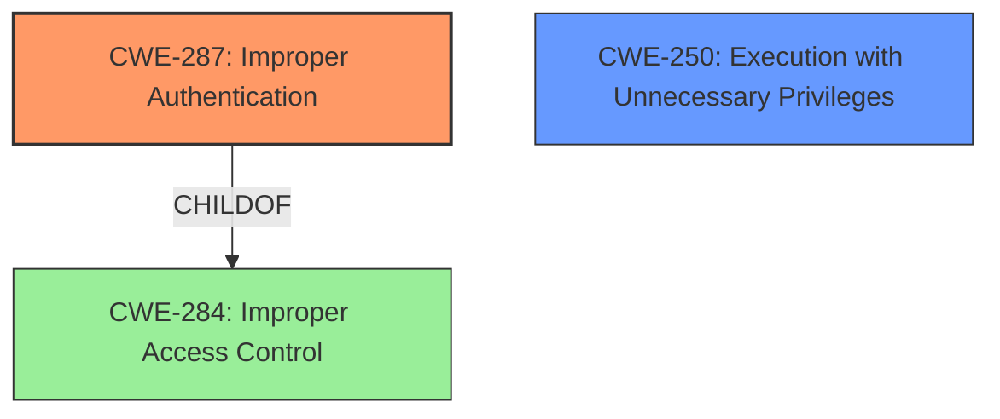

# Analysis Report for CVE-2021-0096

# Vulnerability Analysis Report: CVE-2021-0096

## Description


## Analysis (with Relationship Data)

# Summary
| CWE ID | CWE Name | Confidence | CWE Abstraction Level | CWE Vulnerability Mapping Label | CWE-Vulnerability Mapping Notes |
|---|---|---|---|---|---|
| CWE-287 | Improper Authentication | 1.0 | Class | Primary | Discouraged |
| CWE-250 | Execution with Unnecessary Privileges | 0.7 | Base | Secondary | Allowed |

## Evidence and Confidence

*   **Confidence Score:** 0.9
*   **Evidence Strength:** HIGH

## Relationship Analysis
The primary CWE selected is CWE-287 (Improper Authentication), which is a Class-level CWE. Although discouraged, it directly aligns with the **root cause** stated in the vulnerability description. The secondary CWE is CWE-250 (Execution with Unnecessary Privileges), a Base-level CWE, which describes a condition that can amplify the impact of the **improper authentication**.



## Vulnerability Chain
The vulnerability chain starts with **improper authentication** (CWE-287) in the software installer, which then leads to potential escalation of privileges for an authenticated user. The software might be executing with unnecessary privileges (CWE-250) which amplifies the **impact** of the **improper authentication** weakness.

## Summary of Analysis
The initial analysis focused on the **root cause**, which is **improper authentication** in the software installer. The vulnerability description explicitly states this, " **Improper authentication** in the software installer...may allow an authenticated user to potentially enable escalation of privilege via local access." The CVE Reference Links Content Summary confirms the root cause: "**Root Cause:** **Improper authentication** in the software installer."

CWE-287 (Improper Authentication) was selected as the primary CWE because it aligns directly with the **root cause** of the vulnerability. Although the mapping guidance discourages the use of CWE-287, the description notes: "Consider children or descendants, beginning with CWE-1390: Weak Authentication or CWE-306: Missing Authentication for Critical Function." However, based on the provided information, there isn't sufficient evidence to determine if the authentication is weak or missing entirely. Therefore, the more general CWE-287 is a more appropriate fit.

CWE-250 (Execution with Unnecessary Privileges) was considered as a secondary CWE. If the software installer is running with elevated privileges, the impact of the **improper authentication** is amplified.

Relevant CWE Information:

# Enhanced Context (25 CWEs)

## CWE-277: Insecure Inherited Permissions
**Abstraction Level**: Variant
**Similarity Score**: 0.270
**Source**: sparse

**Description**:
A product defines a set of insecure permissions that are inherited by objects that are created by the program.
**Not Selected**: This CWE does not fit the vulnerability description because it discusses insecure permissions being inherited. The vulnerability is about **improper authentication**.

## CWE-287: Improper Authentication
**Abstraction Level**: Class
**Similarity Score**: 4833.52
**Source**: sparse

**Description**:
When an actor claims to have a given identity, the product does not prove or insufficiently proves that the claim is correct.

**Mapping Guidance**:
- Usage: Discouraged
- Rationale: This CWE entry might be misused when lower-level CWE entries are likely to be applicable. It is a level-1 Class (i.e., a child of a Pillar).
**Selected**: This CWE directly matches the **root cause** of the vulnerability, which is **improper authentication** in the software installer.

## CWE-284: Improper Access Control
**Abstraction Level**: Pillar
**Similarity Score**: 0.254
**Source**: sparse

**Description**:
The product does not restrict or incorrectly restricts access to a resource from an unauthorized actor.

**Mapping Guidance**:
- Usage: Discouraged
- Rationale: CWE-284 is extremely high-level, a Pillar. Its name, "Improper Access Control," is often misused in low-information vulnerability reports.

**Not Selected**: This is a very high-level CWE. The vulnerability is about **improper authentication**, which is a specific type of access control issue.

## CWE-691: Insufficient Control Flow Management
**Abstraction Level**: Pillar
**Similarity Score**: 0.250
**Source**: sparse

**Description**:
The code does not sufficiently manage its control flow during execution, creating conditions in which the control flow can be modified in unexpected ways.

**Mapping Guidance**:
- Usage: Discouraged
- Rationale: This CWE entry is extremely high-level, a Pillar.

**Not Selected**: This is a very high-level CWE and doesn't directly relate to the authentication issue described.

## CWE-453: Insecure Default Variable Initialization
**Abstraction Level**: Variant
**Similarity Score**: 0.237
**Source**: sparse

**Description**:
The product, by default, initializes an internal variable with an insecure or less secure value than is possible.
**Not Selected**: This CWE doesn't fit the vulnerability description. The issue is about **improper authentication**, not insecure variable initialization.

## CWE-250: Execution with Unnecessary Privileges
**Abstraction Level**: Base
**Similarity Score**: 0.536
**Source**: dense

**Description**:
The product performs an operation at a privilege level that is higher than the minimum level required, which creates new weaknesses or amplifies the consequences of other weaknesses.

**Mapping Guidance**:
- Usage: Allowed

**Selected**: The vulnerability results in escalation of privilege for an authenticated user. The software may be executing with unnecessary privileges (CWE-250) which amplifies the impact of the **improper authentication** weakness.

## CWE-613: Insufficient Session Expiration
**Abstraction Level**: base
**Similarity Score**: 0.002
**Source**: graph

**Description**:
CWE-613: Insufficient Session Expiration
**Not Selected**: Session management is not mentioned in the vulnerability description.

## CWE-119: Improper Restriction of Operations within the Bounds of a Memory Buffer
**Abstraction Level**: Class
**Similarity Score**: 0.227
**Source**: sparse

**Description**:
The product performs operations on a memory buffer, but it reads from or writes to a memory location outside the buffer's intended boundary.
**Not Selected**: This CWE describes memory buffer issues, which are not related to the authentication problems described in the vulnerability.

## CWE-248: Uncaught Exception
**Abstraction Level**: Base
**Similarity Score**: 0.226
**Source**: sparse

**Description**:
An exception is thrown from a function, but it is not caught.
**Not Selected**: Exception handling is not mentioned in the vulnerability description.

## CWE-693: Protection Mechanism Failure
**Abstraction Level**: Pillar
**Similarity Score**: 0.223
**Source**: sparse

**Description**:
The product does not use or incorrectly uses a protection mechanism that provides sufficient defense against directed attacks against the product.

**Mapping Guidance**:
- Usage: Discouraged
- Rationale: This CWE entry is extremely high-level, a Pillar.
**Not Selected**: Similar to CWE-284, this is a high-level CWE and doesn't provide sufficient specificity for the **root cause** which is **improper authentication**.


## CWE Relationship Analysis

Current CWEs represent these abstraction levels: .


### Vulnerability Chain Analysis

**Chain starting from CWE-691:**
- 691 (Insufficient Control Flow Management) - ROOT


**Chain starting from CWE-248:**
- 248 (Uncaught Exception) - ROOT


### CWE Relationship Diagram

```mermaid
graph TD
    classDef primary fill:#f96,stroke:#333,stroke-width:2px
    classDef secondary fill:#69f,stroke:#333
    classDef tertiary fill:#9e9,stroke:#333
```


*Report generated on 2025-04-02 06:16:53*
