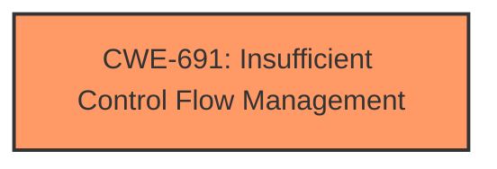

# Analysis Report for CVE-2021-0099

# Vulnerability Analysis Report: CVE-2021-0099

## Description


## Analysis (with Relationship Data)

# Summary
| CWE ID | CWE Name | Confidence | CWE Abstraction Level | CWE Vulnerability Mapping Label | CWE-Vulnerability Mapping Notes |
|---|---|---|---|---|---|
| CWE-691 | Insufficient Control Flow Management | 0.8 | Pillar | Primary | Discouraged |

## Evidence and Confidence

*   **Confidence Score:** 0.8
*   **Evidence Strength:** HIGH

## Relationship Analysis
The primary CWE selected is CWE-691, which is a high-level Pillar. The retriever results indicate other possible CWEs, particularly ones related to access control (CWE-284, CWE-1220). However, the vulnerability description focuses on **insufficient control flow management** as the root cause, making CWE-691 the most appropriate initial classification despite its high level of abstraction. The other CWEs are not as strong a fit, as they focus more on access control, which is an impact rather than the root cause.



## Vulnerability Chain
The chain of events in this vulnerability is as follows:
1.  **Root Cause:** **Insufficient control flow management** (CWE-691) in Intel processors.
2.  **Impact:** Potential escalation of privilege.

## Summary of Analysis
The initial analysis centered on identifying the root cause of the vulnerability, which is clearly stated as **insufficient control flow management**. While CWE-691 is a high-level Pillar, it accurately reflects the described weakness. The evidence to support this is:

*   The **Vulnerability Description Key Phrases** lists "**Insufficient control flow management**" as the root cause.
*   The **CVE Reference Links Content Summary** states: "Root Cause of Vulnerability: **Insufficient control flow management** in the firmware for some Intel Processors." and "Weaknesses/Vulnerabilities Present: The vulnerability stems from a lack of proper control over the flow of execution within the firmware."

The relationship analysis did not lead to a more specific CWE, as the details provided do not delve into the specifics of the control flow issue. Despite CWE-691's discouragement for usage due to its high abstraction level, it remains the most fitting classification given the available information and focus on control flow.
I am selecting CWE-691 as the best option given the information available.

Relevant CWE Information:

# Enhanced Context (25 CWEs)

## CWE-691: Insufficient Control Flow Management
**Abstraction:** Pillar
**Status:** Draft

### Description
The code does not sufficiently manage its control flow during execution, creating conditions in which the control flow can be modified in unexpected ways.

### Extended Description
Not provided

### Alternative Terms
None

### Relationships
None

### Mapping Guidance
**Usage:** Discouraged
**Rationale:** This CWE entry is extremely high-level, a Pillar. However, classification research is limited for weaknesses of this type, so there can be gaps or organizational difficulties within CWE that force use of this weakness, even at such a high level of abstraction.
**Comments:** Where feasible, consider children or descendants of this entry instead.
**Reasons:**
- Abstraction


## CWE Relationship Analysis

Current CWEs represent these abstraction levels: .


### Vulnerability Chain Analysis

**Chain starting from CWE-691:**
- 691 (Insufficient Control Flow Management) - ROOT


**Chain starting from CWE-1220:**
- 1220 (Insufficient Granularity of Access Control) - ROOT


### CWE Relationship Diagram

```mermaid
graph TD
    classDef primary fill:#f96,stroke:#333,stroke-width:2px
    classDef secondary fill:#69f,stroke:#333
    classDef tertiary fill:#9e9,stroke:#333
```


*Report generated on 2025-04-02 00:43:22*
