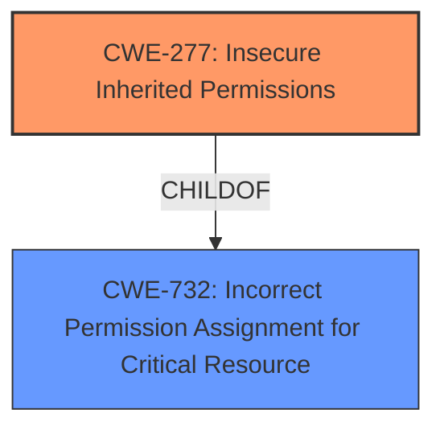

# Enhanced Analysis for CVE-2021-0102

# Summary
| CWE ID | CWE Name | Confidence | CWE Abstraction Level | CWE Vulnerability Mapping Label | CWE-Vulnerability Mapping Notes |
|---|---|---|---|---|---|
| CWE-277 | Insecure Inherited Permissions | 1.0 | Variant | Allowed | Primary CWE |

## Evidence and Confidence

*   **Confidence Score:** 1.0
*   **Evidence Strength:** HIGH

## Relationship Analysis
The primary relationship influencing the decision is the ChildOf relationship between CWE-277 and CWE-732. While CWE-732 is a broader class, CWE-277 specifically addresses the scenario of insecure inherited permissions, which is precisely what the vulnerability description highlights. Therefore, CWE-277 is a more specific and accurate representation of the weakness. No chain relationships are relevant in this case.



## Vulnerability Chain
The vulnerability chain is relatively simple:

1.  **Root Cause:** CWE-277 (**Insecure Inherited Permissions**) are defined within the Intel Unite(R) Client for Windows.
2.  **Impact:** This leads to an escalation of privilege.

## Summary of Analysis
The analysis is based on the vulnerability description and the provided CWE specifications. The vulnerability description explicitly states "**Insecure inherited permissions**" as the root cause. The "CVE Reference Links Content Summary" also confirms that the root cause is insecure inherited permissions. The Retriever Results identify CWE-277 as the top candidate. CWE-277's description, "A product defines a set of insecure permissions that are inherited by objects that are created by the program," directly matches the vulnerability. The mapping guidance for CWE-277 indicates that it is at the Variant level of abstraction, which is a preferred level.

The selection is based on the evidence presented which indicates that the vulnerability's root cause is directly related to how the product defines permissions that are then inherited by other objects. This aligns perfectly with the definition of CWE-277.

Relevant CWE Information:

# Enhanced Context (25 CWEs)
The following CWEs were identified as potentially relevant to this vulnerability:

## CWE-277: Insecure Inherited Permissions
**Abstraction:** Variant
**Status:** Draft

### Description
A product defines a set of insecure permissions that are inherited by objects that are created by the program.

### Extended Description
Not provided

### Alternative Terms
None

### Relationships
ChildOf -> CWE-732

### Mapping Guidance
**Usage:** Allowed
**Rationale:** This CWE entry is at the Variant level of abstraction, which is a preferred level of abstraction for mapping to the root causes of vulnerabilities.
**Comments:** Carefully read both the name and description to ensure that this mapping is an appropriate fit. Do not try to 'force' a mapping to a lower-level Base/Variant simply to comply with this preferred level of abstraction.
**Reasons:**
- Acceptable-Use

### Observed Examples
- **CVE-2005-1841:** User's umask is used when creating temp files.
- **CVE-2002-1786:** Insecure umask for core dumps [is the umask preserved or assigned?].

The following CWEs were considered but not used:

*   **CWE-732 (Incorrect Permission Assignment for Critical Resource):** While related to permissions, this is a broader category. CWE-277 is a more specific child that better captures the essence of the inherited permissions issue.
*   **CWE-276 (Incorrect Default Permissions):** This is about the initial default permissions, not the inherited ones.
*   **CWE-278 (Insecure Preserved Inherited Permissions):** The description of CWE-278 involves inheriting insecure permissions for an object, e.g. when copying from an archive file, without user awareness or involvement. The provided information for the reported vulnerability does not indicate the mechanism used to inherit the insecure permission (copying from an archive file).


## CWE Relationship Analysis

Current CWEs represent these abstraction levels: .


### Vulnerability Chain Analysis

**Chain starting from CWE-732:**
- 732 (Incorrect Permission Assignment for Critical Resource) - ROOT


**Chain starting from CWE-276:**
- 276 (Incorrect Default Permissions) - ROOT


### CWE Relationship Diagram

```mermaid
graph TD
    classDef primary fill:#f96,stroke:#333,stroke-width:2px
    classDef secondary fill:#69f,stroke:#333
    classDef tertiary fill:#9e9,stroke:#333
```