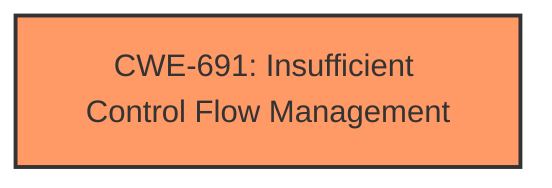

# Analysis Report for CVE-2021-0103

# Vulnerability Analysis Report: CVE-2021-0103

## Description


## Analysis (with Relationship Data)

# Summary
| CWE ID | CWE Name | Confidence | CWE Abstraction Level | CWE Vulnerability Mapping Label | CWE-Vulnerability Mapping Notes |
|---|---|---|---|---|---|
| CWE-691 | Insufficient Control Flow Management | 0.8 | Pillar | Allowed | Discouraged: High-level, but applicable due to the root cause description. |

## Evidence and Confidence

*   **Confidence Score:** 0.8
*   **Evidence Strength:** MEDIUM

## Relationship Analysis
The primary relationship considered was the high-level nature of CWE-691. While it's a Pillar-level CWE, its direct match to the **insufficient control flow management** made it the most relevant choice given the limited information. There are no strong parent-child or chain relationships apparent in the description to influence a more specific selection.



## Vulnerability Chain
The vulnerability chain appears simple:
1.  **Root Cause:** **Insufficient control flow management** (CWE-691)
2.  **Impact:** Escalation of privilege

There's a direct link from the root cause to the impact.

## Summary of Analysis
The initial analysis focused on the direct match between the vulnerability description's key phrase "**insufficient control flow management**" and the CWE-691 description. The retriever results also listed CWE-691 as the top candidate, reinforcing this assessment.

While CWE-691 is a Pillar-level CWE and generally discouraged, the available evidence doesn't point to a more specific root cause. The "CVE Reference Links Content Summary" confirms the root cause as insufficient control flow management.

The decision to use CWE-691 is based on the evidence: "**Root Cause:** Insufficient control flow management in the firmware for some Intel Processors." The graph relationships did not significantly influence the selection due to the limited information available.

I am selecting CWE-691 because it directly reflects the stated root cause, even if it's at a higher level of abstraction. More information would be needed to select a more specific CWE.

Relevant CWE Information:

# Enhanced Context (25 CWEs)

## CWE-1220: Insufficient Granularity of Access Control
**Abstraction Level**: Base
**Similarity Score**: 0.78
**Source**: dense

**Description**:
The product implements access controls via a policy or other feature with the intention to disable or restrict accesses (reads and/or writes) to assets in a system from untrusted agents. However, implemented access controls lack required granularity, which renders the control policy too broad because it allows accesses from unauthorized agents to the security-sensitive assets.

**Mapping Guidance**:
- Usage: Allowed
- Rationale: This CWE entry is at the Base level of abstraction, which is a preferred level of abstraction for mapping to the root causes of vulnerabilities.

CWE-1220 was considered because the **escalation of privilege** suggests a problem with access control. However, the root cause is specifically related to control flow management and not the granularity of access control. Therefore, CWE-1220 is not the best fit.

## CWE-653: Improper Isolation or Compartmentalization
**Abstraction Level**: Class
**Similarity Score**: 0.77
**Source**: dense

**Description**:
The product does not properly compartmentalize or isolate functionality, processes, or resources that require different privilege levels, rights, or permissions.

**Mapping Guidance**:
- Usage: Allowed
- Rationale: This CWE entry is at the Base level of abstraction, which is a preferred level of abstraction for mapping to the root causes of vulnerabilities.

CWE-653 could be related to **escalation of privilege**, but again, the provided root cause is **insufficient control flow management**. There is no explicit mention of issues with isolation or compartmentalization. Therefore, this is not the best fit.

## CWE-1299: Missing Protection Mechanism for Alternate Hardware Interface
**Abstraction Level**: Base
**Similarity Score**: 0.77
**Source**: dense

**Description**:
The lack of protections on alternate paths to access
                control-protected assets (such as unprotected shadow registers
                and other external facing unguarded interfaces) allows an
                attacker to bypass existing protections to the asset that are
		only performed against the primary path.

**Mapping Guidance**:
- Usage: Allowed
- Rationale: This CWE entry is at the Base level of abstraction, which is a preferred level of abstraction for mapping to the root causes of vulnerabilities.

CWE-1299 is not a good fit because the description refers to alternate hardware interfaces and missing protections, which isn't directly supported by the provided vulnerability details focusing on control flow.

## CWE-807: Reliance on Untrusted Inputs in a Security Decision
**Abstraction Level**: Base
**Similarity Score**: 0.77
**Source**: dense

**Description**:
The product uses a protection mechanism that relies on the existence or values of an input, but the input can be modified by an untrusted actor in a way that bypasses the protection mechanism.

**Mapping Guidance**:
- Usage: Allowed
- Rationale: This CWE entry is at the Base level of abstraction, which is a preferred level of abstraction for mapping to the root causes of vulnerabilities.

CWE-807 isn't applicable since the vulnerability description doesn't mention any reliance on untrusted inputs for security decisions.

## CWE-693: Protection Mechanism Failure
**Abstraction Level**: Pillar
**Similarity Score**: 0.76
**Source**: dense

**Description**:
The product does not use or incorrectly uses a protection mechanism that provides sufficient defense against directed attacks against the product.

**Mapping Guidance**:
- Usage: Discouraged
- Rationale: This CWE entry is extremely high-level, a Pillar.

CWE-693 is too general. While it could describe the situation, it doesn't capture the specific root cause of **insufficient control flow management** as well as CWE-691.

## CWE-1256: Improper Restriction of Software Interfaces to Hardware Features
**Abstraction Level**: Base
**Similarity Score**: 5638.47
**Source**: sparse

**Description**:
The product provides software-controllable
			device functionality for capabilities such as power and
			clock management, but it does not properly limit
			functionality that can lead to modification of
			hardware memory or register bits, or the ability to
			observe physical side channels.

**Mapping Guidance**:
- Usage: Allowed
- Rationale: This CWE entry is at the Base level of abstraction, which is a preferred level of abstraction for mapping to the root causes of vulnerabilities.

CWE-1256 is not a good fit, as it focuses on software interfaces to hardware features, specifically related to power and clock management. This is not directly supported by the given root cause.

## CWE-119: Improper Restriction of Operations within the Bounds of a Memory Buffer
**Abstraction Level**: Class
**Similarity Score**: 5515.93
**Source**: sparse

**Description**:
The product performs operations on a memory buffer, but it reads from or writes to a memory location outside the buffer's intended boundary. This may result in read or write operations on unexpected memory locations that could be linked to other variables, data structures, or internal program data.

**Mapping Guidance**:
- Usage: Discouraged
- Rationale: CWE-119 is commonly misused in low-information vulnerability reports when lower-level CWEs could be used instead, or when more details about the vulnerability are available.

CWE-119 isn't applicable because there is no mention of memory buffers or out-of-bounds operations in the vulnerability description. The focus is on control flow, not memory management.

## CWE-863: Incorrect Authorization
**Abstraction Level**: Class
**Similarity Score**: 5377.71
**Source**: sparse

**Description**:
The product performs an authorization check when an actor attempts to access a resource or perform an action, but it does not correctly perform the check.

**Mapping Guidance**:
- Usage: Allowed-with-Review
- Rationale: This CWE entry is a Class and might have Base-level children that would be more appropriate

CWE-863 is a possibility, due to the **escalation of privilege**. However, the described root cause is **insufficient control flow management**, not an authorization check. Therefore, it's not the primary issue.

## CWE-287: Improper Authentication
**Abstraction Level**: Class
**Similarity Score**: 5362.85
**Source**: sparse

**Description**:
When an actor claims to have a given identity, the product does not prove or insufficiently proves that the claim is correct.

**Mapping Guidance**:
- Usage: Discouraged
- Rationale: This CWE entry might be misused when lower-level CWE entries are likely to be applicable. It is a level-1 Class (i.e., a child of a Pillar).

CWE-287 is not a good fit because the vulnerability description doesn't mention issues with authentication.


## CWE Relationship Analysis

Current CWEs represent these abstraction levels: .


### Vulnerability Chain Analysis

**Chain starting from CWE-691:**
- 691 (Insufficient Control Flow Management) - ROOT


**Chain starting from CWE-1299:**
- 1299 (Missing Protection Mechanism for Alternate Hardware Interface) - ROOT


### CWE Relationship Diagram

```mermaid
graph TD
    classDef primary fill:#f96,stroke:#333,stroke-width:2px
    classDef secondary fill:#69f,stroke:#333
    classDef tertiary fill:#9e9,stroke:#333
```


*Report generated on 2025-04-01 18:58:11*
