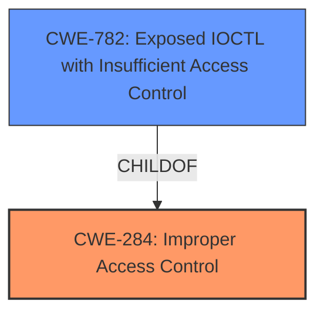

# Enhanced Analysis for CVE-2021-0110

# Summary
| CWE ID | CWE Name | Confidence | CWE Abstraction Level | CWE Vulnerability Mapping Label | CWE-Vulnerability Mapping Notes |
|---|---|---|---|---|---|
| CWE-284 | Improper Access Control | 0.75 | Pillar | Primary | Discouraged |
| CWE-782 | Exposed IOCTL with Insufficient Access Control | 0.6 | Variant | Secondary | Allowed |

## Evidence and Confidence

*   **Confidence Score:** 0.7
*   **Evidence Strength:** MEDIUM

## Relationship Analysis
The primary relationship influencing the CWE selection is the hierarchical structure, specifically the parent-child relationship. CWE-284 is a Pillar-level CWE, while CWE-782 is a Variant. While the description points to **improper access control**, the more specific nature of the Intel Thunderbolt drivers suggests a possible link to exposed IOCTLs lacking sufficient access control. However, the evidence is not definitive, reducing confidence in CWE-782's applicability. The relationship shows a potential refinement from a general access control issue to a specific case involving IOCTLs.



## Vulnerability Chain
The vulnerability chain begins with **improper access control**, potentially leading to a denial of service.
  - Root Cause: **Improper access control**
  - Impact: Denial of Service

## Summary of Analysis
Initially, the vulnerability description points directly to **improper access control**. The key phrase confirms this, stating "rootcause: **Improper access control**". This aligns with CWE-284. However, CWE-284 is a high-level Pillar, and the retriever results suggest other potential candidates.

The CVE Reference Links Content Summary provides additional details: "The vulnerability stems from **improper access control** within the driver, allowing unauthorized actions." This reinforces the initial assessment.

Considering the retriever results, CWE-782 (Exposed IOCTL with Insufficient Access Control) is a strong candidate due to the mention of Intel Thunderbolt drivers, which often rely on IOCTLs for communication. However, there is no explicit mention of IOCTLs in the vulnerability description. Therefore, while CWE-782 is plausible, the evidence is not strong enough to make it the primary CWE.

The final decision is to assign CWE-284 as the primary CWE due to the explicit mention of **improper access control** in the vulnerability description and CVE Reference Links Content Summary. CWE-782 is considered a secondary candidate because it could be a more specific instance of the vulnerability, but lacks direct evidence.

The selection of CWE-284 is at the optimal level of specificity given the available evidence. While more specific CWEs exist, there is insufficient information to confidently assign them.

Relevant CWE Information:

# Enhanced Context (25 CWEs)

## CWE-691: Insufficient Control Flow Management
**Abstraction Level**: Pillar
**Similarity Score**: 0.77
**Source**: dense

**Description**:
The code does not sufficiently manage its control flow during execution, creating conditions in which the control flow can be modified in unexpected ways.

**Mapping Guidance**:
- Usage: Discouraged
- Rationale: This CWE entry is extremely high-level, a Pillar. However, classification research is limited for weaknesses of this type, so there can be gaps or organizational difficulties within CWE that force use of this weakness, even at such a high level of abstraction.

**Analysis:**
This CWE is too general and doesn't directly address the **improper access control** issue. It's a high-level Pillar and doesn't fit the specific vulnerability.

## CWE-693: Protection Mechanism Failure
**Abstraction Level**: Pillar
**Similarity Score**: 0.75
**Source**: dense

**Description**:
The product does not use or incorrectly uses a protection mechanism that provides sufficient defense against directed attacks against the product.

**Mapping Guidance**:
- Usage: Discouraged
- Rationale: This CWE entry is extremely high-level, a Pillar.

**Analysis:**
While related to security, this CWE is too broad. The vulnerability description is more specific about **improper access control**, not a general failure of a protection mechanism.

## CWE-284: Improper Access Control
**Abstraction Level**: Pillar
**Similarity Score**: 0.199
**Source**: sparse

**Description**:
The product does not restrict or incorrectly restricts access to a resource from an unauthorized actor.

**Mapping Guidance**:
- Usage: Discouraged
- Rationale: CWE-284 is extremely high-level, a Pillar. Its name, "Improper Access Control," is often misused in low-information vulnerability reports [REF-1287] or by active use of the OWASP Top Ten, such as "A01:2021-Broken Access Control". It is not useful for trend analysis.
- **Comments:** Consider using descendants of CWE-284 that are more specific to the kind of access control involved...

**Analysis:**
The vulnerability description explicitly states **improper access control**, making this a relevant CWE. However, it's a high-level Pillar, and the mapping guidance discourages its use when more specific CWEs are available.

## CWE-277: Insecure Inherited Permissions
**Abstraction Level**: Variant
**Similarity Score**: 0.191
**Source**: sparse

**Description**:
A product defines a set of insecure permissions that are inherited by objects that are created by the program.

**Analysis:**
This CWE is too specific. The vulnerability description doesn't mention anything about inherited permissions.

## CWE-1288: Improper Validation of Consistency within Input
**Abstraction Level**: Base
**Similarity Score**: 0.191
**Source**: sparse

**Description**:
The product receives a complex input with multiple elements or fields that must be consistent with each other, but it does not validate or incorrectly validates that the input is actually consistent.

**Analysis:**
This CWE is not relevant. The vulnerability description focuses on **improper access control**, not input validation.

## CWE-782: Exposed IOCTL with Insufficient Access Control
**Abstraction Level**: Variant
**Similarity Score**: 0.640
**Source**: dense

**Description**:
The product implements an IOCTL with functionality that should be restricted, but it does not properly enforce access control for the IOCTL.

**Analysis:**
This CWE is a strong candidate. Given the context of Intel Thunderbolt Windows DCH Drivers, IOCTLs are likely involved. The **improper access control** could be related to an exposed IOCTL.

## CWE-1191: On-Chip Debug and Test Interface With Improper Access Control
**Abstraction Level**: Base
**Similarity Score**: 0.002
**Source**: graph

**Description**:
The chip does not implement or does not correctly perform access control to check whether users are authorized to access internal registers and test modes through the physical debug/test interface.

**Analysis:**
This CWE is too specific. It focuses on on-chip debug interfaces, which are not mentioned in the vulnerability description.

## CWE-119: Improper Restriction of Operations within the Bounds of a Memory Buffer
**Abstraction Level**: Class
**Similarity Score**: 0.185
**Source**: sparse

**Description**:
The product performs operations on a memory buffer, but it reads from or writes to a memory location outside the buffer's intended boundary. This may result in read or write operations on unexpected memory locations that could be linked to other variables, data structures, or internal program data.

**Analysis:**
This CWE is not directly related to **improper access control**. It's a memory-related weakness, and the vulnerability description doesn't suggest memory corruption.

## CWE-248: Uncaught Exception
**Abstraction Level**: Base
**Similarity Score**: 0.183
**Source**: sparse

**Description**:
An exception is thrown from a function, but it is not caught.

**Analysis:**
This CWE is not relevant to the **improper access control** issue.

## CWE-1173: Improper Use of Validation Framework
**Abstraction Level**: Base
**Similarity Score**: 0.182
**Source**: sparse

**Description**:
The product does not use, or incorrectly uses, an input validation framework that is provided by the source language or an independent library.

**Analysis:**
This CWE is not relevant. The vulnerability description focuses on **improper access control**, not input validation.


## CWE Relationship Analysis

Current CWEs represent these abstraction levels: .


### Vulnerability Chain Analysis

**Chain starting from CWE-691:**
- 691 (Insufficient Control Flow Management) - ROOT


**Chain starting from CWE-248:**
- 248 (Uncaught Exception) - ROOT


### CWE Relationship Diagram

```mermaid
graph TD
    classDef primary fill:#f96,stroke:#333,stroke-width:2px
    classDef secondary fill:#69f,stroke:#333
    classDef tertiary fill:#9e9,stroke:#333
```