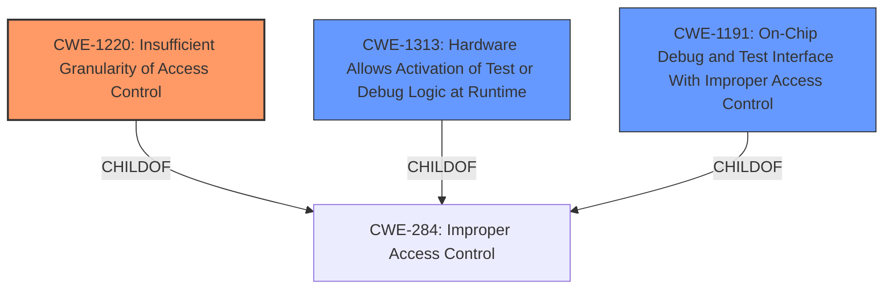

# Raw Analyzer Response for CVE-2021-0124

# Summary
| CWE ID  | CWE Name | Confidence | CWE Abstraction Level | CWE Vulnerability Mapping Label | CWE-Vulnerability Mapping Notes |
|----------------|----------------------------------------------------|-------------------|-------------------------|-----------------------------------|------------------------------------|
| **CWE-1220** | Insufficient Granularity of Access Control | 0.85  | Base | Primary | Allowed  |
| CWE-1313 | Hardware Allows Activation of Test or Debug Logic at Runtime | 0.6 | Base | Secondary | Allowed |
| CWE-1191 | On-Chip Debug and Test Interface With Improper Access Control | 0.4 | Base | Secondary | Allowed |

## Evidence and Confidence

*   **Confidence Score:** 0.8
*   **Evidence Strength:** MEDIUM

## Relationship Analysis
The primary CWE is CWE-1220, "Insufficient Granularity of Access Control". It is a child of the broader CWE-284 "Improper Access Control", and is at the Base level of abstraction which is the preferred level.
CWE-1313 and CWE-1191 are also children of CWE-284.

## Vulnerability Chain
The vulnerability chain starts with **improper access control** in the firmware, potentially leading to escalation of privilege.
  - **Root Cause:** **Improper access control**
  - **Impact:** Escalation of Privilege

## Summary of Analysis
The initial analysis and criticism focused on identifying the root cause of the vulnerability and selecting the most specific and relevant CWE. The analysis is based on the provided evidence, particularly the vulnerability description key phrases and CVE reference links content summary.

The primary CWE selected is CWE-1220, "Insufficient Granularity of Access Control," because the description states "**Improper access control** in the firmware for some Intel(R) Processors may allow a privileged user to potentially enable escalation of privilege via physical access." The reference link content summary also states "**Improper access control** in the firmware for some Intel processors." CWE-1220 is at the Base level of abstraction, which is preferred and more specific than its parent CWE-284. The description of CWE-1220 also matches the vulnerability, "The product implements access controls via a policy or other feature with the intention to disable or restrict accesses (reads and/or writes) to assets in a system from untrusted agents. However, implemented access controls lack required granularity, which renders the control policy too broad because it allows accesses from unauthorized agents to the security-sensitive assets."

I also considered CWE-1313 "Hardware Allows Activation of Test or Debug Logic at Runtime" because the description of the CWE mentions that "During runtime, the hardware allows for test or debug logic (feature) to be activated, which allows for changing the state of the hardware." and CVE-2021-0146, which is listed as an observed example, says "Processor allows the activation of test or debug logic at runtime, allowing escalation of privileges".
I also considered CWE-1191 "On-Chip Debug and Test Interface With Improper Access Control" because it is a child of CWE-284 and is relevant to hardware.

The selection of CWE-1220 is at the optimal level of specificity because it directly addresses the **improper access control** in the firmware, while the alternatives are related, but less specific.

Relevant CWE Information:

# Enhanced Context (25 CWEs)
The following CWEs were identified as potentially relevant to this vulnerability:

## CWE-691: Insufficient Control Flow Management
**Abstraction Level**: Pillar
**Similarity Score**: 0.78
**Source**: dense
**Description**: The code does not sufficiently manage its control flow during execution, creating conditions in which the control flow can be modified in unexpected ways.
**Mapping Guidance**: Discouraged because it is a Pillar. Not selected.

## CWE-1220: Insufficient Granularity of Access Control
**Abstraction Level**: Base
**Similarity Score**: 0.77
**Source**: dense
**Description**: The product implements access controls via a policy or other feature with the intention to disable or restrict accesses (reads and/or writes) to assets in a system from untrusted agents. However, implemented access controls lack required granularity, which renders the control policy too broad because it allows accesses from unauthorized agents to the security-sensitive assets.
**Mapping Guidance**: Allowed. Selected as the primary CWE.

## CWE-653: Improper Isolation or Compartmentalization
**Abstraction Level**: Class
**Similarity Score**: 0.76
**Source**: dense
**Description**: The product does not properly compartmentalize or isolate functionality, processes, or resources that require different privilege levels, rights, or permissions.
**Mapping Guidance**: Allowed. Not selected.

## CWE-805: Buffer Access with Incorrect Length Value
**Abstraction Level**: Base
**Similarity Score**: 0.76
**Source**: dense
**Description**: The product uses a sequential operation to read or write a buffer, but it uses an incorrect length value that causes it to access memory that is outside of the bounds of the buffer.
**Mapping Guidance**: Allowed. Not selected.

## CWE-119: Improper Restriction of Operations within the Bounds of a Memory Buffer
**Abstraction Level**: Class
**Similarity Score**: 0.76
**Source**: dense
**Description**: The product performs operations on a memory buffer, but it reads from or writes to a memory location outside the buffer's intended boundary. This may result in read or write operations on unexpected memory locations that could be linked to other variables, data structures, or internal program data.
**Mapping Guidance**: Discouraged. Not selected.

## CWE-667: Improper Locking
**Abstraction Level**: Class
**Similarity Score**: 0.76
**Source**: dense
**Description**: The product does not properly acquire or release a lock on a resource, leading to unexpected resource state changes and behaviors.
**Mapping Guidance**: Allowed-with-Review. Not selected.

## CWE-131: Incorrect Calculation of Buffer Size
**Abstraction Level**: Base
**Similarity Score**: 0.76
**Source**: dense
**Description**: The product does not correctly calculate the size to be used when allocating a buffer, which could lead to a buffer overflow.
**Mapping Guidance**: Allowed. Not selected.

## CWE-703: Improper Check or Handling of Exceptional Conditions
**Abstraction Level**: Pillar
**Similarity Score**: 0.75
**Source**: dense
**Description**: The product does not properly anticipate or handle exceptional conditions that rarely occur during normal operation of the product.
**Mapping Guidance**: Discouraged. Not selected.

## CWE-191: Integer Underflow (Wrap or Wraparound)
**Abstraction Level**: Base
**Similarity Score**: 0.75
**Source**: dense
**Description**: The product subtracts one value from another, such that the result is less than the minimum allowable integer value, which produces a value that is not equal to the correct result.
**Mapping Guidance**: Allowed. Not selected.

## CWE-664: Improper Control of a Resource Through its Lifetime
**Abstraction Level**: Pillar
**Similarity Score**: 0.75
**Source**: dense
**Description**: The product does not maintain or incorrectly maintains control over a resource throughout its lifetime of creation, use, and release.
**Mapping Guidance**: Discouraged. Not selected.

## CWE-1256: Improper Restriction of Software Interfaces to Hardware Features
**Abstraction Level**: Base
**Similarity Score**: 5409.71
**Source**: sparse
**Description**: The product provides software-controllable
			device functionality for capabilities such as power and
			clock management, but it does not properly limit
			functionality that can lead to modification of
			hardware memory or register bits, or the ability to
			observe physical side channels.
**Mapping Guidance**: Allowed. Not selected.

## CWE-119: Improper Restriction of Operations within the Bounds of a Memory Buffer
**Abstraction Level**: Class
**Similarity Score**: 5282.25
**Source**: sparse
**Description**: The product performs operations on a memory buffer, but it reads from or writes to a memory location outside the buffer's intended boundary. This may result in