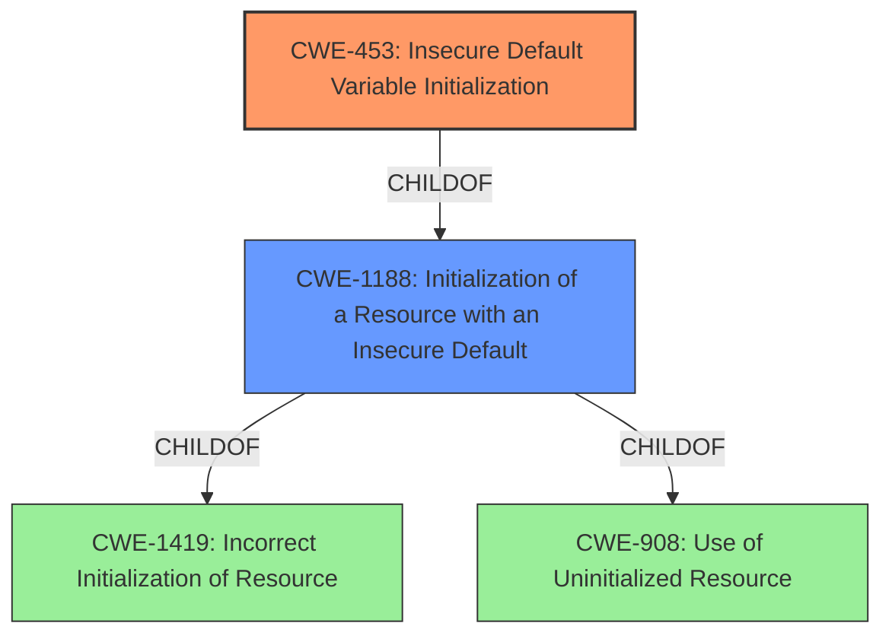

# Analysis for CVE-2021-0144

# Summary
| CWE ID | CWE Name | Confidence | CWE Abstraction Level | CWE Vulnerability Mapping Label | CWE-Vulnerability Mapping Notes |
|---|---|---|---|---|---|
| CWE-453 | Insecure Default Variable Initialization | 1.0 | Variant | Allowed | Primary CWE |
| CWE-1188 | Initialization of a Resource with an Insecure Default | 0.7 | Base | Allowed | Secondary Candidate |

## Evidence and Confidence

*   **Confidence Score:** 0.85
*   **Evidence Strength:** HIGH

## Relationship Analysis
The primary CWE, CWE-453 **(Insecure Default Variable Initialization)**, is a Variant of CWE-1188 **(Initialization of a Resource with an Insecure Default)**. This parent-child relationship influenced the selection, favoring the more specific Variant where the **insecure initialization** is the root cause. Other potential CWEs such as CWE-1419 **(Incorrect Initialization of Resource)** and CWE-908 **(Use of Uninitialized Resource)** were considered but deemed less relevant as they don't specifically address the **insecure nature of the default value**.

## Vulnerability Chain
The vulnerability chain starts with the **insecure default variable initialization (CWE-453)**, which leads to a potential escalation of privilege.

## Summary of Analysis
The analysis is primarily based on the provided evidence, which explicitly states the **root cause** as **"insecure default variable initialization"**.

> **Vulnerability Description Key Phrases**
> -   **rootcause:** **insecure default variable initialization**
> **CVE Reference Links Content Summary**
> -   **Root Cause of Vulnerability:** Insecure default variable initialization within the Intel BIOS Shared SW Architecture (BSSA) Design for Test (DFT) feature.
> -   **Weaknesses/Vulnerabilities Present:** Improper initialization of variables in the firmware.

The retriever results also support this finding, with CWE-453 **(Insecure Default Variable Initialization)** being the top-ranked CWE.

The selection of CWE-453 is at the optimal level of specificity because it directly reflects the **root cause** described in the vulnerability. While CWE-1188 **(Initialization of a Resource with an Insecure Default)** is a valid parent, CWE-453 provides a more precise classification of the weakness.

Relevant CWE Information:

# Enhanced Context (25 CWEs)

## CWE-453: Insecure Default Variable Initialization
**Abstraction:** Variant
**Status:** Draft

### Description
The product, by default, initializes an internal variable with an insecure or less secure value than is possible.

### Extended Description
Not provided

### Alternative Terms
None

### Relationships
ChildOf -> CWE-1188

### Mapping Guidance
**Usage:** Allowed
**Rationale:** This CWE entry is at the Variant level of abstraction, which is a preferred level of abstraction for mapping to the root causes of vulnerabilities.
**Comments:** Carefully read both the name and description to ensure that this mapping is an appropriate fit. Do not try to 'force' a mapping to a lower-level Base/Variant simply to comply with this preferred level of abstraction.
**Reasons:**
- Acceptable-Use

### Additional Notes
**[Maintenance]** This overlaps other categories, probably should be split into separate items.

### Observed Examples
- **CVE-2022-36349:** insecure default variable initialization in BIOS firmware for a hardware board allows DoS

**Analysis:**

The vulnerability description clearly states that the **root cause** is an **insecure default variable initialization**. This aligns perfectly with the description of CWE-453 **(Insecure Default Variable Initialization)**, which specifies that the product initializes a variable with an **insecure** or less secure value by default. The impact of this vulnerability is an escalation of privilege, which can occur when an **insecure default** allows unauthorized actions. The mapping guidance for CWE-453 recommends its use because it is at the Variant level of abstraction. The "Observed Examples" section includes CVE-2022-36349 which also involves **insecure default variable initialization** in BIOS firmware, further strengthening the relevance of this CWE.

## CWE-1188: Initialization of a Resource with an Insecure Default
**Abstraction:** Base
**Status:** Incomplete

### Description
The product initializes or sets a resource with a default that is intended to be changed by the administrator, but the default is not secure.

### Extended Description
Developers often choose default values that leave the product as open and easy to use as possible out-of-the-box, under the assumption that the administrator can (or should) change the default value. However, this ease-of-use comes at a cost when the default is insecure and the administrator does not change it.

### Alternative Terms
None

### Relationships
ChildOf -> CWE-1419
ChildOf -> CWE-665

### Mapping Guidance
**Usage:** Allowed
**Rationale:** This CWE entry is at the Base level of abstraction, which is a preferred level of abstraction for mapping to the root causes of vulnerabilities.
**Comments:** Carefully read both the name and description to ensure that this mapping is an appropriate fit. Do not try to 'force' a mapping to a lower-level Base/Variant simply to comply with this preferred level of abstraction.
**Reasons:**
- Acceptable-Use

### Additional Notes
**[Maintenance]** This entry improves organization of concepts under initialization. The typical CWE model is to cover "Missing" and "Incorrect" behaviors. Arguably, this entry could be named as "Incorrect" instead of "Insecure." This might be changed in the near future.

### Observed Examples
- **CVE-2022-36349:** insecure default variable initialization in BIOS firmware for a hardware board allows DoS
- **CVE-2022-42467:** A generic database browser interface has a default mode that exposes a web server to the network, allowing queries to the database.

**Analysis:**

CWE-1188 **(Initialization of a Resource with an Insecure Default)** is a broader category that encompasses the **insecure initialization** of a resource. While it is relevant to the vulnerability description, it is less specific than CWE-453. The vulnerability involves a variable being initialized with an **insecure default**, which aligns directly with CWE-453. The "Observed Examples" section includes CVE-2022-36349, which is the same as listed for CWE-453, indicating a strong relationship between the two. Given the parent-child relationship where CWE-453 is a child of CWE-1188, and the description clearly identifies an **insecure default variable**, CWE-453 is the more appropriate choice.

## Other CWEs Considered

*   **CWE-1419 (Incorrect Initialization of Resource):** Considered but not used as it is a more general class and doesn't specify the **insecure** nature of the initialization.
*   **CWE-908 (Use of Uninitialized Resource):** Considered but not used as the resource is being initialized, albeit with an **insecure** value, not left uninitialized.
*   **CWE-691 (Insufficient Control Flow Management):** This is a Pillar level CWE and too high level.
*   **CWE-277 (Insecure Inherited Permissions):** This is not relevant because the vulnerability is about **insecure initialization**, not inherited permissions.
*   **CWE-1421 (Exposure of Sensitive Information in Shared Microarchitectural Structures during Transient Execution):** This is not relevant as it deals with exposure of sensitive information in specific hardware structures, not **insecure variable initialization**.
*   **CWE-1256 (Improper Restriction of Software Interfaces to Hardware Features):** This is not relevant, as it refers to software interfaces to hardware, not **insecure initialization**.
*   **CWE-732 (Incorrect Permission Assignment for Critical Resource):** This is not relevant because the issue isn't incorrect permissions, but an **insecure default initialization**.
*   **CWE-284 (Improper Access Control):** This is a Pillar level CWE and too high level.

# Enhanced Query for CVE-2021-0144

## Vulnerability Description
Insecure default variable initialization for the Intel BSSA DFT feature may allow a privileged user to potentially enable an escalation of privilege via local access.

### Vulnerability Description Key Phrases
- **rootcause:** **insecure default variable initialization**
- **impact:** escalation of privilege
- **attacker:** privileged user
- **product:** Intel BSSA
- **component:** DFT feature

## CVE Reference Links Content Summary
The provided content contains information about CVE-2021-0144.

**Root Cause of Vulnerability:**
Insecure default variable initialization within the Intel BIOS Shared SW Architecture (BSSA) Design for Test (DFT) feature.

**Weaknesses/Vulnerabilities Present:**
Improper initialization of variables in the firmware.

**Impact of Exploitation:**
Escalation of privilege.

**Attack Vectors:**
Local access.

**Required Attacker Capabilities/Position:**
A privileged user is required to exploit this vulnerability. The attacker needs to have local access to the target system.

## Retriever Results

### Top Combined Results

| Rank | CWE ID | Name | Abstraction | Usage  | Retrievers | Individual Scores |
|------|--------|------|-------------|-------|------------|-------------------|
| 1 | 453 | Insecure Default Variable Initialization | Variant | Allowed | sparse | 0.336 |
| 2 | 277 | Insecure Inherited Permissions | Variant | Allowed | sparse | 0.197 |
| 3 | 1188 | Initialization of a Resource with an Insecure Default | Base | Allowed | sparse | 0.194 |
| 4 | 691 | Insufficient Control Flow Management | Pillar | Discouraged | sparse | 0.188 |
| 5 | 1419 | Incorrect Initialization of Resource | Class | Allowed-with-Review | sparse | 0.175 |
| 6 | 1421 | Exposure of Sensitive Information in Shared Microarchitectural Structures during Transient Execution | Base | Allowed | dense | 0.548 |
| 7 | 1256 | Improper Restriction of Software Interfaces to Hardware Features | Base | Allowed | graph | 0.002 |
| 8 | 908 | Use of Uninitialized Resource | Base | Allowed | sparse | 0.172 |
| 9 | 732 | Incorrect Permission Assignment for Critical Resource | Class | Allowed-with-Review | sparse | 0.165 |
| 10 | 284 | Improper Access Control | Pillar | Discouraged | sparse | 0.162 |

# Complete CWE Specifications

## CWE-453: Insecure Default Variable Initialization
**Abstraction:** Variant
**Status:** Draft

### Description
The product, by default, initializes an internal variable with an insecure or less secure value than is possible.

### Extended Description
Not provided

### Alternative Terms
None

### Relationships
ChildOf -> CWE-1188

### Mapping Guidance
**Usage:** Allowed
**Rationale:** This CWE entry is at the Variant level of abstraction, which is a preferred level of abstraction for mapping to the root causes of vulnerabilities.
**Comments:** Carefully read both the name and description to ensure that this mapping is an appropriate fit. Do not try to 'force' a mapping to a lower-level Base/Variant simply to comply with this preferred level of abstraction.
**Reasons:**
- Acceptable-Use

### Additional Notes
**[Maintenance]** This overlaps other categories, probably should be split into separate items.

### Observed Examples
- **CVE-2022-36349:** insecure default variable initialization in BIOS firmware for a hardware board allows DoS

## CWE-277: Insecure Inherited Permissions
**Abstraction:** Variant
**Status:** Draft

### Description
A product defines a set of insecure permissions that are inherited by objects that are created by the program.

### Extended Description
Not provided

### Alternative Terms
None

### Relationships
ChildOf -> CWE-732

### Mapping Guidance
**Usage:** Allowed
**Rationale:** This CWE entry is at the Variant level of abstraction, which is a preferred level of abstraction for mapping to the root causes of vulnerabilities.
**Comments:** Carefully read both the name and description to ensure that this mapping is an appropriate fit. Do not try to 'force' a mapping to a lower-level Base/Variant simply to comply with this preferred level of abstraction.
**Reasons:**
- Acceptable-Use

### Observed Examples
- **CVE-2005-1841:** User's umask is used when creating temp files.
- **CVE-2002-1786:** Insecure umask for core dumps [is the umask preserved or assigned?].

## CWE-1188: Initialization of a Resource with an Insecure Default
**Abstraction:** Base
**Status:** Incomplete

### Description
The product initializes or sets a resource with a default that is intended to be changed by the administrator, but the default is not secure.

### Extended Description

Developers often choose default values that leave the product as open and easy to use as possible out-of-the-box, under the assumption that the administrator can (or should) change the default value. However, this ease-of-use comes at a cost when the default is insecure and the administrator does not change it.

### Alternative Terms
None

### Relationships
ChildOf -> CWE-1419
ChildOf -> CWE-665

### Mapping Guidance
**Usage:** Allowed
**Rationale:** This CWE entry is at the Base level of abstraction, which is a preferred level of abstraction for mapping to the root causes of vulnerabilities.
**Comments:** Carefully read both the name and description to ensure that this mapping is an appropriate fit. Do not try to 'force' a mapping to a lower-level Base/Variant simply to comply with this preferred level of abstraction.
**Reasons:**
- Acceptable-Use

### Additional Notes
**[Maintenance]** This entry improves organization of concepts under initialization. The typical CWE model is to cover "Missing" and "Incorrect" behaviors. Arguably, this entry could be named as "Incorrect" instead of "Insecure." This might be changed in the near future.

### Observed Examples
- **CVE-2022-36349:** insecure default variable initialization in BIOS firmware for a hardware board allows DoS
- **CVE-2022-42467:** A generic database browser interface has a default mode that exposes a web server to the network, allowing queries to the database.

## CWE-691: Insufficient Control Flow Management
**Abstraction:** Pillar
**Status:** Draft

### Description
The code does not sufficiently manage its control flow during execution, creating conditions in which the control flow can be modified in unexpected ways.

### Extended Description
Not provided

### Alternative Terms
None

### Relationships
None

### Mapping Guidance
**Usage:** Discouraged
**Rationale:** This CWE entry is extremely high-level, a Pillar. However, classification research is limited for weaknesses of this type, so there can be gaps or organizational difficulties within CWE that force use of this weakness, even at such a high level of abstraction.
**Comments:** Where feasible, consider children or descendants of this entry instead.
**Reasons:**
- Abstraction

### Observed Examples
- **CVE-2019-9805:** Chain: Creation of the packet client occurs before initialization is complete (CWE-696) resulting in a read from uninitialized memory (CWE-908), causing memory corruption.
- **CVE-2014-1266:** chain: incorrect "goto" in Apple SSL product bypasses certificate validation, allowing Adversary-in-the-Middle (AITM) attack (Apple "goto fail" bug). CWE-705 (Incorrect Control Flow Scoping) -> CWE-561 (Dead Code) -> CWE-295 (Improper Certificate Validation) -> CWE-393 (Return of Wrong Status Code) -> CWE-300 (Channel Accessible by Non-Endpoint).
- **CVE-2011-1027:** Chain: off-by-one error (CWE-193) leads to infinite loop (CWE-835) using invalid hex-encoded characters.

## CWE-1419: Incorrect Initialization of Resource
**Abstraction:** Class
**Status:** Incomplete

### Description
The product attempts to initialize a resource but does not correctly do so, which might leave the resource in an unexpected, incorrect, or insecure state when it is accessed.

### Extended Description

This can have security implications when the associated resource is expected to have certain properties or values. Examples include a variable that determines whether a user has been authenticated or not, or a register or fuse value that determines the security state of the product.

For software, this weakness can frequently occur when implicit initialization is used, meaning the resource is not explicitly set to a specific value. For example, in C, memory is not necessarily cleared when it is allocated on the stack, and many scripting languages use a default empty, null value, or zero value when a variable is not explicitly initialized.

For hardware, this weakness frequently appears with reset values and fuses. After a product reset, hardware may initialize registers incorrectly. During different phases of a product lifecycle, fuses may be set to incorrect values. Even if fuses are set to correct values, the lines to the fuse could be broken or there might be hardware on the fuse line that alters the fuse value to be incorrect.

### Alternative Terms
None

### Relationships
ChildOf -> CWE-665

### Mapping Guidance
**Usage:** Allowed-with-Review
**Rationale:** This CWE entry is a Class and might have Base-level children that would be more appropriate
**Comments:** Examine children of this entry to see if there is a better fit
**Reasons:**
- Abstraction

### Observed Examples
- **CVE-2020-27211:** Chain: microcontroller system-on-chip uses a register value stored in flash to set product protection state on the memory bus and does not contain protection against fault injection (CWE-1319) which leads to an incorrect initialization of the memory bus (CWE-1419) causing the product to be in an unprotected state.
- **CVE-2023-25815:** chain: a change in an underlying package causes the gettext function to use implicit initialization with a hard-coded path (CWE-1419) under the user-writable C:\ drive, introducing an untrusted search path element (CWE-427) that enables spoofing of messages.
- **CVE-2022-43468:** WordPress module sets internal variables based on external inputs, allowing false reporting of the number of views

## CWE-1421: Exposure of Sensitive Information in Shared Microarchitectural Structures during Transient Execution
**Abstraction:** Base
**Status:** Incomplete

### Description

			A processor event may allow transient operations to access
			architecturally restricted data (for example, in another address
			space) in a shared microarchitectural structure (for example, a CPU
			cache), potentially exposing the data over a covert channel.
		  

### Extended Description

Many commodity processors have Instruction Set Architecture (ISA) features that protect software components from one another. These features can include memory segmentation, virtual memory, privilege rings, trusted execution environments, and virtual machines, among others. For example, virtual memory provides each process with its own address space, which prevents processes from accessing each other's private data. Many of these features can be used to form hardware-enforced security boundaries between software components.

Many commodity processors also share microarchitectural resources that cache (temporarily store) data, which may be confidential. These resources may be shared across processor contexts, including across SMT threads, privilege rings, or others.

When transient operations allow access to ISA-protected data in a shared microarchitectural resource, this might violate users' expectations of the ISA feature that is bypassed. For example, if transient operations can access a victim's private data in a shared microarchitectural resource, then the operations' microarchitectural side effects may correspond to the accessed data. If an attacker can trigger these transient operations and observe their side effects through a covert channel [REF-1400], then the attacker may be able to infer the victim's private data. Private data could include sensitive program data, OS/VMM data, page table data (such as memory addresses), system configuration data (see Demonstrative Example 3), or any other data that the attacker does not have the required privileges to access.

### Alternative Terms
None

### Relationships
ChildOf -> CWE-1420
ChildOf -> CWE-1420

### Mapping Guidance
**Usage:** Allowed
**Rationale:** This CWE entry is at the Base level of abstraction, which is a preferred level of abstraction for mapping to the root causes of vulnerabilities
**Comments:** If a weakness can potentially be exploited to infer data that is accessible inside or outside the current processor context, then the weakness could map to CWE-1421 and to another CWE such as CWE-1420.
**Reasons:**
- Acceptable-Use

### Observed Examples
- **CVE-2017-5715:** A fault may allow transient user-mode operations to access kernel data cached in the L1D, potentially exposing the data over a covert channel.
- **CVE-2018-3615:** A fault may allow transient non-enclave operations to access SGX enclave data cached in the L1D, potentially exposing the data over a covert channel.
- **CVE-2019-1135:** A TSX Asynchronous Abort may allow transient operations to access architecturally restricted data, potentially exposing the data over a covert channel.

## CWE-1256: Improper Restriction of Software Interfaces to Hardware Features
**Abstraction:** Base
**Status:** Stable

### Description
The product provides software-controllable
			device functionality for capabilities such as power and
			clock management, but it does not properly limit
			functionality that can lead to modification of
			hardware memory or register bits, or the ability to
			observe physical side channels.

### Extended Description

It is frequently assumed that physical attacks such as fault injection and side-channel analysis require an attacker to have physical access to the target device. This assumption may be false if the device has improperly secured power management features, or similar features. For mobile devices, minimizing power consumption is critical, but these devices run a wide variety of applications with different performance requirements. Software-controllable mechanisms to dynamically scale device voltage and frequency and monitor power consumption are common features in today's chipsets, but they also enable attackers to mount fault injection and side-channel attacks without having physical access to the device.

Fault injection attacks involve strategic manipulation of bits in a device to achieve a desired effect such as skipping an authentication step, elevating privileges, or altering the output of a cryptographic operation. Manipulation of the device clock and voltage supply is a well-known technique to inject faults and is cheap to implement with physical device access. Poorly protected power management features allow these attacks to be performed from software. Other features, such as the ability to write repeatedly to DRAM at a rapid rate from unprivileged software, can result in bit flips in other memory locations (Rowhammer, [REF-1083]).

Side channel analysis requires gathering measurement traces of physical quantities such as power consumption. Modern processors often include power metering capabilities in the hardware itself (e.g., Intel RAPL) which if not adequately protected enable attackers to gather measurements necessary for performing side-channel attacks from software.

### Alternative Terms
None

### Relationships
ChildOf -> CWE-285

### Mapping Guidance
**Usage:** Allowed
**Rationale:** This CWE entry is at the Base level of abstraction, which is a preferred level of abstraction for mapping to the root causes of vulnerabilities.
**Comments:** Carefully read both the name and description to ensure that this mapping is an appropriate fit. Do not try to 'force' a mapping to a lower-level Base/Variant simply to comply with this preferred level of abstraction.
**Reasons:**
- Acceptable-Use

### Observed Examples
- **CVE-2019-11157:** Plundervolt: Improper conditions check in voltage settings for some Intel(R) Processors may allow a privileged user to potentially enable escalation of privilege and/or information disclosure via local access [REF-1081].
- **CVE-2020-8694:** PLATYPUS Attack: Insufficient access control in the Linux kernel driver for some Intel processors allows information disclosure.
- **CVE-2020-8695:** Observable discrepancy in the RAPL interface for some Intel processors allows information disclosure.

## CWE-908: Use of Uninitialized Resource
**Abstraction:** Base
**Status:** Incomplete

### Description
The product uses or accesses a resource that has not been initialized.

### Extended Description
When a resource has not been properly initialized, the product may behave unexpectedly. This may lead to a crash or invalid memory access, but the consequences vary depending on the type of resource and how it is used within the product.

### Alternative Terms
None

### Relationships
ChildOf -> CWE-665
ChildOf -> CWE-665

### Mapping Guidance
**Usage:** Allowed
**Rationale:** This CWE entry is at the Base level of abstraction, which is a preferred level of abstraction for mapping to the root causes of vulnerabilities.
**Comments:** Carefully read both the name and description to ensure that this mapping is an appropriate fit. Do not try to 'force' a mapping to a lower-level Base/Variant simply to comply with this preferred level of abstraction.
**Reasons:**
- Acceptable-Use

### Observed Examples
- **CVE-2019-9805:** Chain: Creation of the packet client occurs before initialization is complete (CWE-696) resulting in a read from uninitialized memory (CWE-908), causing memory corruption.
- **CVE-2008-4197:** Use of uninitialized memory may allow code execution.
- **CVE-2008-2934:** Free of an uninitialized pointer leads to crash and possible code execution.

## CWE-732: Incorrect Permission Assignment for Critical Resource
**Abstraction:** Class
**Status:** Draft

### Description
The product specifies permissions for a security-critical resource in a way that allows that resource to be read or modified by unintended actors.

### Extended Description
When a resource is given a permission setting that provides access to a wider range of actors than required, it could lead to the exposure of sensitive information, or the modification of that resource by unintended parties. This is especially dangerous when the resource is related to program configuration, execution, or sensitive user data. For example, consider a misconfigured storage account for the cloud that can be read or written by a public or anonymous user.

### Alternative Terms
None

### Relationships
ChildOf -> CWE-285
ChildOf -> CWE-668

### Mapping Guidance
**Usage:** Allowed-with-Review
**Rationale:** While the name itself indicates an assignment of permissions for resources, this is often misused for vulnerabilities in which "permissions" are not checked, which is an "authorization" weakness (CWE-285 or descendants) within CWE's model [REF-1287].
**Comments:** Closely analyze the specific mistake that is allowing the resource to be exposed, and perform a CWE mapping for that mistake.
**Reasons:**
- Frequent Misuse

### Additional Notes
**[Maintenance]** The relationships between privileges, permissions, and actors (e.g. users and groups) need further refinement within the Research view. One complication is that these concepts apply to two different pillars, related to control of resources (CWE-664) and protection mechanism failures (CWE-693).

### Observed Examples
- **CVE-2022-29527:** Go application for cloud management creates a world-writable sudoers file that allows local attackers to inject sudo rules and escalate privileges to root by winning a race condition.
- **CVE-2009-3482:** Anti-virus product sets insecure "Everyone: Full Control" permissions for files under the "Program Files" folder, allowing attackers to replace executables with Trojan horses.
- **CVE-2009-3897:** Product creates directories with 0777 permissions at installation, allowing users to gain privileges and access a socket used for authentication.

## CWE-284: Improper Access Control
**Abstraction:** Pillar
**Status:** Incomplete

### Description
The product does not restrict or incorrectly restricts access to a resource from an unauthorized actor.

### Extended Description

Access control involves the use of several protection mechanisms such as:

  - Authentication (proving the identity of an actor)

  - Authorization (ensuring that a given actor can access a resource), and

  - Accountability (tracking of activities that were performed)

When any mechanism is not applied or otherwise fails, attackers can compromise the security of the product by gaining privileges, reading sensitive information, executing commands, evading detection, etc.

There are two distinct behaviors that can introduce access control weaknesses:

  - Specification: incorrect privileges, permissions, ownership, etc. are explicitly specified for either the user or the resource (for example, setting a password file to be world-writable, or giving administrator capabilities to a guest user). This action could be performed by the program or the administrator.

  - Enforcement: the mechanism contains errors that prevent it from properly enforcing the specified access control requirements (e.g., allowing the user to specify their own privileges, or allowing a syntactically-incorrect ACL to produce insecure settings). This problem occurs within the program itself, in that it does not actually enforce the intended security policy that the administrator specifies.

### Alternative Terms
Authorization: The terms "access control" and "authorization" are often used interchangeably, although many people have distinct definitions. The CWE usage of "access control" is intended as a general term for the various mechanisms that restrict which users can access which resources, and "authorization" is more narrowly defined. It is unlikely that there will be community consensus on the use of these terms.

### Relationships
None

### Mapping Guidance
**Usage:** Discouraged
**Rationale:** CWE-284 is extremely high-level, a Pillar. Its name, "Improper Access Control," is often misused in low-information vulnerability reports [REF-1287] or by active use of the OWASP Top Ten, such as "A01:2021-Broken Access Control". It is not useful for trend analysis.
**Comments:** Consider using descendants of CWE-284 that are more specific to the kind of access control involved, such as those involving authorization (Missing Authorization (CWE-862), Incorrect Authorization (CWE-863), Incorrect Permission Assignment for Critical Resource (CWE-732), etc.); authentication (Missing Authentication (CWE-306) or Weak Authentication (CWE-1390)); Incorrect User Management (CWE-286); Improper Restriction of Communication Channel to Intended Endpoints (CWE-923); etc.
**Reasons:**
- Frequent Misuse
- Abstraction
**Suggested Alternatives:**
- CWE-862: Missing Authorization
- CWE-863: Incorrect Authorization
- CWE-732: Incorrect Permission Assignment for Critical Resource
- CWE-306: Missing Authentication
- CWE-1390: Weak Authentication
- CWE-923: Improper Restriction of Communication Channel to Intended Endpoints

### Additional Notes
**[Maintenance]** 

This entry needs more work. Possible sub-categories include:

  - Trusted group includes undesired entities (partially covered by CWE-286)

  - Group can perform undesired actions

  - ACL parse error does not fail closed

### Observed Examples
- **CVE-2022-24985:** A form hosting website only checks the session authentication status for a single form, making it possible to bypass authentication when there are multiple forms
- **CVE-2022-29238:** Access-control setting in web-based document collaboration tool is not properly implemented by the code, which prevents listing hidden directories but does not prevent direct requests to files in those directories.
- **CVE-2022-23607:** Python-based HTTP library did not scope cookies to a particular domain such that "supercookies" could be sent to any domain on redirect

