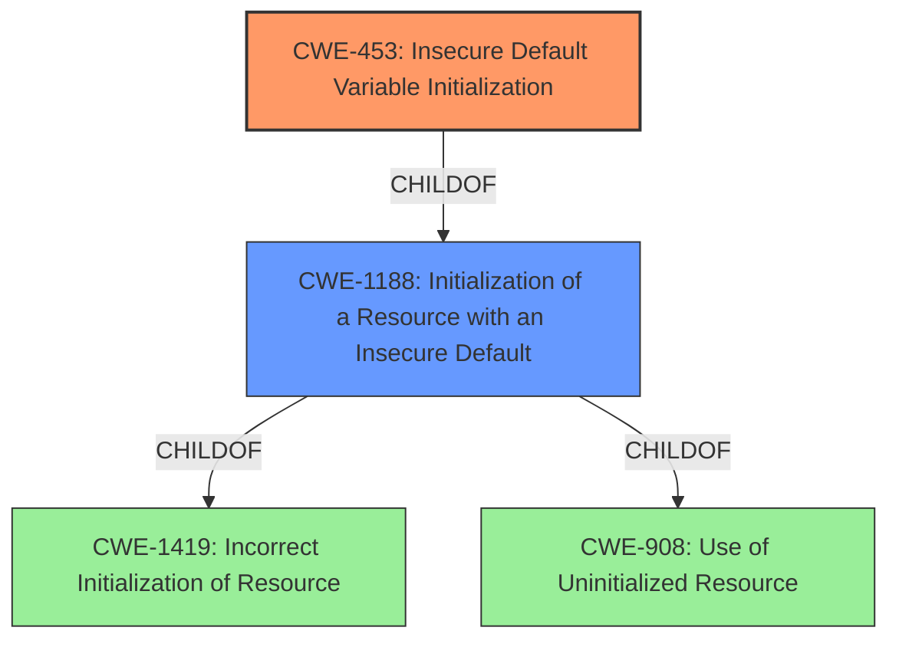

# Analysis Report for CVE-2021-0144

# Vulnerability Analysis Report: CVE-2021-0144

## Description


## Analysis (with Relationship Data)

# Summary
| CWE ID | CWE Name | Confidence | CWE Abstraction Level | CWE Vulnerability Mapping Label | CWE-Vulnerability Mapping Notes |
|---|---|---|---|---|---|
| CWE-453 | Insecure Default Variable Initialization | 1.0 | Variant | Allowed | Primary CWE |
| CWE-1188 | Initialization of a Resource with an Insecure Default | 0.7 | Base | Allowed | Secondary Candidate |

## Evidence and Confidence

*   **Confidence Score:** 0.85
*   **Evidence Strength:** HIGH

## Relationship Analysis
The primary CWE, CWE-453 **(Insecure Default Variable Initialization)**, is a Variant of CWE-1188 **(Initialization of a Resource with an Insecure Default)**. This parent-child relationship influenced the selection, favoring the more specific Variant where the **insecure initialization** is the root cause. Other potential CWEs such as CWE-1419 **(Incorrect Initialization of Resource)** and CWE-908 **(Use of Uninitialized Resource)** were considered but deemed less relevant as they don't specifically address the **insecure nature of the default value**.



## Vulnerability Chain
The vulnerability chain starts with the **insecure default variable initialization (CWE-453)**, which leads to a potential escalation of privilege.

## Summary of Analysis
The analysis is primarily based on the provided evidence, which explicitly states the **root cause** as **"insecure default variable initialization"**.

> **Vulnerability Description Key Phrases**
> -   **rootcause:** **insecure default variable initialization**
> **CVE Reference Links Content Summary**
> -   **Root Cause of Vulnerability:** Insecure default variable initialization within the Intel BIOS Shared SW Architecture (BSSA) Design for Test (DFT) feature.
> -   **Weaknesses/Vulnerabilities Present:** Improper initialization of variables in the firmware.

The retriever results also support this finding, with CWE-453 **(Insecure Default Variable Initialization)** being the top-ranked CWE.

The selection of CWE-453 is at the optimal level of specificity because it directly reflects the **root cause** described in the vulnerability. While CWE-1188 **(Initialization of a Resource with an Insecure Default)** is a valid parent, CWE-453 provides a more precise classification of the weakness.

Relevant CWE Information:

# Enhanced Context (25 CWEs)

## CWE-453: Insecure Default Variable Initialization
**Abstraction:** Variant
**Status:** Draft

### Description
The product, by default, initializes an internal variable with an insecure or less secure value than is possible.

### Extended Description
Not provided

### Alternative Terms
None

### Relationships
ChildOf -> CWE-1188

### Mapping Guidance
**Usage:** Allowed
**Rationale:** This CWE entry is at the Variant level of abstraction, which is a preferred level of abstraction for mapping to the root causes of vulnerabilities.
**Comments:** Carefully read both the name and description to ensure that this mapping is an appropriate fit. Do not try to 'force' a mapping to a lower-level Base/Variant simply to comply with this preferred level of abstraction.
**Reasons:**
- Acceptable-Use

### Additional Notes
**[Maintenance]** This overlaps other categories, probably should be split into separate items.

### Observed Examples
- **CVE-2022-36349:** insecure default variable initialization in BIOS firmware for a hardware board allows DoS

**Analysis:**

The vulnerability description clearly states that the **root cause** is an **insecure default variable initialization**. This aligns perfectly with the description of CWE-453 **(Insecure Default Variable Initialization)**, which specifies that the product initializes a variable with an **insecure** or less secure value by default. The impact of this vulnerability is an escalation of privilege, which can occur when an **insecure default** allows unauthorized actions. The mapping guidance for CWE-453 recommends its use because it is at the Variant level of abstraction. The "Observed Examples" section includes CVE-2022-36349 which also involves **insecure default variable initialization** in BIOS firmware, further strengthening the relevance of this CWE.

## CWE-1188: Initialization of a Resource with an Insecure Default
**Abstraction:** Base
**Status:** Incomplete

### Description
The product initializes or sets a resource with a default that is intended to be changed by the administrator, but the default is not secure.

### Extended Description
Developers often choose default values that leave the product as open and easy to use as possible out-of-the-box, under the assumption that the administrator can (or should) change the default value. However, this ease-of-use comes at a cost when the default is insecure and the administrator does not change it.

### Alternative Terms
None

### Relationships
ChildOf -> CWE-1419
ChildOf -> CWE-665

### Mapping Guidance
**Usage:** Allowed
**Rationale:** This CWE entry is at the Base level of abstraction, which is a preferred level of abstraction for mapping to the root causes of vulnerabilities.
**Comments:** Carefully read both the name and description to ensure that this mapping is an appropriate fit. Do not try to 'force' a mapping to a lower-level Base/Variant simply to comply with this preferred level of abstraction.
**Reasons:**
- Acceptable-Use

### Additional Notes
**[Maintenance]** This entry improves organization of concepts under initialization. The typical CWE model is to cover "Missing" and "Incorrect" behaviors. Arguably, this entry could be named as "Incorrect" instead of "Insecure." This might be changed in the near future.

### Observed Examples
- **CVE-2022-36349:** insecure default variable initialization in BIOS firmware for a hardware board allows DoS
- **CVE-2022-42467:** A generic database browser interface has a default mode that exposes a web server to the network, allowing queries to the database.

**Analysis:**

CWE-1188 **(Initialization of a Resource with an Insecure Default)** is a broader category that encompasses the **insecure initialization** of a resource. While it is relevant to the vulnerability description, it is less specific than CWE-453. The vulnerability involves a variable being initialized with an **insecure default**, which aligns directly with CWE-453. The "Observed Examples" section includes CVE-2022-36349, which is the same as listed for CWE-453, indicating a strong relationship between the two. Given the parent-child relationship where CWE-453 is a child of CWE-1188, and the description clearly identifies an **insecure default variable**, CWE-453 is the more appropriate choice.

## Other CWEs Considered

*   **CWE-1419 (Incorrect Initialization of Resource):** Considered but not used as it is a more general class and doesn't specify the **insecure** nature of the initialization.
*   **CWE-908 (Use of Uninitialized Resource):** Considered but not used as the resource is being initialized, albeit with an **insecure** value, not left uninitialized.
*   **CWE-691 (Insufficient Control Flow Management):** This is a Pillar level CWE and too high level.
*   **CWE-277 (Insecure Inherited Permissions):** This is not relevant because the vulnerability is about **insecure initialization**, not inherited permissions.
*   **CWE-1421 (Exposure of Sensitive Information in Shared Microarchitectural Structures during Transient Execution):** This is not relevant as it deals with exposure of sensitive information in specific hardware structures, not **insecure variable initialization**.
*   **CWE-1256 (Improper Restriction of Software Interfaces to Hardware Features):** This is not relevant, as it refers to software interfaces to hardware, not **insecure initialization**.
*   **CWE-732 (Incorrect Permission Assignment for Critical Resource):** This is not relevant because the issue isn't incorrect permissions, but an **insecure default initialization**.
*   **CWE-284 (Improper Access Control):** This is a Pillar level CWE and too high level.


## CWE Relationship Analysis

Current CWEs represent these abstraction levels: .


### Vulnerability Chain Analysis

**Chain starting from CWE-691:**
- 691 (Insufficient Control Flow Management) - ROOT


**Chain starting from CWE-1421:**
- 1421 (Exposure of Sensitive Information in Shared Microarchitectural Structures during Transient Execution) - ROOT


### CWE Relationship Diagram

```mermaid
graph TD
    classDef primary fill:#f96,stroke:#333,stroke-width:2px
    classDef secondary fill:#69f,stroke:#333
    classDef tertiary fill:#9e9,stroke:#333
```


*Report generated on 2025-04-01 23:07:03*
