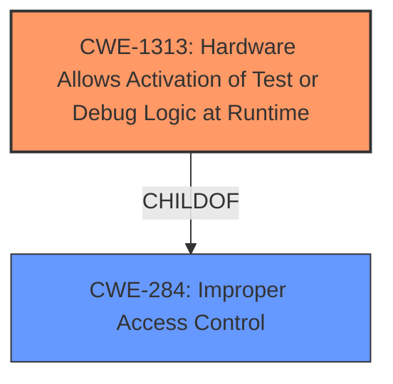

# Enhanced Analysis for CVE-2021-0146

# Summary
| CWE ID   | CWE Name                                                        | Confidence | CWE Abstraction Level | CWE Vulnerability Mapping Label | CWE-Vulnerability Mapping Notes |
| :------- | :-------------------------------------------------------------- | :--------- | :-------------------- | :------------------------------ | :------------------------------ |
| CWE-1313 | Hardware Allows **Activation of Test or Debug Logic at Runtime** | 0.9        | Base                  | Primary                         | Allowed                       |
| CWE-284  | Improper Access Control                                         | 0.5        | Pillar                | Secondary                       | Discouraged                     |

## Evidence and Confidence

*   **Confidence Score:** 0.7
*   **Evidence Strength:** HIGH

## Relationship Analysis
The primary CWE, CWE-1313, is a base-level CWE that directly describes the vulnerability of allowing test or debug logic to be activated at runtime. It is a child of CWE-284, Improper Access Control, a high-level pillar. While CWE-284 is generally discouraged due to its high level, it provides context by highlighting the access control implications of the hardware flaw. The relationship between CWE-1313 and CWE-284 shows a hierarchical structure, with the base CWE providing a specific description of the hardware issue and the pillar CWE offering a broader security context.



## Vulnerability Chain
The vulnerability chain starts with the **activation of test or debug logic at runtime** (CWE-1313). This allows an unauthenticated user with physical access to potentially escalate privileges. The chain can be represented as:

CWE-1313 (Root Cause: Hardware Allows Activation of Test or Debug Logic at Runtime) -> Escalation of Privilege (Impact)

## Summary of Analysis
My analysis concludes that **CWE-1313** is the most appropriate primary CWE for this vulnerability because it directly describes the **root cause**: "Hardware allows **activation of test or debug logic at runtime**." This is supported by the **Vulnerability Description Key Phrases**. "rootcause: **activation of test or debug logic at runtime**". The "CVE Reference Links Content Summary" also states, "The vulnerability stems from a hardware design flaw in certain Intel processors that allows the **activation of test or debug logic at runtime**." The retriever results also list **CWE-1313** as the top combined result.

CWE-284, Improper Access Control, is considered as a secondary CWE because it broadly describes the access control issues that arise from the **activation of test or debug logic at runtime**. The vulnerability allows an unauthenticated user to potentially escalate privileges via physical access. While this reflects an access control problem, CWE-1313 is more specific to the hardware flaw that enables this.
The selection of CWE-1313 is at the optimal level of specificity because it directly matches the hardware **weakness** described in the vulnerability.

Relevant CWE Information:
*   **CWE-1313: Hardware Allows Activation of Test or Debug Logic at Runtime**
    *   **Abstraction:** Base
    *   This CWE entry is at the Base level of abstraction, which is a preferred level of abstraction for mapping to the root causes of vulnerabilities.
    *   The hardware allows for test or debug logic to be activated during runtime, enabling changes to the hardware state. This can alter the intended system behavior and allow for alteration and leakage of sensitive data.
    *   The vulnerability description states, "Hardware allows **activation of test or debug logic at runtime**," directly aligning with the CWE description.

*   **CWE-284: Improper Access Control**
    *   **Abstraction:** Pillar
    *   The product does not restrict or incorrectly restricts access to a resource from an unauthorized actor.
    *   This CWE is a parent of CWE-1313.
    *   While the vulnerability ultimately leads to an escalation of privilege, the more specific **root cause** is the hardware's allowance of test/debug logic at runtime. This makes CWE-1313 a more precise fit.


## CWE Relationship Analysis

Current CWEs represent these abstraction levels: .


### Vulnerability Chain Analysis

**Chain starting from CWE-1313:**
- 1313 (Hardware Allows Activation of Test or Debug Logic at Runtime) - ROOT


**Chain starting from CWE-284:**
- 284 (Improper Access Control) - ROOT


### CWE Relationship Diagram

```mermaid
graph TD
    classDef primary fill:#f96,stroke:#333,stroke-width:2px
    classDef secondary fill:#69f,stroke:#333
    classDef tertiary fill:#9e9,stroke:#333
```