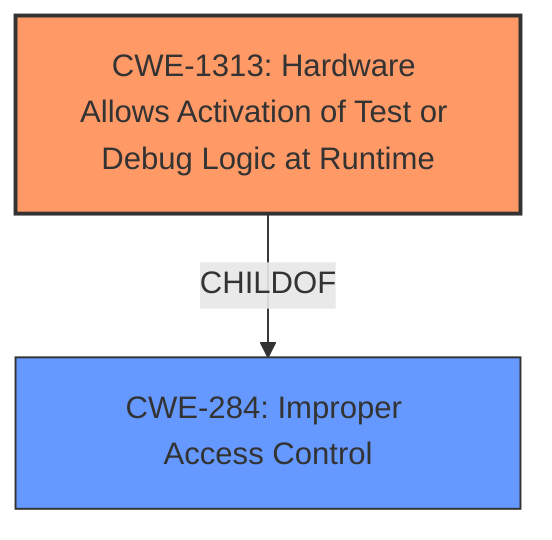

# Analysis for CVE-2021-0146

# Summary
| CWE ID   | CWE Name                                                        | Confidence | CWE Abstraction Level | CWE Vulnerability Mapping Label | CWE-Vulnerability Mapping Notes |
| :------- | :-------------------------------------------------------------- | :--------- | :-------------------- | :------------------------------ | :------------------------------ |
| CWE-1313 | Hardware Allows **Activation of Test or Debug Logic at Runtime** | 0.9        | Base                  | Primary                         | Allowed                       |
| CWE-284  | Improper Access Control                                         | 0.5        | Pillar                | Secondary                       | Discouraged                     |

## Evidence and Confidence

*   **Confidence Score:** 0.7
*   **Evidence Strength:** HIGH

## Relationship Analysis
The primary CWE, CWE-1313, is a base-level CWE that directly describes the vulnerability of allowing test or debug logic to be activated at runtime. It is a child of CWE-284, Improper Access Control, a high-level pillar. While CWE-284 is generally discouraged due to its high level, it provides context by highlighting the access control implications of the hardware flaw. The relationship between CWE-1313 and CWE-284 shows a hierarchical structure, with the base CWE providing a specific description of the hardware issue and the pillar CWE offering a broader security context.

## Vulnerability Chain
The vulnerability chain starts with the **activation of test or debug logic at runtime** (CWE-1313). This allows an unauthenticated user with physical access to potentially escalate privileges. The chain can be represented as:

CWE-1313 (Root Cause: Hardware Allows Activation of Test or Debug Logic at Runtime) -> Escalation of Privilege (Impact)

## Summary of Analysis
My analysis concludes that **CWE-1313** is the most appropriate primary CWE for this vulnerability because it directly describes the **root cause**: "Hardware allows **activation of test or debug logic at runtime**." This is supported by the **Vulnerability Description Key Phrases**. "rootcause: **activation of test or debug logic at runtime**". The "CVE Reference Links Content Summary" also states, "The vulnerability stems from a hardware design flaw in certain Intel processors that allows the **activation of test or debug logic at runtime**." The retriever results also list **CWE-1313** as the top combined result.

CWE-284, Improper Access Control, is considered as a secondary CWE because it broadly describes the access control issues that arise from the **activation of test or debug logic at runtime**. The vulnerability allows an unauthenticated user to potentially escalate privileges via physical access. While this reflects an access control problem, CWE-1313 is more specific to the hardware flaw that enables this.
The selection of CWE-1313 is at the optimal level of specificity because it directly matches the hardware **weakness** described in the vulnerability.

Relevant CWE Information:
*   **CWE-1313: Hardware Allows Activation of Test or Debug Logic at Runtime**
    *   **Abstraction:** Base
    *   This CWE entry is at the Base level of abstraction, which is a preferred level of abstraction for mapping to the root causes of vulnerabilities.
    *   The hardware allows for test or debug logic to be activated during runtime, enabling changes to the hardware state. This can alter the intended system behavior and allow for alteration and leakage of sensitive data.
    *   The vulnerability description states, "Hardware allows **activation of test or debug logic at runtime**," directly aligning with the CWE description.

*   **CWE-284: Improper Access Control**
    *   **Abstraction:** Pillar
    *   The product does not restrict or incorrectly restricts access to a resource from an unauthorized actor.
    *   This CWE is a parent of CWE-1313.
    *   While the vulnerability ultimately leads to an escalation of privilege, the more specific **root cause** is the hardware's allowance of test/debug logic at runtime. This makes CWE-1313 a more precise fit.

# Enhanced Query for CVE-2021-0146

## Vulnerability Description
Hardware allows **activation of test or debug logic at runtime** for some Intel(R) processors which may allow an unauthenticated user to potentially enable escalation of privilege via physical access.

### Vulnerability Description Key Phrases
- **rootcause:** **activation of test or debug logic at runtime**
- **impact:** escalation of privilege
- **vector:** physical access
- **attacker:** unauthenticated user
- **product:** some Intel(R) processors

### CWE for similar CVE Descriptions
### Primary CWE Match
CWE-NVD-Other

#### Top CWEs
- CWE-NVD-Other (Count: 6)
- CWE-NVD-noinfo (Count: 1)

## CVE Reference Links Content Summary
Based on the provided information, here's a breakdown of the vulnerability:

**CVE ID:** CVE-2021-0146

**Root Cause:**
The vulnerability stems from a hardware design flaw in certain Intel processors that allows the activation of test or debug logic at runtime.

**Weaknesses/Vulnerabilities:**
- Hardware allows activation of test or debug logic at runtime
- Unauthenticated user can potentially access this logic via physical access.

**Impact of Exploitation:**
- Escalation of privilege
- Potential for disclosure of sensitive information, modification of data, or denial of service (DoS).

**Attack Vectors:**
- Physical access to the affected system.

**Required Attacker Capabilities/Position:**
- Unauthenticated user
- Physical access to the vulnerable hardware

**Additional Details:**
- Intel is releasing firmware updates to mitigate this issue.
- The vulnerability has a CVSS base score of 7.1 (High) according to Intel, and 6.8 (Medium) according to NetApp.
- The vulnerability affects a range of Intel Pentium, Celeron, and Atom processors.
- The vulnerability was discovered by researchers from Positive Technologies, and an independent researcher. Intel employees also contributed in creating the proof-of-concept.
- NetApp's affected product is Cloud Backup (formerly AltaVault), for which they have no plans to release a fix, stating the product is end-of-life.

## Retriever Results

### Top Combined Results

| Rank | CWE ID | Name | Abstraction | Usage  | Retrievers | Individual Scores |
|------|--------|------|-------------|-------|------------|-------------------|
| 1 | 1313 | Hardware Allows Activation of Test or Debug Logic at Runtime | Base | Allowed | sparse | 0.386 |
| 2 | 691 | Insufficient Control Flow Management | Pillar | Discouraged | sparse | 0.216 |
| 3 | 453 | Insecure Default Variable Initialization | Variant | Allowed | sparse | 0.213 |
| 4 | 1256 | Improper Restriction of Software Interfaces to Hardware Features | Base | Allowed | sparse | 0.208 |
| 5 | 1258 | Exposure of Sensitive System Information Due to Uncleared Debug Information | Base | Allowed | sparse | 0.202 |
| 6 | 1234 | Hardware Internal or Debug Modes Allow Override of Locks | Base | Allowed | dense | 0.642 |
| 7 | 1191 | On-Chip Debug and Test Interface With Improper Access Control | Base | Allowed | graph | 0.002 |
| 8 | 284 | Improper Access Control | Pillar | Discouraged | sparse | 0.196 |
| 9 | 248 | Uncaught Exception | Base | Allowed | sparse | 0.188 |
| 10 | 693 | Protection Mechanism Failure | Pillar | Discouraged | sparse | 0.187 |

# Complete CWE Specifications

## CWE-1313: Hardware Allows Activation of Test or Debug Logic at Runtime
**Abstraction:** Base
**Status:** Draft

### Description
During runtime, the hardware allows for test or debug logic (feature) to be activated, which allows for changing the state of the hardware. This feature can alter the intended behavior of the system and allow for alteration and leakage of sensitive data by an adversary.

### Extended Description

An adversary can take advantage of test or debug logic that is made accessible through the hardware during normal operation to modify the intended behavior of the system. For example, an accessible Test/debug mode may allow read/write access to any system data. Using error injection (a common test/debug feature) during a transmit/receive operation on a bus, data may be modified to produce an unintended message. Similarly, confidentiality could be compromised by such features allowing access to secrets.

### Alternative Terms
None

### Relationships
ChildOf -> CWE-284

### Mapping Guidance
**Usage:** Allowed
**Rationale:** This CWE entry is at the Base level of abstraction, which is a preferred level of abstraction for mapping to the root causes of vulnerabilities.
**Comments:** Carefully read both the name and description to ensure that this mapping is an appropriate fit. Do not try to 'force' a mapping to a lower-level Base/Variant simply to comply with this preferred level of abstraction.
**Reasons:**
- Acceptable-Use

### Observed Examples
- **CVE-2021-33150:** Hardware processor allows activation of test or debug logic at runtime.
- **CVE-2021-0146:** Processor allows the activation of test or debug logic at runtime, allowing escalation of privileges

## CWE-691: Insufficient Control Flow Management
**Abstraction:** Pillar
**Status:** Draft

### Description
The code does not sufficiently manage its control flow during execution, creating conditions in which the control flow can be modified in unexpected ways.

### Extended Description
Not provided

### Alternative Terms
None

### Relationships
None

### Mapping Guidance
**Usage:** Discouraged
**Rationale:** This CWE entry is extremely high-level, a Pillar. However, classification research is limited for weaknesses of this type, so there can be gaps or organizational difficulties within CWE that force use of this weakness, even at such a high level of abstraction.
**Comments:** Where feasible, consider children or descendants of this entry instead.
**Reasons:**
- Abstraction

### Observed Examples
- **CVE-2019-9805:** Chain: Creation of the packet client occurs before initialization is complete (CWE-696) resulting in a read from uninitialized memory (CWE-908), causing memory corruption.
- **CVE-2014-1266:** chain: incorrect "goto" in Apple SSL product bypasses certificate validation, allowing Adversary-in-the-Middle (AITM) attack (Apple "goto fail" bug). CWE-705 (Incorrect Control Flow Scoping) -> CWE-561 (Dead Code) -> CWE-295 (Improper Certificate Validation) -> CWE-393 (Return of Wrong Status Code) -> CWE-300 (Channel Accessible by Non-Endpoint).
- **CVE-2011-1027:** Chain: off-by-one error (CWE-193) leads to infinite loop (CWE-835) using invalid hex-encoded characters.

## CWE-453: Insecure Default Variable Initialization
**Abstraction:** Variant
**Status:** Draft

### Description
The product, by default, initializes an internal variable with an insecure or less secure value than is possible.

### Extended Description
Not provided

### Alternative Terms
None

### Relationships
ChildOf -> CWE-1188

### Mapping Guidance
**Usage:** Allowed
**Rationale:** This CWE entry is at the Variant level of abstraction, which is a preferred level of abstraction for mapping to the root causes of vulnerabilities.
**Comments:** Carefully read both the name and description to ensure that this mapping is an appropriate fit. Do not try to 'force' a mapping to a lower-level Base/Variant simply to comply with this preferred level of abstraction.
**Reasons:**
- Acceptable-Use

### Additional Notes
**[Maintenance]** This overlaps other categories, probably should be split into separate items.

### Observed Examples
- **CVE-2022-36349:** insecure default variable initialization in BIOS firmware for a hardware board allows DoS

## CWE-1256: Improper Restriction of Software Interfaces to Hardware Features
**Abstraction:** Base
**Status:** Stable

### Description
The product provides software-controllable
			device functionality for capabilities such as power and
			clock management, but it does not properly limit
			functionality that can lead to modification of
			hardware memory or register bits, or the ability to
			observe physical side channels.

### Extended Description

It is frequently assumed that physical attacks such as fault injection and side-channel analysis require an attacker to have physical access to the target device. This assumption may be false if the device has improperly secured power management features, or similar features. For mobile devices, minimizing power consumption is critical, but these devices run a wide variety of applications with different performance requirements. Software-controllable mechanisms to dynamically scale device voltage and frequency and monitor power consumption are common features in today's chipsets, but they also enable attackers to mount fault injection and side-channel attacks without having physical access to the device.

Fault injection attacks involve strategic manipulation of bits in a device to achieve a desired effect such as skipping an authentication step, elevating privileges, or altering the output of a cryptographic operation. Manipulation of the device clock and voltage supply is a well-known technique to inject faults and is cheap to implement with physical device access. Poorly protected power management features allow these attacks to be performed from software. Other features, such as the ability to write repeatedly to DRAM at a rapid rate from unprivileged software, can result in bit flips in other memory locations (Rowhammer, [REF-1083]).

Side channel analysis requires gathering measurement traces of physical quantities such as power consumption. Modern processors often include power metering capabilities in the hardware itself (e.g., Intel RAPL) which if not adequately protected enable attackers to gather measurements necessary for performing side-channel attacks from software.

### Alternative Terms
None

### Relationships
ChildOf -> CWE-285

### Mapping Guidance
**Usage:** Allowed
**Rationale:** This CWE entry is at the Base level of abstraction, which is a preferred level of abstraction for mapping to the root causes of vulnerabilities.
**Comments:** Carefully read both the name and description to ensure that this mapping is an appropriate fit. Do not try to 'force' a mapping to a lower-level Base/Variant simply to comply with this preferred level of abstraction.
**Reasons:**
- Acceptable-Use

### Observed Examples
- **CVE-2019-11157:** Plundervolt: Improper conditions check in voltage settings for some Intel(R) Processors may allow a privileged user to potentially enable escalation of privilege and/or information disclosure via local access [REF-1081].
- **CVE-2020-8694:** PLATYPUS Attack: Insufficient access control in the Linux kernel driver for some Intel processors allows information disclosure.
- **CVE-2020-8695:** Observable discrepancy in the RAPL interface for some Intel processors allows information disclosure.

## CWE-1258: Exposure of Sensitive System Information Due to Uncleared Debug Information
**Abstraction:** Base
**Status:** Draft

### Description
The hardware does not fully clear security-sensitive values, such as keys and intermediate values in cryptographic operations, when debug mode is entered.

### Extended Description

Security sensitive values, keys, intermediate steps of cryptographic operations, etc. are stored in temporary registers in the hardware. If these values are not cleared when debug mode is entered they may be accessed by a debugger allowing sensitive information to be accessible by untrusted parties.

### Alternative Terms
None

### Relationships
ChildOf -> CWE-212
ChildOf -> CWE-200

### Mapping Guidance
**Usage:** Allowed
**Rationale:** This CWE entry is at the Base level of abstraction, which is a preferred level of abstraction for mapping to the root causes of vulnerabilities.
**Comments:** Carefully read both the name and description to ensure that this mapping is an appropriate fit. Do not try to 'force' a mapping to a lower-level Base/Variant simply to comply with this preferred level of abstraction.
**Reasons:**
- Acceptable-Use

### Observed Examples
- **CVE-2021-33080:** Uncleared debug information in memory accelerator for SSD product exposes sensitive system information
- **CVE-2022-31162:** Rust library leaks Oauth client details in application debug logs

## CWE-1234: Hardware Internal or Debug Modes Allow Override of Locks
**Abstraction:** Base
**Status:** Incomplete

### Description
System configuration protection may be bypassed during debug mode.

### Extended Description

Device configuration controls are commonly programmed after a device power reset by a trusted firmware or software module (e.g., BIOS/bootloader) and then locked from any further modification. This is commonly implemented using a trusted lock bit, which when set, disables writes to a protected set of registers or address regions. The lock protection is intended to prevent modification of certain system configuration (e.g., memory/memory protection unit configuration). If debug features supported by hardware or internal modes/system states are supported in the hardware design, modification of the lock protection may be allowed allowing access and modification of configuration information.

### Alternative Terms
None

### Relationships
ChildOf -> CWE-667

### Mapping Guidance
**Usage:** Allowed
**Rationale:** This CWE entry is at the Base level of abstraction, which is a preferred level of abstraction for mapping to the root causes of vulnerabilities.
**Comments:** Carefully read both the name and description to ensure that this mapping is an appropriate fit. Do not try to 'force' a mapping to a lower-level Base/Variant simply to comply with this preferred level of abstraction.
**Reasons:**
- Acceptable-Use

## CWE-1191: On-Chip Debug and Test Interface With Improper Access Control
**Abstraction:** Base
**Status:** Stable

### Description
The chip does not implement or does not correctly perform access control to check whether users are authorized to access internal registers and test modes through the physical debug/test interface.

### Extended Description

A device's internal information may be accessed through a scan chain of interconnected internal registers, usually through a JTAG interface. The JTAG interface provides access to these registers in a serial fashion in the form of a scan chain for the purposes of debugging programs running on a device. Since almost all information contained within a device may be accessed over this interface, device manufacturers typically insert some form of authentication and authorization to prevent unintended use of this sensitive information. This mechanism is implemented in addition to on-chip protections that are already present.

If authorization, authentication, or some other form of access control is not implemented or not implemented correctly, a user may be able to bypass on-chip protection mechanisms through the debug interface.

Sometimes, designers choose not to expose the debug pins on the motherboard. Instead, they choose to hide these pins in the intermediate layers of the board. This is primarily done to work around the lack of debug authorization inside the chip. In such a scenario (without debug authorization), when the debug interface is exposed, chip internals are accessible to an attacker.

### Alternative Terms
None

### Relationships
ChildOf -> CWE-284

### Mapping Guidance
**Usage:** Allowed
**Rationale:** This CWE entry is at the Base level of abstraction, which is a preferred level of abstraction for mapping to the root causes of vulnerabilities.
**Comments:** Carefully read both the name and description to ensure that this mapping is an appropriate fit. Do not try to 'force' a mapping to a lower-level Base/Variant simply to comply with this preferred level of abstraction.
**Reasons:**
- Acceptable-Use

### Additional Notes
**[Relationship]** CWE-1191 and CWE-1244 both involve physical debug access, but the weaknesses are different. CWE-1191 is effectively about missing authorization for a debug interface, i.e. JTAG. CWE-1244 is about providing internal assets with the wrong debug access level, exposing the asset to untrusted debug agents.

### Observed Examples
- **CVE-2019-18827:** chain: JTAG interface is not disabled (CWE-1191) during ROM code execution, introducing a race condition (CWE-362) to extract encryption keys

## CWE-284: Improper Access Control
**Abstraction:** Pillar
**Status:** Incomplete

### Description
The product does not restrict or incorrectly restricts access to a resource from an unauthorized actor.

### Extended Description

Access control involves the use of several protection mechanisms such as:

  - Authentication (proving the identity of an actor)

  - Authorization (ensuring that a given actor can access a resource), and

  - Accountability (tracking of activities that were performed)

When any mechanism is not applied or otherwise fails, attackers can compromise the security of the product by gaining privileges, reading sensitive information, executing commands, evading detection, etc.

There are two distinct behaviors that can introduce access control weaknesses:

  - Specification: incorrect privileges, permissions, ownership, etc. are explicitly specified for either the user or the resource (for example, setting a password file to be world-writable, or giving administrator capabilities to a guest user). This action could be performed by the program or the administrator.

  - Enforcement: the mechanism contains errors that prevent it from properly enforcing the specified access control requirements (e.g., allowing the user to specify their own privileges, or allowing a syntactically-incorrect ACL to produce insecure settings). This problem occurs within the program itself, in that it does not actually enforce the intended security policy that the administrator specifies.

### Alternative Terms
Authorization: The terms "access control" and "authorization" are often used interchangeably, although many people have distinct definitions. The CWE usage of "access control" is intended as a general term for the various mechanisms that restrict which users can access which resources, and "authorization" is more narrowly defined. It is unlikely that there will be community consensus on the use of these terms.

### Relationships
None

### Mapping Guidance
**Usage:** Discouraged
**Rationale:** CWE-284 is extremely high-level, a Pillar. Its name, "Improper Access Control," is often misused in low-information vulnerability reports [REF-1287] or by active use of the OWASP Top Ten, such as "A01:2021-Broken Access Control". It is not useful for trend analysis.
**Comments:** Consider using descendants of CWE-284 that are more specific to the kind of access control involved, such as those involving authorization (Missing Authorization (CWE-862), Incorrect Authorization (CWE-863), Incorrect Permission Assignment for Critical Resource (CWE-732), etc.); authentication (Missing Authentication (CWE-306) or Weak Authentication (CWE-1390)); Incorrect User Management (CWE-286); Improper Restriction of Communication Channel to Intended Endpoints (CWE-923); etc.
**Reasons:**
- Frequent Misuse
- Abstraction
**Suggested Alternatives:**
- CWE-862: Missing Authorization
- CWE-863: Incorrect Authorization
- CWE-732: Incorrect Permission Assignment for Critical Resource
- CWE-306: Missing Authentication
- CWE-1390: Weak Authentication
- CWE-923: Improper Restriction of Communication Channel to Intended Endpoints

### Additional Notes
**[Maintenance]** 

This entry needs more work. Possible sub-categories include:

  - Trusted group includes undesired entities (partially covered by CWE-286)

  - Group can perform undesired actions

  - ACL parse error does not fail closed

### Observed Examples
- **CVE-2022-24985:** A form hosting website only checks the session authentication status for a single form, making it possible to bypass authentication when there are multiple forms
- **CVE-2022-29238:** Access-control setting in web-based document collaboration tool is not properly implemented by the code, which prevents listing hidden directories but does not prevent direct requests to files in those directories.
- **CVE-2022-23607:** Python-based HTTP library did not scope cookies to a particular domain such that "supercookies" could be sent to any domain on redirect

## CWE-248: Uncaught Exception
**Abstraction:** Base
**Status:** Draft

### Description
An exception is thrown from a function, but it is not caught.

### Extended Description
When an exception is not caught, it may cause the program to crash or expose sensitive information.

### Alternative Terms
None

### Relationships
ChildOf -> CWE-705
ChildOf -> CWE-755
ChildOf -> CWE-703
ChildOf -> CWE-703

### Mapping Guidance
**Usage:** Allowed
**Rationale:** This CWE entry is at the Base level of abstraction, which is a preferred level of abstraction for mapping to the root causes of vulnerabilities.
**Comments:** Carefully read both the name and description to ensure that this mapping is an appropriate fit. Do not try to 'force' a mapping to a lower-level Base/Variant simply to comply with this preferred level of abstraction.
**Reasons:**
- Acceptable-Use

### Observed Examples
- **CVE-2023-41151:** SDK for OPC Unified Architecture (OPC UA) server has uncaught exception when a socket is blocked for writing but the server tries to send an error
- **CVE-2023-21087:** Java code in a smartphone OS can encounter a "boot loop" due to an uncaught exception

## CWE-693: Protection Mechanism Failure
**Abstraction:** Pillar
**Status:** Draft

### Description
The product does not use or incorrectly uses a protection mechanism that provides sufficient defense against directed attacks against the product.

### Extended Description
This weakness covers three distinct situations. A "missing" protection mechanism occurs when the application does not define any mechanism against a certain class of attack. An "insufficient" protection mechanism might provide some defenses - for example, against the most common attacks - but it does not protect against everything that is intended. Finally, an "ignored" mechanism occurs when a mechanism is available and in active use within the product, but the developer has not applied it in some code path.

### Alternative Terms
None

### Relationships
None

### Mapping Guidance
**Usage:** Discouraged
**Rationale:** This CWE entry is extremely high-level, a Pillar.
**Comments:** Consider children or descendants of this entry instead.
**Reasons:**
- Abstraction

### Additional Notes
**[Research Gap]** The concept of protection mechanisms is well established, but protection mechanism failures have not been studied comprehensively. It is suspected that protection mechanisms can have significantly different types of weaknesses than the weaknesses that they are intended to prevent.

