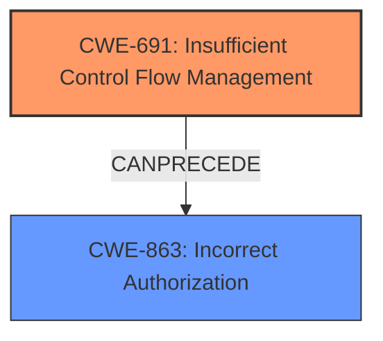

# Analysis Report for CVE-2021-0157

# Vulnerability Analysis Report: CVE-2021-0157

## Description


## Analysis (with Relationship Data)

# Summary
| CWE ID | CWE Name | Confidence | CWE Abstraction Level | CWE Vulnerability Mapping Label | CWE-Vulnerability Mapping Notes |
|---|---|---|---|---|---|
| CWE-691 | Insufficient Control Flow Management | 0.75 | Pillar | Allowed | Primary CWE |
| CWE-863 | Incorrect Authorization | 0.50 | Class | Allowed-with-Review | Secondary Candidate |

## Evidence and Confidence

*   **Confidence Score:** 0.70
*   **Evidence Strength:** MEDIUM

## Relationship Analysis
The primary CWE selected is CWE-691, which is a Pillar-level CWE. While this is a high-level abstraction, the provided information doesn't allow for a more specific mapping. CWE-863 (Incorrect Authorization) was considered as a potential secondary weakness, because **insufficient control flow** could lead to incorrect authorization.



## Vulnerability Chain
The vulnerability chain starts with **insufficient control flow management** (CWE-691) in the BIOS firmware, which could potentially lead to **escalation of privilege**. The **insufficient control flow** could lead to incorrect authorization (CWE-863), enabling a privileged user to escalate their privileges.

## Summary of Analysis
The initial analysis strongly pointed towards CWE-691 due to the explicit mention of "**Insufficient control flow management**" in the vulnerability description.

The description states: "**Insufficient control flow management** in the BIOS firmware for some Intel(R) Processors may allow a privileged user to potentially enable **escalation of privilege** via local access."

The reference links content summary highlights the **root cause** as "**Insufficient control flow management** in the BIOS firmware for some Intel processors."

The retriever results also listed CWE-691 as the top candidate, although it is a Pillar and thus discouraged. While other CWEs like CWE-863 (Incorrect Authorization) and CWE-1220 (Insufficient Granularity of Access Control) were considered, they seem to be potential consequences or related issues rather than the direct cause as described. Given the evidence, CWE-691 is the most appropriate, despite its high level of abstraction.

CWE-863 (Incorrect Authorization) was considered a secondary weakness because the **insufficient control flow** may be a prerequisite for an authorization bypass or other authorization issues leading to privilege escalation.

Relevant CWE Information:

# Enhanced Context (25 CWEs)

## CWE-1289: Improper Validation of Unsafe Equivalence in Input
**Abstraction Level**: Base
**Similarity Score**: 0.80
**Source**: dense

**Description**:
The product receives an input value that is used as a resource identifier or other type of reference, but it does not validate or incorrectly validates that the input is equivalent to a potentially-unsafe value.
**Relationships**: None
**Mapping Guidance**: Usage: Allowed

## CWE-691: Insufficient Control Flow Management
**Abstraction Level**: Pillar
**Similarity Score**: 0.78
**Source**: dense

**Description**:
The code does not sufficiently manage its control flow during execution, creating conditions in which the control flow can be modified in unexpected ways.
**Relationships**: None
**Mapping Guidance**: Usage: Discouraged

## CWE-807: Reliance on Untrusted Inputs in a Security Decision
**Abstraction Level**: Base
**Similarity Score**: 0.78
**Source**: dense

**Description**:
The product uses a protection mechanism that relies on the existence or values of an input, but the input can be modified by an untrusted actor in a way that bypasses the protection mechanism.
**Relationships**: None
**Mapping Guidance**: Usage: Allowed

## CWE-1220: Insufficient Granularity of Access Control
**Abstraction Level**: Base
**Similarity Score**: 0.76
**Source**: dense

**Description**:
The product implements access controls via a policy or other feature with the intention to disable or restrict accesses (reads and/or writes) to assets in a system from untrusted agents. However, implemented access controls lack required granularity, which renders the control policy too broad because it allows accesses from unauthorized agents to the security-sensitive assets.
**Relationships**: ChildOf -> CWE-284
**Mapping Guidance**: Usage: Allowed

## CWE-183: Permissive List of Allowed Inputs
**Abstraction Level**: Base
**Similarity Score**: 0.76
**Source**: dense

**Description**:
The product implements a protection mechanism that relies on a list of inputs (or properties of inputs) that are explicitly allowed by policy because the inputs are assumed to be safe, but the list is too permissive - that is, it allows an input that is unsafe, leading to resultant weaknesses.
**Relationships**: None
**Mapping Guidance**: Usage: Allowed

## CWE-1288: Improper Validation of Consistency within Input
**Abstraction Level**: Base
**Similarity Score**: 0.76
**Source**: dense

**Description**:
The product receives a complex input with multiple elements or fields that must be consistent with each other, but it does not validate or incorrectly validates that the input is actually consistent.
**Relationships**: None
**Mapping Guidance**: Usage: Allowed

## CWE-653: Improper Isolation or Compartmentalization
**Abstraction Level**: Class
**Similarity Score**: 0.76
**Source**: dense

**Description**:
The product does not properly compartmentalize or isolate functionality, processes, or resources that require different privilege levels, rights, or permissions.
**Relationships**: None
**Mapping Guidance**: Usage: Allowed

## CWE-1173: Improper Use of Validation Framework
**Abstraction Level**: Base
**Similarity Score**: 0.76
**Source**: dense

**Description**:
The product does not use, or incorrectly uses, an input validation framework that is provided by the source language or an independent library.
**Relationships**: None
**Mapping Guidance**: Usage: Allowed

## CWE-184: Incomplete List of Disallowed Inputs
**Abstraction Level**: Base
**Similarity Score**: 0.75
**Source**: dense

**Description**:
The product implements a protection mechanism that relies on a list of inputs (or properties of inputs) that are not allowed by policy or otherwise require other action to neutralize before additional processing takes place, but the list is incomplete.
**Relationships**: None
**Mapping Guidance**: Usage: Allowed

## CWE-274: Improper Handling of Insufficient Privileges
**Abstraction Level**: Base
**Similarity Score**: 0.75
**Source**: dense

**Description**:
The product does not handle or incorrectly handles when it has insufficient privileges to perform an operation, leading to resultant weaknesses.
**Relationships**: None
**Mapping Guidance**: Usage: Discouraged

## CWE-119: Improper Restriction of Operations within the Bounds of a Memory Buffer
**Abstraction Level**: Class
**Similarity Score**: 7258.51
**Source**: sparse

**Description**:
The product performs operations on a memory buffer, but it reads from or writes to a memory location outside the buffer's intended boundary. This may result in read or write operations on unexpected memory locations that could be linked to other variables, data structures, or internal program data.
**Relationships**: ChildOf -> CWE-118, ChildOf -> CWE-20
**Mapping Guidance**: Usage: Discouraged

## CWE-863: Incorrect Authorization
**Abstraction Level**: Class
**Similarity Score**: 7083.31
**Source**: sparse

**Description**:
The product performs an authorization check when an actor attempts to access a resource or perform an action, but it does not correctly perform the check.
**Relationships**: None
**Mapping Guidance**: Usage: Allowed-with-Review

## CWE-125: Out-of-bounds Read
**Abstraction Level**: Base
**Similarity Score**: 7033.63
**Source**: sparse

**Description**:
The product reads data past the end, or before the beginning, of the intended buffer.
**Relationships**: None
**Mapping Guidance**: Usage: Allowed

## CWE-287: Improper Authentication
**Abstraction Level**: Class
**Similarity Score**: 7018.76
**Source**: sparse

**Description**:
When an actor claims to have a given identity, the product does not prove or insufficiently proves that the claim is correct.
**Relationships**: ChildOf -> CWE-284
**Mapping Guidance**: Usage: Discouraged

## CWE-22: Improper Limitation of a Pathname to a Restricted Directory ('Path Traversal')
**Abstraction Level**: Base
**Similarity Score**: 6979.45
**Source**: sparse

**Description**:
The product uses external input to construct a pathname that is intended to identify a file or directory that is located underneath a restricted parent directory, but the product does not properly neutralize special elements within the pathname that can cause the pathname


## CWE Relationship Analysis

Current CWEs represent these abstraction levels: .


### Vulnerability Chain Analysis

**Chain starting from CWE-691:**
- 691 (Insufficient Control Flow Management) - ROOT


**Chain starting from CWE-20:**
- 20 (Improper Input Validation) - ROOT


### CWE Relationship Diagram

```mermaid
graph TD
    classDef primary fill:#f96,stroke:#333,stroke-width:2px
    classDef secondary fill:#69f,stroke:#333
    classDef tertiary fill:#9e9,stroke:#333
```


*Report generated on 2025-04-02 12:44:04*
