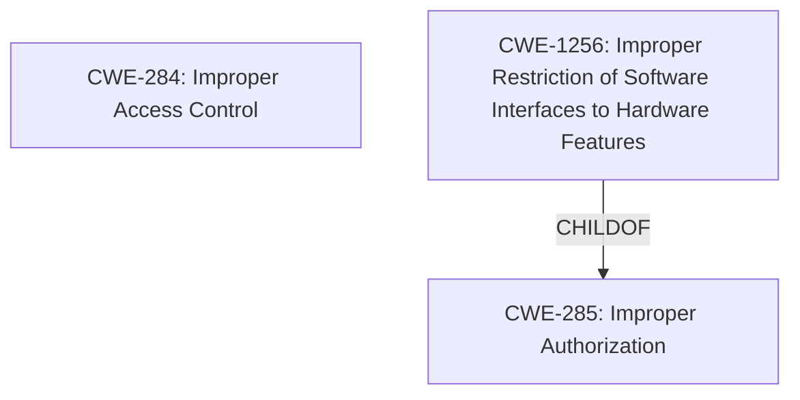

# Raw Analyzer Response for CVE-2021-0171

# Summary
| CWE ID | CWE Name | Confidence | CWE Abstraction Level | CWE Vulnerability Mapping Label | CWE-Vulnerability Mapping Notes |
|---|---|---|---|---|---|
| CWE-284 | Improper Access Control | 0.75 | Pillar | Primary | Discouraged |
| CWE-1256 | Improper Restriction of Software Interfaces to Hardware Features | 0.5 | Base | Secondary | Allowed |

## Evidence and Confidence

*   **Confidence Score:** 0.7
*   **Evidence Strength:** MEDIUM

## Relationship Analysis
The primary CWE is CWE-284, a Pillar-level weakness. While it directly aligns with the stated **Improper access control**, it is generally discouraged due to its high level of abstraction. CWE-1256, a Base level weakness, is considered because it relates to improper restriction of software interfaces to hardware features. It's a child of CWE-285 (Improper Authorization), suggesting a potential connection to authorization issues.

## Vulnerability Chain
The vulnerability chain starts with **improper access control**, leading to information disclosure.
  - Root Cause: **Improper Access Control**
  - Impact: Information Disclosure

## Summary of Analysis
The initial assessment identified CWE-284 as the primary candidate due to the explicit mention of "**Improper access control**" in the vulnerability description and CVE Reference Links Content Summary. However, CWE-284 is a Pillar-level CWE and its use is discouraged.

The analysis considered CWE-1256 because the vulnerability is in software for Intel(R) PROSet/Wireless Wi-Fi and Killer(TM) Wi-Fi, implying interaction between software and hardware features. But the description lacks specific details about hardware interactions to justify CWE-1256 definitively.

The final decision is to assign CWE-284 as the primary CWE, acknowledging that it's a high-level classification. While CWE-1256 might be relevant, the evidence is insufficient to support it strongly. The choice reflects a balance between direct evidence and the need for a more specific classification where possible.

Relevant CWE Information:

# Enhanced Context (25 CWEs)
The following CWEs were identified as potentially relevant to this vulnerability:

## CWE-691: Insufficient Control Flow Management
**Abstraction Level**: Pillar
**Similarity Score**: 0.76

## CWE-131: Incorrect Calculation of Buffer Size
**Abstraction Level**: Base
**Similarity Score**: 0.76

## CWE-1289: Improper Validation of Unsafe Equivalence in Input
**Abstraction Level**: Base
**Similarity Score**: 0.76

## CWE-119: Improper Restriction of Operations within the Bounds of a Memory Buffer
**Abstraction Level**: Class
**Similarity Score**: 0.75

## CWE-191: Integer Underflow (Wrap or Wraparound)
**Abstraction Level**: Base
**Similarity Score**: 0.75

## CWE-805: Buffer Access with Incorrect Length Value
**Abstraction Level**: Base
**Similarity Score**: 0.75

## CWE-667: Improper Locking
**Abstraction Level**: Class
**Similarity Score**: 0.75

## CWE-125: Out-of-bounds Read
**Abstraction Level**: Base
**Similarity Score**: 0.75

## CWE-653: Improper Isolation or Compartmentalization
**Abstraction Level**: Class
**Similarity Score**: 0.75

## CWE-404: Improper Resource Shutdown or Release
**Abstraction Level**: Class
**Similarity Score**: 0.75

## CWE-119: Improper Restriction of Operations within the Bounds of a Memory Buffer
**Abstraction Level**: Class
**Similarity Score**: 6597.37

## CWE-1284: Improper Validation of Specified Quantity in Input
**Abstraction Level**: Base
**Similarity Score**: 6534.11

## CWE-125: Out-of-bounds Read
**Abstraction Level**: Base
**Similarity Score**: 6467.45

## CWE-1285: Improper Validation of Specified Index, Position, or Offset in Input
**Abstraction Level**: Base
**Similarity Score**: 6430.82

## CWE-20: Improper Input Validation
**Abstraction Level**: Class
**Similarity Score**: 6419.96

## CWE-41: Improper Resolution of Path Equivalence
**Abstraction Level**: base
**Similarity Score**: 5.03

## CWE-22: Improper Limitation of a Pathname to a Restricted Directory ('Path Traversal')
**Abstraction Level**: base
**Similarity Score**: 4.33

## CWE-770: Allocation of Resources Without Limits or Throttling
**Abstraction Level**: base
**Similarity Score**: 4.33

## CWE-73: External Control of File Name or Path
**Abstraction Level**: base
**Similarity Score**: 4.33

## CWE-190: Integer Overflow or Wraparound
**Abstraction Level**: base
**Similarity Score**: 4.33

## CWE-787: Out-of-bounds Write
**Abstraction Level**: base
**Similarity Score**: 4.33

## CWE-822: Untrusted Pointer Dereference
**Abstraction Level**: base
**Similarity Score**: 4.33

## CWE-781: Improper Address Validation in IOCTL with METHOD_NEITHER I/O Control Code
**Abstraction Level**: variant
**Similarity Score**: 3.88

## CWE-322: Key Exchange without Entity Authentication
**Abstraction Level**: base
**Similarity Score**: 3.57

## CWE-1284: Improper Validation of Specified Quantity in Input
**Abstraction Level**: base
**Similarity Score**: 3.42

## CWE-284: Improper Access Control
**CWE-284** (Improper Access Control) is selected as the primary CWE because the vulnerability description explicitly mentions "**Improper access control**". The CVE Reference Links Content Summary reinforces this by stating the root cause as "**Improper access control**". However, CWE-284 is a Pillar-level CWE, and the MITRE mapping guidance discourages its use due to its high level of abstraction and potential for misuse. It is a general term, and more specific CWEs should be preferred when available. The impact is information disclosure, indicating a potential failure in restricting access to sensitive data.
**Confidence:** 0.75

## CWE-1256: Improper Restriction of Software Interfaces to Hardware Features
**CWE-1256** (Improper Restriction of Software Interfaces to Hardware Features) is considered because the vulnerability affects Intel(R) PROSet/Wireless Wi-Fi and Killer(TM) Wi-Fi software. This suggests a potential interaction between software and hardware features. If the **improper access control** relates to how the software manages or restricts access to specific hardware functionalities, then CWE-1256 could be relevant. However, the description lacks specific details about hardware interactions. Without more evidence, it's difficult to determine whether this vulnerability directly involves the improper restriction of software interfaces to hardware features. Therefore, it can only be considered as a secondary candidate.
**Confidence:** 0.5

## Other CWEs Considered and Rejected:

- **CWE-20 (Improper Input Validation)**, **CWE-1284 (Improper Validation of Specified Quantity in Input)**, **CWE-1285 (Improper Validation of Specified Index, Position, or Offset in Input)**, **CWE-1288 (Improper Validation of Consistency within Input)**, **CWE-1173 (Improper Use of Validation Framework)**: These CWEs relate to input validation issues. However, the vulnerability description doesn't explicitly mention any problems with input validation. It focuses on **improper access control**, suggesting a different type of weakness. Therefore, these CWEs are not appropriate.
- **CWE-119 (Improper Restriction of Operations within the Bounds of a Memory Buffer)**, **CWE-787 (Out-of-bounds Write)**, **CWE-125 (Out-of-bounds Read)**: These CWEs relate to memory buffer issues. The vulnerability description doesn't suggest any problems with memory buffers, so these CWEs are not relevant.
- **CWE-73 (External Control of File Name or Path)**, **CWE-22 (Improper Limitation of a Pathname to a Restricted Directory ('Path Traversal'))**: These CWEs relate to path traversal issues, which are not mentioned in the vulnerability description.
- **CWE-770 (Allocation of Resources Without Limits or Throttling)**: This CWE is about resource allocation without limits, which is unrelated to the described vulnerability.
- **CWE-781 (Improper Address Validation in IOCTL with METHOD_NEITHER I/O Control Code)**: This CWE is specific to IOCTL