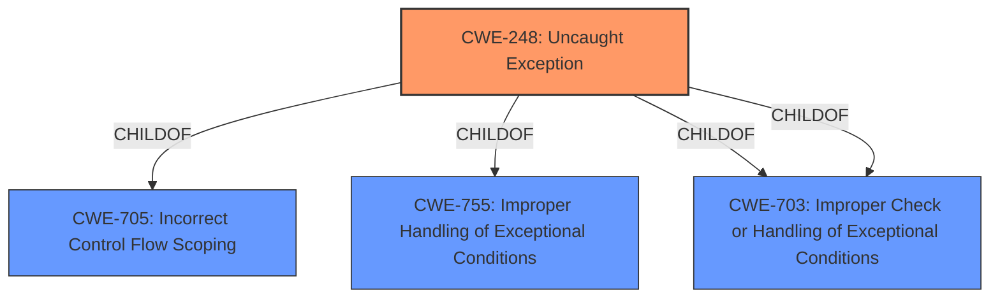

# Enhanced Analysis for CVE-2021-0190

# Summary
| CWE ID | CWE Name | Confidence | CWE Abstraction Level | CWE Vulnerability Mapping Label | CWE-Vulnerability Mapping Notes |
|---|---|---|---|---|---|
| CWE-248 | Uncaught Exception | 1.0 | Base | Allowed | Primary CWE |
| CWE-1256 | Improper Restriction of Software Interfaces to Hardware Features | 0.5 | Base | Allowed | Secondary Candidate |

## Evidence and Confidence

*   **Confidence Score:** 0.8
*   **Evidence Strength:** HIGH

## Relationship Analysis
The primary relationship that influenced the CWE selection was the parent-child relationship, specifically where CWE-248 is a child of CWE-705, CWE-755, and CWE-703 (twice), all of which relate to improper handling of exceptional conditions. The selection of CWE-248 as the base level CWE was supported by the evidence of the **uncaught exception** within the BIOS firmware.



## Vulnerability Chain
The vulnerability chain starts with an **uncaught exception** (CWE-248), which leads to an escalation of privilege. The specific mechanisms by which the exception leads to privilege escalation are not detailed in the vulnerability description, creating a gap in the chain.

## Summary of Analysis
The primary selection of CWE-248 is based on the direct evidence from the vulnerability description and CVE reference summary, which clearly states that the root cause is an **uncaught exception** in the BIOS firmware. The retriever results also support this selection with a high similarity score.

CWE-1256 was considered as a secondary candidate because the vulnerability occurs in the BIOS firmware and involves hardware features. However, the description does not explicitly mention improper restriction of software interfaces to hardware features, making CWE-248 a more accurate initial classification.

The selection of CWE-248 is at the optimal level of specificity because it is a Base-level CWE that directly addresses the root cause of the vulnerability which is the **uncaught exception**.

Relevant CWE Information:

# Enhanced Context (25 CWEs)

## CWE-1256: Improper Restriction of Software Interfaces to Hardware Features
**Abstraction Level**: Base
**Similarity Score**: 0.79
**Source**: dense

**Description**:
The product provides software-controllable
			device functionality for capabilities such as power and
			clock management, but it does not properly limit
			functionality that can lead to modification of
			hardware memory or register bits, or the ability to
			observe physical side channels.

**Mapping Guidance**:
- Usage: Allowed
- Rationale: This CWE entry is at the Base level of abstraction, which is a preferred level of abstraction for mapping to the root causes of vulnerabilities.

# Vulnerability Report

## Vulnerability Description
**Uncaught exception** in the BIOS firmware for some Intel(R) Processors may allow a privileged user to potentially enable aescalation of privilege via local access.

### Vulnerability Description Key Phrases
- **rootcause:** **Uncaught exception**
- **impact:** escalation of privilege
- **attacker:** privileged user
- **product:** Intel(R) Processors
- **component:** BIOS firmware

## CVE Reference Links Content Summary
Based on the provided content, here's an analysis of CVE-2021-0190:

**Root Cause of Vulnerability:**
- The vulnerability stems from an **uncaught exception** within the BIOS firmware of certain Intel processors.

**Weaknesses/Vulnerabilities Present:**
- **Uncaught exception**: The BIOS firmware does not properly handle exceptions, leading to a potential exploitable state.

**Impact of Exploitation:**
- Escalation of Privilege: A successful exploit could allow a privileged user to gain elevated privileges on the system.
- The NetApp advisory indicates potential impacts of sensitive information disclosure, data modification, or denial of service (DoS), which may result from exploitation of this and related vulnerabilities.

**Attack Vectors:**
- Local Access: The attack vector is local, meaning the attacker needs to have existing access to the target system.

**Required Attacker Capabilities/Position:**
- Privileged User: The attacker must already possess privileged access to the system to trigger the vulnerability. This means the vulnerability is not directly exploitable by an unprivileged user.

**Additional Details:**
- The Intel advisory (INTEL-SA-00601) groups this CVE with other BIOS vulnerabilities.
- The vulnerability affects a range of Intel processors, including some Xeon, Core, and Pentium/Celeron families.
- The CVSS v3.1 vector is AV:L/AC:L/PR:H/UI:N/S:C/C:H/I:H/A:H, indicating local attack vector, low attack complexity, high privileges required, no user interaction, scope change, and high impact on confidentiality, integrity, and availability.
- NetApp has confirmed that none of their products are affected, although they incorporate Intel Technology that is vulnerable.

## Retriever Results

### Top Combined Results

| Rank | CWE ID | Name | Abstraction | Usage  | Retrievers | Individual Scores |
|------|--------|------|-------------|-------|------------|-------------------|
| 1 | 248 | Uncaught Exception | Base | Allowed | sparse | 0.317 |
| 2 | 691 | Insufficient Control Flow Management | Pillar | Discouraged | sparse | 0.242 |
| 3 | 466 | Return of Pointer Value Outside of Expected Range | Base | Allowed | sparse | 0.209 |
| 4 | 453 | Insecure Default Variable Initialization | Variant | Allowed | sparse | 0.208 |
| 5 | 119 | Improper Restriction of Operations within the Bounds of a Memory Buffer | Class | Discouraged | sparse | 0.184 |
| 6 | 1342 | Information Exposure through Microarchitectural State after Transient Execution | Base | Allowed | dense | 0.593 |
| 7 | 617 | Reachable Assertion | Base | Allowed | graph | 0.002 |
| 8 | 693 | Protection Mechanism Failure | Pillar | Discouraged | sparse | 0.178 |
| 9 | 284 | Improper Access Control | Pillar | Discouraged | sparse | 0.176 |
| 10 | 1256 | Improper Restriction of Software Interfaces to Hardware Features | Base | Allowed | sparse | 0.170 |


## CWE Relationship Analysis

Current CWEs represent these abstraction levels: .


### Vulnerability Chain Analysis

**Chain starting from CWE-248:**
- 248 (Uncaught Exception) - ROOT


**Chain starting from CWE-1256:**
- 1256 (Improper Restriction of Software Interfaces to Hardware Features) - ROOT


### CWE Relationship Diagram

```mermaid
graph TD
    classDef primary fill:#f96,stroke:#333,stroke-width:2px
    classDef secondary fill:#69f,stroke:#333
    classDef tertiary fill:#9e9,stroke:#333
```