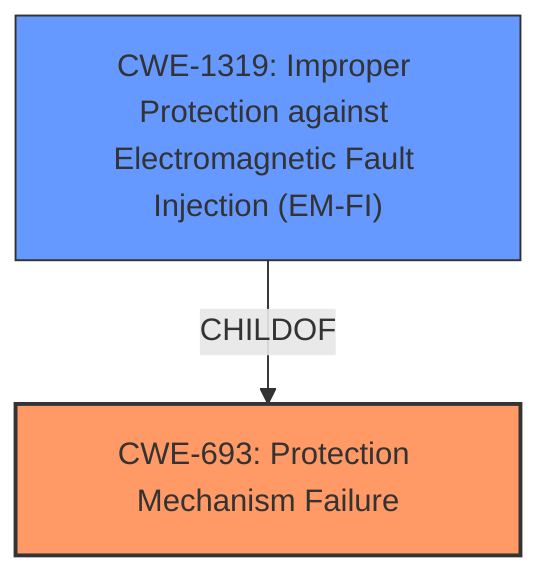

# Raw Analyzer Response for CVE-2021-0197

# Summary
| CWE ID  | CWE Name                                               | Confidence | CWE Abstraction Level | CWE Vulnerability Mapping Label | CWE-Vulnerability Mapping Notes |
| :-------- | :----------------------------------------------------- | :--------- | :---------------------- | :------------------------------ | :------------------------------ |
| CWE-693   | Protection Mechanism Failure                           | 0.9        | Pillar                  | Primary                         | Discouraged                   |

## Evidence and Confidence

*   **Confidence Score:** 0.9
*   **Evidence Strength:** HIGH

## Relationship Analysis
The primary CWE selected is CWE-693, which is a Pillar-level weakness. While discouraged, it directly reflects the description's focus on a **"protection mechanism failure"**. Alternatives like more specific child CWEs of access control or authentication issues were considered, but the description doesn't provide enough detail to pinpoint a precise mechanism. The high-level nature of the description necessitates using the Pillar CWE.

## Vulnerability Chain
The vulnerability chain is relatively simple: a **protection mechanism failure** leads to a denial of service.

## Summary of Analysis
The initial assessment strongly pointed towards CWE-693 due to the explicit mention of "**Protection mechanism failure**" in both the vulnerability description and the CVE reference summary. The lack of specifics regarding the type of protection mechanism involved makes selecting a more granular CWE difficult. The decision is based heavily on the provided evidence, specifically:

*   "**Protection mechanism failure** in the firmware" (Vulnerability Description)
*   "The root cause is a **failure in the protection mechanism** within the firmware" (CVE Reference Links Content Summary)
*   "**Protection Mechanism Failure**: The firmware lacks proper protection mechanisms." (CVE Reference Links Content Summary)

The CWE-693 is used even though it is discouraged because there isn't enough detail to go with a more specific CWE.

Relevant CWE Information:

# Enhanced Context (25 CWEs)

## CWE-693: Protection Mechanism Failure
**Abstraction:** Pillar
**Status:** Draft

### Description
The product does not use or incorrectly uses a protection mechanism that provides sufficient defense against directed attacks against the product.

### Extended Description
This weakness covers three distinct situations. A "missing" protection mechanism occurs when the application does not define any mechanism against a certain class of attack. An "insufficient" protection mechanism might provide some defenses - for example, against the most common attacks - but it does not protect against everything that is intended. Finally, an "ignored" mechanism occurs when a mechanism is available and in active use within the product, but the developer has not applied it in some code path.