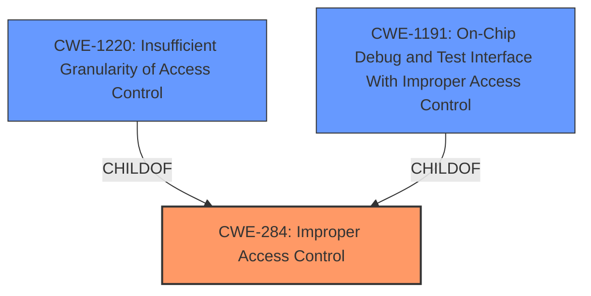

# Enhanced Analysis for CVE-2021-0198

# Summary
| CWE ID  | CWE Name | Confidence | CWE Abstraction Level | CWE Vulnerability Mapping Label | CWE-Vulnerability Mapping Notes |
|---|---|---|---|---|---|
| CWE-284 | Improper Access Control | 0.75 | Pillar | Discouraged | The description indicates "**Improper access control**" which directly aligns with this CWE. However, this is a high-level CWE. |
| CWE-1220 | Insufficient Granularity of Access Control | 0.7 | Base | Allowed | Access controls are implemented, but they lack the required granularity, leading to unauthorized access. |
| CWE-1191 | On-Chip Debug and Test Interface With Improper Access Control | 0.6 | Base | Allowed | The issue is **improper access control** in firmware, which could potentially relate to debug interfaces. |

## Evidence and Confidence

*   **Confidence Score:** 0.7
*   **Evidence Strength:** MEDIUM

## Relationship Analysis
The primary relationship influencing the CWE selection is the hierarchical structure, where CWE-284 is a parent (Pillar) of CWE-1220 (Base). The choice between them depends on the level of detail available. CWE-1191 is a peer (Base) of CWE-1220 related to hardware.



## Vulnerability Chain
The vulnerability chain starts with **improper access control**, leading to a potential denial of service.

## Summary of Analysis
The initial assessment highlights **improper access control** as the primary weakness, which aligns with CWE-284. However, CWE-284 is a high-level Pillar, and the description suggests that the access controls are implemented but lack sufficient granularity. This points to a more specific weakness: CWE-1220, Insufficient Granularity of Access Control. The retriever also shows a high score for CWE-1220. The evidence provided focuses on the **improper access control** and potential DoS, but it is not conclusive enough to definitively choose the more specific CWE-1220, though it is a strong candidate. Given the limited information, I'm starting with CWE-284 and listing other CWE's as secondary.

Relevant CWE Information:

# Enhanced Context (25 CWEs)
The following CWEs were identified as potentially relevant to this vulnerability:

## CWE-1220: Insufficient Granularity of Access Control
**Abstraction Level**: Base
**Similarity Score**: 0.80
**Source**: dense

**Description**:
The product implements access controls via a policy or other feature with the intention to disable or restrict accesses (reads and/or writes) to assets in a system from untrusted agents. However, implemented access controls lack required granularity, which renders the control policy too broad because it allows accesses from unauthorized agents to the security-sensitive assets.

**Mapping Guidance**:
- Usage: Allowed
- Rationale: This CWE entry is at the Base level of abstraction, which is a preferred level of abstraction for mapping to the root causes of vulnerabilities.

## CWE-284: Improper Access Control
**Abstraction:** Pillar
**Status:** Incomplete

### Description
The product does not restrict or incorrectly restricts access to a resource from an unauthorized actor.

### Extended Description


Access control involves the use of several protection mechanisms such as:


  - Authentication (proving the identity of an actor)

  - Authorization (ensuring that a given actor can access a resource), and

  - Accountability (tracking of activities that were performed)

When any mechanism is not applied or otherwise fails, attackers can compromise the security of the product by gaining privileges, reading sensitive information, executing commands, evading detection, etc.

There are two distinct behaviors that can introduce access control weaknesses:


  - Specification: incorrect privileges, permissions, ownership, etc. are explicitly specified for either the user or the resource (for example, setting a password file to be world-writable, or giving administrator capabilities to a guest user). This action could be performed by the program or the administrator.

  - Enforcement: the mechanism contains errors that prevent it from properly enforcing the specified access control requirements (e.g., allowing the user to specify their own privileges, or allowing a syntactically-incorrect ACL to produce insecure settings). This problem occurs within the program itself, in that it does not actually enforce the intended security policy that the administrator specifies.
### Mapping Guidance
**Usage:** Discouraged
**Rationale:** CWE-284 is extremely high-level, a Pillar. Its name, "Improper Access Control," is often misused in low-information vulnerability reports [REF-1287] or by active use of the OWASP Top Ten, such as "A01:2021-Broken Access Control". It is not useful for trend analysis.
**Comments:** Consider using descendants of CWE-284 that are more specific to the kind of access control involved, such as those involving authorization (Missing Authorization (CWE-862), Incorrect Authorization (CWE-863), Incorrect Permission Assignment for Critical Resource (CWE-732), etc.); authentication (Missing Authentication (CWE-306) or Weak Authentication (CWE-1390)); Incorrect User Management (CWE-286); Improper Restriction of Communication Channel to Intended Endpoints (CWE-923); etc.
**Reasons:**
- Frequent Misuse
- Abstraction
**Suggested Alternatives:**
- CWE-862: Missing Authorization
- CWE-863: Incorrect Authorization
- CWE-732: Incorrect Permission Assignment for Critical Resource
- CWE-306: Missing Authentication
- CWE-1390: Weak Authentication
- CWE-923: Improper Restriction of Communication Channel to Intended Endpoints

## CWE-1191: On-Chip Debug and Test Interface With Improper Access Control
**Abstraction Level**: Base
**Similarity Score**: 0.75
**Source**: dense

**Description**:
The chip does not implement or does not correctly perform access control to check whether users are authorized to access internal registers and test modes through the physical debug/test interface.

**Mapping Guidance**:
- Usage: Allowed
- Rationale: This CWE entry is at the Base level of abstraction, which is a preferred level of abstraction for mapping to the root causes of vulnerabilities.

The final decision favors CWE-284 due to the explicit mention of **improper access control** in the description. However, it is essential to acknowledge that the evidence is not strong enough to exclude other more specific CWEs, especially CWE-1220. CWE-1191 is possible but less likely given the general nature of the description and the lack of mention of debug interfaces. The use of CWE-284 is explicitly discouraged, so the best option is to map to CWE-1220 with a note indicating the lack of granularity.


## CWE Relationship Analysis

Current CWEs represent these abstraction levels: .


### Vulnerability Chain Analysis

**Chain starting from CWE-732:**
- 732 (Incorrect Permission Assignment for Critical Resource) - ROOT


**Chain starting from CWE-286:**
- 286 (Incorrect User Management) - ROOT


### CWE Relationship Diagram

```mermaid
graph TD
    classDef primary fill:#f96,stroke:#333,stroke-width:2px
    classDef secondary fill:#69f,stroke:#333
    classDef tertiary fill:#9e9,stroke:#333
```