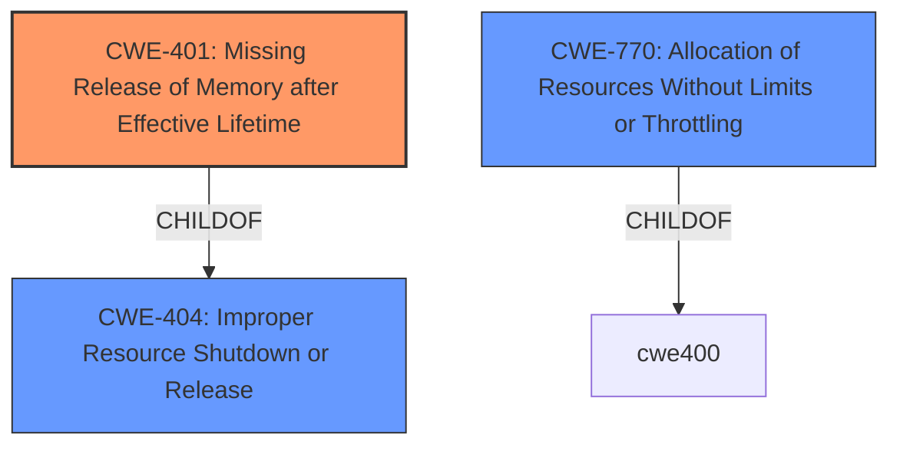

# Enhanced Analysis for CVE-2021-0202

# Summary
| CWE ID | CWE Name | Confidence | CWE Abstraction Level | CWE Vulnerability Mapping Label | CWE-Vulnerability Mapping Notes |
|---|---|---|---|---|---|
| CWE-401 | Missing Release of Memory after Effective Lifetime | 1.0 | Variant | Allowed | Primary CWE |
| CWE-404 | Improper Resource Shutdown or Release | 0.5 | Class | Allowed-with-Review | Secondary Candidate |
| CWE-770 | Allocation of Resources Without Limits or Throttling | 0.4 | Base | Allowed | Secondary Candidate |

## Evidence and Confidence

*   **Confidence Score:** 0.9
*   **Evidence Strength:** HIGH

## Relationship Analysis
The primary CWE selected is CWE-401, which is a variant of CWE-404. This indicates a hierarchical relationship where CWE-401 is a more specific type of resource management issue. CWE-770 is a parent of CWE-789, which was identified in other CVE descriptions, so it was considered.



## Vulnerability Chain
The vulnerability chain starts with a specific network event, which then triggers a **memory leak** (CWE-401), leading to out-of-memory conditions, MPC restarts, and finally, traffic interruption.

## Summary of Analysis
The initial assessment strongly points to CWE-401, Missing Release of Memory after Effective Lifetime, as the primary weakness. The vulnerability description explicitly mentions a **memory leak** as the root cause, aligning perfectly with CWE-401's description.

> Vulnerability Description Key Phrases
> - **weakness:** **memory leak**

The retriever results also list CWE-401 as the top match, further solidifying this assessment. The relationship analysis confirms that CWE-401 is a variant (more specific) of CWE-404 (Improper Resource Shutdown or Release), which is a broader category.

The decision to select CWE-401 is based on direct evidence from the vulnerability description and is supported by the retriever results and relationship analysis. The selected CWE is at the optimal level of specificity (Variant) as it accurately represents the weakness described in the vulnerability.

Relevant CWE Information:

# Enhanced Context (25 CWEs)
The following CWEs were identified as potentially relevant to this vulnerability:

## CWE-404: Improper Resource Shutdown or Release
**Abstraction Level**: Class
**Similarity Score**: 0.81
**Source**: dense

**Description**:
The product does not release or incorrectly releases a resource before it is made available for re-use.

**Mapping Guidance**:
- Usage: Allowed-with-Review
- Rationale: This CWE entry is a Class and might have Base-level children that would be more appropriate

This was considered as a candidate because CWE-401 is a child of CWE-404. However, CWE-401 is a more specific variant and therefore a better fit.

## CWE-770: Allocation of Resources Without Limits or Throttling
**Abstraction Level**: Base
**Similarity Score**: 6773.17
**Source**: sparse

**Description**:
The product allocates a reusable resource or group of resources on behalf of an actor without imposing any restrictions on the size or number of resources that can be allocated, in violation of the intended security policy for that actor.

**Mapping Guidance**:
- Usage: Allowed
- Rationale: This CWE entry is at the Base level of abstraction, which is a preferred level of abstraction for mapping to the root causes of vulnerabilities.

While the vulnerability leads to resource exhaustion, the **root cause** is a memory leak, not an allocation without limits. Therefore, CWE-770 is not the primary weakness, but could be a secondary contributing factor, as a **memory leak** can eventually lead to resource exhaustion.

## CWE-401: Missing Release of Memory after Effective Lifetime
*   **CWE-401 (Missing Release of Memory after Effective Lifetime)**
    *   **Technical Explanation:** The vulnerability description explicitly states that certain network events cause a **memory leak**, leading to out-of-memory conditions and MPC restarts. This aligns directly with CWE-401, which describes a scenario where allocated memory is not properly released after it has been used, leading to memory consumption over time.
    *   **Security Implications:** A **memory leak** can lead to resource exhaustion, causing denial of service. In this case, it leads to MPC restarts, resulting in traffic interruption.
    *   **Relationship Analysis:** CWE-401 is a Variant of CWE-404 (Improper Resource Shutdown or Release). Choosing CWE-401 provides a more specific and accurate representation of the weakness compared to its parent.
    *   **Mapping Guidance:** The MITRE mapping guidance for CWE-401 allows its use, as it is at the Variant level of abstraction.
    *   **Justification:** The explicit mention of a **memory leak** in the vulnerability description, combined with the accurate description of CWE-401 and its allowed usage, makes this the most appropriate CWE.
    *   **Confidence:** 1.0


## CWE Relationship Analysis

Current CWEs represent these abstraction levels: .


### Vulnerability Chain Analysis

**Chain starting from CWE-770:**
- 770 (Allocation of Resources Without Limits or Throttling) - ROOT


**Chain starting from CWE-404:**
- 404 (Improper Resource Shutdown or Release) - ROOT


### CWE Relationship Diagram

```mermaid
graph TD
    classDef primary fill:#f96,stroke:#333,stroke-width:2px
    classDef secondary fill:#69f,stroke:#333
    classDef tertiary fill:#9e9,stroke:#333
```