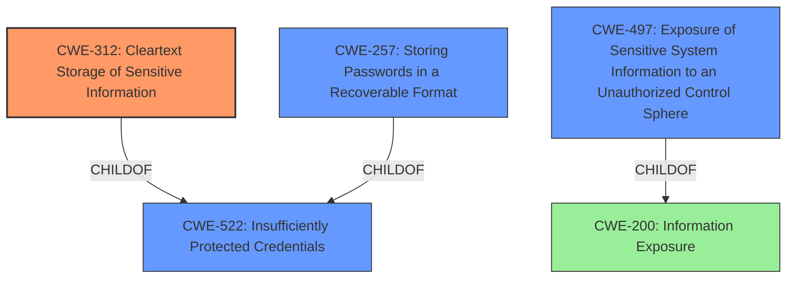

# Enhanced Analysis for CVE-2021-0212

# Summary
| CWE ID | CWE Name | Confidence | CWE Abstraction Level | CWE Vulnerability Mapping Label | CWE-Vulnerability Mapping Notes |
|---|---|---|---|---|---|
| CWE-312 | Cleartext Storage of Sensitive Information | 1.0 | Base | Allowed | Primary CWE |
| CWE-522 | Insufficiently Protected Credentials | 0.8 | Class | Allowed-with-Review | Secondary Candidate |
| CWE-257 | Storing Passwords in a Recoverable Format | 0.7 | Base | Allowed | Secondary Candidate |
| CWE-497 | Exposure of Sensitive System Information to an Unauthorized Control Sphere | 0.6 | Base | Allowed | Secondary Candidate |

## Evidence and Confidence

*   **Confidence Score:** 0.9
*   **Evidence Strength:** HIGH

## Relationship Analysis
The primary CWE selected is CWE-312 **Cleartext Storage of Sensitive Information**, which is a Base level CWE. CWE-522 **Insufficiently Protected Credentials** is a Class-level CWE and a parent of CWE-312. CWE-257 **Storing Passwords in a Recoverable Format** is a Base level CWE and a child of CWE-522. CWE-497 **Exposure of Sensitive System Information to an Unauthorized Control Sphere** is a Base level CWE and a child of CWE-200 **Information Exposure**. The relationships show that CWE-312 is the most specific and appropriate choice.



## Vulnerability Chain
The chain of weaknesses starts with the **storage of administrator credentials in plaintext** (CWE-312). A locally authenticated attacker is able to **read files** on the system and retrieve the credentials. This leads to **information exposure** and ultimately allows the attacker to **elevate their privileges** on the system.

## Summary of Analysis
The initial analysis identified several potential CWEs, including CWE-522, CWE-257, CWE-250, and CWE-497. However, after reviewing the vulnerability description and the provided CWE specifications, it became clear that CWE-312 **Cleartext Storage of Sensitive Information** is the most accurate and specific representation of the vulnerability.

The vulnerability description explicitly states that administrator credentials are **stored in plaintext**. This aligns perfectly with the description of CWE-312, which states that "The product stores sensitive information in cleartext within a resource that might be accessible to another control sphere."

The other CWEs were considered but ultimately deemed less appropriate:

*   CWE-522 **Insufficiently Protected Credentials** is a broader category that encompasses various insecure methods of storing or transmitting credentials, but the vulnerability description specifically mentions plaintext storage, making CWE-312 a more precise fit.
*   CWE-257 **Storing Passwords in a Recoverable Format** is similar to CWE-312, but it implies that the passwords might be encrypted but easily recoverable. The vulnerability description does not mention any encryption, so CWE-312 is a better fit.
*   CWE-497 **Exposure of Sensitive System Information to an Unauthorized Control Sphere** is a more general weakness related to the exposure of system information. While the plaintext credentials do constitute sensitive system information, CWE-312 more directly addresses the specific issue of storing credentials in plaintext.

The selection of CWE-312 is based on the explicit evidence in the vulnerability description. The relationship analysis further supports this decision, as CWE-312 is a child of CWE-522, indicating a more specific classification.

Relevant CWE Information:

## CWE-312: Cleartext Storage of Sensitive Information
**Abstraction Level**: Base
**Similarity Score**: N/A
**Source**: N/A

**Description**:
The product stores sensitive information in cleartext within a resource that might be accessible to another control sphere.

**Mapping Guidance**:
- Usage: Allowed
- Rationale: This CWE entry is at the Base level of abstraction, which is a preferred level of abstraction for mapping to the root causes of vulnerabilities.


## CWE Relationship Analysis

Current CWEs represent these abstraction levels: .


### Vulnerability Chain Analysis

**Chain starting from CWE-497:**
- 497 (Exposure of Sensitive System Information to an Unauthorized Control Sphere) - ROOT


**Chain starting from CWE-312:**
- 312 (Cleartext Storage of Sensitive Information) - ROOT


### CWE Relationship Diagram

```mermaid
graph TD
    classDef primary fill:#f96,stroke:#333,stroke-width:2px
    classDef secondary fill:#69f,stroke:#333
    classDef tertiary fill:#9e9,stroke:#333
```