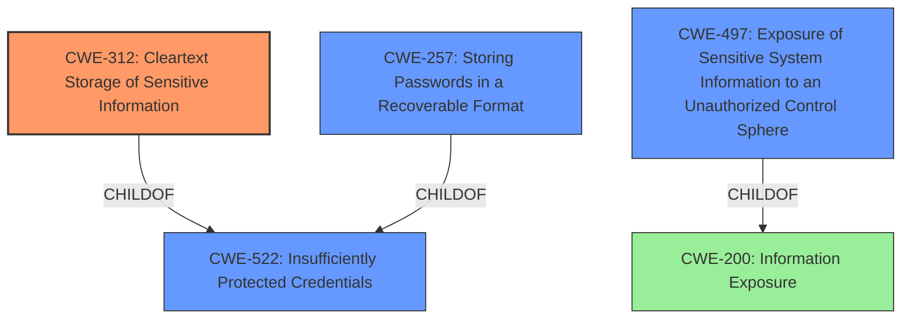

# Analysis for CVE-2021-0212

# Summary
| CWE ID | CWE Name | Confidence | CWE Abstraction Level | CWE Vulnerability Mapping Label | CWE-Vulnerability Mapping Notes |
|---|---|---|---|---|---|
| CWE-312 | Cleartext Storage of Sensitive Information | 1.0 | Base | Allowed | Primary CWE |
| CWE-522 | Insufficiently Protected Credentials | 0.8 | Class | Allowed-with-Review | Secondary Candidate |
| CWE-257 | Storing Passwords in a Recoverable Format | 0.7 | Base | Allowed | Secondary Candidate |
| CWE-497 | Exposure of Sensitive System Information to an Unauthorized Control Sphere | 0.6 | Base | Allowed | Secondary Candidate |

## Evidence and Confidence

*   **Confidence Score:** 0.9
*   **Evidence Strength:** HIGH

## Relationship Analysis
The primary CWE selected is CWE-312 **Cleartext Storage of Sensitive Information**, which is a Base level CWE. CWE-522 **Insufficiently Protected Credentials** is a Class-level CWE and a parent of CWE-312. CWE-257 **Storing Passwords in a Recoverable Format** is a Base level CWE and a child of CWE-522. CWE-497 **Exposure of Sensitive System Information to an Unauthorized Control Sphere** is a Base level CWE and a child of CWE-200 **Information Exposure**. The relationships show that CWE-312 is the most specific and appropriate choice.

## Vulnerability Chain
The chain of weaknesses starts with the **storage of administrator credentials in plaintext** (CWE-312). A locally authenticated attacker is able to **read files** on the system and retrieve the credentials. This leads to **information exposure** and ultimately allows the attacker to **elevate their privileges** on the system.

## Summary of Analysis
The initial analysis identified several potential CWEs, including CWE-522, CWE-257, CWE-250, and CWE-497. However, after reviewing the vulnerability description and the provided CWE specifications, it became clear that CWE-312 **Cleartext Storage of Sensitive Information** is the most accurate and specific representation of the vulnerability.

The vulnerability description explicitly states that administrator credentials are **stored in plaintext**. This aligns perfectly with the description of CWE-312, which states that "The product stores sensitive information in cleartext within a resource that might be accessible to another control sphere."

The other CWEs were considered but ultimately deemed less appropriate:

*   CWE-522 **Insufficiently Protected Credentials** is a broader category that encompasses various insecure methods of storing or transmitting credentials, but the vulnerability description specifically mentions plaintext storage, making CWE-312 a more precise fit.
*   CWE-257 **Storing Passwords in a Recoverable Format** is similar to CWE-312, but it implies that the passwords might be encrypted but easily recoverable. The vulnerability description does not mention any encryption, so CWE-312 is a better fit.
*   CWE-497 **Exposure of Sensitive System Information to an Unauthorized Control Sphere** is a more general weakness related to the exposure of system information. While the plaintext credentials do constitute sensitive system information, CWE-312 more directly addresses the specific issue of storing credentials in plaintext.

The selection of CWE-312 is based on the explicit evidence in the vulnerability description. The relationship analysis further supports this decision, as CWE-312 is a child of CWE-522, indicating a more specific classification.

Relevant CWE Information:

## CWE-312: Cleartext Storage of Sensitive Information
**Abstraction Level**: Base
**Similarity Score**: N/A
**Source**: N/A

**Description**:
The product stores sensitive information in cleartext within a resource that might be accessible to another control sphere.

**Mapping Guidance**:
- Usage: Allowed
- Rationale: This CWE entry is at the Base level of abstraction, which is a preferred level of abstraction for mapping to the root causes of vulnerabilities.

# Enhanced Query for CVE-2021-0212

## Vulnerability Description
An **Information Exposure** vulnerability in Juniper Networks Contrail Networking allows a locally authenticated attacker able to read files to retrieve administrator credentials stored in plaintext thereby elevating their privileges over the system. This issue affects Juniper Networks Contrail Networking versions prior to 1911.31.

### Vulnerability Description Key Phrases
- **weakness:** **Information Exposure**
- **impact:** retrieve administrator credentials stored in plaintext
- **vector:** read files
- **attacker:** locally authenticated attacker
- **product:** Juniper Networks Contrail Networking
- **version:** prior to 1911.31

## Retriever Results

### Top Combined Results

| Rank | CWE ID | Name | Abstraction | Usage  | Retrievers | Individual Scores |
|------|--------|------|-------------|-------|------------|-------------------|
| 1 | 522 | Insufficiently Protected Credentials | Class | Allowed-with-Review | sparse | 0.273 |
| 2 | 257 | Storing Passwords in a Recoverable Format | Base | Allowed | sparse | 0.246 |
| 3 | 250 | Execution with Unnecessary Privileges | Base | Allowed | sparse | 0.231 |
| 4 | 497 | Exposure of Sensitive System Information to an Unauthorized Control Sphere | Base | Allowed | sparse | 0.226 |
| 5 | 269 | Improper Privilege Management | Class | Discouraged | sparse | 0.226 |
| 6 | 642 | External Control of Critical State Data | Class | Allowed-with-Review | dense | 0.575 |
| 7 | 613 | Insufficient Session Expiration | Base | Allowed | graph | 0.002 |
| 8 | 532 | Insertion of Sensitive Information into Log File | Base | Allowed | sparse | 0.220 |
| 9 | 252 | Unchecked Return Value | Base | Allowed | sparse | 0.219 |
| 10 | 256 | Plaintext Storage of a Password | Base | Allowed | sparse | 0.211 |

# Complete CWE Specifications

## CWE-522: Insufficiently Protected Credentials
**Abstraction:** Class
**Status:** Incomplete

### Description
The product transmits or stores authentication credentials, but it uses an insecure method that is susceptible to unauthorized interception and/or retrieval.

### Extended Description
Not provided

### Alternative Terms
None

### Relationships
ChildOf -> CWE-1390
ChildOf -> CWE-287
ChildOf -> CWE-668

### Mapping Guidance
**Usage:** Allowed-with-Review
**Rationale:** This CWE entry is a Class and might have Base-level children that would be more appropriate
**Comments:** Examine children of this entry to see if there is a better fit
**Reasons:**
- Abstraction

### Observed Examples
- **CVE-2022-30018:** A messaging platform serializes all elements of User/Group objects, making private information available to adversaries
- **CVE-2022-29959:** Initialization file contains credentials that can be decoded using a "simple string transformation"
- **CVE-2022-35411:** Python-based RPC framework enables pickle functionality by default, allowing clients to unpickle untrusted data.

## CWE-257: Storing Passwords in a Recoverable Format
**Abstraction:** Base
**Status:** Incomplete

### Description
The storage of passwords in a recoverable format makes them subject to password reuse attacks by malicious users. In fact, it should be noted that recoverable encrypted passwords provide no significant benefit over plaintext passwords since they are subject not only to reuse by malicious attackers but also by malicious insiders. If a system administrator can recover a password directly, or use a brute force search on the available information, the administrator can use the password on other accounts.

### Extended Description
Not provided

### Alternative Terms
None

### Relationships
ChildOf -> CWE-522
PeerOf -> CWE-259

### Mapping Guidance
**Usage:** Allowed
**Rationale:** This CWE entry is at the Base level of abstraction, which is a preferred level of abstraction for mapping to the root causes of vulnerabilities.
**Comments:** Carefully read both the name and description to ensure that this mapping is an appropriate fit. Do not try to 'force' a mapping to a lower-level Base/Variant simply to comply with this preferred level of abstraction.
**Reasons:**
- Acceptable-Use

### Additional Notes
**[Maintenance]** The meaning of this entry needs to be investigated more closely, especially with respect to what is meant by "recoverable."

### Observed Examples
- **CVE-2022-30018:** A messaging platform serializes all elements of User/Group objects, making private information available to adversaries

## CWE-250: Execution with Unnecessary Privileges
**Abstraction:** Base
**Status:** Draft

### Description
The product performs an operation at a privilege level that is higher than the minimum level required, which creates new weaknesses or amplifies the consequences of other weaknesses.

### Extended Description

New weaknesses can be exposed because running with extra privileges, such as root or Administrator, can disable the normal security checks being performed by the operating system or surrounding environment. Other pre-existing weaknesses can turn into security vulnerabilities if they occur while operating at raised privileges.

Privilege management functions can behave in some less-than-obvious ways, and they have different quirks on different platforms. These inconsistencies are particularly pronounced if you are transitioning from one non-root user to another. Signal handlers and spawned processes run at the privilege of the owning process, so if a process is running as root when a signal fires or a sub-process is executed, the signal handler or sub-process will operate with root privileges.

### Alternative Terms
None

### Relationships
ChildOf -> CWE-269
ChildOf -> CWE-657

### Mapping Guidance
**Usage:** Allowed
**Rationale:** This CWE entry is at the Base level of abstraction, which is a preferred level of abstraction for mapping to the root causes of vulnerabilities.
**Comments:** Carefully read both the name and description to ensure that this mapping is an appropriate fit. Do not try to 'force' a mapping to a lower-level Base/Variant simply to comply with this preferred level of abstraction.
**Reasons:**
- Acceptable-Use

### Additional Notes
**[Relationship]** There is a close association with CWE-653 (Insufficient Separation of Privileges). CWE-653 is about providing separate components for each privilege; CWE-250 is about ensuring that each component has the least amount of privileges possible.

**[Maintenance]** CWE-271, CWE-272, and CWE-250 are all closely related and possibly overlapping. CWE-271 is probably better suited as a category. Both CWE-272 and CWE-250 are in active use by the community. The "least privilege" phrase has multiple interpretations.

**[Maintenance]** The Taxonomy_Mappings to ISA/IEC 62443 were added in CWE 4.10, but they are still under review and might change in future CWE versions. These draft mappings were performed by members of the "Mapping CWE to 62443" subgroup of the CWE-CAPEC ICS/OT Special Interest Group (SIG), and their work is incomplete as of CWE 4.10. The mappings are included to facilitate discussion and review by the broader ICS/OT community, and they are likely to change in future CWE versions.

### Observed Examples
- **CVE-2007-4217:** FTP client program on a certain OS runs with setuid privileges and has a buffer overflow. Most clients do not need extra privileges, so an overflow is not a vulnerability for those clients.
- **CVE-2008-1877:** Program runs with privileges and calls another program with the same privileges, which allows read of arbitrary files.
- **CVE-2007-5159:** OS incorrectly installs a program with setuid privileges, allowing users to gain privileges.

## CWE-497: Exposure of Sensitive System Information to an Unauthorized Control Sphere
**Abstraction:** Base
**Status:** Incomplete

### Description
The product does not properly prevent sensitive system-level information from being accessed by unauthorized actors who do not have the same level of access to the underlying system as the product does.

### Extended Description

Network-based products, such as web applications, often run on top of an operating system or similar environment. When the product communicates with outside parties, details about the underlying system are expected to remain hidden, such as path names for data files, other OS users, installed packages, the application environment, etc. This system information may be provided by the product itself, or buried within diagnostic or debugging messages. Debugging information helps an adversary learn about the system and form an attack plan.

An information exposure occurs when system data or debugging information leaves the program through an output stream or logging function that makes it accessible to unauthorized parties. Using other weaknesses, an attacker could cause errors to occur; the response to these errors can reveal detailed system information, along with other impacts. An attacker can use messages that reveal technologies, operating systems, and product versions to tune the attack against known vulnerabilities in these technologies. A product may use diagnostic methods that provide significant implementation details such as stack traces as part of its error handling mechanism.

### Alternative Terms
None

### Relationships
ChildOf -> CWE-200

### Mapping Guidance
**Usage:** Allowed
**Rationale:** This CWE entry is at the Base level of abstraction, which is a preferred level of abstraction for mapping to the root causes of vulnerabilities.
**Comments:** Carefully read both the name and description to ensure that this mapping is an appropriate fit. Do not try to 'force' a mapping to a lower-level Base/Variant simply to comply with this preferred level of abstraction.
**Reasons:**
- Acceptable-Use

### Observed Examples
- **CVE-2021-32638:** Code analysis product passes access tokens as a command-line parameter or through an environment variable, making them visible to other processes via the ps command.

## CWE-269: Improper Privilege Management
**Abstraction:** Class
**Status:** Draft

### Description
The product does not properly assign, modify, track, or check privileges for an actor, creating an unintended sphere of control for that actor.

### Extended Description
Not provided

### Alternative Terms
None

### Relationships
ChildOf -> CWE-284

### Mapping Guidance
**Usage:** Discouraged
**Rationale:** CWE-269 is commonly misused. It can be conflated with "privilege escalation," which is a technical impact that is listed in many low-information vulnerability reports [REF-1287]. It is not useful for trend analysis.
**Comments:** If an error or mistake allows privilege escalation, then use the CWE ID for that mistake. Avoid using CWE-269 when only phrases such as "privilege escalation" or "gain privileges" are available, as these indicate technical impact of the vulnerability - not the root cause weakness. If the root cause seems to be directly related to privileges, then examine the children of CWE-269 for additional hints, such as Execution with Unnecessary Privileges (CWE-250) or Incorrect Privilege Assignment (CWE-266).
**Reasons:**
- Frequent Misuse

### Additional Notes
**[Maintenance]** The relationships between privileges, permissions, and actors (e.g. users and groups) need further refinement within the Research view. One complication is that these concepts apply to two different pillars, related to control of resources (CWE-664) and protection mechanism failures (CWE-693).

### Observed Examples
- **CVE-2001-1555:** Terminal privileges are not reset when a user logs out.
- **CVE-2001-1514:** Does not properly pass security context to child processes in certain cases, allows privilege escalation.
- **CVE-2001-0128:** Does not properly compute roles.

## CWE-642: External Control of Critical State Data
**Abstraction:** Class
**Status:** Draft

### Description
The product stores security-critical state information about its users, or the product itself, in a location that is accessible to unauthorized actors.

### Extended Description

If an attacker can modify the state information without detection, then it could be used to perform unauthorized actions or access unexpected resources, since the application programmer does not expect that the state can be changed.

State information can be stored in various locations such as a cookie, in a hidden web form field, input parameter or argument, an environment variable, a database record, within a settings file, etc. All of these locations have the potential to be modified by an attacker. When this state information is used to control security or determine resource usage, then it may create a vulnerability. For example, an application may perform authentication, then save the state in an "authenticated=true" cookie. An attacker may simply create this cookie in order to bypass the authentication.

### Alternative Terms
None

### Relationships
ChildOf -> CWE-668

### Mapping Guidance
**Usage:** Allowed-with-Review
**Rationale:** This CWE entry is a Class and might have Base-level children that would be more appropriate
**Comments:** Examine children of this entry to see if there is a better fit
**Reasons:**
- Abstraction

### Observed Examples
- **CVE-2005-2428:** Mail client stores password hashes for unrelated accounts in a hidden form field.
- **CVE-2008-0306:** Privileged program trusts user-specified environment variable to modify critical configuration settings.
- **CVE-1999-0073:** Telnet daemon allows remote clients to specify critical environment variables for the server, leading to code execution.

## CWE-613: Insufficient Session Expiration
**Abstraction:** Base
**Status:** Incomplete

### Description
According to WASC, "Insufficient Session Expiration is when a web site permits an attacker to reuse old session credentials or session IDs for authorization."

### Extended Description
Not provided

### Alternative Terms
None

### Relationships
ChildOf -> CWE-672
ChildOf -> CWE-672
CanPrecede -> CWE-287

### Mapping Guidance
**Usage:** Allowed
**Rationale:** This CWE entry is at the Base level of abstraction, which is a preferred level of abstraction for mapping to the root causes of vulnerabilities.
**Comments:** Carefully read both the name and description to ensure that this mapping is an appropriate fit. Do not try to 'force' a mapping to a lower-level Base/Variant simply to comply with this preferred level of abstraction.
**Reasons:**
- Acceptable-Use

### Additional Notes
**[Other]** The lack of proper session expiration may improve the likely success of certain attacks. For example, an attacker may intercept a session ID, possibly via a network sniffer or Cross-site Scripting attack. Although short session expiration times do not help if a stolen token is immediately used, they will protect against ongoing replaying of the session ID. In another scenario, a user might access a web site from a shared computer (such as at a library, Internet cafe, or open work environment). Insufficient Session Expiration could allow an attacker to use the browser's back button to access web pages previously accessed by the victim.

## CWE-532: Insertion of Sensitive Information into Log File
**Abstraction:** Base
**Status:** Incomplete

### Description
The product writes sensitive information to a log file.

### Extended Description
Not provided

### Alternative Terms
None

### Relationships
ChildOf -> CWE-538
ChildOf -> CWE-200

### Mapping Guidance
**Usage:** Allowed
**Rationale:** This CWE entry is at the Base level of abstraction, which is a preferred level of abstraction for mapping to the root causes of vulnerabilities.
**Comments:** Carefully read both the name and description to ensure that this mapping is an appropriate fit. Do not try to 'force' a mapping to a lower-level Base/Variant simply to comply with this preferred level of abstraction.
**Reasons:**
- Acceptable-Use

### Observed Examples
- **CVE-2017-9615:** verbose logging stores admin credentials in a world-readable log file
- **CVE-2018-1999036:** SSH password for private key stored in build log

## CWE-252: Unchecked Return Value
**Abstraction:** Base
**Status:** Draft

### Description
The product does not check the return value from a method or function, which can prevent it from detecting unexpected states and conditions.

### Extended Description
Two common programmer assumptions are "this function call can never fail" and "it doesn't matter if this function call fails". If an attacker can force the function to fail or otherwise return a value that is not expected, then the subsequent program logic could lead to a vulnerability, because the product is not in a state that the programmer assumes. For example, if the program calls a function to drop privileges but does not check the return code to ensure that privileges were successfully dropped, then the program will continue to operate with the higher privileges.

### Alternative Terms
None

### Relationships
ChildOf -> CWE-754
ChildOf -> CWE-754
CanPrecede -> CWE-476

### Mapping Guidance
**Usage:** Allowed
**Rationale:** This CWE entry is at the Base level of abstraction, which is a preferred level of abstraction for mapping to the root causes of vulnerabilities.
**Comments:** Carefully read both the name and description to ensure that this mapping is an appropriate fit. Do not try to 'force' a mapping to a lower-level Base/Variant simply to comply with this preferred level of abstraction.
**Reasons:**
- Acceptable-Use

### Observed Examples
- **CVE-2020-17533:** Chain: unchecked return value (CWE-252) of some functions for policy enforcement leads to authorization bypass (CWE-862)
- **CVE-2020-6078:** Chain: The return value of a function returning a pointer is not checked for success (CWE-252) resulting in the later use of an uninitialized variable (CWE-456) and a null pointer dereference (CWE-476)
- **CVE-2019-15900:** Chain: sscanf() call is used to check if a username and group exists, but the return value of sscanf() call is not checked (CWE-252), causing an uninitialized variable to be checked (CWE-457), returning success to allow authorization bypass for executing a privileged (CWE-863).

## CWE-256: Plaintext Storage of a Password
**Abstraction:** Base
**Status:** Incomplete

### Description
Storing a password in plaintext may result in a system compromise.

### Extended Description
Password management issues occur when a password is stored in plaintext in an application's properties, configuration file, or memory. Storing a plaintext password in a configuration file allows anyone who can read the file access to the password-protected resource. In some contexts, even storage of a plaintext password in memory is considered a security risk if the password is not cleared immediately after it is used.

### Alternative Terms
None

### Relationships
ChildOf -> CWE-522

### Mapping Guidance
**Usage:** Allowed
**Rationale:** This CWE entry is at the Base level of abstraction, which is a preferred level of abstraction for mapping to the root causes of vulnerabilities.
**Comments:** Carefully read both the name and description to ensure that this mapping is an appropriate fit. Do not try to 'force' a mapping to a lower-level Base/Variant simply to comply with this preferred level of abstraction.
**Reasons:**
- Acceptable-Use

### Observed Examples
- **CVE-2022-30275:** Remote Terminal Unit (RTU) uses a driver that relies on a password stored in plaintext.

