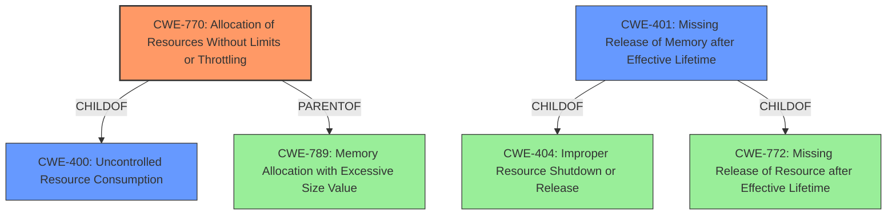

# Enhanced Analysis for CVE-2021-0217

# Summary
| CWE ID | CWE Name | Confidence | CWE Abstraction Level | CWE Vulnerability Mapping Label | CWE-Vulnerability Mapping Notes |
|---|---|---|---|---|---|
| CWE-770 | Allocation of Resources Without Limits or Throttling | 0.9 | Base | Allowed | Primary CWE |
| CWE-401 | Missing Release of Memory after Effective Lifetime | 0.7 | Variant | Allowed | Secondary Candidate |
| CWE-400 | Uncontrolled Resource Consumption | 0.6 | Class | Discouraged | Secondary Candidate |

## Evidence and Confidence

*   **Confidence Score:** 0.9
*   **Evidence Strength:** HIGH

## Relationship Analysis
The primary CWE is CWE-770, which has a hierarchical relationship as a ChildOf to CWE-400 (Uncontrolled Resource Consumption). CWE-400 represents a broader class of resource consumption issues, while CWE-770 focuses specifically on the allocation of resources without limits or throttling. CWE-770 is also related to CWE-789 (Memory Allocation with Excessive Size Value) through a ParentOf relationship, suggesting that excessive memory allocation can be a specific instance of allocating resources without limits. CWE-401, Missing Release of Memory after Effective Lifetime is a Variant and a ChildOf CWE-404 and CWE-772.



## Vulnerability Chain
The vulnerability chain starts with the processing of certain DHCP packets without proper **validation of resource limits**, leading to **excessive DMA memory allocation**, and culminating in a **Denial of Service (DoS)** due to memory exhaustion.
  - **Root Cause:** Improper handling of DHCP packets leading to uncontrolled memory allocation.
  - **Weakness:** **Allocation of resources without limits or throttling** (CWE-770).
  - **Impact:** Denial of Service (DoS).

## Summary of Analysis
The analysis is primarily based on the vulnerability description, which highlights that processing specific DHCP packets leads to DMA memory exhaustion and a subsequent Denial of Service.

The vulnerability description states that the **root cause** is related to processing DHCP packets that can lead to the exhaustion of DMA memory. The key phrase from the description is: "processing of certain DHCP packets...may lead to exhaustion of DMA memory causing a Denial of Service (DoS)."

The Retriever Results and Complete CWE Specifications were used to determine that **CWE-770 (Allocation of Resources Without Limits or Throttling)** is the most appropriate primary CWE. The vulnerability aligns with CWE-770 because it involves allocating DMA memory without proper limits, allowing an attacker to trigger resource exhaustion. The allocation of packet buffers without limits is a clear match with CWE-770's description.

The relationships influenced the decision by providing a broader context, especially with CWE-400 as a parent, but CWE-770 was chosen for its specific focus on allocation issues.

The selected CWE is at the optimal level of specificity because it directly addresses the **root cause** of the vulnerability, which is the **unlimited allocation of DMA memory**. The other CWEs considered, such as CWE-400 and CWE-401, were either too broad or focused on the symptom (resource exhaustion) rather than the cause (**uncontrolled allocation**).

CWE-400 (Uncontrolled Resource Consumption) was considered but ultimately deemed less specific than CWE-770. While the vulnerability does lead to resource exhaustion, the more precise issue is the lack of limits on resource allocation. CWE-401 (Missing Release of Memory after Effective Lifetime) was also considered, but the primary issue isn't a failure to release memory; it's the uncontrolled allocation of it in the first place.


## CWE Relationship Analysis

Current CWEs represent these abstraction levels: .


### Vulnerability Chain Analysis

**Chain starting from CWE-404:**
- 404 (Improper Resource Shutdown or Release) - ROOT


**Chain starting from CWE-401:**
- 401 (Missing Release of Memory after Effective Lifetime) - ROOT


### CWE Relationship Diagram

```mermaid
graph TD
    classDef primary fill:#f96,stroke:#333,stroke-width:2px
    classDef secondary fill:#69f,stroke:#333
    classDef tertiary fill:#9e9,stroke:#333
```