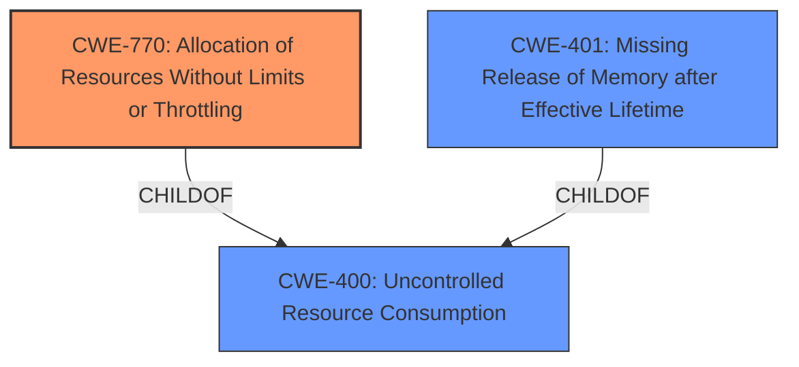

# Analysis Report for CVE-2021-0238

# Vulnerability Analysis Report: CVE-2021-0238

## Description


## Analysis (with Relationship Data)

# Summary
| CWE ID  | CWE Name                                                                   | Confidence | CWE Abstraction Level | CWE Vulnerability Mapping Label | CWE-Vulnerability Mapping Notes |
| :-------- | :------------------------------------------------------------------------- | :--------- | :---------------------- | :------------------------------ | :------------------------------ |
| CWE-770 | Allocation of Resources Without Limits or Throttling                                                                 | 0.85       | Base                      | Allowed                          | Primary CWE                                                                                                                                                                                                        |
| CWE-400 | Uncontrolled Resource Consumption                                                                  | 0.65       | Class                      | Discouraged                          | Secondary Candidate                                                                                                                                                                                                         |
| CWE-401 | Missing Release of Memory after Effective Lifetime                                                                  | 0.50      | Variant                      | Allowed                         | Secondary Candidate                                                                                                                                                                                                         |

## Evidence and Confidence

*   **Confidence Score:** 0.75
*   **Evidence Strength:** MEDIUM

## Relationship Analysis
The primary relationship that influenced the choice of CWE-770 **Allocation of Resources Without Limits or Throttling** was its direct parent relationship to CWE-400 **Uncontrolled Resource Consumption**. While the vulnerability description highlights the impact of running out of disk space, the root cause seems to stem from an **allocation of resources** (disk space) without proper limits or throttling. The relationship of CWE-770 as a child of CWE-400 helped refine the selection to a more specific root cause.



## Vulnerability Chain
The vulnerability chain starts with the **execution of certain CLI commands**, which leads to **uncontrolled allocation of disk space**, eventually resulting in the **system running out of disk space**.

CLI Command Execution -> Uncontrolled Resource Allocation -> Resource Exhaustion (Disk Space)

*   **Root Cause:** CWE-770 **Allocation of Resources Without Limits or Throttling**
*   **Impact:** Resource exhaustion, system complications.

## Summary of Analysis
Initially, the "impact: run out of disk space" suggested CWE-400 **Uncontrolled Resource Consumption**. However, after reviewing the description, the **root cause** appears to be the lack of proper limits when allocating disk space upon the execution of specific CLI commands.

The vulnerability description states: "executing certain CLI command may cause the system to run out of disk space, excessive disk usage may cause other complications." This points to the **allocation** process itself being flawed because "the product allocates a reusable resource or group of resources on behalf of an actor without imposing any restrictions on the size or number of resources that can be allocated." This aligns directly with CWE-770 **Allocation of Resources Without Limits or Throttling**.

CWE-400 **Uncontrolled Resource Consumption** is a broader class, and its discouraged usage further supports the decision to choose the more specific CWE-770 **Allocation of Resources Without Limits or Throttling**.

CWE-401 **Missing Release of Memory after Effective Lifetime** was also considered but deemed less relevant because the primary issue is not the **failure to release** resources, but the **uncontrolled allocation** of resources in the first place.

The selection of CWE-770 **Allocation of Resources Without Limits or Throttling** is at the optimal level of specificity because it accurately describes the **root cause** of the vulnerability based on the available evidence.

Relevant CWE Information:

# Enhanced Context (25 CWEs)

## CWE-664: Improper Control of a Resource Through its Lifetime
**Abstraction Level**: Pillar
**Similarity Score**: 0.79
**Source**: dense

**Description**:
The product does not maintain or incorrectly maintains control over a resource throughout its lifetime of creation, use, and release.

**Mapping Guidance**:
- Usage: Discouraged
- Rationale: This CWE entry is high-level when lower-level children are available.

## CWE-404: Improper Resource Shutdown or Release
**Abstraction Level**: Class
**Similarity Score**: 0.77
**Source**: dense

**Description**:
The product does not release or incorrectly releases a resource before it is made available for re-use.

**Mapping Guidance**:
- Usage: Allowed-with-Review
- Rationale: This CWE entry is a Class and might have Base-level children that would be more appropriate

## CWE-668: Exposure of Resource to Wrong Sphere
**Abstraction Level**: Class
**Similarity Score**: 0.76
**Source**: dense

**Description**:
The product exposes a resource to the wrong control sphere, providing unintended actors with inappropriate access to the resource.

**Mapping Guidance**:
- Usage: Discouraged
- Rationale: CWE-668 is high-level and is often misused as a catch-all when lower-level CWE IDs might be applicable. It is sometimes used for low-information vulnerability reports [REF-1287]. It is a level-1 Class (i.e., a child of a Pillar). It is not useful for trend analysis.

## CWE-41: Improper Resolution of Path Equivalence
**Abstraction Level**: Base
**Similarity Score**: 0.76
**Source**: dense

**Description**:
The product is vulnerable to file system contents disclosure through path equivalence. Path equivalence involves the use of special characters in file and directory names. The associated manipulations are intended to generate multiple names for the same object.

**Mapping Guidance**:
- Usage: Allowed
- Rationale: This CWE entry is at the Base level of abstraction, which is a preferred level of abstraction for mapping to the root causes of vulnerabilities.

## CWE-226: Sensitive Information in Resource Not Removed Before Reuse
**Abstraction Level**: Base
**Similarity Score**: 0.75
**Source**: dense

**Description**:
The product releases a resource such as memory or a file so that it can be made available for reuse, but it does not clear or "zeroize" the information contained in the resource before the product performs a critical state transition or makes the resource available for reuse by other entities.

**Mapping Guidance**:
- Usage: Allowed
- Rationale: This CWE entry is at the Base level of abstraction, which is a preferred level of abstraction for mapping to the root causes of vulnerabilities.

## CWE-754: Improper Check for Unusual or Exceptional Conditions
**Abstraction Level**: Class
**Similarity Score**: 0.75
**Source**: dense

**Description**:
The product does not check or incorrectly checks for unusual or exceptional conditions that are not expected to occur frequently during day to day operation of the product.

**Mapping Guidance**:
- Usage: Allowed-with-Review
- Rationale: This CWE entry is a Class and might have Base-level children that would be more appropriate

## CWE-667: Improper Locking
**Abstraction Level**: Class
**Similarity Score**: 0.75
**Source**: dense

**Description**:
The product does not properly acquire or release a lock on a resource, leading to unexpected resource state changes and behaviors.

**Mapping Guidance**:
- Usage: Allowed-with-Review
- Rationale: This CWE entry is a Class and might have Base-level children that would be more appropriate

## CWE-23: Relative Path Traversal
**Abstraction Level**: Base
**Similarity Score**: 0.74
**Source**: dense

**Description**:
The product uses external input to construct a pathname that should be within a restricted directory, but it does not properly neutralize sequences such as ".." that can resolve to a location that is outside of that directory.

**Mapping Guidance**:
- Usage: Allowed
- Rationale: This CWE entry is at the Base level of abstraction, which is a preferred level of abstraction for mapping to the root causes of vulnerabilities.

## CWE-405: Asymmetric Resource Consumption (Amplification)
**Abstraction Level**: Class
**Similarity Score**: 0.74
**Source**: dense

**Description**:
The product does not properly control situations in which an adversary can cause the product to consume or produce excessive resources without requiring the adversary to invest equivalent work or otherwise prove authorization, i.e., the adversary's influence is "asymmetric."

**Mapping Guidance**:
- Usage: Allowed-with-Review
- Rationale: This CWE entry is a Class and might have Base-level children that would be more appropriate

## CWE-274: Improper Handling of Insufficient Privileges
**Abstraction Level**: Base
**Similarity Score**: 0.74
**Source**: dense

**Description**:
The product does not handle or incorrectly handles when it has insufficient privileges to perform an operation, leading to resultant weaknesses.

**Mapping Guidance**:


## CWE Relationship Analysis

Current CWEs represent these abstraction levels: .


### Vulnerability Chain Analysis

**Chain starting from CWE-754:**
- 754 (Improper Check for Unusual or Exceptional Conditions) - ROOT


**Chain starting from CWE-667:**
- 667 (Improper Locking) - ROOT


### CWE Relationship Diagram

```mermaid
graph TD
    classDef primary fill:#f96,stroke:#333,stroke-width:2px
    classDef secondary fill:#69f,stroke:#333
    classDef tertiary fill:#9e9,stroke:#333
```


*Report generated on 2025-04-02 11:09:49*
