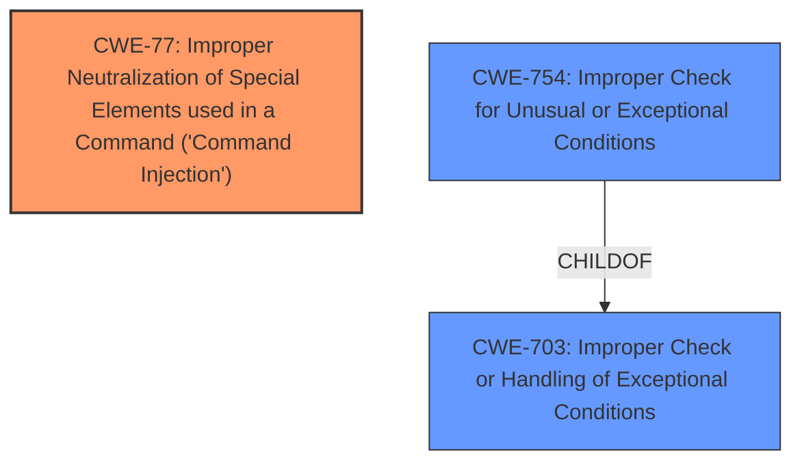

# Analysis Report for CVE-2021-0252

# Vulnerability Analysis Report: CVE-2021-0252

## Description


## Analysis (with Relationship Data)

# Summary
| CWE ID | CWE Name | Confidence | CWE Abstraction Level | CWE Vulnerability Mapping Label | CWE-Vulnerability Mapping Notes |
|---|---|---|---|---|---|
| CWE-77 | Improper Neutralization of Special Elements used in a Command ('Command Injection') | 1.0 | Base | Allowed | Primary CWE |
| CWE-703 | Improper Check or Handling of Exceptional Conditions | 0.4 | Pillar | Discouraged | Secondary Candidate |
| CWE-754 | Improper Check for Unusual or Exceptional Conditions | 0.4 | Class | Allowed-with-Review | Secondary Candidate |

## Evidence and Confidence

*   **Confidence Score:** 1.0
*   **Evidence Strength:** HIGH

## Relationship Analysis
The primary CWE, CWE-77 (Improper Neutralization of Special Elements used in a Command ('Command Injection')), stands alone in this case as the most direct representation of the vulnerability. The suggested alternative CWEs, CWE-703 (Improper Check or Handling of Exceptional Conditions) and CWE-754 (Improper Check for Unusual or Exceptional Conditions), are higher-level classifications that broadly describe error handling issues but do not specifically address the command injection aspect. Therefore, focusing on CWE-77 provides the most accurate and actionable classification.



## Vulnerability Chain
The chain of events starts with the lack of input sanitization, which leads to command injection, and ultimately results in the ability to execute arbitrary commands with root privileges.
  - **Root Cause:** Lack of input sanitization.
  - **Weakness:** Use of `subprocess.check_output()` with `shell=True` and unsanitized user-controlled input, leading to CWE-77 (Improper Neutralization of Special Elements used in a Command ('Command Injection')).
  - **Impact:** Execution of arbitrary commands with root privileges, leading to complete system compromise.

## Summary of Analysis
The primary weakness is a command injection vulnerability due to the use of `subprocess.check_output()` with `shell=True` and unsanitized user-controlled input in the `file_type_checker.py` script. This script is called by the `jdmd` process. The vulnerability can be triggered from the CLI by providing malicious file paths when instantiating a virtual network function (VNF) or adding storage to a VNF.

The evidence directly supports the classification of CWE-77 (Improper Neutralization of Special Elements used in a Command ('Command Injection')). The "CVE Reference Links Content Summary" section states: "A command injection vulnerability exists in the `file_type_checker.py` python script due to the use of `subprocess.check_output()` with `shell=True` and unsanitized user-controlled input." This aligns perfectly with the definition of CWE-77, which involves failing to neutralize special elements that could modify the intended command when it is sent to an interpreter.

CWE-703 (Improper Check or Handling of Exceptional Conditions) and CWE-754 (Improper Check for Unusual or Exceptional Conditions) were considered due to their similarity scores in the Retriever Results. However, these are too abstract. The core issue is not merely about mishandling exceptional conditions, but specifically about the injection of malicious commands due to inadequate input sanitization. Thus, CWE-77 is the more precise and appropriate classification.

The selection of CWE-77 is at the optimal level of specificity as it directly addresses the **root cause** of the vulnerability, which is the **improper neutralization** of special elements in a command.

Relevant CWE Information:

# Enhanced Context (25 CWEs)
The following CWEs were identified as potentially relevant to this vulnerability:

## CWE-703: Improper Check or Handling of Exceptional Conditions
**Abstraction Level**: Pillar
**Similarity Score**: 0.77
**Source**: dense

**Description**:
The product does not properly anticipate or handle exceptional conditions that rarely occur during normal operation of the product.

**Mapping Guidance**:
- Usage: Discouraged
- Rationale: This CWE entry is extremely high-level, a Pillar.

## CWE-754: Improper Check for Unusual or Exceptional Conditions
**Abstraction Level**: Class
**Similarity Score**: 0.76
**Source**: dense

**Description**:
The product does not check or incorrectly checks for unusual or exceptional conditions that are not expected to occur frequently during day to day operation of the product.

**Mapping Guidance**:
- Usage: Allowed-with-Review
- Rationale: This CWE entry is a Class and might have Base-level children that would be more appropriate

## CWE-364: Signal Handler Race Condition
**Abstraction Level**: Base
**Similarity Score**: 0.74
**Source**: dense

**Description**:
The product uses a signal handler that introduces a race condition.

**Mapping Guidance**:
- Usage: Allowed
- Rationale: This CWE entry is at the Base level of abstraction, which is a preferred level of abstraction for mapping to the root causes of vulnerabilities.

## CWE-606: Unchecked Input for Loop Condition
**Abstraction Level**: Base
**Similarity Score**: 0.74
**Source**: dense

**Description**:
The product does not properly check inputs that are used for loop conditions, potentially leading to a denial of service or other consequences because of excessive looping.

**Mapping Guidance**:
- Usage: Allowed
- Rationale: This CWE entry is at the Base level of abstraction, which is a preferred level of abstraction for mapping to the root causes of vulnerabilities.

## CWE-755: Improper Handling of Exceptional Conditions
**Abstraction Level**: Class
**Similarity Score**: 0.74
**Source**: dense

**Description**:
The product does not handle or incorrectly handles an exceptional condition.

**Mapping Guidance**:
- Usage: Discouraged
- Rationale: This CWE entry is a level-1 Class (i.e., a child of a Pillar). It might have lower-level children that would be more appropriate

## CWE-653: Improper Isolation or Compartmentalization
**Abstraction Level**: Class
**Similarity Score**: 0.73
**Source**: dense

**Description**:
The product does not properly compartmentalize or isolate functionality, processes, or resources that require different privilege levels, rights, or permissions.

**Mapping Guidance**:
- Usage: Allowed
- Rationale: This CWE entry is at the Base level of abstraction, which is a preferred level of abstraction for mapping to the root causes of vulnerabilities.

## CWE-274: Improper Handling of Insufficient Privileges
**Abstraction Level**: Base
**Similarity Score**: 0.73
**Source**: dense

**Description**:
The product does not handle or incorrectly handles when it has insufficient privileges to perform an operation, leading to resultant weaknesses.

**Mapping Guidance**:
- Usage: Discouraged
- Rationale: This CWE entry could be deprecated in a future version of CWE.

## CWE-667: Improper Locking
**Abstraction Level**: Class
**Similarity Score**: 0.73
**Source**: dense

**Description**:
The product does not properly acquire or release a lock on a resource, leading to unexpected resource state changes and behaviors.

**Mapping Guidance**:
- Usage: Allowed-with-Review
- Rationale: This CWE entry is a Class and might have Base-level children that would be more appropriate

## CWE-1289: Improper Validation of Unsafe Equivalence in Input
**Abstraction Level**: Base
**Similarity Score**: 0.73
**Source**: dense

**Description**:
The product receives an input value that is used as a resource identifier or other type of reference, but it does not validate or incorrectly validates that the input is equivalent to a potentially-unsafe value.

**Mapping Guidance**:
- Usage: Allowed
- Rationale: This CWE entry is at the Base level of abstraction, which is a preferred level of abstraction for mapping to the root causes of vulnerabilities.

## CWE-362: Concurrent Execution using Shared Resource with Improper Synchronization ('Race Condition')
**Abstraction Level**: Class
**Similarity Score**: 0.73
**Source**: dense

**Description**:
The product contains a concurrent code sequence that requires temporary, exclusive access to a shared resource, but a timing window exists in which the shared resource can be modified by another code sequence operating concurrently.

**Mapping Guidance**:
- Usage: Allowed-with-Review
- Rationale: This CWE entry is a Class and might have Base-level children that would be more appropriate

## CWE-364: Signal Handler Race Condition
**Abstraction Level**: Base
**Similarity Score**: 6962.94
**Source**: sparse

**


## CWE Relationship Analysis

Current CWEs represent these abstraction levels: .


### Vulnerability Chain Analysis

**Chain starting from CWE-754:**
- 754 (Improper Check for Unusual or Exceptional Conditions) - ROOT


**Chain starting from CWE-667:**
- 667 (Improper Locking) - ROOT


### CWE Relationship Diagram

```mermaid
graph TD
    classDef primary fill:#f96,stroke:#333,stroke-width:2px
    classDef secondary fill:#69f,stroke:#333
    classDef tertiary fill:#9e9,stroke:#333
```


*Report generated on 2025-04-02 16:49:06*
