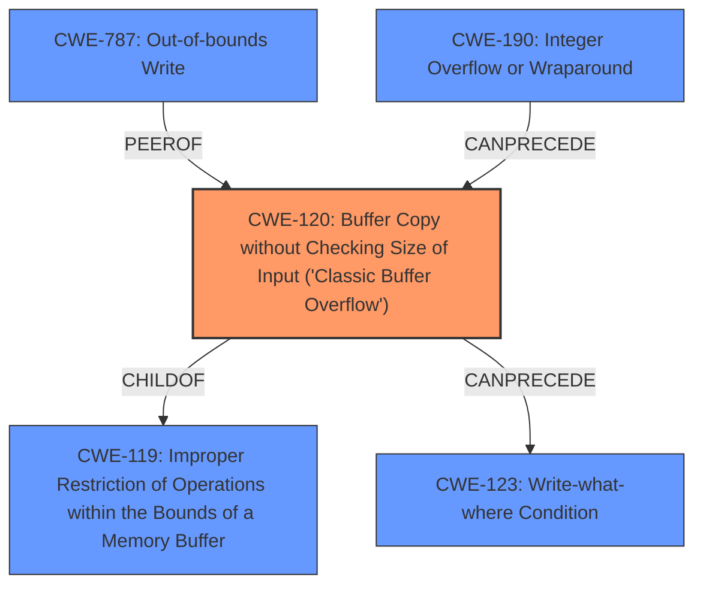

# Raw Analyzer Response for CVE-2021-0254

# Summary
| CWE ID    | CWE Name                                                                                                                  | Confidence | CWE Abstraction Level | CWE Vulnerability Mapping Label | CWE-Vulnerability Mapping Notes |
| :-------- | :------------------------------------------------------------------------------------------------------------------------ | :--------- | :---------------------- | :------------------------------ | :------------------------------ |
| CWE-120   | Buffer Copy without Checking Size of Input ('Classic Buffer Overflow')                                                    | 0.9        | Base                    | Allowed-with-Review            | Primary CWE                   |
| CWE-787   | Out-of-bounds Write                                                                                                       | 0.7        | Base                    | Allowed                       | Secondary Candidate           |
| CWE-190   | Integer Overflow or Wraparound                                                                                            | 0.6        | Base                    | Allowed                       | Secondary Candidate           |

## Evidence and Confidence

*   **Confidence Score:** 0.8
*   **Evidence Strength:** HIGH

## Relationship Analysis
The primary CWE is CWE-120, which has a ChildOf relationship to CWE-119, indicating it's a specific type of buffer overflow. CWE-120 can also precede CWE-123 (Write-what-where Condition), which suggests a potential exploitation path. The relationships between CWE-120, CWE-190, and CWE-787 indicate potential causes and consequences of the **improper buffer size validation**.

## Vulnerability Chain
The vulnerability chain starts with the **improper buffer size validation**, leading to a **buffer overflow**. This can then result in a write-what-where condition, remote code execution, or a denial of service.
  - Root Cause: Improper buffer size validation
  - Weakness: Buffer Overflow (CWE-120)
  - Impact: Remote Code Execution, Denial of Service

## Summary of Analysis
The vulnerability description clearly indicates an **improper buffer size validation** that leads to a **buffer overflow**, making CWE-120 the most appropriate primary CWE. The description states: "This issue results from **improper buffer size validation, which can lead to a buffer overflow**." This directly aligns with the characteristics of CWE-120. While other CWEs like CWE-119 (Improper Restriction of Operations within the Bounds of a Memory Buffer) and CWE-787 (Out-of-bounds Write) are related, CWE-120 is more specific to the "classic" buffer overflow scenario where the size of the input is not checked before copying it to a buffer. The choice of CWE-120 is further supported by the vulnerability description key phrases that identified the **rootcause** as **improper buffer size validation, which can lead to a buffer overflow**, and the **weakness** as **Buffer Overflow**.

CWE-120 is a base level CWE which is the preferred level of abstraction.

CWE-787 (Out-of-bounds Write) is considered as a secondary candidate since the **buffer overflow** resulting from the **improper validation** will lead to an out-of-bounds write.

CWE-190 (Integer Overflow or Wraparound) is also considered a secondary candidate since the **improper size validation** may involve some calculation that could lead to an integer overflow.

# Relevant CWE Information:

# Enhanced Context (25 CWEs)
The following CWEs were identified as potentially relevant to this vulnerability:

## CWE-404: Improper Resource Shutdown or Release
**Abstraction Level**: Class
**Similarity Score**: 0.77
**Source**: dense

**Description**:
The product does not release or incorrectly releases a resource before it is made available for re-use.

**Mapping Guidance**:
- Usage: Allowed-with-Review
- Rationale: This CWE entry is a Class and might have Base-level children that would be more appropriate

## CWE-191: Integer Underflow (Wrap or Wraparound)
**Abstraction Level**: Base
**Similarity Score**: 0.77
**Source**: dense

**Description**:
The product subtracts one value from another, such that the result is less than the minimum allowable integer value, which produces a value that is not equal to the correct result.

**Mapping Guidance**:
- Usage: Allowed
- Rationale: This CWE entry is at the Base level of abstraction, which is a preferred level of abstraction for mapping to the root causes of vulnerabilities.

## CWE-131: Incorrect Calculation of Buffer Size
**Abstraction Level**: Base
**Similarity Score**: 0.77
**Source**: dense

**Description**:
The product does not correctly calculate the size to be used when allocating a buffer, which could lead to a buffer overflow.

**Mapping Guidance**:
- Usage: Allowed
- Rationale: This CWE entry is at the Base level of abstraction, which is a preferred level of abstraction for mapping to the root causes of vulnerabilities.

## CWE-119: Improper Restriction of Operations within the Bounds of a Memory Buffer
**Abstraction Level**: Class
**Similarity Score**: 0.77
**Source**: dense

**Description**:
The product performs operations on a memory buffer, but it reads from or writes to a memory location outside the buffer's intended boundary. This may result in read or write operations on unexpected memory locations that could be linked to other variables, data structures, or internal program data.

**Mapping Guidance**:
- Usage: Discouraged
- Rationale: CWE-119 is commonly misused in low-information vulnerability reports when lower-level CWEs could be used instead, or when more details about the vulnerability are available.

## CWE-667: Improper Locking
**Abstraction Level**: Class
**Similarity Score**: 0.76
**Source**: dense

**Description**:
The product does not properly acquire or release a lock on a resource, leading to unexpected resource state changes and behaviors.

**Mapping Guidance**:
- Usage: Allowed-with-Review
- Rationale: This CWE entry is a Class and might have Base-level children that would be more appropriate

## CWE-226: Sensitive Information in Resource Not Removed Before Reuse
**Abstraction Level**: Base
**Similarity Score**: 0.76
**Source**: dense

**Description**:
The product releases a resource such as memory or a file so that it can be made available for reuse, but it does not clear or "zeroize" the information contained in the resource before the product performs a critical state transition or makes the resource available for reuse by other entities.

**Mapping Guidance**:
- Usage: Allowed
- Rationale: This CWE entry is at the Base level of abstraction, which is a preferred level of abstraction for mapping to the root causes of vulnerabilities.

## CWE-405: Asymmetric Resource Consumption (Amplification)
**Abstraction Level**: Class
**Similarity Score**: 0.76
**Source**: dense

**Description**:
The product does not properly control situations in which an adversary can cause the product to consume or produce excessive resources without requiring the adversary to invest equivalent work or otherwise prove authorization, i.e., the adversary's influence is "asymmetric."

**Mapping Guidance**:
- Usage: Allowed-with-Review
- Rationale: This CWE entry is a Class and might have Base-level children that would be more appropriate

## CWE-754: Improper Check for Unusual or Exceptional Conditions
**Abstraction Level**: Class
**Similarity Score**: 0.76
**Source**: dense

**Description**:
The product does not check or incorrectly checks for unusual or exceptional conditions that are not expected to occur frequently during day to day operation of the product.

**Mapping Guidance**:
- Usage: Allowed-with-Review
- Rationale: This CWE entry is a Class and might have Base-level children that would be more appropriate

## CWE-789: Memory Allocation with Excessive Size Value
**Abstraction Level**: Variant
**Similarity Score**: 0.76
**Source**: dense

**Description**:
The product allocates memory based on an untrusted, large size value, but it does not ensure that the size is within expected limits, allowing arbitrary amounts of memory to be allocated.

**Mapping Guidance**: